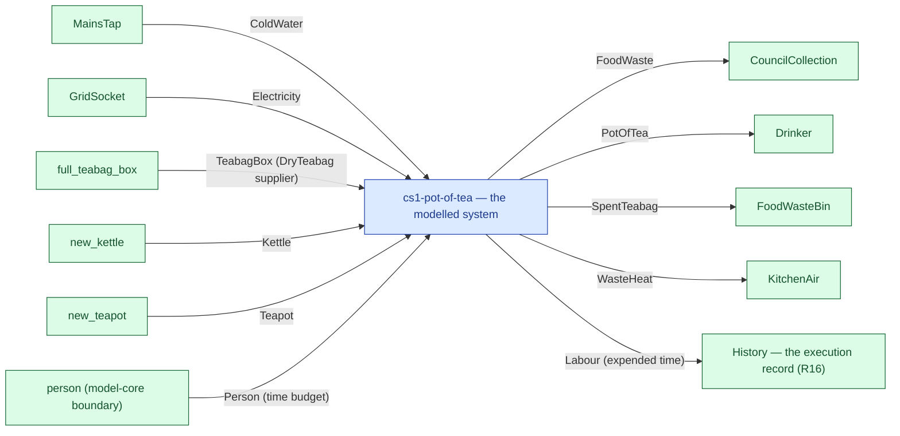

# cs1-pot-of-tea — context diagram

> Generated by `tools/diagram-gen` from `model/cs1-pot-of-tea` — **do not hand-edit**; regenerate with `tools/diagrams.sh`. Diagram nodes are clickable (absolute links into the source); the legend table under the diagram carries the hyperlinks into the source.

The system as one box — only what crosses the boundary (R12/R15): inputs from suppliers and sources on the left-hand edges, outputs to consumers and sinks on the right. Extracted statically from the crate's `boundary` module functions, its `Supplier`/`Consumer` impls and its `outcome_token!` declarations. *cs1-pot-of-tea — case study CS-1: making a pot of tea*

## Legend — node → source

| Node | Kind | Defined at |
|---|---|---|
| `n_system` (cs1-pot-of-tea — the modelled system) | the system | [model/cs1-pot-of-tea/src/lib.rs#L1](/model/cs1-pot-of-tea/src/lib.rs#L1) |
| `n_MainsTap` (MainsTap) | external party | [model/cs1-pot-of-tea/src/resources.rs#L265](/model/cs1-pot-of-tea/src/resources.rs#L265) |
| `n_GridSocket` (GridSocket) | external party | [model/cs1-pot-of-tea/src/resources.rs#L274](/model/cs1-pot-of-tea/src/resources.rs#L274) |
| `n_full_teabag_box` (full_teabag_box) | external party | [model/cs1-pot-of-tea/src/resources.rs#L556](/model/cs1-pot-of-tea/src/resources.rs#L556) |
| `n_new_kettle` (new_kettle) | external party | [model/cs1-pot-of-tea/src/resources.rs#L455](/model/cs1-pot-of-tea/src/resources.rs#L455) |
| `n_new_teapot` (new_teapot) | external party | [model/cs1-pot-of-tea/src/resources.rs#L462](/model/cs1-pot-of-tea/src/resources.rs#L462) |
| `n_CouncilCollection` (CouncilCollection) | external party | [model/cs1-pot-of-tea/src/resources.rs#L427](/model/cs1-pot-of-tea/src/resources.rs#L427) |
| `n_Drinker` (Drinker) | external party | [model/cs1-pot-of-tea/src/resources.rs#L404](/model/cs1-pot-of-tea/src/resources.rs#L404) |
| `n_FoodWasteBin` (FoodWasteBin) | external party | [model/cs1-pot-of-tea/src/resources.rs#L333](/model/cs1-pot-of-tea/src/resources.rs#L333) |
| `n_KitchenAir` (KitchenAir) | external party | [model/cs1-pot-of-tea/src/resources.rs#L380](/model/cs1-pot-of-tea/src/resources.rs#L380) |
| `n_person` (person (model-core boundary)) | external party | — |
| `n_history` (History — the execution record (R16)) | external party | — |

## Resources on the edges

| Resource | Kind | Unit | Defined at |
|---|---|---|---|
| `ColdWater` | continuous (container) | grams | [model/cs1-pot-of-tea/src/resources.rs#L44](/model/cs1-pot-of-tea/src/resources.rs#L44) |
| `DryTeabag` | discrete (consumable) | — | [model/cs1-pot-of-tea/src/resources.rs#L157](/model/cs1-pot-of-tea/src/resources.rs#L157) |
| `Electricity` | continuous (container) | joules | [model/cs1-pot-of-tea/src/resources.rs#L53](/model/cs1-pot-of-tea/src/resources.rs#L53) |
| `FoodWaste` | continuous (container) | grams | [model/cs1-pot-of-tea/src/resources.rs#L72](/model/cs1-pot-of-tea/src/resources.rs#L72) |
| `Kettle` | reusable (placeholder) | — | [model/cs1-pot-of-tea/src/resources.rs#L87](/model/cs1-pot-of-tea/src/resources.rs#L87) |
| `PotOfTea` | continuous (container) | joules (embodied) | [model/cs1-pot-of-tea/src/resources.rs#L245](/model/cs1-pot-of-tea/src/resources.rs#L245) |
| `SpentTeabag` | discrete (consumable) | — | [model/cs1-pot-of-tea/src/resources.rs#L173](/model/cs1-pot-of-tea/src/resources.rs#L173) |
| `TeabagBox` | boundary object (placeholder) | — | [model/cs1-pot-of-tea/src/resources.rs#L296](/model/cs1-pot-of-tea/src/resources.rs#L296) |
| `Teapot` | reusable (placeholder) | — | [model/cs1-pot-of-tea/src/resources.rs#L198](/model/cs1-pot-of-tea/src/resources.rs#L198) |
| `WasteHeat` | continuous (container) | joules | [model/cs1-pot-of-tea/src/resources.rs#L62](/model/cs1-pot-of-tea/src/resources.rs#L62) |
