```mermaid
flowchart LR
  classDef process fill:#dbeafe,stroke:#1e40af,color:#1e3a8a;
  classDef boundary fill:#dcfce7,stroke:#166534,color:#14532d;
  classDef sink fill:#fee2e2,stroke:#991b1b,color:#7f1d1d;
  classDef helper fill:#f3e8ff,stroke:#6b21a8,color:#581c87;
  classDef grouping fill:#ffedd5,stroke:#9a3412,color:#7c2d12;
  classDef flowio fill:#e2e8f0,stroke:#334155,color:#0f172a;
  classDef resource fill:#fef9c3,stroke:#854d0e,color:#713f12;
  classDef external fill:#dcfce7,stroke:#166534,color:#14532d;
  classDef system fill:#dbeafe,stroke:#1e40af,color:#1e3a8a;
  subgraph sg_sources["System boundary — sources and setup"]
    direction TB
    n_new_person["new_person"]:::boundary
    n_new_mains_tap["new_mains_tap"]:::boundary
    n_new_grid_socket["new_grid_socket"]:::boundary
    n_draw_cold_water["draw_cold_water"]:::boundary
    n_new_kettle["new_kettle"]:::boundary
    n_new_teapot["new_teapot"]:::boundary
    n_full_teabag_box["full_teabag_box"]:::boundary
    n_draw_grid_energy["draw_grid_energy"]:::boundary
  end
  subgraph sg_system["Processes"]
    direction TB
    n_fill_kettle["fill_kettle"]:::process
    n_load_pot["load_pot"]:::process
    n_boil["boil"]:::process
    n_vent_heat["vent_heat"]:::process
    n_pour_and_brew["pour_and_brew"]:::process
    n_empty_bin["empty_bin"]:::process
  end
  subgraph sg_helpers["Time accounting and helpers (model-core)"]
    direction TB
    n_new_history["new_history"]:::helper
    n_draw_time["draw_time"]:::helper
    n_record["record fill_kettle"]:::helper
    n_draw_time_2["draw_time (2)"]:::helper
    n_record_2["record load_pot (2)"]:::helper
    n_draw_time_3["draw_time (3)"]:::helper
    n_record_3["record pour_and_brew (3)"]:::helper
    n_draw_time_4["draw_time (4)"]:::helper
    n_record_4["record empty_bin (4)"]:::helper
  end
  subgraph sg_sinks["System boundary — sinks"]
    direction TB
    n_new_food_waste_bin["new_food_waste_bin"]:::sink
    n_new_kitchen_air["new_kitchen_air"]:::sink
    n_new_council_collection["new_council_collection"]:::sink
    n_new_drinker["new_drinker"]:::sink
  end
  n_flow_end["flow end — everything accounted"]:::flowio
  n_new_mains_tap -- "MainsTap" --> n_draw_cold_water
  n_new_person -- "Person 300000 ms" --> n_fill_kettle
  n_new_kettle -- "Kettle" --> n_fill_kettle
  n_draw_cold_water -- "ColdWater 1500 grams" --> n_fill_kettle
  n_fill_kettle -- "Person 300000 ms" --> n_draw_time
  n_new_history -- "History" --> n_record
  n_draw_time -- "Labour 30000 ms" --> n_record
  n_draw_time -- "Person 270000 ms" --> n_load_pot
  n_new_teapot -- "Teapot" --> n_load_pot
  n_full_teabag_box -- "TeabagBox" --> n_load_pot
  n_load_pot -- "Person 270000 ms" --> n_draw_time_2
  n_record -- "History" --> n_record_2
  n_draw_time_2 -- "Labour 20000 ms" --> n_record_2
  n_new_grid_socket -- "GridSocket" --> n_draw_grid_energy
  n_fill_kettle -- "FilledKettle" --> n_boil
  n_draw_grid_energy -- "Electricity 550000 joules" --> n_boil
  n_new_kitchen_air -- "KitchenAir" --> n_vent_heat
  n_boil -- "WasteHeat 50000 joules" --> n_vent_heat
  n_draw_time_2 -- "Person 250000 ms" --> n_pour_and_brew
  n_boil -- "BoilingKettle 1500, 500000 joules" --> n_pour_and_brew
  n_load_pot -- "LoadedPot" --> n_pour_and_brew
  n_new_food_waste_bin -- "FoodWasteBin 10" --> n_pour_and_brew
  n_vent_heat -- "KitchenAir" --> n_pour_and_brew
  n_pour_and_brew -- "Person 250000 ms" --> n_draw_time_3
  n_record_2 -- "History" --> n_record_3
  n_draw_time_3 -- "Labour 15000 ms" --> n_record_3
  n_draw_time_3 -- "Person 235000 ms" --> n_empty_bin
  n_pour_and_brew -- "FoodWasteBin" --> n_empty_bin
  n_new_council_collection -- "CouncilCollection" --> n_empty_bin
  n_empty_bin -- "Person 235000 ms" --> n_draw_time_4
  n_record_3 -- "History" --> n_record_4
  n_draw_time_4 -- "Labour 10000 ms" --> n_record_4
  n_pour_and_brew -- "PotOfTea 1473, 480000 joules" --> n_new_drinker
  n_pour_and_brew -- "Kettle" --> n_flow_end
  n_empty_bin -- "FoodWasteBin 10" --> n_flow_end
  n_load_pot -- "TeabagBox" --> n_flow_end
  n_draw_time_4 -- "Person 225000 ms" --> n_flow_end
  n_draw_cold_water -- "MainsTap" --> n_flow_end
  n_draw_grid_energy -- "GridSocket" --> n_flow_end
  n_pour_and_brew -- "KitchenAir" --> n_flow_end
  n_empty_bin -- "CouncilCollection" --> n_flow_end
  n_record_4 -- "History" --> n_flow_end
  click n_new_history "../../../model/model-core/src/history.rs#L264" "model/model-core/src/history.rs"
  click n_new_person "../../../model/model-core/src/common.rs#L152" "model/model-core/src/common.rs"
  click n_new_mains_tap "../../../model/cs1-pot-of-tea/src/resources.rs#L468" "model/cs1-pot-of-tea/src/resources.rs"
  click n_new_grid_socket "../../../model/cs1-pot-of-tea/src/resources.rs#L475" "model/cs1-pot-of-tea/src/resources.rs"
  click n_new_food_waste_bin "../../../model/cs1-pot-of-tea/src/resources.rs#L566" "model/cs1-pot-of-tea/src/resources.rs"
  click n_new_kitchen_air "../../../model/cs1-pot-of-tea/src/resources.rs#L575" "model/cs1-pot-of-tea/src/resources.rs"
  click n_draw_cold_water "../../../model/cs1-pot-of-tea/src/resources.rs#L484" "model/cs1-pot-of-tea/src/resources.rs"
  click n_new_kettle "../../../model/cs1-pot-of-tea/src/resources.rs#L454" "model/cs1-pot-of-tea/src/resources.rs"
  click n_fill_kettle "../../../model/cs1-pot-of-tea/src/resources.rs#L623" "model/cs1-pot-of-tea/src/resources.rs"
  click n_draw_time "../../../model/model-core/src/common.rs#L242" "model/model-core/src/common.rs"
  click n_record "../../../model/model-core/src/history.rs#L284" "model/model-core/src/history.rs"
  click n_new_teapot "../../../model/cs1-pot-of-tea/src/resources.rs#L461" "model/cs1-pot-of-tea/src/resources.rs"
  click n_full_teabag_box "../../../model/cs1-pot-of-tea/src/resources.rs#L555" "model/cs1-pot-of-tea/src/resources.rs"
  click n_load_pot "../../../model/cs1-pot-of-tea/src/resources.rs#L689" "model/cs1-pot-of-tea/src/resources.rs"
  click n_draw_time_2 "../../../model/model-core/src/common.rs#L242" "model/model-core/src/common.rs"
  click n_record_2 "../../../model/model-core/src/history.rs#L284" "model/model-core/src/history.rs"
  click n_draw_grid_energy "../../../model/cs1-pot-of-tea/src/resources.rs#L492" "model/cs1-pot-of-tea/src/resources.rs"
  click n_boil "../../../model/cs1-pot-of-tea/src/resources.rs#L661" "model/cs1-pot-of-tea/src/resources.rs"
  click n_vent_heat "../../../model/cs1-pot-of-tea/src/resources.rs#L774" "model/cs1-pot-of-tea/src/resources.rs"
  click n_pour_and_brew "../../../model/cs1-pot-of-tea/src/resources.rs#L740" "model/cs1-pot-of-tea/src/resources.rs"
  click n_draw_time_3 "../../../model/model-core/src/common.rs#L242" "model/model-core/src/common.rs"
  click n_record_3 "../../../model/model-core/src/history.rs#L284" "model/model-core/src/history.rs"
  click n_new_council_collection "../../../model/cs1-pot-of-tea/src/resources.rs#L585" "model/cs1-pot-of-tea/src/resources.rs"
  click n_empty_bin "../../../model/cs1-pot-of-tea/src/resources.rs#L836" "model/cs1-pot-of-tea/src/resources.rs"
  click n_draw_time_4 "../../../model/model-core/src/common.rs#L242" "model/model-core/src/common.rs"
  click n_record_4 "../../../model/model-core/src/history.rs#L284" "model/model-core/src/history.rs"
  click n_new_drinker "../../../model/cs1-pot-of-tea/src/resources.rs#L580" "model/cs1-pot-of-tea/src/resources.rs"
  click n_flow_end "../../../model/cs1-pot-of-tea/tests/flows.rs#L79" "model/cs1-pot-of-tea/tests/flows.rs"
```

# cs1-pot-of-tea — detailed diagram

> Generated by `tools/diagram-gen` from `model/cs1-pot-of-tea` — **do not hand-edit**; regenerate with `tools/diagrams.sh`. Diagram nodes are clickable (absolute links into the source); the legend table under the diagram carries the hyperlinks into the source.

All levels, fully connected: every call in the flow — boundary setup, the processes, the adjacent time draws and their `History` records (F-048/R16), internal waste routing, and the disposal steps — traced from the flow function's `let`-binding sequence, with the const magnitudes from each call site. Edge labels carry the resource and its magnitude in the base unit (R7).

## Main flow — `flow_order_a_type_checks_and_accounts_for_everything`

Source: [model/cs1-pot-of-tea/tests/flows.rs#L79](/model/cs1-pot-of-tea/tests/flows.rs#L79)

### Legend — node → source

| Node | Kind | Defined at |
|---|---|---|
| `n_new_history` (new_history) | model-core helper | [model/model-core/src/history.rs#L264](/model/model-core/src/history.rs#L264) |
| `n_new_person` (new_person) | boundary source | [model/model-core/src/common.rs#L152](/model/model-core/src/common.rs#L152) |
| `n_new_mains_tap` (new_mains_tap) | boundary source | [model/cs1-pot-of-tea/src/resources.rs#L469](/model/cs1-pot-of-tea/src/resources.rs#L469) |
| `n_new_grid_socket` (new_grid_socket) | boundary source | [model/cs1-pot-of-tea/src/resources.rs#L476](/model/cs1-pot-of-tea/src/resources.rs#L476) |
| `n_new_food_waste_bin` (new_food_waste_bin) | boundary sink | [model/cs1-pot-of-tea/src/resources.rs#L567](/model/cs1-pot-of-tea/src/resources.rs#L567) |
| `n_new_kitchen_air` (new_kitchen_air) | boundary sink | [model/cs1-pot-of-tea/src/resources.rs#L576](/model/cs1-pot-of-tea/src/resources.rs#L576) |
| `n_draw_cold_water` (draw_cold_water) | boundary source | [model/cs1-pot-of-tea/src/resources.rs#L485](/model/cs1-pot-of-tea/src/resources.rs#L485) |
| `n_new_kettle` (new_kettle) | boundary source | [model/cs1-pot-of-tea/src/resources.rs#L455](/model/cs1-pot-of-tea/src/resources.rs#L455) |
| `n_fill_kettle` (fill_kettle) | process | [model/cs1-pot-of-tea/src/resources.rs#L624](/model/cs1-pot-of-tea/src/resources.rs#L624) |
| `n_draw_time` (draw_time) | model-core helper | [model/model-core/src/common.rs#L242](/model/model-core/src/common.rs#L242) |
| `n_record` (record fill_kettle) | model-core helper | [model/model-core/src/history.rs#L284](/model/model-core/src/history.rs#L284) |
| `n_new_teapot` (new_teapot) | boundary source | [model/cs1-pot-of-tea/src/resources.rs#L462](/model/cs1-pot-of-tea/src/resources.rs#L462) |
| `n_full_teabag_box` (full_teabag_box) | boundary source | [model/cs1-pot-of-tea/src/resources.rs#L556](/model/cs1-pot-of-tea/src/resources.rs#L556) |
| `n_load_pot` (load_pot) | process | [model/cs1-pot-of-tea/src/resources.rs#L690](/model/cs1-pot-of-tea/src/resources.rs#L690) |
| `n_draw_time_2` (draw_time (2)) | model-core helper | [model/model-core/src/common.rs#L242](/model/model-core/src/common.rs#L242) |
| `n_record_2` (record load_pot (2)) | model-core helper | [model/model-core/src/history.rs#L284](/model/model-core/src/history.rs#L284) |
| `n_draw_grid_energy` (draw_grid_energy) | boundary source | [model/cs1-pot-of-tea/src/resources.rs#L493](/model/cs1-pot-of-tea/src/resources.rs#L493) |
| `n_boil` (boil) | process | [model/cs1-pot-of-tea/src/resources.rs#L662](/model/cs1-pot-of-tea/src/resources.rs#L662) |
| `n_vent_heat` (vent_heat) | process | [model/cs1-pot-of-tea/src/resources.rs#L775](/model/cs1-pot-of-tea/src/resources.rs#L775) |
| `n_pour_and_brew` (pour_and_brew) | process | [model/cs1-pot-of-tea/src/resources.rs#L741](/model/cs1-pot-of-tea/src/resources.rs#L741) |
| `n_draw_time_3` (draw_time (3)) | model-core helper | [model/model-core/src/common.rs#L242](/model/model-core/src/common.rs#L242) |
| `n_record_3` (record pour_and_brew (3)) | model-core helper | [model/model-core/src/history.rs#L284](/model/model-core/src/history.rs#L284) |
| `n_new_council_collection` (new_council_collection) | boundary sink | [model/cs1-pot-of-tea/src/resources.rs#L586](/model/cs1-pot-of-tea/src/resources.rs#L586) |
| `n_empty_bin` (empty_bin) | process | [model/cs1-pot-of-tea/src/resources.rs#L837](/model/cs1-pot-of-tea/src/resources.rs#L837) |
| `n_draw_time_4` (draw_time (4)) | model-core helper | [model/model-core/src/common.rs#L242](/model/model-core/src/common.rs#L242) |
| `n_record_4` (record empty_bin (4)) | model-core helper | [model/model-core/src/history.rs#L284](/model/model-core/src/history.rs#L284) |
| `n_new_drinker` (new_drinker) | boundary sink | [model/cs1-pot-of-tea/src/resources.rs#L581](/model/cs1-pot-of-tea/src/resources.rs#L581) |
| `n_flow_end` (flow end — everything accounted) | flow input/output | [model/cs1-pot-of-tea/tests/flows.rs#L79](/model/cs1-pot-of-tea/tests/flows.rs#L79) |

## Test flow — `flow_order_b_type_checks_and_accounts_for_everything`

Source: [model/cs1-pot-of-tea/tests/flows.rs#L143](/model/cs1-pot-of-tea/tests/flows.rs#L143)

```mermaid
flowchart LR
  classDef process fill:#dbeafe,stroke:#1e40af,color:#1e3a8a;
  classDef boundary fill:#dcfce7,stroke:#166534,color:#14532d;
  classDef sink fill:#fee2e2,stroke:#991b1b,color:#7f1d1d;
  classDef helper fill:#f3e8ff,stroke:#6b21a8,color:#581c87;
  classDef grouping fill:#ffedd5,stroke:#9a3412,color:#7c2d12;
  classDef flowio fill:#e2e8f0,stroke:#334155,color:#0f172a;
  classDef resource fill:#fef9c3,stroke:#854d0e,color:#713f12;
  classDef external fill:#dcfce7,stroke:#166534,color:#14532d;
  classDef system fill:#dbeafe,stroke:#1e40af,color:#1e3a8a;
  subgraph sg_sources["System boundary — sources and setup"]
    direction TB
    n_new_person["new_person"]:::boundary
    n_new_mains_tap["new_mains_tap"]:::boundary
    n_draw_cold_water["draw_cold_water"]:::boundary
    n_new_kettle["new_kettle"]:::boundary
    n_new_grid_socket["new_grid_socket"]:::boundary
    n_draw_grid_energy["draw_grid_energy"]:::boundary
    n_new_teapot["new_teapot"]:::boundary
    n_full_teabag_box["full_teabag_box"]:::boundary
  end
  subgraph sg_system["Processes"]
    direction TB
    n_fill_kettle["fill_kettle"]:::process
    n_boil["boil"]:::process
    n_vent_heat["vent_heat"]:::process
    n_load_pot["load_pot"]:::process
    n_pour_and_brew["pour_and_brew"]:::process
    n_empty_bin["empty_bin"]:::process
  end
  subgraph sg_helpers["Time accounting and helpers (model-core)"]
    direction TB
    n_new_history["new_history"]:::helper
    n_draw_time["draw_time"]:::helper
    n_record["record fill_kettle"]:::helper
    n_draw_time_2["draw_time (2)"]:::helper
    n_record_2["record load_pot (2)"]:::helper
    n_draw_time_3["draw_time (3)"]:::helper
    n_record_3["record pour_and_brew (3)"]:::helper
    n_draw_time_4["draw_time (4)"]:::helper
    n_record_4["record empty_bin (4)"]:::helper
  end
  subgraph sg_sinks["System boundary — sinks"]
    direction TB
    n_new_food_waste_bin["new_food_waste_bin"]:::sink
    n_new_kitchen_air["new_kitchen_air"]:::sink
    n_new_council_collection["new_council_collection"]:::sink
    n_new_drinker["new_drinker"]:::sink
  end
  n_flow_end["flow end — everything accounted"]:::flowio
  n_new_mains_tap -- "MainsTap" --> n_draw_cold_water
  n_new_person -- "Person 300000 ms" --> n_fill_kettle
  n_new_kettle -- "Kettle" --> n_fill_kettle
  n_draw_cold_water -- "ColdWater 1500 grams" --> n_fill_kettle
  n_fill_kettle -- "Person 300000 ms" --> n_draw_time
  n_new_history -- "History" --> n_record
  n_draw_time -- "Labour 30000 ms" --> n_record
  n_new_grid_socket -- "GridSocket" --> n_draw_grid_energy
  n_fill_kettle -- "FilledKettle" --> n_boil
  n_draw_grid_energy -- "Electricity 550000 joules" --> n_boil
  n_new_kitchen_air -- "KitchenAir" --> n_vent_heat
  n_boil -- "WasteHeat 50000 joules" --> n_vent_heat
  n_draw_time -- "Person 270000 ms" --> n_load_pot
  n_new_teapot -- "Teapot" --> n_load_pot
  n_full_teabag_box -- "TeabagBox" --> n_load_pot
  n_load_pot -- "Person 270000 ms" --> n_draw_time_2
  n_record -- "History" --> n_record_2
  n_draw_time_2 -- "Labour 20000 ms" --> n_record_2
  n_draw_time_2 -- "Person 250000 ms" --> n_pour_and_brew
  n_boil -- "BoilingKettle 1500, 500000 joules" --> n_pour_and_brew
  n_load_pot -- "LoadedPot" --> n_pour_and_brew
  n_new_food_waste_bin -- "FoodWasteBin 10" --> n_pour_and_brew
  n_vent_heat -- "KitchenAir" --> n_pour_and_brew
  n_pour_and_brew -- "Person 250000 ms" --> n_draw_time_3
  n_record_2 -- "History" --> n_record_3
  n_draw_time_3 -- "Labour 15000 ms" --> n_record_3
  n_draw_time_3 -- "Person 235000 ms" --> n_empty_bin
  n_pour_and_brew -- "FoodWasteBin" --> n_empty_bin
  n_new_council_collection -- "CouncilCollection" --> n_empty_bin
  n_empty_bin -- "Person 235000 ms" --> n_draw_time_4
  n_record_3 -- "History" --> n_record_4
  n_draw_time_4 -- "Labour 10000 ms" --> n_record_4
  n_pour_and_brew -- "PotOfTea 1473, 480000 joules" --> n_new_drinker
  n_pour_and_brew -- "Kettle" --> n_flow_end
  n_empty_bin -- "FoodWasteBin 10" --> n_flow_end
  n_load_pot -- "TeabagBox" --> n_flow_end
  n_draw_time_4 -- "Person 225000 ms" --> n_flow_end
  n_draw_cold_water -- "MainsTap" --> n_flow_end
  n_draw_grid_energy -- "GridSocket" --> n_flow_end
  n_pour_and_brew -- "KitchenAir" --> n_flow_end
  n_empty_bin -- "CouncilCollection" --> n_flow_end
  n_record_4 -- "History" --> n_flow_end
  click n_new_history "https://github.com/twalmsley/lavoisier/blob/main/model/model-core/src/history.rs#L264" "model/model-core/src/history.rs"
  click n_new_person "https://github.com/twalmsley/lavoisier/blob/main/model/model-core/src/common.rs#L152" "model/model-core/src/common.rs"
  click n_new_food_waste_bin "https://github.com/twalmsley/lavoisier/blob/main/model/cs1-pot-of-tea/src/resources.rs#L567" "model/cs1-pot-of-tea/src/resources.rs"
  click n_new_kitchen_air "https://github.com/twalmsley/lavoisier/blob/main/model/cs1-pot-of-tea/src/resources.rs#L576" "model/cs1-pot-of-tea/src/resources.rs"
  click n_new_mains_tap "https://github.com/twalmsley/lavoisier/blob/main/model/cs1-pot-of-tea/src/resources.rs#L469" "model/cs1-pot-of-tea/src/resources.rs"
  click n_draw_cold_water "https://github.com/twalmsley/lavoisier/blob/main/model/cs1-pot-of-tea/src/resources.rs#L485" "model/cs1-pot-of-tea/src/resources.rs"
  click n_new_kettle "https://github.com/twalmsley/lavoisier/blob/main/model/cs1-pot-of-tea/src/resources.rs#L455" "model/cs1-pot-of-tea/src/resources.rs"
  click n_fill_kettle "https://github.com/twalmsley/lavoisier/blob/main/model/cs1-pot-of-tea/src/resources.rs#L624" "model/cs1-pot-of-tea/src/resources.rs"
  click n_draw_time "https://github.com/twalmsley/lavoisier/blob/main/model/model-core/src/common.rs#L242" "model/model-core/src/common.rs"
  click n_record "https://github.com/twalmsley/lavoisier/blob/main/model/model-core/src/history.rs#L284" "model/model-core/src/history.rs"
  click n_new_grid_socket "https://github.com/twalmsley/lavoisier/blob/main/model/cs1-pot-of-tea/src/resources.rs#L476" "model/cs1-pot-of-tea/src/resources.rs"
  click n_draw_grid_energy "https://github.com/twalmsley/lavoisier/blob/main/model/cs1-pot-of-tea/src/resources.rs#L493" "model/cs1-pot-of-tea/src/resources.rs"
  click n_boil "https://github.com/twalmsley/lavoisier/blob/main/model/cs1-pot-of-tea/src/resources.rs#L662" "model/cs1-pot-of-tea/src/resources.rs"
  click n_vent_heat "https://github.com/twalmsley/lavoisier/blob/main/model/cs1-pot-of-tea/src/resources.rs#L775" "model/cs1-pot-of-tea/src/resources.rs"
  click n_new_teapot "https://github.com/twalmsley/lavoisier/blob/main/model/cs1-pot-of-tea/src/resources.rs#L462" "model/cs1-pot-of-tea/src/resources.rs"
  click n_full_teabag_box "https://github.com/twalmsley/lavoisier/blob/main/model/cs1-pot-of-tea/src/resources.rs#L556" "model/cs1-pot-of-tea/src/resources.rs"
  click n_load_pot "https://github.com/twalmsley/lavoisier/blob/main/model/cs1-pot-of-tea/src/resources.rs#L690" "model/cs1-pot-of-tea/src/resources.rs"
  click n_draw_time_2 "https://github.com/twalmsley/lavoisier/blob/main/model/model-core/src/common.rs#L242" "model/model-core/src/common.rs"
  click n_record_2 "https://github.com/twalmsley/lavoisier/blob/main/model/model-core/src/history.rs#L284" "model/model-core/src/history.rs"
  click n_pour_and_brew "https://github.com/twalmsley/lavoisier/blob/main/model/cs1-pot-of-tea/src/resources.rs#L741" "model/cs1-pot-of-tea/src/resources.rs"
  click n_draw_time_3 "https://github.com/twalmsley/lavoisier/blob/main/model/model-core/src/common.rs#L242" "model/model-core/src/common.rs"
  click n_record_3 "https://github.com/twalmsley/lavoisier/blob/main/model/model-core/src/history.rs#L284" "model/model-core/src/history.rs"
  click n_new_council_collection "https://github.com/twalmsley/lavoisier/blob/main/model/cs1-pot-of-tea/src/resources.rs#L586" "model/cs1-pot-of-tea/src/resources.rs"
  click n_empty_bin "https://github.com/twalmsley/lavoisier/blob/main/model/cs1-pot-of-tea/src/resources.rs#L837" "model/cs1-pot-of-tea/src/resources.rs"
  click n_draw_time_4 "https://github.com/twalmsley/lavoisier/blob/main/model/model-core/src/common.rs#L242" "model/model-core/src/common.rs"
  click n_record_4 "https://github.com/twalmsley/lavoisier/blob/main/model/model-core/src/history.rs#L284" "model/model-core/src/history.rs"
  click n_new_drinker "https://github.com/twalmsley/lavoisier/blob/main/model/cs1-pot-of-tea/src/resources.rs#L581" "model/cs1-pot-of-tea/src/resources.rs"
  click n_flow_end "https://github.com/twalmsley/lavoisier/blob/main/model/cs1-pot-of-tea/tests/flows.rs#L143" "model/cs1-pot-of-tea/tests/flows.rs"
```

### Legend — node → source

| Node | Kind | Defined at |
|---|---|---|
| `n_new_history` (new_history) | model-core helper | [model/model-core/src/history.rs#L264](/model/model-core/src/history.rs#L264) |
| `n_new_person` (new_person) | boundary source | [model/model-core/src/common.rs#L152](/model/model-core/src/common.rs#L152) |
| `n_new_food_waste_bin` (new_food_waste_bin) | boundary sink | [model/cs1-pot-of-tea/src/resources.rs#L567](/model/cs1-pot-of-tea/src/resources.rs#L567) |
| `n_new_kitchen_air` (new_kitchen_air) | boundary sink | [model/cs1-pot-of-tea/src/resources.rs#L576](/model/cs1-pot-of-tea/src/resources.rs#L576) |
| `n_new_mains_tap` (new_mains_tap) | boundary source | [model/cs1-pot-of-tea/src/resources.rs#L469](/model/cs1-pot-of-tea/src/resources.rs#L469) |
| `n_draw_cold_water` (draw_cold_water) | boundary source | [model/cs1-pot-of-tea/src/resources.rs#L485](/model/cs1-pot-of-tea/src/resources.rs#L485) |
| `n_new_kettle` (new_kettle) | boundary source | [model/cs1-pot-of-tea/src/resources.rs#L455](/model/cs1-pot-of-tea/src/resources.rs#L455) |
| `n_fill_kettle` (fill_kettle) | process | [model/cs1-pot-of-tea/src/resources.rs#L624](/model/cs1-pot-of-tea/src/resources.rs#L624) |
| `n_draw_time` (draw_time) | model-core helper | [model/model-core/src/common.rs#L242](/model/model-core/src/common.rs#L242) |
| `n_record` (record fill_kettle) | model-core helper | [model/model-core/src/history.rs#L284](/model/model-core/src/history.rs#L284) |
| `n_new_grid_socket` (new_grid_socket) | boundary source | [model/cs1-pot-of-tea/src/resources.rs#L476](/model/cs1-pot-of-tea/src/resources.rs#L476) |
| `n_draw_grid_energy` (draw_grid_energy) | boundary source | [model/cs1-pot-of-tea/src/resources.rs#L493](/model/cs1-pot-of-tea/src/resources.rs#L493) |
| `n_boil` (boil) | process | [model/cs1-pot-of-tea/src/resources.rs#L662](/model/cs1-pot-of-tea/src/resources.rs#L662) |
| `n_vent_heat` (vent_heat) | process | [model/cs1-pot-of-tea/src/resources.rs#L775](/model/cs1-pot-of-tea/src/resources.rs#L775) |
| `n_new_teapot` (new_teapot) | boundary source | [model/cs1-pot-of-tea/src/resources.rs#L462](/model/cs1-pot-of-tea/src/resources.rs#L462) |
| `n_full_teabag_box` (full_teabag_box) | boundary source | [model/cs1-pot-of-tea/src/resources.rs#L556](/model/cs1-pot-of-tea/src/resources.rs#L556) |
| `n_load_pot` (load_pot) | process | [model/cs1-pot-of-tea/src/resources.rs#L690](/model/cs1-pot-of-tea/src/resources.rs#L690) |
| `n_draw_time_2` (draw_time (2)) | model-core helper | [model/model-core/src/common.rs#L242](/model/model-core/src/common.rs#L242) |
| `n_record_2` (record load_pot (2)) | model-core helper | [model/model-core/src/history.rs#L284](/model/model-core/src/history.rs#L284) |
| `n_pour_and_brew` (pour_and_brew) | process | [model/cs1-pot-of-tea/src/resources.rs#L741](/model/cs1-pot-of-tea/src/resources.rs#L741) |
| `n_draw_time_3` (draw_time (3)) | model-core helper | [model/model-core/src/common.rs#L242](/model/model-core/src/common.rs#L242) |
| `n_record_3` (record pour_and_brew (3)) | model-core helper | [model/model-core/src/history.rs#L284](/model/model-core/src/history.rs#L284) |
| `n_new_council_collection` (new_council_collection) | boundary sink | [model/cs1-pot-of-tea/src/resources.rs#L586](/model/cs1-pot-of-tea/src/resources.rs#L586) |
| `n_empty_bin` (empty_bin) | process | [model/cs1-pot-of-tea/src/resources.rs#L837](/model/cs1-pot-of-tea/src/resources.rs#L837) |
| `n_draw_time_4` (draw_time (4)) | model-core helper | [model/model-core/src/common.rs#L242](/model/model-core/src/common.rs#L242) |
| `n_record_4` (record empty_bin (4)) | model-core helper | [model/model-core/src/history.rs#L284](/model/model-core/src/history.rs#L284) |
| `n_new_drinker` (new_drinker) | boundary sink | [model/cs1-pot-of-tea/src/resources.rs#L581](/model/cs1-pot-of-tea/src/resources.rs#L581) |
| `n_flow_end` (flow end — everything accounted) | flow input/output | [model/cs1-pot-of-tea/tests/flows.rs#L143](/model/cs1-pot-of-tea/tests/flows.rs#L143) |

## Resources on the edges

| Resource | Kind | Unit | Defined at |
|---|---|---|---|
| `BoilingKettle` | continuous (container) | joules (embodied) | [model/cs1-pot-of-tea/src/resources.rs#L108](/model/cs1-pot-of-tea/src/resources.rs#L108) |
| `ColdWater` | continuous (container) | grams | [model/cs1-pot-of-tea/src/resources.rs#L44](/model/cs1-pot-of-tea/src/resources.rs#L44) |
| `CouncilCollection` | boundary object (placeholder) | — | [model/cs1-pot-of-tea/src/resources.rs#L427](/model/cs1-pot-of-tea/src/resources.rs#L427) |
| `Electricity` | continuous (container) | joules | [model/cs1-pot-of-tea/src/resources.rs#L53](/model/cs1-pot-of-tea/src/resources.rs#L53) |
| `FilledKettle` | continuous (container) | grams of water | [model/cs1-pot-of-tea/src/resources.rs#L97](/model/cs1-pot-of-tea/src/resources.rs#L97) |
| `FoodWasteBin` | boundary object | — | [model/cs1-pot-of-tea/src/resources.rs#L333](/model/cs1-pot-of-tea/src/resources.rs#L333) |
| `GridSocket` | reusable (placeholder) | — | [model/cs1-pot-of-tea/src/resources.rs#L274](/model/cs1-pot-of-tea/src/resources.rs#L274) |
| `Kettle` | reusable (placeholder) | — | [model/cs1-pot-of-tea/src/resources.rs#L87](/model/cs1-pot-of-tea/src/resources.rs#L87) |
| `KitchenAir` | boundary object (placeholder) | — | [model/cs1-pot-of-tea/src/resources.rs#L380](/model/cs1-pot-of-tea/src/resources.rs#L380) |
| `LoadedPot` | discrete (consumable) | — | [model/cs1-pot-of-tea/src/resources.rs#L208](/model/cs1-pot-of-tea/src/resources.rs#L208) |
| `MainsTap` | reusable (placeholder) | — | [model/cs1-pot-of-tea/src/resources.rs#L265](/model/cs1-pot-of-tea/src/resources.rs#L265) |
| `PotOfTea` | continuous (container) | joules (embodied) | [model/cs1-pot-of-tea/src/resources.rs#L245](/model/cs1-pot-of-tea/src/resources.rs#L245) |
| `TeabagBox` | boundary object (placeholder) | — | [model/cs1-pot-of-tea/src/resources.rs#L296](/model/cs1-pot-of-tea/src/resources.rs#L296) |
| `Teapot` | reusable (placeholder) | — | [model/cs1-pot-of-tea/src/resources.rs#L198](/model/cs1-pot-of-tea/src/resources.rs#L198) |
| `WasteHeat` | continuous (container) | joules | [model/cs1-pot-of-tea/src/resources.rs#L62](/model/cs1-pot-of-tea/src/resources.rs#L62) |
