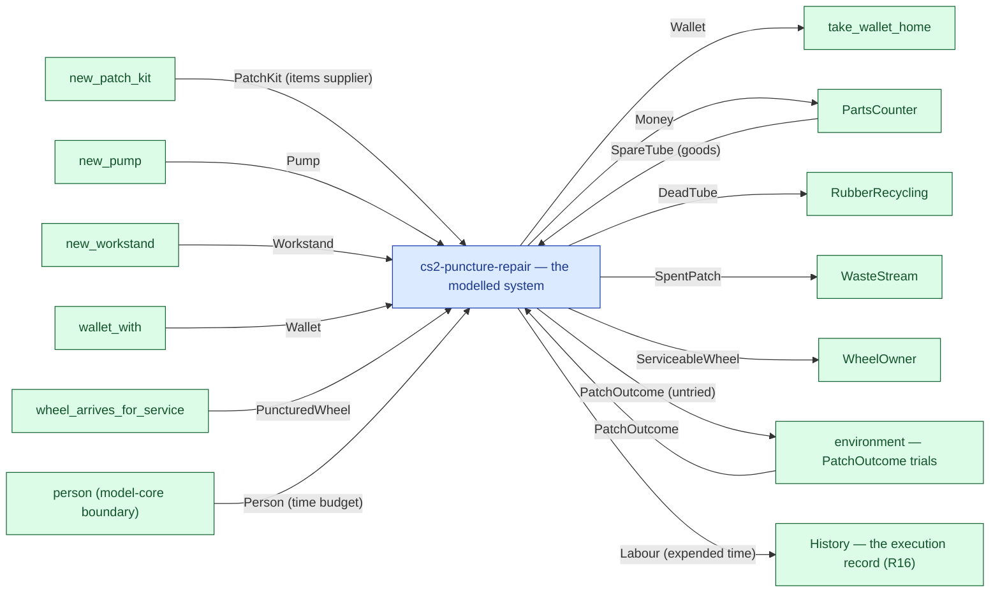

# cs2-puncture-repair — context diagram

> Generated by `tools/diagram-gen` from `model/cs2-puncture-repair` — **do not hand-edit**; regenerate with `tools/diagrams.sh`. Diagram nodes are clickable (absolute links into the source); the legend table under the diagram carries the hyperlinks into the source.

The system as one box — only what crosses the boundary (R12/R15): inputs from suppliers and sources on the left-hand edges, outputs to consumers and sinks on the right. Extracted statically from the crate's `boundary` module functions, its `Supplier`/`Consumer` impls and its `outcome_token!` declarations. *cs2-puncture-repair — case study CS-2: bicycle puncture repair*

## Legend — node → source

| Node | Kind | Defined at |
|---|---|---|
| `n_system` (cs2-puncture-repair — the modelled system) | the system | [model/cs2-puncture-repair/src/lib.rs#L1](/model/cs2-puncture-repair/src/lib.rs#L1) |
| `n_new_patch_kit` (new_patch_kit) | external party | [model/cs2-puncture-repair/src/resources.rs#L638](/model/cs2-puncture-repair/src/resources.rs#L638) |
| `n_new_pump` (new_pump) | external party | [model/cs2-puncture-repair/src/resources.rs#L629](/model/cs2-puncture-repair/src/resources.rs#L629) |
| `n_new_workstand` (new_workstand) | external party | [model/cs2-puncture-repair/src/resources.rs#L622](/model/cs2-puncture-repair/src/resources.rs#L622) |
| `n_exit_take_wallet_home` (take_wallet_home) | external party | [model/cs2-puncture-repair/src/resources.rs#L660](/model/cs2-puncture-repair/src/resources.rs#L660) |
| `n_wallet_with` (wallet_with) | external party | [model/cs2-puncture-repair/src/resources.rs#L650](/model/cs2-puncture-repair/src/resources.rs#L650) |
| `n_wheel_arrives_for_service` (wheel_arrives_for_service) | external party | [model/cs2-puncture-repair/src/resources.rs#L615](/model/cs2-puncture-repair/src/resources.rs#L615) |
| `n_PartsCounter` (PartsCounter) | external party | [model/cs2-puncture-repair/src/resources.rs#L482](/model/cs2-puncture-repair/src/resources.rs#L482) |
| `n_RubberRecycling` (RubberRecycling) | external party | [model/cs2-puncture-repair/src/resources.rs#L561](/model/cs2-puncture-repair/src/resources.rs#L561) |
| `n_WasteStream` (WasteStream) | external party | [model/cs2-puncture-repair/src/resources.rs#L535](/model/cs2-puncture-repair/src/resources.rs#L535) |
| `n_WheelOwner` (WheelOwner) | external party | [model/cs2-puncture-repair/src/resources.rs#L581](/model/cs2-puncture-repair/src/resources.rs#L581) |
| `n_env_PatchOutcome` (environment — PatchOutcome trials) | external party | [model/cs2-puncture-repair/src/resources.rs#L416](/model/cs2-puncture-repair/src/resources.rs#L416) |
| `n_person` (person (model-core boundary)) | external party | — |
| `n_history` (History — the execution record (R16)) | external party | — |

## Resources on the edges

| Resource | Kind | Unit | Defined at |
|---|---|---|---|
| `DeadTube` | discrete (consumable) | — | [model/cs2-puncture-repair/src/resources.rs#L214](/model/cs2-puncture-repair/src/resources.rs#L214) |
| `Money` | continuous (container) | pence | [model/cs2-puncture-repair/src/resources.rs#L334](/model/cs2-puncture-repair/src/resources.rs#L334) |
| `PatchKit` | boundary object (placeholder) | — | [model/cs2-puncture-repair/src/resources.rs#L275](/model/cs2-puncture-repair/src/resources.rs#L275) |
| `PatchOutcome` | outcome token (R17) | — | [model/cs2-puncture-repair/src/resources.rs#L416](/model/cs2-puncture-repair/src/resources.rs#L416) |
| `Pump` | reusable (placeholder) | — | [model/cs2-puncture-repair/src/resources.rs#L386](/model/cs2-puncture-repair/src/resources.rs#L386) |
| `PuncturedWheel` | discrete (consumable) | — | [model/cs2-puncture-repair/src/resources.rs#L56](/model/cs2-puncture-repair/src/resources.rs#L56) |
| `ServiceableWheel` | continuous (container) | grams | [model/cs2-puncture-repair/src/resources.rs#L85](/model/cs2-puncture-repair/src/resources.rs#L85) |
| `SpareTube` | discrete (consumable) | — | [model/cs2-puncture-repair/src/resources.rs#L188](/model/cs2-puncture-repair/src/resources.rs#L188) |
| `SpentPatch` | continuous (container) | grams | [model/cs2-puncture-repair/src/resources.rs#L249](/model/cs2-puncture-repair/src/resources.rs#L249) |
| `Wallet` | continuous (container) | pence remaining | [model/cs2-puncture-repair/src/resources.rs#L344](/model/cs2-puncture-repair/src/resources.rs#L344) |
| `Workstand` | reusable (placeholder) | — | [model/cs2-puncture-repair/src/resources.rs#L376](/model/cs2-puncture-repair/src/resources.rs#L376) |
