# cs2-puncture-repair — top-level diagram

> Generated by `tools/diagram-gen` from `model/cs2-puncture-repair` — **do not hand-edit**; regenerate with `tools/diagrams.sh`. Diagram nodes are clickable (absolute links into the source); the legend table under the diagram carries the hyperlinks into the source.

The first level of processes with their inputs and outputs, linked to each other and to the boundary. This is the **R9 connection graph**, extracted statically from the process signatures (the model describes connections, not sequences): an edge `A — T → B` means A outputs a resource of type T that B's signature accepts. Requirement-trait bounds are resolved through their `satisfies!`-tagged types; `Consumer`/`SupplyN` bounds become sink/supplier edges. Dashed links are reusable resources or boundary objects **threaded** through a process (moved in and returned, R2) — no direction is claimed. Hand-overs that happen inside a process (e.g. a sealed disposal minting its output) are not visible in signatures and appear only in the detailed diagram's flow trace.

```mermaid
flowchart LR
  classDef process fill:#dbeafe,stroke:#1e40af,color:#1e3a8a;
  classDef boundary fill:#dcfce7,stroke:#166534,color:#14532d;
  classDef sink fill:#fee2e2,stroke:#991b1b,color:#7f1d1d;
  classDef helper fill:#f3e8ff,stroke:#6b21a8,color:#581c87;
  classDef grouping fill:#ffedd5,stroke:#9a3412,color:#7c2d12;
  classDef flowio fill:#e2e8f0,stroke:#334155,color:#0f172a;
  classDef resource fill:#fef9c3,stroke:#854d0e,color:#713f12;
  classDef external fill:#dcfce7,stroke:#166534,color:#14532d;
  classDef system fill:#dbeafe,stroke:#1e40af,color:#1e3a8a;
  subgraph sg_sources["System boundary — sources and setup"]
    direction TB
    n_patch_will_fail["patch_will_fail"]:::boundary
    n_patch_will_hold["patch_will_hold"]:::boundary
    n_new_pump["new_pump"]:::boundary
    n_wheel_arrives_for_service["wheel_arrives_for_service"]:::boundary
    n_wallet_with["wallet_with"]:::boundary
    n_new_workstand["new_workstand"]:::boundary
    n_PatchKit["PatchKit"]:::boundary
    n_new_parts_counter["new_parts_counter"]:::boundary
    n_new_patch_kit["new_patch_kit"]:::boundary
    n_qualify["qualify (model-core)"]:::boundary
  end
  subgraph sg_system["Processes"]
    direction TB
    n_draw_cash["draw_cash"]:::process
    n_deposit["deposit"]:::process
    n_split_money["split_money"]:::process
    n_draw_cement["draw_cement"]:::process
    n_open_wheel["open_wheel"]:::process
    n_find_hole["find_hole"]:::process
    n_patch_tube["patch_tube"]:::process
    n_check_patch["check_patch"]:::process
    n_buy_spare["buy_spare"]:::process
    n_retire_tube["retire_tube"]:::process
    n_refit_and_inflate["refit_and_inflate"]:::process
  end
  subgraph sg_sinks["System boundary — sinks"]
    direction TB
    n_RubberRecycling["RubberRecycling"]:::sink
    n_return_patch_outcome["return_patch_outcome"]:::sink
    n_WheelOwner["WheelOwner"]:::sink
    n_take_wallet_home["take_wallet_home"]:::sink
    n_PartsCounter["PartsCounter"]:::sink
    n_WasteStream["WasteStream"]:::sink
  end
  n_caller["caller / flow"]:::flowio
  n_LocatedTube["LocatedTube"]:::resource
  n_Money["Money"]:::resource
  n_PatchOutcome["PatchOutcome"]:::resource
  n_Pump["Pump"]:::resource
  n_Wallet["Wallet"]:::resource
  n_Workstand["Workstand"]:::resource
  n_Qualified["Qualified"]:::resource
  n_draw_cement -- "Cement" --> n_patch_tube
  n_check_patch -- "CheckedTube" --> n_refit_and_inflate
  n_retire_tube -- "DeadTube" --> n_RubberRecycling
  n_caller -- "DryPatch" --> n_patch_tube
  n_find_hole -- "LocatedTube" --> n_LocatedTube
  n_patch_tube -- "LocatedTube (on failure)" --> n_LocatedTube
  n_LocatedTube -- "LocatedTube" --> n_patch_tube
  n_LocatedTube -- "LocatedTube" --> n_retire_tube
  n_buy_spare -- "Money" --> n_Money
  n_draw_cash -- "Money" --> n_Money
  n_split_money -- "Money" --> n_Money
  n_Money -- "Money" --> n_buy_spare
  n_Money -- "Money" --> n_deposit
  n_Money -- "Money" --> n_split_money
  n_open_wheel -- "OpenWheel" --> n_refit_and_inflate
  n_patch_will_fail -- "PatchOutcome" --> n_PatchOutcome
  n_patch_will_hold -- "PatchOutcome" --> n_PatchOutcome
  n_PatchOutcome -- "PatchOutcome" --> n_patch_tube
  n_PatchOutcome -- "PatchOutcome" --> n_return_patch_outcome
  n_patch_tube -- "PatchedTube (on success)" --> n_check_patch
  n_new_pump -- "Pump" --> n_Pump
  n_Pump -- "Pump" --> n_caller
  n_open_wheel -- "PuncturedTube" --> n_find_hole
  n_wheel_arrives_for_service -- "PuncturedWheel" --> n_open_wheel
  n_refit_and_inflate -- "ServiceableWheel" --> n_WheelOwner
  n_buy_spare -- "SpareTube" --> n_refit_and_inflate
  n_deposit -- "Wallet" --> n_Wallet
  n_draw_cash -- "Wallet" --> n_Wallet
  n_wallet_with -- "Wallet" --> n_Wallet
  n_Wallet -- "Wallet" --> n_deposit
  n_Wallet -- "Wallet" --> n_draw_cash
  n_Wallet -- "Wallet" --> n_take_wallet_home
  n_patch_tube -- "WasteStream" --> n_caller
  n_new_workstand -- "Workstand" --> n_Workstand
  n_Workstand -- "Workstand" --> n_caller
  n_buy_spare -- "Money" --> n_PartsCounter
  n_patch_tube -- "SpentPatch" --> n_WasteStream
  n_draw_cement -- "PatchKit" --> n_PatchKit
  n_new_parts_counter -- "PartsCounter" --> n_PartsCounter
  n_new_patch_kit -- "PatchKit" --> n_PatchKit
  n_Qualified -.- n_buy_spare
  n_Pump -.- n_check_patch
  n_Qualified -.- n_check_patch
  n_PatchKit -.- n_draw_cement
  n_Pump -.- n_find_hole
  n_Qualified -.- n_find_hole
  n_Qualified -.- n_open_wheel
  n_Workstand -.- n_open_wheel
  n_Qualified -.- n_patch_tube
  n_Pump -.- n_refit_and_inflate
  n_Qualified -.- n_refit_and_inflate
  n_Workstand -.- n_refit_and_inflate
  n_qualify -- "Qualified" --> n_Qualified
  click n_draw_cash "https://github.com/twalmsley/lavoisier/blob/main/model/cs2-puncture-repair/src/resources.rs#L722" "model/cs2-puncture-repair/src/resources.rs"
  click n_deposit "https://github.com/twalmsley/lavoisier/blob/main/model/cs2-puncture-repair/src/resources.rs#L730" "model/cs2-puncture-repair/src/resources.rs"
  click n_split_money "https://github.com/twalmsley/lavoisier/blob/main/model/cs2-puncture-repair/src/resources.rs#L749" "model/cs2-puncture-repair/src/resources.rs"
  click n_draw_cement "https://github.com/twalmsley/lavoisier/blob/main/model/cs2-puncture-repair/src/resources.rs#L782" "model/cs2-puncture-repair/src/resources.rs"
  click n_open_wheel "https://github.com/twalmsley/lavoisier/blob/main/model/cs2-puncture-repair/src/resources.rs#L817" "model/cs2-puncture-repair/src/resources.rs"
  click n_find_hole "https://github.com/twalmsley/lavoisier/blob/main/model/cs2-puncture-repair/src/resources.rs#L835" "model/cs2-puncture-repair/src/resources.rs"
  click n_patch_tube "https://github.com/twalmsley/lavoisier/blob/main/model/cs2-puncture-repair/src/resources.rs#L906" "model/cs2-puncture-repair/src/resources.rs"
  click n_check_patch "https://github.com/twalmsley/lavoisier/blob/main/model/cs2-puncture-repair/src/resources.rs#L956" "model/cs2-puncture-repair/src/resources.rs"
  click n_buy_spare "https://github.com/twalmsley/lavoisier/blob/main/model/cs2-puncture-repair/src/resources.rs#L994" "model/cs2-puncture-repair/src/resources.rs"
  click n_retire_tube "https://github.com/twalmsley/lavoisier/blob/main/model/cs2-puncture-repair/src/resources.rs#L1015" "model/cs2-puncture-repair/src/resources.rs"
  click n_refit_and_inflate "https://github.com/twalmsley/lavoisier/blob/main/model/cs2-puncture-repair/src/resources.rs#L1033" "model/cs2-puncture-repair/src/resources.rs"
  click n_RubberRecycling "https://github.com/twalmsley/lavoisier/blob/main/model/cs2-puncture-repair/src/resources.rs#L561" "model/cs2-puncture-repair/src/resources.rs"
  click n_LocatedTube "https://github.com/twalmsley/lavoisier/blob/main/model/cs2-puncture-repair/src/resources.rs#L112" "model/cs2-puncture-repair/src/resources.rs"
  click n_Money "https://github.com/twalmsley/lavoisier/blob/main/model/cs2-puncture-repair/src/resources.rs#L334" "model/cs2-puncture-repair/src/resources.rs"
  click n_PatchOutcome "https://github.com/twalmsley/lavoisier/blob/main/model/cs2-puncture-repair/src/resources.rs#L416" "model/cs2-puncture-repair/src/resources.rs"
  click n_patch_will_fail "https://github.com/twalmsley/lavoisier/blob/main/model/cs2-puncture-repair/src/resources.rs#L416" "model/cs2-puncture-repair/src/resources.rs"
  click n_patch_will_hold "https://github.com/twalmsley/lavoisier/blob/main/model/cs2-puncture-repair/src/resources.rs#L416" "model/cs2-puncture-repair/src/resources.rs"
  click n_return_patch_outcome "https://github.com/twalmsley/lavoisier/blob/main/model/cs2-puncture-repair/src/resources.rs#L416" "model/cs2-puncture-repair/src/resources.rs"
  click n_Pump "https://github.com/twalmsley/lavoisier/blob/main/model/cs2-puncture-repair/src/resources.rs#L386" "model/cs2-puncture-repair/src/resources.rs"
  click n_new_pump "https://github.com/twalmsley/lavoisier/blob/main/model/cs2-puncture-repair/src/resources.rs#L629" "model/cs2-puncture-repair/src/resources.rs"
  click n_wheel_arrives_for_service "https://github.com/twalmsley/lavoisier/blob/main/model/cs2-puncture-repair/src/resources.rs#L615" "model/cs2-puncture-repair/src/resources.rs"
  click n_WheelOwner "https://github.com/twalmsley/lavoisier/blob/main/model/cs2-puncture-repair/src/resources.rs#L581" "model/cs2-puncture-repair/src/resources.rs"
  click n_Wallet "https://github.com/twalmsley/lavoisier/blob/main/model/cs2-puncture-repair/src/resources.rs#L344" "model/cs2-puncture-repair/src/resources.rs"
  click n_wallet_with "https://github.com/twalmsley/lavoisier/blob/main/model/cs2-puncture-repair/src/resources.rs#L650" "model/cs2-puncture-repair/src/resources.rs"
  click n_take_wallet_home "https://github.com/twalmsley/lavoisier/blob/main/model/cs2-puncture-repair/src/resources.rs#L660" "model/cs2-puncture-repair/src/resources.rs"
  click n_Workstand "https://github.com/twalmsley/lavoisier/blob/main/model/cs2-puncture-repair/src/resources.rs#L376" "model/cs2-puncture-repair/src/resources.rs"
  click n_new_workstand "https://github.com/twalmsley/lavoisier/blob/main/model/cs2-puncture-repair/src/resources.rs#L622" "model/cs2-puncture-repair/src/resources.rs"
  click n_PartsCounter "https://github.com/twalmsley/lavoisier/blob/main/model/cs2-puncture-repair/src/resources.rs#L482" "model/cs2-puncture-repair/src/resources.rs"
  click n_WasteStream "https://github.com/twalmsley/lavoisier/blob/main/model/cs2-puncture-repair/src/resources.rs#L535" "model/cs2-puncture-repair/src/resources.rs"
  click n_PatchKit "https://github.com/twalmsley/lavoisier/blob/main/model/cs2-puncture-repair/src/resources.rs#L275" "model/cs2-puncture-repair/src/resources.rs"
  click n_new_parts_counter "https://github.com/twalmsley/lavoisier/blob/main/model/cs2-puncture-repair/src/resources.rs#L668" "model/cs2-puncture-repair/src/resources.rs"
  click n_new_patch_kit "https://github.com/twalmsley/lavoisier/blob/main/model/cs2-puncture-repair/src/resources.rs#L638" "model/cs2-puncture-repair/src/resources.rs"
  click n_qualify "https://github.com/twalmsley/lavoisier/blob/main/model/model-core/src/common.rs#L166" "model/model-core/src/common.rs"
```

## Legend — node → source

| Node | Kind | Defined at |
|---|---|---|
| `n_draw_cash` (draw_cash) | process | [model/cs2-puncture-repair/src/resources.rs#L722](/model/cs2-puncture-repair/src/resources.rs#L722) |
| `n_deposit` (deposit) | process | [model/cs2-puncture-repair/src/resources.rs#L730](/model/cs2-puncture-repair/src/resources.rs#L730) |
| `n_split_money` (split_money) | process | [model/cs2-puncture-repair/src/resources.rs#L749](/model/cs2-puncture-repair/src/resources.rs#L749) |
| `n_draw_cement` (draw_cement) | process | [model/cs2-puncture-repair/src/resources.rs#L782](/model/cs2-puncture-repair/src/resources.rs#L782) |
| `n_open_wheel` (open_wheel) | process | [model/cs2-puncture-repair/src/resources.rs#L817](/model/cs2-puncture-repair/src/resources.rs#L817) |
| `n_find_hole` (find_hole) | process | [model/cs2-puncture-repair/src/resources.rs#L835](/model/cs2-puncture-repair/src/resources.rs#L835) |
| `n_patch_tube` (patch_tube) | process | [model/cs2-puncture-repair/src/resources.rs#L906](/model/cs2-puncture-repair/src/resources.rs#L906) |
| `n_check_patch` (check_patch) | process | [model/cs2-puncture-repair/src/resources.rs#L956](/model/cs2-puncture-repair/src/resources.rs#L956) |
| `n_buy_spare` (buy_spare) | process | [model/cs2-puncture-repair/src/resources.rs#L994](/model/cs2-puncture-repair/src/resources.rs#L994) |
| `n_retire_tube` (retire_tube) | process | [model/cs2-puncture-repair/src/resources.rs#L1015](/model/cs2-puncture-repair/src/resources.rs#L1015) |
| `n_refit_and_inflate` (refit_and_inflate) | process | [model/cs2-puncture-repair/src/resources.rs#L1033](/model/cs2-puncture-repair/src/resources.rs#L1033) |
| `n_RubberRecycling` (RubberRecycling) | boundary sink | [model/cs2-puncture-repair/src/resources.rs#L561](/model/cs2-puncture-repair/src/resources.rs#L561) |
| `n_caller` (caller / flow) | flow input/output | — |
| `n_LocatedTube` (LocatedTube) | shared resource | [model/cs2-puncture-repair/src/resources.rs#L112](/model/cs2-puncture-repair/src/resources.rs#L112) |
| `n_Money` (Money) | shared resource | [model/cs2-puncture-repair/src/resources.rs#L334](/model/cs2-puncture-repair/src/resources.rs#L334) |
| `n_PatchOutcome` (PatchOutcome) | shared resource | [model/cs2-puncture-repair/src/resources.rs#L416](/model/cs2-puncture-repair/src/resources.rs#L416) |
| `n_patch_will_fail` (patch_will_fail) | boundary source | [model/cs2-puncture-repair/src/resources.rs#L416](/model/cs2-puncture-repair/src/resources.rs#L416) |
| `n_patch_will_hold` (patch_will_hold) | boundary source | [model/cs2-puncture-repair/src/resources.rs#L416](/model/cs2-puncture-repair/src/resources.rs#L416) |
| `n_return_patch_outcome` (return_patch_outcome) | boundary sink | [model/cs2-puncture-repair/src/resources.rs#L416](/model/cs2-puncture-repair/src/resources.rs#L416) |
| `n_Pump` (Pump) | shared resource | [model/cs2-puncture-repair/src/resources.rs#L386](/model/cs2-puncture-repair/src/resources.rs#L386) |
| `n_new_pump` (new_pump) | boundary source | [model/cs2-puncture-repair/src/resources.rs#L629](/model/cs2-puncture-repair/src/resources.rs#L629) |
| `n_wheel_arrives_for_service` (wheel_arrives_for_service) | boundary source | [model/cs2-puncture-repair/src/resources.rs#L615](/model/cs2-puncture-repair/src/resources.rs#L615) |
| `n_WheelOwner` (WheelOwner) | boundary sink | [model/cs2-puncture-repair/src/resources.rs#L581](/model/cs2-puncture-repair/src/resources.rs#L581) |
| `n_Wallet` (Wallet) | shared resource | [model/cs2-puncture-repair/src/resources.rs#L344](/model/cs2-puncture-repair/src/resources.rs#L344) |
| `n_wallet_with` (wallet_with) | boundary source | [model/cs2-puncture-repair/src/resources.rs#L650](/model/cs2-puncture-repair/src/resources.rs#L650) |
| `n_take_wallet_home` (take_wallet_home) | boundary sink | [model/cs2-puncture-repair/src/resources.rs#L660](/model/cs2-puncture-repair/src/resources.rs#L660) |
| `n_Workstand` (Workstand) | shared resource | [model/cs2-puncture-repair/src/resources.rs#L376](/model/cs2-puncture-repair/src/resources.rs#L376) |
| `n_new_workstand` (new_workstand) | boundary source | [model/cs2-puncture-repair/src/resources.rs#L622](/model/cs2-puncture-repair/src/resources.rs#L622) |
| `n_PartsCounter` (PartsCounter) | boundary sink | [model/cs2-puncture-repair/src/resources.rs#L482](/model/cs2-puncture-repair/src/resources.rs#L482) |
| `n_WasteStream` (WasteStream) | boundary sink | [model/cs2-puncture-repair/src/resources.rs#L535](/model/cs2-puncture-repair/src/resources.rs#L535) |
| `n_PatchKit` (PatchKit) | boundary source | [model/cs2-puncture-repair/src/resources.rs#L275](/model/cs2-puncture-repair/src/resources.rs#L275) |
| `n_new_parts_counter` (new_parts_counter) | boundary source | [model/cs2-puncture-repair/src/resources.rs#L668](/model/cs2-puncture-repair/src/resources.rs#L668) |
| `n_new_patch_kit` (new_patch_kit) | boundary source | [model/cs2-puncture-repair/src/resources.rs#L638](/model/cs2-puncture-repair/src/resources.rs#L638) |
| `n_Qualified` (Qualified) | shared resource | — |
| `n_qualify` (qualify (model-core)) | boundary source | [model/model-core/src/common.rs#L166](/model/model-core/src/common.rs#L166) |

## Resources on the edges

| Resource | Kind | Unit | Defined at |
|---|---|---|---|
| `Cement` | continuous (container) | grams | [model/cs2-puncture-repair/src/resources.rs#L259](/model/cs2-puncture-repair/src/resources.rs#L259) |
| `CheckedTube` | continuous (container) | grams | [model/cs2-puncture-repair/src/resources.rs#L153](/model/cs2-puncture-repair/src/resources.rs#L153) |
| `DeadTube` | discrete (consumable) | — | [model/cs2-puncture-repair/src/resources.rs#L214](/model/cs2-puncture-repair/src/resources.rs#L214) |
| `DryPatch` | discrete (consumable) | — | [model/cs2-puncture-repair/src/resources.rs#L234](/model/cs2-puncture-repair/src/resources.rs#L234) |
| `LocatedTube` | discrete (consumable) | — | [model/cs2-puncture-repair/src/resources.rs#L112](/model/cs2-puncture-repair/src/resources.rs#L112) |
| `Money` | continuous (container) | pence | [model/cs2-puncture-repair/src/resources.rs#L334](/model/cs2-puncture-repair/src/resources.rs#L334) |
| `OpenWheel` | discrete (consumable) | — | [model/cs2-puncture-repair/src/resources.rs#L70](/model/cs2-puncture-repair/src/resources.rs#L70) |
| `PartsCounter` | reusable (placeholder) | — | [model/cs2-puncture-repair/src/resources.rs#L482](/model/cs2-puncture-repair/src/resources.rs#L482) |
| `PatchKit` | boundary object (placeholder) | — | [model/cs2-puncture-repair/src/resources.rs#L275](/model/cs2-puncture-repair/src/resources.rs#L275) |
| `PatchOutcome` | outcome token (R17) | — | [model/cs2-puncture-repair/src/resources.rs#L416](/model/cs2-puncture-repair/src/resources.rs#L416) |
| `PatchedTube` | continuous (container) | grams | [model/cs2-puncture-repair/src/resources.rs#L144](/model/cs2-puncture-repair/src/resources.rs#L144) |
| `Pump` | reusable (placeholder) | — | [model/cs2-puncture-repair/src/resources.rs#L386](/model/cs2-puncture-repair/src/resources.rs#L386) |
| `PuncturedTube` | discrete (consumable) | — | [model/cs2-puncture-repair/src/resources.rs#L98](/model/cs2-puncture-repair/src/resources.rs#L98) |
| `PuncturedWheel` | discrete (consumable) | — | [model/cs2-puncture-repair/src/resources.rs#L56](/model/cs2-puncture-repair/src/resources.rs#L56) |
| `ServiceableWheel` | continuous (container) | grams | [model/cs2-puncture-repair/src/resources.rs#L85](/model/cs2-puncture-repair/src/resources.rs#L85) |
| `SpareTube` | discrete (consumable) | — | [model/cs2-puncture-repair/src/resources.rs#L188](/model/cs2-puncture-repair/src/resources.rs#L188) |
| `SpentPatch` | continuous (container) | grams | [model/cs2-puncture-repair/src/resources.rs#L249](/model/cs2-puncture-repair/src/resources.rs#L249) |
| `Wallet` | continuous (container) | pence remaining | [model/cs2-puncture-repair/src/resources.rs#L344](/model/cs2-puncture-repair/src/resources.rs#L344) |
| `WasteStream` | boundary object (placeholder) | — | [model/cs2-puncture-repair/src/resources.rs#L535](/model/cs2-puncture-repair/src/resources.rs#L535) |
| `Workstand` | reusable (placeholder) | — | [model/cs2-puncture-repair/src/resources.rs#L376](/model/cs2-puncture-repair/src/resources.rs#L376) |
