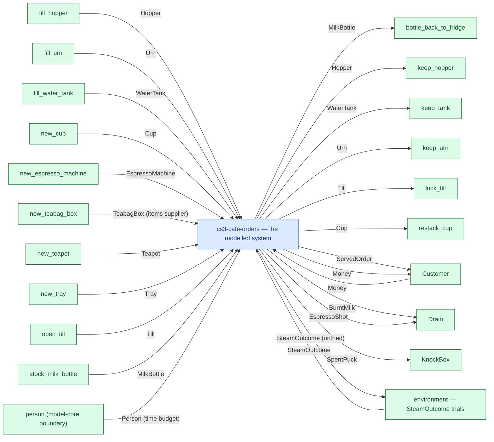

# cs3-cafe-orders — context diagram

> Generated by `tools/diagram-gen` from `model/cs3-cafe-orders` — **do not hand-edit**; regenerate with `tools/diagrams.sh`. Diagram nodes are clickable (absolute links into the source); the legend table under the diagram carries the hyperlinks into the source.

The system as one box — only what crosses the boundary (R12/R15): inputs from suppliers and sources on the left-hand edges, outputs to consumers and sinks on the right. Extracted statically from the crate's `boundary` module functions, its `Supplier`/`Consumer` impls and its `outcome_token!` declarations. *cs3-cafe-orders — case study CS-3: café order fulfilment*

## Legend — node → source

| Node | Kind | Defined at |
|---|---|---|
| `n_system` (cs3-cafe-orders — the modelled system) | the system | [model/cs3-cafe-orders/src/lib.rs#L1](/model/cs3-cafe-orders/src/lib.rs#L1) |
| `n_exit_bottle_back_to_fridge` (bottle_back_to_fridge) | external party | [model/cs3-cafe-orders/src/resources.rs#L698](/model/cs3-cafe-orders/src/resources.rs#L698) |
| `n_fill_hopper` (fill_hopper) | external party | [model/cs3-cafe-orders/src/resources.rs#L706](/model/cs3-cafe-orders/src/resources.rs#L706) |
| `n_fill_urn` (fill_urn) | external party | [model/cs3-cafe-orders/src/resources.rs#L735](/model/cs3-cafe-orders/src/resources.rs#L735) |
| `n_fill_water_tank` (fill_water_tank) | external party | [model/cs3-cafe-orders/src/resources.rs#L721](/model/cs3-cafe-orders/src/resources.rs#L721) |
| `n_exit_keep_hopper` (keep_hopper) | external party | [model/cs3-cafe-orders/src/resources.rs#L713](/model/cs3-cafe-orders/src/resources.rs#L713) |
| `n_exit_keep_tank` (keep_tank) | external party | [model/cs3-cafe-orders/src/resources.rs#L728](/model/cs3-cafe-orders/src/resources.rs#L728) |
| `n_exit_keep_urn` (keep_urn) | external party | [model/cs3-cafe-orders/src/resources.rs#L742](/model/cs3-cafe-orders/src/resources.rs#L742) |
| `n_exit_lock_till` (lock_till) | external party | [model/cs3-cafe-orders/src/resources.rs#L823](/model/cs3-cafe-orders/src/resources.rs#L823) |
| `n_new_cup` (new_cup) | external party | [model/cs3-cafe-orders/src/resources.rs#L782](/model/cs3-cafe-orders/src/resources.rs#L782) |
| `n_new_espresso_machine` (new_espresso_machine) | external party | [model/cs3-cafe-orders/src/resources.rs#L681](/model/cs3-cafe-orders/src/resources.rs#L681) |
| `n_new_teabag_box` (new_teabag_box) | external party | [model/cs3-cafe-orders/src/resources.rs#L750](/model/cs3-cafe-orders/src/resources.rs#L750) |
| `n_new_teapot` (new_teapot) | external party | [model/cs3-cafe-orders/src/resources.rs#L800](/model/cs3-cafe-orders/src/resources.rs#L800) |
| `n_new_tray` (new_tray) | external party | [model/cs3-cafe-orders/src/resources.rs#L807](/model/cs3-cafe-orders/src/resources.rs#L807) |
| `n_open_till` (open_till) | external party | [model/cs3-cafe-orders/src/resources.rs#L815](/model/cs3-cafe-orders/src/resources.rs#L815) |
| `n_exit_restack_cup` (restack_cup) | external party | [model/cs3-cafe-orders/src/resources.rs#L791](/model/cs3-cafe-orders/src/resources.rs#L791) |
| `n_stock_milk_bottle` (stock_milk_bottle) | external party | [model/cs3-cafe-orders/src/resources.rs#L689](/model/cs3-cafe-orders/src/resources.rs#L689) |
| `n_Customer` (Customer) | external party | [model/cs3-cafe-orders/src/resources.rs#L572](/model/cs3-cafe-orders/src/resources.rs#L572) |
| `n_Drain` (Drain) | external party | [model/cs3-cafe-orders/src/resources.rs#L616](/model/cs3-cafe-orders/src/resources.rs#L616) |
| `n_KnockBox` (KnockBox) | external party | [model/cs3-cafe-orders/src/resources.rs#L650](/model/cs3-cafe-orders/src/resources.rs#L650) |
| `n_env_SteamOutcome` (environment — SteamOutcome trials) | external party | [model/cs3-cafe-orders/src/resources.rs#L510](/model/cs3-cafe-orders/src/resources.rs#L510) |
| `n_person` (person (model-core boundary)) | external party | — |

## Resources on the edges

| Resource | Kind | Unit | Defined at |
|---|---|---|---|
| `BurntMilk` | continuous (container) | grams | [model/cs3-cafe-orders/src/resources.rs#L158](/model/cs3-cafe-orders/src/resources.rs#L158) |
| `Cup` | discrete (consumable) | — | [model/cs3-cafe-orders/src/resources.rs#L335](/model/cs3-cafe-orders/src/resources.rs#L335) |
| `EspressoMachine` | reusable (placeholder) | — | [model/cs3-cafe-orders/src/resources.rs#L495](/model/cs3-cafe-orders/src/resources.rs#L495) |
| `EspressoShot` | continuous (container) | grams | [model/cs3-cafe-orders/src/resources.rs#L209](/model/cs3-cafe-orders/src/resources.rs#L209) |
| `Hopper` | continuous (container) | grams | [model/cs3-cafe-orders/src/resources.rs#L171](/model/cs3-cafe-orders/src/resources.rs#L171) |
| `MilkBottle` | continuous (container) | grams | [model/cs3-cafe-orders/src/resources.rs#L127](/model/cs3-cafe-orders/src/resources.rs#L127) |
| `Money` | continuous (container) | pence | [model/cs3-cafe-orders/src/resources.rs#L101](/model/cs3-cafe-orders/src/resources.rs#L101) |
| `ServedOrder` | discrete (consumable) | — | [model/cs3-cafe-orders/src/resources.rs#L426](/model/cs3-cafe-orders/src/resources.rs#L426) |
| `SpentPuck` | continuous (container) | grams | [model/cs3-cafe-orders/src/resources.rs#L219](/model/cs3-cafe-orders/src/resources.rs#L219) |
| `SteamOutcome` | outcome token (R17) | — | [model/cs3-cafe-orders/src/resources.rs#L510](/model/cs3-cafe-orders/src/resources.rs#L510) |
| `TeabagBox` | boundary object (placeholder) | — | [model/cs3-cafe-orders/src/resources.rs#L267](/model/cs3-cafe-orders/src/resources.rs#L267) |
| `Teapot` | discrete (consumable) | — | [model/cs3-cafe-orders/src/resources.rs#L345](/model/cs3-cafe-orders/src/resources.rs#L345) |
| `Till` | continuous (container) | pence | [model/cs3-cafe-orders/src/resources.rs#L112](/model/cs3-cafe-orders/src/resources.rs#L112) |
| `Tray` | discrete (consumable) | — | [model/cs3-cafe-orders/src/resources.rs#L355](/model/cs3-cafe-orders/src/resources.rs#L355) |
| `Urn` | continuous (container) | grams | [model/cs3-cafe-orders/src/resources.rs#L232](/model/cs3-cafe-orders/src/resources.rs#L232) |
| `WaterTank` | continuous (container) | grams | [model/cs3-cafe-orders/src/resources.rs#L189](/model/cs3-cafe-orders/src/resources.rs#L189) |
