# cs3-cafe-orders — top-level diagram

> Generated by `tools/diagram-gen` from `model/cs3-cafe-orders` — **do not hand-edit**; regenerate with `tools/diagrams.sh`. Diagram nodes are clickable (absolute links into the source); the legend table under the diagram carries the hyperlinks into the source.

The first level of processes with their inputs and outputs, linked to each other and to the boundary. This is the **R9 connection graph**, extracted statically from the process signatures (the model describes connections, not sequences): an edge `A — T → B` means A outputs a resource of type T that B's signature accepts. Requirement-trait bounds are resolved through their `satisfies!`-tagged types; `Consumer`/`SupplyN` bounds become sink/supplier edges. Dashed links are reusable resources or boundary objects **threaded** through a process (moved in and returned, R2) — no direction is claimed. Hand-overs that happen inside a process (e.g. a sealed disposal minting its output) are not visible in signatures and appear only in the detailed diagram's flow trace.

```mermaid
flowchart LR
  classDef process fill:#dbeafe,stroke:#1e40af,color:#1e3a8a;
  classDef boundary fill:#dcfce7,stroke:#166534,color:#14532d;
  classDef sink fill:#fee2e2,stroke:#991b1b,color:#7f1d1d;
  classDef helper fill:#f3e8ff,stroke:#6b21a8,color:#581c87;
  classDef grouping fill:#ffedd5,stroke:#9a3412,color:#7c2d12;
  classDef flowio fill:#e2e8f0,stroke:#334155,color:#0f172a;
  classDef resource fill:#fef9c3,stroke:#854d0e,color:#713f12;
  classDef external fill:#dcfce7,stroke:#166534,color:#14532d;
  classDef system fill:#dbeafe,stroke:#1e40af,color:#1e3a8a;
  subgraph sg_sources["System boundary — sources and setup"]
    direction TB
    n_new_cup["new_cup"]:::boundary
    n_tender_cash["tender_cash"]:::boundary
    n_new_espresso_machine["new_espresso_machine"]:::boundary
    n_fill_hopper["fill_hopper"]:::boundary
    n_stock_milk_bottle["stock_milk_bottle"]:::boundary
    n_milk_burns["milk_burns"]:::boundary
    n_steam_goes_well["steam_goes_well"]:::boundary
    n_new_teapot["new_teapot"]:::boundary
    n_open_till["open_till"]:::boundary
    n_new_tray["new_tray"]:::boundary
    n_fill_urn["fill_urn"]:::boundary
    n_fill_water_tank["fill_water_tank"]:::boundary
    n_TeabagBox["TeabagBox"]:::boundary
    n_new_teabag_box["new_teabag_box"]:::boundary
    n_new_person["new_person (model-core)"]:::boundary
    n_qualify["qualify (model-core)"]:::boundary
  end
  subgraph sg_system["Processes"]
    direction TB
    n_draw_milk["draw_milk"]:::process
    n_draw_grounds["draw_grounds"]:::process
    n_draw_water["draw_water"]:::process
    n_draw_urn_water["draw_urn_water"]:::process
    n_split_money["split_money"]:::process
    n_deposit_till["deposit_till"]:::process
    n_pull_espresso["pull_espresso"]:::process
    n_steam_milk["steam_milk"]:::process
    n_build_flat_white["build_flat_white"]:::process
    n_take_payment["take_payment"]:::process
    n_brew_tea["brew_tea"]:::process
    n_hand_over["hand_over"]:::process
    n_refund_flat_white["refund_flat_white"]:::process
  end
  subgraph sg_sinks["System boundary — sinks"]
    direction TB
    n_restack_cup["restack_cup"]:::sink
    n_Customer["Customer"]:::sink
    n_keep_hopper["keep_hopper"]:::sink
    n_bottle_back_to_fridge["bottle_back_to_fridge"]:::sink
    n_return_steam_outcome["return_steam_outcome"]:::sink
    n_lock_till["lock_till"]:::sink
    n_keep_urn["keep_urn"]:::sink
    n_keep_tank["keep_tank"]:::sink
    n_KnockBox["KnockBox"]:::sink
    n_Drain["Drain"]:::sink
  end
  n_Cup["Cup"]:::resource
  n_caller["caller / flow"]:::flowio
  n_EspressoMachine["EspressoMachine"]:::resource
  n_Hopper["Hopper"]:::resource
  n_MilkBottle["MilkBottle"]:::resource
  n_Money["Money"]:::resource
  n_SteamOutcome["SteamOutcome"]:::resource
  n_Till["Till"]:::resource
  n_Urn["Urn"]:::resource
  n_WaterTank["WaterTank"]:::resource
  n_Person["Person"]:::resource
  n_Qualified["Qualified"]:::resource
  n_pull_espresso -- "Cup" --> n_Cup
  n_new_cup -- "Cup" --> n_Cup
  n_Cup -- "Cup" --> n_brew_tea
  n_Cup -- "Cup" --> n_build_flat_white
  n_Cup -- "Cup" --> n_pull_espresso
  n_Cup -- "Cup" --> n_restack_cup
  n_Customer -- "Customer" --> n_tender_cash
  n_steam_milk -- "Drain" --> n_caller
  n_new_espresso_machine -- "EspressoMachine" --> n_EspressoMachine
  n_EspressoMachine -- "EspressoMachine" --> n_caller
  n_pull_espresso -- "EspressoShot" --> n_build_flat_white
  n_build_flat_white -- "FlatWhite" --> n_caller
  n_draw_grounds -- "Grounds" --> n_pull_espresso
  n_draw_grounds -- "Hopper" --> n_Hopper
  n_fill_hopper -- "Hopper" --> n_Hopper
  n_Hopper -- "Hopper" --> n_draw_grounds
  n_Hopper -- "Hopper" --> n_keep_hopper
  n_draw_water -- "MachineWater" --> n_pull_espresso
  n_draw_milk -- "Milk" --> n_steam_milk
  n_draw_milk -- "MilkBottle" --> n_MilkBottle
  n_stock_milk_bottle -- "MilkBottle" --> n_MilkBottle
  n_MilkBottle -- "MilkBottle" --> n_draw_milk
  n_MilkBottle -- "MilkBottle" --> n_bottle_back_to_fridge
  n_refund_flat_white -- "Money" --> n_Money
  n_split_money -- "Money" --> n_Money
  n_tender_cash -- "Money" --> n_Money
  n_Money -- "Money" --> n_deposit_till
  n_Money -- "Money" --> n_split_money
  n_Money -- "Money" --> n_take_payment
  n_take_payment -- "PaymentReceipt" --> n_hand_over
  n_brew_tea -- "PotOfTea" --> n_hand_over
  n_hand_over -- "ServedOrder" --> n_Customer
  n_milk_burns -- "SteamOutcome" --> n_SteamOutcome
  n_steam_goes_well -- "SteamOutcome" --> n_SteamOutcome
  n_SteamOutcome -- "SteamOutcome" --> n_steam_milk
  n_SteamOutcome -- "SteamOutcome" --> n_return_steam_outcome
  n_steam_milk -- "SteamedMilk (on success)" --> n_build_flat_white
  n_caller -- "Teabag" --> n_brew_tea
  n_new_teapot -- "Teapot" --> n_brew_tea
  n_deposit_till -- "Till" --> n_Till
  n_refund_flat_white -- "Till" --> n_Till
  n_take_payment -- "Till" --> n_Till
  n_open_till -- "Till" --> n_Till
  n_Till -- "Till" --> n_deposit_till
  n_Till -- "Till" --> n_refund_flat_white
  n_Till -- "Till" --> n_take_payment
  n_Till -- "Till" --> n_lock_till
  n_new_tray -- "Tray" --> n_hand_over
  n_draw_urn_water -- "Urn" --> n_Urn
  n_fill_urn -- "Urn" --> n_Urn
  n_Urn -- "Urn" --> n_draw_urn_water
  n_Urn -- "Urn" --> n_keep_urn
  n_draw_urn_water -- "UrnWater" --> n_brew_tea
  n_draw_water -- "WaterTank" --> n_WaterTank
  n_fill_water_tank -- "WaterTank" --> n_WaterTank
  n_WaterTank -- "WaterTank" --> n_draw_water
  n_WaterTank -- "WaterTank" --> n_keep_tank
  n_pull_espresso -- "SpentPuck" --> n_KnockBox
  n_steam_milk -- "BurntMilk" --> n_Drain
  n_take_payment -- "Money" --> n_Customer
  n_new_teabag_box -- "TeabagBox" --> n_TeabagBox
  n_Person -.- n_brew_tea
  n_Qualified -.- n_build_flat_white
  n_Person -.- n_hand_over
  n_EspressoMachine -.- n_pull_espresso
  n_Qualified -.- n_pull_espresso
  n_Person -.- n_refund_flat_white
  n_Qualified -.- n_steam_milk
  n_Person -.- n_take_payment
  n_new_person -- "Person" --> n_Person
  n_qualify -- "Qualified" --> n_Qualified
  click n_draw_milk "https://github.com/twalmsley/lavoisier/blob/main/model/cs3-cafe-orders/src/resources.rs#L903" "model/cs3-cafe-orders/src/resources.rs"
  click n_draw_grounds "https://github.com/twalmsley/lavoisier/blob/main/model/cs3-cafe-orders/src/resources.rs#L911" "model/cs3-cafe-orders/src/resources.rs"
  click n_draw_water "https://github.com/twalmsley/lavoisier/blob/main/model/cs3-cafe-orders/src/resources.rs#L919" "model/cs3-cafe-orders/src/resources.rs"
  click n_draw_urn_water "https://github.com/twalmsley/lavoisier/blob/main/model/cs3-cafe-orders/src/resources.rs#L926" "model/cs3-cafe-orders/src/resources.rs"
  click n_split_money "https://github.com/twalmsley/lavoisier/blob/main/model/cs3-cafe-orders/src/resources.rs#L935" "model/cs3-cafe-orders/src/resources.rs"
  click n_deposit_till "https://github.com/twalmsley/lavoisier/blob/main/model/cs3-cafe-orders/src/resources.rs#L952" "model/cs3-cafe-orders/src/resources.rs"
  click n_pull_espresso "https://github.com/twalmsley/lavoisier/blob/main/model/cs3-cafe-orders/src/resources.rs#L998" "model/cs3-cafe-orders/src/resources.rs"
  click n_steam_milk "https://github.com/twalmsley/lavoisier/blob/main/model/cs3-cafe-orders/src/resources.rs#L1075" "model/cs3-cafe-orders/src/resources.rs"
  click n_build_flat_white "https://github.com/twalmsley/lavoisier/blob/main/model/cs3-cafe-orders/src/resources.rs#L1116" "model/cs3-cafe-orders/src/resources.rs"
  click n_take_payment "https://github.com/twalmsley/lavoisier/blob/main/model/cs3-cafe-orders/src/resources.rs#L1165" "model/cs3-cafe-orders/src/resources.rs"
  click n_brew_tea "https://github.com/twalmsley/lavoisier/blob/main/model/cs3-cafe-orders/src/resources.rs#L1186" "model/cs3-cafe-orders/src/resources.rs"
  click n_hand_over "https://github.com/twalmsley/lavoisier/blob/main/model/cs3-cafe-orders/src/resources.rs#L1220" "model/cs3-cafe-orders/src/resources.rs"
  click n_refund_flat_white "https://github.com/twalmsley/lavoisier/blob/main/model/cs3-cafe-orders/src/resources.rs#L1256" "model/cs3-cafe-orders/src/resources.rs"
  click n_Cup "https://github.com/twalmsley/lavoisier/blob/main/model/cs3-cafe-orders/src/resources.rs#L358" "model/cs3-cafe-orders/src/resources.rs"
  click n_new_cup "https://github.com/twalmsley/lavoisier/blob/main/model/cs3-cafe-orders/src/resources.rs#L793" "model/cs3-cafe-orders/src/resources.rs"
  click n_restack_cup "https://github.com/twalmsley/lavoisier/blob/main/model/cs3-cafe-orders/src/resources.rs#L802" "model/cs3-cafe-orders/src/resources.rs"
  click n_Customer "https://github.com/twalmsley/lavoisier/blob/main/model/cs3-cafe-orders/src/resources.rs#L595" "model/cs3-cafe-orders/src/resources.rs"
  click n_tender_cash "https://github.com/twalmsley/lavoisier/blob/main/model/cs3-cafe-orders/src/resources.rs#L850" "model/cs3-cafe-orders/src/resources.rs"
  click n_EspressoMachine "https://github.com/twalmsley/lavoisier/blob/main/model/cs3-cafe-orders/src/resources.rs#L518" "model/cs3-cafe-orders/src/resources.rs"
  click n_new_espresso_machine "https://github.com/twalmsley/lavoisier/blob/main/model/cs3-cafe-orders/src/resources.rs#L692" "model/cs3-cafe-orders/src/resources.rs"
  click n_Hopper "https://github.com/twalmsley/lavoisier/blob/main/model/cs3-cafe-orders/src/resources.rs#L173" "model/cs3-cafe-orders/src/resources.rs"
  click n_fill_hopper "https://github.com/twalmsley/lavoisier/blob/main/model/cs3-cafe-orders/src/resources.rs#L717" "model/cs3-cafe-orders/src/resources.rs"
  click n_keep_hopper "https://github.com/twalmsley/lavoisier/blob/main/model/cs3-cafe-orders/src/resources.rs#L724" "model/cs3-cafe-orders/src/resources.rs"
  click n_MilkBottle "https://github.com/twalmsley/lavoisier/blob/main/model/cs3-cafe-orders/src/resources.rs#L129" "model/cs3-cafe-orders/src/resources.rs"
  click n_stock_milk_bottle "https://github.com/twalmsley/lavoisier/blob/main/model/cs3-cafe-orders/src/resources.rs#L700" "model/cs3-cafe-orders/src/resources.rs"
  click n_bottle_back_to_fridge "https://github.com/twalmsley/lavoisier/blob/main/model/cs3-cafe-orders/src/resources.rs#L709" "model/cs3-cafe-orders/src/resources.rs"
  click n_Money "https://github.com/twalmsley/lavoisier/blob/main/model/cs3-cafe-orders/src/resources.rs#L103" "model/cs3-cafe-orders/src/resources.rs"
  click n_SteamOutcome "https://github.com/twalmsley/lavoisier/blob/main/model/cs3-cafe-orders/src/resources.rs#L533" "model/cs3-cafe-orders/src/resources.rs"
  click n_milk_burns "https://github.com/twalmsley/lavoisier/blob/main/model/cs3-cafe-orders/src/resources.rs#L533" "model/cs3-cafe-orders/src/resources.rs"
  click n_steam_goes_well "https://github.com/twalmsley/lavoisier/blob/main/model/cs3-cafe-orders/src/resources.rs#L533" "model/cs3-cafe-orders/src/resources.rs"
  click n_return_steam_outcome "https://github.com/twalmsley/lavoisier/blob/main/model/cs3-cafe-orders/src/resources.rs#L533" "model/cs3-cafe-orders/src/resources.rs"
  click n_new_teapot "https://github.com/twalmsley/lavoisier/blob/main/model/cs3-cafe-orders/src/resources.rs#L811" "model/cs3-cafe-orders/src/resources.rs"
  click n_Till "https://github.com/twalmsley/lavoisier/blob/main/model/cs3-cafe-orders/src/resources.rs#L114" "model/cs3-cafe-orders/src/resources.rs"
  click n_open_till "https://github.com/twalmsley/lavoisier/blob/main/model/cs3-cafe-orders/src/resources.rs#L826" "model/cs3-cafe-orders/src/resources.rs"
  click n_lock_till "https://github.com/twalmsley/lavoisier/blob/main/model/cs3-cafe-orders/src/resources.rs#L834" "model/cs3-cafe-orders/src/resources.rs"
  click n_new_tray "https://github.com/twalmsley/lavoisier/blob/main/model/cs3-cafe-orders/src/resources.rs#L818" "model/cs3-cafe-orders/src/resources.rs"
  click n_Urn "https://github.com/twalmsley/lavoisier/blob/main/model/cs3-cafe-orders/src/resources.rs#L255" "model/cs3-cafe-orders/src/resources.rs"
  click n_fill_urn "https://github.com/twalmsley/lavoisier/blob/main/model/cs3-cafe-orders/src/resources.rs#L746" "model/cs3-cafe-orders/src/resources.rs"
  click n_keep_urn "https://github.com/twalmsley/lavoisier/blob/main/model/cs3-cafe-orders/src/resources.rs#L753" "model/cs3-cafe-orders/src/resources.rs"
  click n_WaterTank "https://github.com/twalmsley/lavoisier/blob/main/model/cs3-cafe-orders/src/resources.rs#L191" "model/cs3-cafe-orders/src/resources.rs"
  click n_fill_water_tank "https://github.com/twalmsley/lavoisier/blob/main/model/cs3-cafe-orders/src/resources.rs#L732" "model/cs3-cafe-orders/src/resources.rs"
  click n_keep_tank "https://github.com/twalmsley/lavoisier/blob/main/model/cs3-cafe-orders/src/resources.rs#L739" "model/cs3-cafe-orders/src/resources.rs"
  click n_KnockBox "https://github.com/twalmsley/lavoisier/blob/main/model/cs3-cafe-orders/src/resources.rs#L661" "model/cs3-cafe-orders/src/resources.rs"
  click n_Drain "https://github.com/twalmsley/lavoisier/blob/main/model/cs3-cafe-orders/src/resources.rs#L637" "model/cs3-cafe-orders/src/resources.rs"
  click n_TeabagBox "https://github.com/twalmsley/lavoisier/blob/main/model/cs3-cafe-orders/src/resources.rs#L290" "model/cs3-cafe-orders/src/resources.rs"
  click n_new_teabag_box "https://github.com/twalmsley/lavoisier/blob/main/model/cs3-cafe-orders/src/resources.rs#L761" "model/cs3-cafe-orders/src/resources.rs"
  click n_new_person "https://github.com/twalmsley/lavoisier/blob/main/model/model-core/src/common.rs#L152" "model/model-core/src/common.rs"
  click n_qualify "https://github.com/twalmsley/lavoisier/blob/main/model/model-core/src/common.rs#L166" "model/model-core/src/common.rs"
```

## Legend — node → source

| Node | Kind | Defined at |
|---|---|---|
| `n_draw_milk` (draw_milk) | process | [model/cs3-cafe-orders/src/resources.rs#L903](/model/cs3-cafe-orders/src/resources.rs#L903) |
| `n_draw_grounds` (draw_grounds) | process | [model/cs3-cafe-orders/src/resources.rs#L911](/model/cs3-cafe-orders/src/resources.rs#L911) |
| `n_draw_water` (draw_water) | process | [model/cs3-cafe-orders/src/resources.rs#L919](/model/cs3-cafe-orders/src/resources.rs#L919) |
| `n_draw_urn_water` (draw_urn_water) | process | [model/cs3-cafe-orders/src/resources.rs#L926](/model/cs3-cafe-orders/src/resources.rs#L926) |
| `n_split_money` (split_money) | process | [model/cs3-cafe-orders/src/resources.rs#L935](/model/cs3-cafe-orders/src/resources.rs#L935) |
| `n_deposit_till` (deposit_till) | process | [model/cs3-cafe-orders/src/resources.rs#L952](/model/cs3-cafe-orders/src/resources.rs#L952) |
| `n_pull_espresso` (pull_espresso) | process | [model/cs3-cafe-orders/src/resources.rs#L998](/model/cs3-cafe-orders/src/resources.rs#L998) |
| `n_steam_milk` (steam_milk) | process | [model/cs3-cafe-orders/src/resources.rs#L1075](/model/cs3-cafe-orders/src/resources.rs#L1075) |
| `n_build_flat_white` (build_flat_white) | process | [model/cs3-cafe-orders/src/resources.rs#L1116](/model/cs3-cafe-orders/src/resources.rs#L1116) |
| `n_take_payment` (take_payment) | process | [model/cs3-cafe-orders/src/resources.rs#L1165](/model/cs3-cafe-orders/src/resources.rs#L1165) |
| `n_brew_tea` (brew_tea) | process | [model/cs3-cafe-orders/src/resources.rs#L1186](/model/cs3-cafe-orders/src/resources.rs#L1186) |
| `n_hand_over` (hand_over) | process | [model/cs3-cafe-orders/src/resources.rs#L1220](/model/cs3-cafe-orders/src/resources.rs#L1220) |
| `n_refund_flat_white` (refund_flat_white) | process | [model/cs3-cafe-orders/src/resources.rs#L1256](/model/cs3-cafe-orders/src/resources.rs#L1256) |
| `n_Cup` (Cup) | shared resource | [model/cs3-cafe-orders/src/resources.rs#L358](/model/cs3-cafe-orders/src/resources.rs#L358) |
| `n_new_cup` (new_cup) | boundary source | [model/cs3-cafe-orders/src/resources.rs#L793](/model/cs3-cafe-orders/src/resources.rs#L793) |
| `n_restack_cup` (restack_cup) | boundary sink | [model/cs3-cafe-orders/src/resources.rs#L802](/model/cs3-cafe-orders/src/resources.rs#L802) |
| `n_Customer` (Customer) | boundary sink | [model/cs3-cafe-orders/src/resources.rs#L595](/model/cs3-cafe-orders/src/resources.rs#L595) |
| `n_tender_cash` (tender_cash) | boundary source | [model/cs3-cafe-orders/src/resources.rs#L850](/model/cs3-cafe-orders/src/resources.rs#L850) |
| `n_caller` (caller / flow) | flow input/output | — |
| `n_EspressoMachine` (EspressoMachine) | shared resource | [model/cs3-cafe-orders/src/resources.rs#L518](/model/cs3-cafe-orders/src/resources.rs#L518) |
| `n_new_espresso_machine` (new_espresso_machine) | boundary source | [model/cs3-cafe-orders/src/resources.rs#L692](/model/cs3-cafe-orders/src/resources.rs#L692) |
| `n_Hopper` (Hopper) | shared resource | [model/cs3-cafe-orders/src/resources.rs#L173](/model/cs3-cafe-orders/src/resources.rs#L173) |
| `n_fill_hopper` (fill_hopper) | boundary source | [model/cs3-cafe-orders/src/resources.rs#L717](/model/cs3-cafe-orders/src/resources.rs#L717) |
| `n_keep_hopper` (keep_hopper) | boundary sink | [model/cs3-cafe-orders/src/resources.rs#L724](/model/cs3-cafe-orders/src/resources.rs#L724) |
| `n_MilkBottle` (MilkBottle) | shared resource | [model/cs3-cafe-orders/src/resources.rs#L129](/model/cs3-cafe-orders/src/resources.rs#L129) |
| `n_stock_milk_bottle` (stock_milk_bottle) | boundary source | [model/cs3-cafe-orders/src/resources.rs#L700](/model/cs3-cafe-orders/src/resources.rs#L700) |
| `n_bottle_back_to_fridge` (bottle_back_to_fridge) | boundary sink | [model/cs3-cafe-orders/src/resources.rs#L709](/model/cs3-cafe-orders/src/resources.rs#L709) |
| `n_Money` (Money) | shared resource | [model/cs3-cafe-orders/src/resources.rs#L103](/model/cs3-cafe-orders/src/resources.rs#L103) |
| `n_SteamOutcome` (SteamOutcome) | shared resource | [model/cs3-cafe-orders/src/resources.rs#L533](/model/cs3-cafe-orders/src/resources.rs#L533) |
| `n_milk_burns` (milk_burns) | boundary source | [model/cs3-cafe-orders/src/resources.rs#L533](/model/cs3-cafe-orders/src/resources.rs#L533) |
| `n_steam_goes_well` (steam_goes_well) | boundary source | [model/cs3-cafe-orders/src/resources.rs#L533](/model/cs3-cafe-orders/src/resources.rs#L533) |
| `n_return_steam_outcome` (return_steam_outcome) | boundary sink | [model/cs3-cafe-orders/src/resources.rs#L533](/model/cs3-cafe-orders/src/resources.rs#L533) |
| `n_new_teapot` (new_teapot) | boundary source | [model/cs3-cafe-orders/src/resources.rs#L811](/model/cs3-cafe-orders/src/resources.rs#L811) |
| `n_Till` (Till) | shared resource | [model/cs3-cafe-orders/src/resources.rs#L114](/model/cs3-cafe-orders/src/resources.rs#L114) |
| `n_open_till` (open_till) | boundary source | [model/cs3-cafe-orders/src/resources.rs#L826](/model/cs3-cafe-orders/src/resources.rs#L826) |
| `n_lock_till` (lock_till) | boundary sink | [model/cs3-cafe-orders/src/resources.rs#L834](/model/cs3-cafe-orders/src/resources.rs#L834) |
| `n_new_tray` (new_tray) | boundary source | [model/cs3-cafe-orders/src/resources.rs#L818](/model/cs3-cafe-orders/src/resources.rs#L818) |
| `n_Urn` (Urn) | shared resource | [model/cs3-cafe-orders/src/resources.rs#L255](/model/cs3-cafe-orders/src/resources.rs#L255) |
| `n_fill_urn` (fill_urn) | boundary source | [model/cs3-cafe-orders/src/resources.rs#L746](/model/cs3-cafe-orders/src/resources.rs#L746) |
| `n_keep_urn` (keep_urn) | boundary sink | [model/cs3-cafe-orders/src/resources.rs#L753](/model/cs3-cafe-orders/src/resources.rs#L753) |
| `n_WaterTank` (WaterTank) | shared resource | [model/cs3-cafe-orders/src/resources.rs#L191](/model/cs3-cafe-orders/src/resources.rs#L191) |
| `n_fill_water_tank` (fill_water_tank) | boundary source | [model/cs3-cafe-orders/src/resources.rs#L732](/model/cs3-cafe-orders/src/resources.rs#L732) |
| `n_keep_tank` (keep_tank) | boundary sink | [model/cs3-cafe-orders/src/resources.rs#L739](/model/cs3-cafe-orders/src/resources.rs#L739) |
| `n_KnockBox` (KnockBox) | boundary sink | [model/cs3-cafe-orders/src/resources.rs#L661](/model/cs3-cafe-orders/src/resources.rs#L661) |
| `n_Drain` (Drain) | boundary sink | [model/cs3-cafe-orders/src/resources.rs#L637](/model/cs3-cafe-orders/src/resources.rs#L637) |
| `n_TeabagBox` (TeabagBox) | boundary source | [model/cs3-cafe-orders/src/resources.rs#L290](/model/cs3-cafe-orders/src/resources.rs#L290) |
| `n_new_teabag_box` (new_teabag_box) | boundary source | [model/cs3-cafe-orders/src/resources.rs#L761](/model/cs3-cafe-orders/src/resources.rs#L761) |
| `n_Person` (Person) | shared resource | — |
| `n_Qualified` (Qualified) | shared resource | — |
| `n_new_person` (new_person (model-core)) | boundary source | [model/model-core/src/common.rs#L152](/model/model-core/src/common.rs#L152) |
| `n_qualify` (qualify (model-core)) | boundary source | [model/model-core/src/common.rs#L166](/model/model-core/src/common.rs#L166) |

## Resources on the edges

| Resource | Kind | Unit | Defined at |
|---|---|---|---|
| `BurntMilk` | continuous (container) | grams | [model/cs3-cafe-orders/src/resources.rs#L160](/model/cs3-cafe-orders/src/resources.rs#L160) |
| `Cup` | discrete (consumable) | — | [model/cs3-cafe-orders/src/resources.rs#L358](/model/cs3-cafe-orders/src/resources.rs#L358) |
| `Customer` | boundary object (placeholder) | — | [model/cs3-cafe-orders/src/resources.rs#L595](/model/cs3-cafe-orders/src/resources.rs#L595) |
| `Drain` | boundary object (placeholder) | — | [model/cs3-cafe-orders/src/resources.rs#L637](/model/cs3-cafe-orders/src/resources.rs#L637) |
| `EspressoMachine` | reusable (placeholder) | — | [model/cs3-cafe-orders/src/resources.rs#L518](/model/cs3-cafe-orders/src/resources.rs#L518) |
| `EspressoShot` | continuous (container) | grams | [model/cs3-cafe-orders/src/resources.rs#L211](/model/cs3-cafe-orders/src/resources.rs#L211) |
| `FlatWhite` | discrete (consumable) | — | [model/cs3-cafe-orders/src/resources.rs#L390](/model/cs3-cafe-orders/src/resources.rs#L390) |
| `Grounds` | continuous (container) | grams | [model/cs3-cafe-orders/src/resources.rs#L182](/model/cs3-cafe-orders/src/resources.rs#L182) |
| `Hopper` | continuous (container) | grams | [model/cs3-cafe-orders/src/resources.rs#L173](/model/cs3-cafe-orders/src/resources.rs#L173) |
| `MachineWater` | continuous (container) | grams | [model/cs3-cafe-orders/src/resources.rs#L199](/model/cs3-cafe-orders/src/resources.rs#L199) |
| `Milk` | continuous (container) | grams | [model/cs3-cafe-orders/src/resources.rs#L138](/model/cs3-cafe-orders/src/resources.rs#L138) |
| `MilkBottle` | continuous (container) | grams | [model/cs3-cafe-orders/src/resources.rs#L129](/model/cs3-cafe-orders/src/resources.rs#L129) |
| `Money` | continuous (container) | pence | [model/cs3-cafe-orders/src/resources.rs#L103](/model/cs3-cafe-orders/src/resources.rs#L103) |
| `PaymentReceipt` | discrete (consumable) | — | [model/cs3-cafe-orders/src/resources.rs#L464](/model/cs3-cafe-orders/src/resources.rs#L464) |
| `PotOfTea` | discrete (consumable) | — | [model/cs3-cafe-orders/src/resources.rs#L431](/model/cs3-cafe-orders/src/resources.rs#L431) |
| `ServedOrder` | discrete (consumable) | — | [model/cs3-cafe-orders/src/resources.rs#L449](/model/cs3-cafe-orders/src/resources.rs#L449) |
| `SpentPuck` | continuous (container) | grams | [model/cs3-cafe-orders/src/resources.rs#L242](/model/cs3-cafe-orders/src/resources.rs#L242) |
| `SteamOutcome` | outcome token (R17) | — | [model/cs3-cafe-orders/src/resources.rs#L533](/model/cs3-cafe-orders/src/resources.rs#L533) |
| `SteamedMilk` | continuous (container) | grams | [model/cs3-cafe-orders/src/resources.rs#L148](/model/cs3-cafe-orders/src/resources.rs#L148) |
| `Teabag` | discrete (consumable) | — | [model/cs3-cafe-orders/src/resources.rs#L273](/model/cs3-cafe-orders/src/resources.rs#L273) |
| `TeabagBox` | boundary object (placeholder) | — | [model/cs3-cafe-orders/src/resources.rs#L290](/model/cs3-cafe-orders/src/resources.rs#L290) |
| `Teapot` | discrete (consumable) | — | [model/cs3-cafe-orders/src/resources.rs#L368](/model/cs3-cafe-orders/src/resources.rs#L368) |
| `Till` | continuous (container) | pence | [model/cs3-cafe-orders/src/resources.rs#L114](/model/cs3-cafe-orders/src/resources.rs#L114) |
| `Tray` | discrete (consumable) | — | [model/cs3-cafe-orders/src/resources.rs#L378](/model/cs3-cafe-orders/src/resources.rs#L378) |
| `Urn` | continuous (container) | grams | [model/cs3-cafe-orders/src/resources.rs#L255](/model/cs3-cafe-orders/src/resources.rs#L255) |
| `UrnWater` | continuous (container) | grams | [model/cs3-cafe-orders/src/resources.rs#L263](/model/cs3-cafe-orders/src/resources.rs#L263) |
| `WaterTank` | continuous (container) | grams | [model/cs3-cafe-orders/src/resources.rs#L191](/model/cs3-cafe-orders/src/resources.rs#L191) |

<!-- WARN (diagram-gen): hand_over: unresolved parameter `W: OrderSlot` -->
