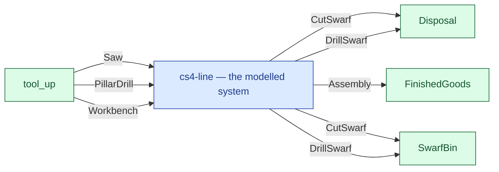

# cs4-line — context diagram

> Generated by `tools/diagram-gen` from `model/cs4-line` — **do not hand-edit**; regenerate with `tools/diagrams.sh`. Diagram nodes are clickable (absolute links into the source); the legend table under the diagram carries the hyperlinks into the source.

The system as one box — only what crosses the boundary (R12/R15): inputs from suppliers and sources on the left-hand edges, outputs to consumers and sinks on the right. Extracted statically from the crate's `boundary` module functions, its `Supplier`/`Consumer` impls and its `outcome_token!` declarations. *cs4-line — case study CS-4, the production-line subsystem*

## Legend — node → source

| Node | Kind | Defined at |
|---|---|---|
| `n_system` (cs4-line — the modelled system) | the system | [model/cs4-line/src/lib.rs#L1](/model/cs4-line/src/lib.rs#L1) |
| `n_tool_up` (tool_up) | external party | [model/cs4-line/src/resources.rs#L128](/model/cs4-line/src/resources.rs#L128) |
| `n_Disposal` (Disposal) | external party | [model/cs4-stores/src/resources.rs#L514](/model/cs4-stores/src/resources.rs#L514) |
| `n_FinishedGoods` (FinishedGoods) | external party | [model/cs4-stores/src/resources.rs#L476](/model/cs4-stores/src/resources.rs#L476) |
| `n_SwarfBin` (SwarfBin) | external party | [model/cs4-line/src/resources.rs#L57](/model/cs4-line/src/resources.rs#L57) |

## Resources on the edges

| Resource | Kind | Unit | Defined at |
|---|---|---|---|
| `Assembly` | discrete (consumable) | — | [model/cs4-stores/src/resources.rs#L190](/model/cs4-stores/src/resources.rs#L190) |
| `CutSwarf` | continuous (container) | grams | [model/cs4-stores/src/resources.rs#L124](/model/cs4-stores/src/resources.rs#L124) |
| `DrillSwarf` | continuous (container) | grams | [model/cs4-stores/src/resources.rs#L132](/model/cs4-stores/src/resources.rs#L132) |
| `PillarDrill` | reusable | — | [model/cs4-line/src/resources.rs#L31](/model/cs4-line/src/resources.rs#L31) |
| `Saw` | reusable | — | [model/cs4-line/src/resources.rs#L24](/model/cs4-line/src/resources.rs#L24) |
| `Workbench` | reusable | — | [model/cs4-line/src/resources.rs#L38](/model/cs4-line/src/resources.rs#L38) |
