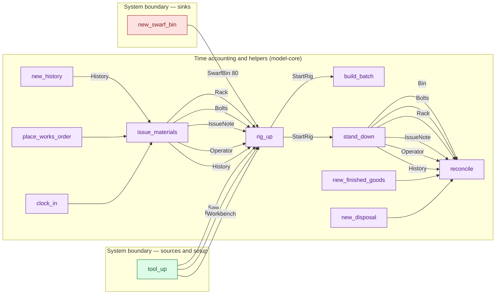

# cs4-line — detailed diagram

> Generated by `tools/diagram-gen` from `model/cs4-line` — **do not hand-edit**; regenerate with `tools/diagrams.sh`. Diagram nodes are clickable (absolute links into the source); the legend table under the diagram carries the hyperlinks into the source.

All levels, fully connected: every call in the flow — boundary setup, the processes, the adjacent time draws and their `History` records (F-048/R16), internal waste routing, and the disposal steps — traced from the flow function's `let`-binding sequence, with the const magnitudes from each call site. Edge labels carry the resource and its magnitude in the base unit (R7).

## Composite fallible flow — `run_batch`

Source: [model/cs4-line/src/flows.rs#L72](/model/cs4-line/src/flows.rs#L72)

### Legend — node → source

| Node | Kind | Defined at |
|---|---|---|
| `n_new_history` (new_history) | model-core helper | [model/model-core/src/history.rs#L264](/model/model-core/src/history.rs#L264) |
| `n_place_works_order` (place_works_order) | model-core helper | — |
| `n_clock_in` (clock_in) | model-core helper | — |
| `n_issue_materials` (issue_materials) | model-core helper | — |
| `n_tool_up` (tool_up) | boundary source | [model/cs4-line/src/resources.rs#L128](/model/cs4-line/src/resources.rs#L128) |
| `n_new_swarf_bin` (new_swarf_bin) | boundary sink | [model/cs4-line/src/resources.rs#L136](/model/cs4-line/src/resources.rs#L136) |
| `n_rig_up` (rig_up) | model-core helper | [model/cs4-line/src/batch.rs#L80](/model/cs4-line/src/batch.rs#L80) |
| `n_build_batch` (build_batch) | model-core helper | — |
| `n_stand_down` (stand_down) | model-core helper | [model/cs4-line/src/batch.rs#L99](/model/cs4-line/src/batch.rs#L99) |
| `n_new_finished_goods` (new_finished_goods) | model-core helper | — |
| `n_new_disposal` (new_disposal) | model-core helper | — |
| `n_reconcile` (reconcile) | model-core helper | — |

<!-- WARN (diagram-gen): unknown callee `place_works_order` in a traced flow — shown as a plain step -->
<!-- WARN (diagram-gen): unknown callee `clock_in` in a traced flow — shown as a plain step -->
<!-- WARN (diagram-gen): unknown callee `issue_materials` in a traced flow — shown as a plain step -->
<!-- WARN (diagram-gen): unknown callee `build_batch` in a traced flow — shown as a plain step -->
<!-- WARN (diagram-gen): unknown callee `new_finished_goods` in a traced flow — shown as a plain step -->
<!-- WARN (diagram-gen): unknown callee `new_disposal` in a traced flow — shown as a plain step -->
<!-- WARN (diagram-gen): unknown callee `reconcile` in a traced flow — shown as a plain step -->

## Resources on the edges

| Resource | Kind | Unit | Defined at |
|---|---|---|---|
| `PillarDrill` | reusable | — | [model/cs4-line/src/resources.rs#L31](/model/cs4-line/src/resources.rs#L31) |
| `Saw` | reusable | — | [model/cs4-line/src/resources.rs#L24](/model/cs4-line/src/resources.rs#L24) |
| `SwarfBin` | boundary object (placeholder) | — | [model/cs4-line/src/resources.rs#L57](/model/cs4-line/src/resources.rs#L57) |
| `Workbench` | reusable | — | [model/cs4-line/src/resources.rs#L38](/model/cs4-line/src/resources.rs#L38) |
