# cs4-line — top-level diagram

> Generated by `tools/diagram-gen` from `model/cs4-line` — **do not hand-edit**; regenerate with `tools/diagrams.sh`. Diagram nodes are clickable (absolute links into the source); the legend table under the diagram carries the hyperlinks into the source.

The first level of processes with their inputs and outputs, linked to each other and to the boundary. This is the **R9 connection graph**, extracted statically from the process signatures (the model describes connections, not sequences): an edge `A — T → B` means A outputs a resource of type T that B's signature accepts. Requirement-trait bounds are resolved through their `satisfies!`-tagged types; `Consumer`/`SupplyN` bounds become sink/supplier edges. Dashed links are reusable resources or boundary objects **threaded** through a process (moved in and returned, R2) — no direction is claimed. Hand-overs that happen inside a process (e.g. a sealed disposal minting its output) are not visible in signatures and appear only in the detailed diagram's flow trace.

```mermaid
flowchart LR
  classDef process fill:#dbeafe,stroke:#1e40af,color:#1e3a8a;
  classDef boundary fill:#dcfce7,stroke:#166534,color:#14532d;
  classDef sink fill:#fee2e2,stroke:#991b1b,color:#7f1d1d;
  classDef helper fill:#f3e8ff,stroke:#6b21a8,color:#581c87;
  classDef grouping fill:#ffedd5,stroke:#9a3412,color:#7c2d12;
  classDef flowio fill:#e2e8f0,stroke:#334155,color:#0f172a;
  classDef resource fill:#fef9c3,stroke:#854d0e,color:#713f12;
  classDef external fill:#dcfce7,stroke:#166534,color:#14532d;
  classDef system fill:#dbeafe,stroke:#1e40af,color:#1e3a8a;
  subgraph sg_sources["System boundary — sources and setup"]
    direction TB
    n_tool_up["tool_up"]:::boundary
    n_BoltBox["BoltBox"]:::boundary
  end
  subgraph sg_system["Processes"]
    direction TB
    n_cut["cut"]:::process
    n_drill_blank["drill_blank"]:::process
    n_fasten["fasten"]:::process
  end
  subgraph sg_sinks["System boundary — sinks"]
    direction TB
    n_FinishedGoods["FinishedGoods"]:::sink
    n_SwarfBin["SwarfBin"]:::sink
  end
  n_PillarDrill["PillarDrill"]:::resource
  n_caller["caller / flow"]:::flowio
  n_Saw["Saw"]:::resource
  n_Workbench["Workbench"]:::resource
  n_fasten -- "Assembly" --> n_FinishedGoods
  n_cut -- "Blank" --> n_drill_blank
  n_drill_blank -- "DrilledPlate" --> n_fasten
  n_tool_up -- "PillarDrill" --> n_PillarDrill
  n_PillarDrill -- "PillarDrill" --> n_caller
  n_tool_up -- "Saw" --> n_Saw
  n_Saw -- "Saw" --> n_caller
  n_caller -- "Sheet" --> n_cut
  n_tool_up -- "Workbench" --> n_Workbench
  n_Workbench -- "Workbench" --> n_caller
  n_cut -- "CutSwarf" --> n_SwarfBin
  n_drill_blank -- "DrillSwarf" --> n_SwarfBin
  n_BoltBox -- "4 × Bolt" --> n_fasten
  n_Saw -.- n_cut
  n_PillarDrill -.- n_drill_blank
  n_Workbench -.- n_fasten
  click n_cut "https://github.com/twalmsley/lavoisier/blob/main/model/cs4-line/src/processes.rs#L34" "model/cs4-line/src/processes.rs"
  click n_drill_blank "https://github.com/twalmsley/lavoisier/blob/main/model/cs4-line/src/processes.rs#L48" "model/cs4-line/src/processes.rs"
  click n_fasten "https://github.com/twalmsley/lavoisier/blob/main/model/cs4-line/src/processes.rs#L69" "model/cs4-line/src/processes.rs"
  click n_FinishedGoods "https://github.com/twalmsley/lavoisier/blob/main/model/cs4-stores/src/resources.rs#L476" "model/cs4-stores/src/resources.rs"
  click n_PillarDrill "https://github.com/twalmsley/lavoisier/blob/main/model/cs4-line/src/resources.rs#L31" "model/cs4-line/src/resources.rs"
  click n_tool_up "https://github.com/twalmsley/lavoisier/blob/main/model/cs4-line/src/resources.rs#L128" "model/cs4-line/src/resources.rs"
  click n_Saw "https://github.com/twalmsley/lavoisier/blob/main/model/cs4-line/src/resources.rs#L24" "model/cs4-line/src/resources.rs"
  click n_Workbench "https://github.com/twalmsley/lavoisier/blob/main/model/cs4-line/src/resources.rs#L38" "model/cs4-line/src/resources.rs"
  click n_SwarfBin "https://github.com/twalmsley/lavoisier/blob/main/model/cs4-line/src/resources.rs#L57" "model/cs4-line/src/resources.rs"
  click n_BoltBox "https://github.com/twalmsley/lavoisier/blob/main/model/cs4-stores/src/resources.rs#L347" "model/cs4-stores/src/resources.rs"
```

## Legend — node → source

| Node | Kind | Defined at |
|---|---|---|
| `n_cut` (cut) | process | [model/cs4-line/src/processes.rs#L34](/model/cs4-line/src/processes.rs#L34) |
| `n_drill_blank` (drill_blank) | process | [model/cs4-line/src/processes.rs#L48](/model/cs4-line/src/processes.rs#L48) |
| `n_fasten` (fasten) | process | [model/cs4-line/src/processes.rs#L69](/model/cs4-line/src/processes.rs#L69) |
| `n_FinishedGoods` (FinishedGoods) | boundary sink | [model/cs4-stores/src/resources.rs#L476](/model/cs4-stores/src/resources.rs#L476) |
| `n_PillarDrill` (PillarDrill) | shared resource | [model/cs4-line/src/resources.rs#L31](/model/cs4-line/src/resources.rs#L31) |
| `n_tool_up` (tool_up) | boundary source | [model/cs4-line/src/resources.rs#L128](/model/cs4-line/src/resources.rs#L128) |
| `n_caller` (caller / flow) | flow input/output | — |
| `n_Saw` (Saw) | shared resource | [model/cs4-line/src/resources.rs#L24](/model/cs4-line/src/resources.rs#L24) |
| `n_Workbench` (Workbench) | shared resource | [model/cs4-line/src/resources.rs#L38](/model/cs4-line/src/resources.rs#L38) |
| `n_SwarfBin` (SwarfBin) | boundary sink | [model/cs4-line/src/resources.rs#L57](/model/cs4-line/src/resources.rs#L57) |
| `n_BoltBox` (BoltBox) | boundary source | [model/cs4-stores/src/resources.rs#L347](/model/cs4-stores/src/resources.rs#L347) |

## Resources on the edges

| Resource | Kind | Unit | Defined at |
|---|---|---|---|
| `Assembly` | discrete (consumable) | — | [model/cs4-stores/src/resources.rs#L190](/model/cs4-stores/src/resources.rs#L190) |
| `Blank` | continuous (container) | grams | [model/cs4-stores/src/resources.rs#L105](/model/cs4-stores/src/resources.rs#L105) |
| `Bolt` | discrete (consumable) | — | [model/cs4-stores/src/resources.rs#L147](/model/cs4-stores/src/resources.rs#L147) |
| `CutSwarf` | continuous (container) | grams | [model/cs4-stores/src/resources.rs#L124](/model/cs4-stores/src/resources.rs#L124) |
| `DrillSwarf` | continuous (container) | grams | [model/cs4-stores/src/resources.rs#L132](/model/cs4-stores/src/resources.rs#L132) |
| `DrilledPlate` | continuous (container) | grams | [model/cs4-stores/src/resources.rs#L114](/model/cs4-stores/src/resources.rs#L114) |
| `PillarDrill` | reusable | — | [model/cs4-line/src/resources.rs#L31](/model/cs4-line/src/resources.rs#L31) |
| `Saw` | reusable | — | [model/cs4-line/src/resources.rs#L24](/model/cs4-line/src/resources.rs#L24) |
| `Sheet` | continuous (container) | grams | [model/cs4-stores/src/resources.rs#L97](/model/cs4-stores/src/resources.rs#L97) |
| `Workbench` | reusable | — | [model/cs4-line/src/resources.rs#L38](/model/cs4-line/src/resources.rs#L38) |
