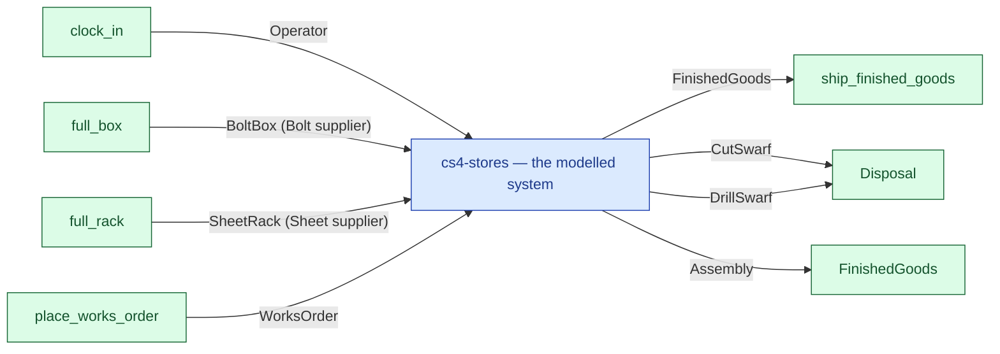

# cs4-stores — context diagram

> Generated by `tools/diagram-gen` from `model/cs4-stores` — **do not hand-edit**; regenerate with `tools/diagrams.sh`. Diagram nodes are clickable (absolute links into the source); the legend table under the diagram carries the hyperlinks into the source.

The system as one box — only what crosses the boundary (R12/R15): inputs from suppliers and sources on the left-hand edges, outputs to consumers and sinks on the right. Extracted statically from the crate's `boundary` module functions, its `Supplier`/`Consumer` impls and its `outcome_token!` declarations. *cs4-stores — case study CS-4, the stores subsystem*

## Legend — node → source

| Node | Kind | Defined at |
|---|---|---|
| `n_system` (cs4-stores — the modelled system) | the system | [model/cs4-stores/src/lib.rs#L1](/model/cs4-stores/src/lib.rs#L1) |
| `n_clock_in` (clock_in) | external party | [model/cs4-stores/src/resources.rs#L611](/model/cs4-stores/src/resources.rs#L611) |
| `n_full_box` (full_box) | external party | [model/cs4-stores/src/resources.rs#L641](/model/cs4-stores/src/resources.rs#L641) |
| `n_full_rack` (full_rack) | external party | [model/cs4-stores/src/resources.rs#L636](/model/cs4-stores/src/resources.rs#L636) |
| `n_place_works_order` (place_works_order) | external party | [model/cs4-stores/src/resources.rs#L603](/model/cs4-stores/src/resources.rs#L603) |
| `n_exit_ship_finished_goods` (ship_finished_goods) | external party | [model/cs4-stores/src/resources.rs#L689](/model/cs4-stores/src/resources.rs#L689) |
| `n_Disposal` (Disposal) | external party | [model/cs4-stores/src/resources.rs#L514](/model/cs4-stores/src/resources.rs#L514) |
| `n_FinishedGoods` (FinishedGoods) | external party | [model/cs4-stores/src/resources.rs#L476](/model/cs4-stores/src/resources.rs#L476) |

## Resources on the edges

| Resource | Kind | Unit | Defined at |
|---|---|---|---|
| `Assembly` | discrete (consumable) | — | [model/cs4-stores/src/resources.rs#L190](/model/cs4-stores/src/resources.rs#L190) |
| `Bolt` | discrete (consumable) | — | [model/cs4-stores/src/resources.rs#L147](/model/cs4-stores/src/resources.rs#L147) |
| `BoltBox` | boundary object (placeholder) | — | [model/cs4-stores/src/resources.rs#L347](/model/cs4-stores/src/resources.rs#L347) |
| `CutSwarf` | continuous (container) | grams | [model/cs4-stores/src/resources.rs#L124](/model/cs4-stores/src/resources.rs#L124) |
| `DrillSwarf` | continuous (container) | grams | [model/cs4-stores/src/resources.rs#L132](/model/cs4-stores/src/resources.rs#L132) |
| `FinishedGoods` | boundary object (placeholder) | — | [model/cs4-stores/src/resources.rs#L476](/model/cs4-stores/src/resources.rs#L476) |
| `Operator` | boundary object | — | [model/cs4-stores/src/resources.rs#L435](/model/cs4-stores/src/resources.rs#L435) |
| `Sheet` | continuous (container) | grams | [model/cs4-stores/src/resources.rs#L97](/model/cs4-stores/src/resources.rs#L97) |
| `SheetRack` | boundary object (placeholder) | — | [model/cs4-stores/src/resources.rs#L314](/model/cs4-stores/src/resources.rs#L314) |
| `WorksOrder` | discrete (consumable) | — | [model/cs4-stores/src/resources.rs#L206](/model/cs4-stores/src/resources.rs#L206) |
