# cs4-stores — top-level diagram

> Generated by `tools/diagram-gen` from `model/cs4-stores` — **do not hand-edit**; regenerate with `tools/diagrams.sh`. Diagram nodes are clickable (absolute links into the source); the legend table under the diagram carries the hyperlinks into the source.

The first level of processes with their inputs and outputs, linked to each other and to the boundary. This is the **R9 connection graph**, extracted statically from the process signatures (the model describes connections, not sequences): an edge `A — T → B` means A outputs a resource of type T that B's signature accepts. Requirement-trait bounds are resolved through their `satisfies!`-tagged types; `Consumer`/`SupplyN` bounds become sink/supplier edges. Dashed links are reusable resources or boundary objects **threaded** through a process (moved in and returned, R2) — no direction is claimed. Hand-overs that happen inside a process (e.g. a sealed disposal minting its output) are not visible in signatures and appear only in the detailed diagram's flow trace.

```mermaid
flowchart LR
  classDef process fill:#dbeafe,stroke:#1e40af,color:#1e3a8a;
  classDef boundary fill:#dcfce7,stroke:#166534,color:#14532d;
  classDef sink fill:#fee2e2,stroke:#991b1b,color:#7f1d1d;
  classDef helper fill:#f3e8ff,stroke:#6b21a8,color:#581c87;
  classDef grouping fill:#ffedd5,stroke:#9a3412,color:#7c2d12;
  classDef flowio fill:#e2e8f0,stroke:#334155,color:#0f172a;
  classDef resource fill:#fef9c3,stroke:#854d0e,color:#713f12;
  classDef external fill:#dcfce7,stroke:#166534,color:#14532d;
  classDef system fill:#dbeafe,stroke:#1e40af,color:#1e3a8a;
  subgraph sg_sources["System boundary — sources and setup"]
    direction TB
    n_new_disposal["new_disposal"]:::boundary
    n_new_finished_goods["new_finished_goods"]:::boundary
    n_clock_in["clock_in"]:::boundary
    n_place_works_order["place_works_order"]:::boundary
    n_SheetRack["SheetRack"]:::boundary
    n_BoltBox["BoltBox"]:::boundary
    n_full_box["full_box"]:::boundary
    n_full_rack["full_rack"]:::boundary
  end
  subgraph sg_system["Processes"]
    direction TB
    n_shear_sheet["shear_sheet"]:::process
    n_bore_blank["bore_blank"]:::process
    n_join_assembly["join_assembly"]:::process
    n_draw_effort_30k["draw_effort_30k"]:::process
    n_draw_effort_60k["draw_effort_60k"]:::process
    n_draw_effort_120k["draw_effort_120k"]:::process
    n_issue_materials["issue_materials"]:::process
    n_reconcile["reconcile"]:::process
  end
  subgraph sg_sinks["System boundary — sinks"]
    direction TB
    n_ship_finished_goods["ship_finished_goods"]:::sink
  end
  n_caller["caller / flow"]:::flowio
  n_History["History"]:::resource
  n_Operator["Operator"]:::resource
  n_join_assembly -- "Assembly" --> n_caller
  n_shear_sheet -- "Blank" --> n_bore_blank
  n_caller -- "Cons" --> n_join_assembly
  n_shear_sheet -- "CutSwarf" --> n_caller
  n_new_disposal -- "Disposal" --> n_caller
  n_bore_blank -- "DrillSwarf" --> n_caller
  n_bore_blank -- "DrilledPlate" --> n_join_assembly
  n_draw_effort_120k -- "Effort" --> n_caller
  n_draw_effort_30k -- "Effort" --> n_caller
  n_draw_effort_60k -- "Effort" --> n_caller
  n_new_finished_goods -- "FinishedGoods" --> n_ship_finished_goods
  n_issue_materials -- "History" --> n_History
  n_reconcile -- "History" --> n_History
  n_History -- "History" --> n_issue_materials
  n_History -- "History" --> n_reconcile
  n_issue_materials -- "IssueNote" --> n_reconcile
  n_clock_in -- "Operator" --> n_Operator
  n_Operator -- "Operator" --> n_caller
  n_reconcile -- "ReconciledNote" --> n_caller
  n_caller -- "Sheet" --> n_shear_sheet
  n_place_works_order -- "WorksOrder" --> n_issue_materials
  n_issue_materials -- "SheetRack" --> n_SheetRack
  n_issue_materials -- "BoltBox" --> n_BoltBox
  n_full_box -- "BoltBox" --> n_BoltBox
  n_full_rack -- "SheetRack" --> n_SheetRack
  n_Operator -.- n_draw_effort_120k
  n_Operator -.- n_draw_effort_30k
  n_Operator -.- n_draw_effort_60k
  n_Operator -.- n_issue_materials
  n_BoltBox -.- n_reconcile
  n_Operator -.- n_reconcile
  n_SheetRack -.- n_reconcile
  click n_shear_sheet "https://github.com/twalmsley/lavoisier/blob/main/model/cs4-stores/src/resources.rs#L798" "model/cs4-stores/src/resources.rs"
  click n_bore_blank "https://github.com/twalmsley/lavoisier/blob/main/model/cs4-stores/src/resources.rs#L825" "model/cs4-stores/src/resources.rs"
  click n_join_assembly "https://github.com/twalmsley/lavoisier/blob/main/model/cs4-stores/src/resources.rs#L867" "model/cs4-stores/src/resources.rs"
  click n_draw_effort_30k "https://github.com/twalmsley/lavoisier/blob/main/model/cs4-stores/src/resources.rs#L905" "model/cs4-stores/src/resources.rs"
  click n_draw_effort_60k "https://github.com/twalmsley/lavoisier/blob/main/model/cs4-stores/src/resources.rs#L918" "model/cs4-stores/src/resources.rs"
  click n_draw_effort_120k "https://github.com/twalmsley/lavoisier/blob/main/model/cs4-stores/src/resources.rs#L942" "model/cs4-stores/src/resources.rs"
  click n_issue_materials "https://github.com/twalmsley/lavoisier/blob/main/model/cs4-stores/src/resources.rs#L961" "model/cs4-stores/src/resources.rs"
  click n_reconcile "https://github.com/twalmsley/lavoisier/blob/main/model/cs4-stores/src/resources.rs#L1021" "model/cs4-stores/src/resources.rs"
  click n_new_disposal "https://github.com/twalmsley/lavoisier/blob/main/model/cs4-stores/src/resources.rs#L629" "model/cs4-stores/src/resources.rs"
  click n_new_finished_goods "https://github.com/twalmsley/lavoisier/blob/main/model/cs4-stores/src/resources.rs#L620" "model/cs4-stores/src/resources.rs"
  click n_ship_finished_goods "https://github.com/twalmsley/lavoisier/blob/main/model/cs4-stores/src/resources.rs#L688" "model/cs4-stores/src/resources.rs"
  click n_History "https://github.com/twalmsley/lavoisier/blob/main/model/model-core/src/history.rs#L158" "model/model-core/src/history.rs"
  click n_Operator "https://github.com/twalmsley/lavoisier/blob/main/model/cs4-stores/src/resources.rs#L435" "model/cs4-stores/src/resources.rs"
  click n_clock_in "https://github.com/twalmsley/lavoisier/blob/main/model/cs4-stores/src/resources.rs#L610" "model/cs4-stores/src/resources.rs"
  click n_place_works_order "https://github.com/twalmsley/lavoisier/blob/main/model/cs4-stores/src/resources.rs#L602" "model/cs4-stores/src/resources.rs"
  click n_SheetRack "https://github.com/twalmsley/lavoisier/blob/main/model/cs4-stores/src/resources.rs#L314" "model/cs4-stores/src/resources.rs"
  click n_BoltBox "https://github.com/twalmsley/lavoisier/blob/main/model/cs4-stores/src/resources.rs#L347" "model/cs4-stores/src/resources.rs"
  click n_full_box "https://github.com/twalmsley/lavoisier/blob/main/model/cs4-stores/src/resources.rs#L640" "model/cs4-stores/src/resources.rs"
  click n_full_rack "https://github.com/twalmsley/lavoisier/blob/main/model/cs4-stores/src/resources.rs#L635" "model/cs4-stores/src/resources.rs"
```

## Legend — node → source

| Node | Kind | Defined at |
|---|---|---|
| `n_shear_sheet` (shear_sheet) | process | [model/cs4-stores/src/resources.rs#L798](/model/cs4-stores/src/resources.rs#L798) |
| `n_bore_blank` (bore_blank) | process | [model/cs4-stores/src/resources.rs#L825](/model/cs4-stores/src/resources.rs#L825) |
| `n_join_assembly` (join_assembly) | process | [model/cs4-stores/src/resources.rs#L867](/model/cs4-stores/src/resources.rs#L867) |
| `n_draw_effort_30k` (draw_effort_30k) | process | [model/cs4-stores/src/resources.rs#L905](/model/cs4-stores/src/resources.rs#L905) |
| `n_draw_effort_60k` (draw_effort_60k) | process | [model/cs4-stores/src/resources.rs#L918](/model/cs4-stores/src/resources.rs#L918) |
| `n_draw_effort_120k` (draw_effort_120k) | process | [model/cs4-stores/src/resources.rs#L942](/model/cs4-stores/src/resources.rs#L942) |
| `n_issue_materials` (issue_materials) | process | [model/cs4-stores/src/resources.rs#L961](/model/cs4-stores/src/resources.rs#L961) |
| `n_reconcile` (reconcile) | process | [model/cs4-stores/src/resources.rs#L1021](/model/cs4-stores/src/resources.rs#L1021) |
| `n_caller` (caller / flow) | flow input/output | — |
| `n_new_disposal` (new_disposal) | boundary source | [model/cs4-stores/src/resources.rs#L629](/model/cs4-stores/src/resources.rs#L629) |
| `n_new_finished_goods` (new_finished_goods) | boundary source | [model/cs4-stores/src/resources.rs#L620](/model/cs4-stores/src/resources.rs#L620) |
| `n_ship_finished_goods` (ship_finished_goods) | boundary sink | [model/cs4-stores/src/resources.rs#L688](/model/cs4-stores/src/resources.rs#L688) |
| `n_History` (History) | shared resource | [model/model-core/src/history.rs#L158](/model/model-core/src/history.rs#L158) |
| `n_Operator` (Operator) | shared resource | [model/cs4-stores/src/resources.rs#L435](/model/cs4-stores/src/resources.rs#L435) |
| `n_clock_in` (clock_in) | boundary source | [model/cs4-stores/src/resources.rs#L610](/model/cs4-stores/src/resources.rs#L610) |
| `n_place_works_order` (place_works_order) | boundary source | [model/cs4-stores/src/resources.rs#L602](/model/cs4-stores/src/resources.rs#L602) |
| `n_SheetRack` (SheetRack) | boundary source | [model/cs4-stores/src/resources.rs#L314](/model/cs4-stores/src/resources.rs#L314) |
| `n_BoltBox` (BoltBox) | boundary source | [model/cs4-stores/src/resources.rs#L347](/model/cs4-stores/src/resources.rs#L347) |
| `n_full_box` (full_box) | boundary source | [model/cs4-stores/src/resources.rs#L640](/model/cs4-stores/src/resources.rs#L640) |
| `n_full_rack` (full_rack) | boundary source | [model/cs4-stores/src/resources.rs#L635](/model/cs4-stores/src/resources.rs#L635) |

## Resources on the edges

| Resource | Kind | Unit | Defined at |
|---|---|---|---|
| `Assembly` | discrete (consumable) | — | [model/cs4-stores/src/resources.rs#L190](/model/cs4-stores/src/resources.rs#L190) |
| `Blank` | continuous (container) | grams | [model/cs4-stores/src/resources.rs#L105](/model/cs4-stores/src/resources.rs#L105) |
| `BoltBox` | boundary object (placeholder) | — | [model/cs4-stores/src/resources.rs#L347](/model/cs4-stores/src/resources.rs#L347) |
| `CutSwarf` | continuous (container) | grams | [model/cs4-stores/src/resources.rs#L124](/model/cs4-stores/src/resources.rs#L124) |
| `Disposal` | boundary object (placeholder) | — | [model/cs4-stores/src/resources.rs#L513](/model/cs4-stores/src/resources.rs#L513) |
| `DrillSwarf` | continuous (container) | grams | [model/cs4-stores/src/resources.rs#L132](/model/cs4-stores/src/resources.rs#L132) |
| `DrilledPlate` | continuous (container) | grams | [model/cs4-stores/src/resources.rs#L114](/model/cs4-stores/src/resources.rs#L114) |
| `Effort` | continuous (container) | person-milliseconds | [model/cs4-stores/src/resources.rs#L243](/model/cs4-stores/src/resources.rs#L243) |
| `FinishedGoods` | boundary object (placeholder) | — | [model/cs4-stores/src/resources.rs#L475](/model/cs4-stores/src/resources.rs#L475) |
| `IssueNote` | discrete (consumable) | — | [model/cs4-stores/src/resources.rs#L216](/model/cs4-stores/src/resources.rs#L216) |
| `Operator` | boundary object | — | [model/cs4-stores/src/resources.rs#L435](/model/cs4-stores/src/resources.rs#L435) |
| `ReconciledNote` | reusable | — | [model/cs4-stores/src/resources.rs#L232](/model/cs4-stores/src/resources.rs#L232) |
| `Sheet` | continuous (container) | grams | [model/cs4-stores/src/resources.rs#L97](/model/cs4-stores/src/resources.rs#L97) |
| `SheetRack` | boundary object (placeholder) | — | [model/cs4-stores/src/resources.rs#L314](/model/cs4-stores/src/resources.rs#L314) |
| `WorksOrder` | discrete (consumable) | — | [model/cs4-stores/src/resources.rs#L206](/model/cs4-stores/src/resources.rs#L206) |

<!-- WARN (diagram-gen): reconcile: unresolved parameter `AS: ` -->
<!-- WARN (diagram-gen): reconcile: unresolved parameter `consumer of AS` -->
<!-- WARN (diagram-gen): reconcile: unresolved parameter `FB: SwarfReturn` -->
<!-- WARN (diagram-gen): reconcile: unresolved parameter `consumer of Contents` -->
