# cs5-logistics — top-level diagram

> Generated by `tools/diagram-gen` from `model/cs5-logistics` — **do not hand-edit**; regenerate with `tools/diagrams.sh`. Diagram nodes are clickable (absolute links into the source); the legend table under the diagram carries the hyperlinks into the source.

The first level of processes with their inputs and outputs, linked to each other and to the boundary. This is the **R9 connection graph**, extracted statically from the process signatures (the model describes connections, not sequences): an edge `A — T → B` means A outputs a resource of type T that B's signature accepts. Requirement-trait bounds are resolved through their `satisfies!`-tagged types; `Consumer`/`SupplyN` bounds become sink/supplier edges. Dashed links are reusable resources or boundary objects **threaded** through a process (moved in and returned, R2) — no direction is claimed. Hand-overs that happen inside a process (e.g. a sealed disposal minting its output) are not visible in signatures and appear only in the detailed diagram's flow trace.

```mermaid
flowchart LR
  classDef process fill:#dbeafe,stroke:#1e40af,color:#1e3a8a;
  classDef boundary fill:#dcfce7,stroke:#166534,color:#14532d;
  classDef sink fill:#fee2e2,stroke:#991b1b,color:#7f1d1d;
  classDef helper fill:#f3e8ff,stroke:#6b21a8,color:#581c87;
  classDef grouping fill:#ffedd5,stroke:#9a3412,color:#7c2d12;
  classDef flowio fill:#e2e8f0,stroke:#334155,color:#0f172a;
  classDef resource fill:#fef9c3,stroke:#854d0e,color:#713f12;
  classDef external fill:#dcfce7,stroke:#166534,color:#14532d;
  classDef system fill:#dbeafe,stroke:#1e40af,color:#1e3a8a;
  subgraph sg_sources["System boundary — sources and setup"]
    direction TB
    n_courier_reports_for_duty["courier_reports_for_duty"]:::boundary
  end
  subgraph sg_system["Processes"]
    direction TB
    n_consign["consign"]:::process
    n_carry_to_vendor["carry_to_vendor"]:::process
    n_purchase_at_vendor["purchase_at_vendor"]:::process
    n_hand_over["hand_over"]:::process
  end
  subgraph sg_sinks["System boundary — sinks"]
    direction TB
    n_Vendor["Vendor"]:::sink
  end
  n_caller["caller / flow"]:::flowio
  n_CourierAtVendor["CourierAtVendor"]:::resource
  n_InboundCourier["InboundCourier"]:::resource
  n_OutboundCourier["OutboundCourier"]:::resource
  n_hand_over -- "BoxedComponent" --> n_caller
  n_hand_over -- "CourierAtUk" --> n_consign
  n_courier_reports_for_duty -- "CourierAtUk" --> n_consign
  n_carry_to_vendor -- "CourierAtVendor" --> n_CourierAtVendor
  n_CourierAtVendor -- "CourierAtVendor" --> n_caller
  n_caller -- "Euros" --> n_purchase_at_vendor
  n_purchase_at_vendor -- "InboundCourier" --> n_InboundCourier
  n_InboundCourier -- "InboundCourier" --> n_caller
  n_consign -- "OutboundCourier" --> n_OutboundCourier
  n_OutboundCourier -- "OutboundCourier" --> n_caller
  n_caller -- "PurchaseOrder" --> n_consign
  n_purchase_at_vendor -- "PurchaseOrder" --> n_Vendor
  n_OutboundCourier -.- n_carry_to_vendor
  n_InboundCourier -.- n_hand_over
  n_CourierAtVendor -.- n_purchase_at_vendor
  click n_consign "https://github.com/twalmsley/lavoisier/blob/main/model/cs5-logistics/src/resources.rs#L132" "model/cs5-logistics/src/resources.rs"
  click n_carry_to_vendor "https://github.com/twalmsley/lavoisier/blob/main/model/cs5-logistics/src/resources.rs#L142" "model/cs5-logistics/src/resources.rs"
  click n_purchase_at_vendor "https://github.com/twalmsley/lavoisier/blob/main/model/cs5-logistics/src/resources.rs#L159" "model/cs5-logistics/src/resources.rs"
  click n_hand_over "https://github.com/twalmsley/lavoisier/blob/main/model/cs5-logistics/src/resources.rs#L171" "model/cs5-logistics/src/resources.rs"
  click n_courier_reports_for_duty "https://github.com/twalmsley/lavoisier/blob/main/model/cs5-logistics/src/resources.rs#L103" "model/cs5-logistics/src/resources.rs"
  click n_CourierAtVendor "https://github.com/twalmsley/lavoisier/blob/main/model/cs5-logistics/src/resources.rs#L70" "model/cs5-logistics/src/resources.rs"
  click n_InboundCourier "https://github.com/twalmsley/lavoisier/blob/main/model/cs5-logistics/src/resources.rs#L79" "model/cs5-logistics/src/resources.rs"
  click n_OutboundCourier "https://github.com/twalmsley/lavoisier/blob/main/model/cs5-logistics/src/resources.rs#L62" "model/cs5-logistics/src/resources.rs"
  click n_Vendor "https://github.com/twalmsley/lavoisier/blob/main/model/cs5-supply/src/resources.rs#L237" "model/cs5-supply/src/resources.rs"
```

## Legend — node → source

| Node | Kind | Defined at |
|---|---|---|
| `n_consign` (consign) | process | [model/cs5-logistics/src/resources.rs#L132](/model/cs5-logistics/src/resources.rs#L132) |
| `n_carry_to_vendor` (carry_to_vendor) | process | [model/cs5-logistics/src/resources.rs#L142](/model/cs5-logistics/src/resources.rs#L142) |
| `n_purchase_at_vendor` (purchase_at_vendor) | process | [model/cs5-logistics/src/resources.rs#L159](/model/cs5-logistics/src/resources.rs#L159) |
| `n_hand_over` (hand_over) | process | [model/cs5-logistics/src/resources.rs#L171](/model/cs5-logistics/src/resources.rs#L171) |
| `n_caller` (caller / flow) | flow input/output | — |
| `n_courier_reports_for_duty` (courier_reports_for_duty) | boundary source | [model/cs5-logistics/src/resources.rs#L103](/model/cs5-logistics/src/resources.rs#L103) |
| `n_CourierAtVendor` (CourierAtVendor) | shared resource | [model/cs5-logistics/src/resources.rs#L70](/model/cs5-logistics/src/resources.rs#L70) |
| `n_InboundCourier` (InboundCourier) | shared resource | [model/cs5-logistics/src/resources.rs#L79](/model/cs5-logistics/src/resources.rs#L79) |
| `n_OutboundCourier` (OutboundCourier) | shared resource | [model/cs5-logistics/src/resources.rs#L62](/model/cs5-logistics/src/resources.rs#L62) |
| `n_Vendor` (Vendor) | boundary sink | [model/cs5-supply/src/resources.rs#L237](/model/cs5-supply/src/resources.rs#L237) |

## Resources on the edges

| Resource | Kind | Unit | Defined at |
|---|---|---|---|
| `BoxedComponent` | discrete (consumable) | — | [model/cs5-supply/src/resources.rs#L125](/model/cs5-supply/src/resources.rs#L125) |
| `CourierAtUk` | boundary object | — | [model/cs5-logistics/src/resources.rs#L36](/model/cs5-logistics/src/resources.rs#L36) |
| `CourierAtVendor` | boundary object | — | [model/cs5-logistics/src/resources.rs#L70](/model/cs5-logistics/src/resources.rs#L70) |
| `Euros` | continuous (container) | euro cents | [model/cs5-supply/src/resources.rs#L60](/model/cs5-supply/src/resources.rs#L60) |
| `InboundCourier` | boundary object | — | [model/cs5-logistics/src/resources.rs#L79](/model/cs5-logistics/src/resources.rs#L79) |
| `OutboundCourier` | boundary object | — | [model/cs5-logistics/src/resources.rs#L62](/model/cs5-logistics/src/resources.rs#L62) |
| `PurchaseOrder` | discrete (consumable) | — | [model/cs5-supply/src/resources.rs#L178](/model/cs5-supply/src/resources.rs#L178) |
