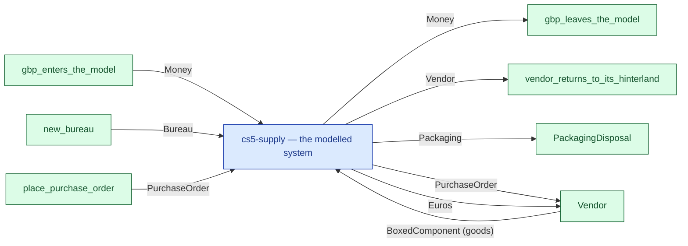

# cs5-supply — context diagram

> Generated by `tools/diagram-gen` from `model/cs5-supply` — **do not hand-edit**; regenerate with `tools/diagrams.sh`. Diagram nodes are clickable (absolute links into the source); the legend table under the diagram carries the hyperlinks into the source.

The system as one box — only what crosses the boundary (R12/R15): inputs from suppliers and sources on the left-hand edges, outputs to consumers and sinks on the right. Extracted statically from the crate's `boundary` module functions, its `Supplier`/`Consumer` impls and its `outcome_token!` declarations. *cs5-supply — case study CS-5, the supply subsystem*

## Legend — node → source

| Node | Kind | Defined at |
|---|---|---|
| `n_system` (cs5-supply — the modelled system) | the system | [model/cs5-supply/src/lib.rs#L1](/model/cs5-supply/src/lib.rs#L1) |
| `n_gbp_enters_the_model` (gbp_enters_the_model) | external party | [model/cs5-supply/src/resources.rs#L381](/model/cs5-supply/src/resources.rs#L381) |
| `n_exit_gbp_leaves_the_model` (gbp_leaves_the_model) | external party | [model/cs5-supply/src/resources.rs#L390](/model/cs5-supply/src/resources.rs#L390) |
| `n_new_bureau` (new_bureau) | external party | [model/cs5-supply/src/resources.rs#L399](/model/cs5-supply/src/resources.rs#L399) |
| `n_place_purchase_order` (place_purchase_order) | external party | [model/cs5-supply/src/resources.rs#L409](/model/cs5-supply/src/resources.rs#L409) |
| `n_exit_vendor_returns_to_its_hinterland` (vendor_returns_to_its_hinterland) | external party | [model/cs5-supply/src/resources.rs#L481](/model/cs5-supply/src/resources.rs#L481) |
| `n_PackagingDisposal` (PackagingDisposal) | external party | [model/cs5-supply/src/resources.rs#L350](/model/cs5-supply/src/resources.rs#L350) |
| `n_Vendor` (Vendor) | external party | [model/cs5-supply/src/resources.rs#L237](/model/cs5-supply/src/resources.rs#L237) |

## Resources on the edges

| Resource | Kind | Unit | Defined at |
|---|---|---|---|
| `BoxedComponent` | discrete (consumable) | — | [model/cs5-supply/src/resources.rs#L125](/model/cs5-supply/src/resources.rs#L125) |
| `Bureau` | reusable (placeholder) | — | [model/cs5-supply/src/resources.rs#L97](/model/cs5-supply/src/resources.rs#L97) |
| `Euros` | continuous (container) | euro cents | [model/cs5-supply/src/resources.rs#L60](/model/cs5-supply/src/resources.rs#L60) |
| `Money` | continuous (container) | pence | [model/cs5-supply/src/resources.rs#L47](/model/cs5-supply/src/resources.rs#L47) |
| `Packaging` | continuous (container) | grams | [model/cs5-supply/src/resources.rs#L163](/model/cs5-supply/src/resources.rs#L163) |
| `PurchaseOrder` | discrete (consumable) | — | [model/cs5-supply/src/resources.rs#L178](/model/cs5-supply/src/resources.rs#L178) |
| `Vendor` | boundary object | — | [model/cs5-supply/src/resources.rs#L237](/model/cs5-supply/src/resources.rs#L237) |
