# cs5-supply — top-level diagram

> Generated by `tools/diagram-gen` from `model/cs5-supply` — **do not hand-edit**; regenerate with `tools/diagrams.sh`. Diagram nodes are clickable (absolute links into the source); the legend table under the diagram carries the hyperlinks into the source.

The first level of processes with their inputs and outputs, linked to each other and to the boundary. This is the **R9 connection graph**, extracted statically from the process signatures (the model describes connections, not sequences): an edge `A — T → B` means A outputs a resource of type T that B's signature accepts. Requirement-trait bounds are resolved through their `satisfies!`-tagged types; `Consumer`/`SupplyN` bounds become sink/supplier edges. Dashed links are reusable resources or boundary objects **threaded** through a process (moved in and returned, R2) — no direction is claimed. Hand-overs that happen inside a process (e.g. a sealed disposal minting its output) are not visible in signatures and appear only in the detailed diagram's flow trace.

```mermaid
flowchart LR
  classDef process fill:#dbeafe,stroke:#1e40af,color:#1e3a8a;
  classDef boundary fill:#dcfce7,stroke:#166534,color:#14532d;
  classDef sink fill:#fee2e2,stroke:#991b1b,color:#7f1d1d;
  classDef helper fill:#f3e8ff,stroke:#6b21a8,color:#581c87;
  classDef grouping fill:#ffedd5,stroke:#9a3412,color:#7c2d12;
  classDef flowio fill:#e2e8f0,stroke:#334155,color:#0f172a;
  classDef resource fill:#fef9c3,stroke:#854d0e,color:#713f12;
  classDef external fill:#dcfce7,stroke:#166534,color:#14532d;
  classDef system fill:#dbeafe,stroke:#1e40af,color:#1e3a8a;
  subgraph sg_sources["System boundary — sources and setup"]
    direction TB
    n_new_bureau["new_bureau"]:::boundary
    n_gbp_enters_the_model["gbp_enters_the_model"]:::boundary
    n_place_purchase_order["place_purchase_order"]:::boundary
    n_vendor_opens_for_business["vendor_opens_for_business"]:::boundary
  end
  subgraph sg_system["Processes"]
    direction TB
    n_split_money["split_money"]:::process
    n_combine_money["combine_money"]:::process
    n_exchange["exchange"]:::process
    n_sell_component["sell_component"]:::process
    n_open_and_inspect["open_and_inspect"]:::process
  end
  subgraph sg_sinks["System boundary — sinks"]
    direction TB
    n_gbp_leaves_the_model["gbp_leaves_the_model"]:::sink
    n_PackagingDisposal["PackagingDisposal"]:::sink
    n_Vendor["Vendor"]:::sink
    n_vendor_returns_to_its_hinterland["vendor_returns_to_its_hinterland"]:::sink
  end
  n_Bureau["Bureau"]:::resource
  n_caller["caller / flow"]:::flowio
  n_Money["Money"]:::resource
  n_sell_component -- "BoxedComponent" --> n_open_and_inspect
  n_new_bureau -- "Bureau" --> n_Bureau
  n_Bureau -- "Bureau" --> n_caller
  n_exchange -- "Euros" --> n_sell_component
  n_open_and_inspect -- "InspectedComponent" --> n_caller
  n_combine_money -- "Money" --> n_Money
  n_split_money -- "Money" --> n_Money
  n_gbp_enters_the_model -- "Money" --> n_Money
  n_Money -- "Money" --> n_combine_money
  n_Money -- "Money" --> n_exchange
  n_Money -- "Money" --> n_split_money
  n_Money -- "Money" --> n_gbp_leaves_the_model
  n_open_and_inspect -- "Packaging" --> n_PackagingDisposal
  n_place_purchase_order -- "PurchaseOrder" --> n_sell_component
  n_Vendor -- "Vendor" --> n_vendor_returns_to_its_hinterland
  n_sell_component -- "PurchaseOrder" --> n_Vendor
  n_vendor_opens_for_business -- "Vendor" --> n_Vendor
  n_Bureau -.- n_exchange
  click n_split_money "https://github.com/twalmsley/lavoisier/blob/main/model/cs5-supply/src/resources.rs#L513" "model/cs5-supply/src/resources.rs"
  click n_combine_money "https://github.com/twalmsley/lavoisier/blob/main/model/cs5-supply/src/resources.rs#L530" "model/cs5-supply/src/resources.rs"
  click n_exchange "https://github.com/twalmsley/lavoisier/blob/main/model/cs5-supply/src/resources.rs#L607" "model/cs5-supply/src/resources.rs"
  click n_sell_component "https://github.com/twalmsley/lavoisier/blob/main/model/cs5-supply/src/resources.rs#L637" "model/cs5-supply/src/resources.rs"
  click n_open_and_inspect "https://github.com/twalmsley/lavoisier/blob/main/model/cs5-supply/src/resources.rs#L665" "model/cs5-supply/src/resources.rs"
  click n_Bureau "https://github.com/twalmsley/lavoisier/blob/main/model/cs5-supply/src/resources.rs#L97" "model/cs5-supply/src/resources.rs"
  click n_new_bureau "https://github.com/twalmsley/lavoisier/blob/main/model/cs5-supply/src/resources.rs#L399" "model/cs5-supply/src/resources.rs"
  click n_Money "https://github.com/twalmsley/lavoisier/blob/main/model/cs5-supply/src/resources.rs#L47" "model/cs5-supply/src/resources.rs"
  click n_gbp_enters_the_model "https://github.com/twalmsley/lavoisier/blob/main/model/cs5-supply/src/resources.rs#L381" "model/cs5-supply/src/resources.rs"
  click n_gbp_leaves_the_model "https://github.com/twalmsley/lavoisier/blob/main/model/cs5-supply/src/resources.rs#L390" "model/cs5-supply/src/resources.rs"
  click n_PackagingDisposal "https://github.com/twalmsley/lavoisier/blob/main/model/cs5-supply/src/resources.rs#L350" "model/cs5-supply/src/resources.rs"
  click n_place_purchase_order "https://github.com/twalmsley/lavoisier/blob/main/model/cs5-supply/src/resources.rs#L409" "model/cs5-supply/src/resources.rs"
  click n_Vendor "https://github.com/twalmsley/lavoisier/blob/main/model/cs5-supply/src/resources.rs#L237" "model/cs5-supply/src/resources.rs"
  click n_vendor_returns_to_its_hinterland "https://github.com/twalmsley/lavoisier/blob/main/model/cs5-supply/src/resources.rs#L481" "model/cs5-supply/src/resources.rs"
  click n_vendor_opens_for_business "https://github.com/twalmsley/lavoisier/blob/main/model/cs5-supply/src/resources.rs#L421" "model/cs5-supply/src/resources.rs"
```

## Legend — node → source

| Node | Kind | Defined at |
|---|---|---|
| `n_split_money` (split_money) | process | [model/cs5-supply/src/resources.rs#L513](/model/cs5-supply/src/resources.rs#L513) |
| `n_combine_money` (combine_money) | process | [model/cs5-supply/src/resources.rs#L530](/model/cs5-supply/src/resources.rs#L530) |
| `n_exchange` (exchange) | process | [model/cs5-supply/src/resources.rs#L607](/model/cs5-supply/src/resources.rs#L607) |
| `n_sell_component` (sell_component) | process | [model/cs5-supply/src/resources.rs#L637](/model/cs5-supply/src/resources.rs#L637) |
| `n_open_and_inspect` (open_and_inspect) | process | [model/cs5-supply/src/resources.rs#L665](/model/cs5-supply/src/resources.rs#L665) |
| `n_Bureau` (Bureau) | shared resource | [model/cs5-supply/src/resources.rs#L97](/model/cs5-supply/src/resources.rs#L97) |
| `n_new_bureau` (new_bureau) | boundary source | [model/cs5-supply/src/resources.rs#L399](/model/cs5-supply/src/resources.rs#L399) |
| `n_caller` (caller / flow) | flow input/output | — |
| `n_Money` (Money) | shared resource | [model/cs5-supply/src/resources.rs#L47](/model/cs5-supply/src/resources.rs#L47) |
| `n_gbp_enters_the_model` (gbp_enters_the_model) | boundary source | [model/cs5-supply/src/resources.rs#L381](/model/cs5-supply/src/resources.rs#L381) |
| `n_gbp_leaves_the_model` (gbp_leaves_the_model) | boundary sink | [model/cs5-supply/src/resources.rs#L390](/model/cs5-supply/src/resources.rs#L390) |
| `n_PackagingDisposal` (PackagingDisposal) | boundary sink | [model/cs5-supply/src/resources.rs#L350](/model/cs5-supply/src/resources.rs#L350) |
| `n_place_purchase_order` (place_purchase_order) | boundary source | [model/cs5-supply/src/resources.rs#L409](/model/cs5-supply/src/resources.rs#L409) |
| `n_Vendor` (Vendor) | boundary sink | [model/cs5-supply/src/resources.rs#L237](/model/cs5-supply/src/resources.rs#L237) |
| `n_vendor_returns_to_its_hinterland` (vendor_returns_to_its_hinterland) | boundary sink | [model/cs5-supply/src/resources.rs#L481](/model/cs5-supply/src/resources.rs#L481) |
| `n_vendor_opens_for_business` (vendor_opens_for_business) | boundary source | [model/cs5-supply/src/resources.rs#L421](/model/cs5-supply/src/resources.rs#L421) |

## Resources on the edges

| Resource | Kind | Unit | Defined at |
|---|---|---|---|
| `BoxedComponent` | discrete (consumable) | — | [model/cs5-supply/src/resources.rs#L125](/model/cs5-supply/src/resources.rs#L125) |
| `Bureau` | reusable (placeholder) | — | [model/cs5-supply/src/resources.rs#L97](/model/cs5-supply/src/resources.rs#L97) |
| `Euros` | continuous (container) | euro cents | [model/cs5-supply/src/resources.rs#L60](/model/cs5-supply/src/resources.rs#L60) |
| `InspectedComponent` | discrete (consumable) | — | [model/cs5-supply/src/resources.rs#L142](/model/cs5-supply/src/resources.rs#L142) |
| `Money` | continuous (container) | pence | [model/cs5-supply/src/resources.rs#L47](/model/cs5-supply/src/resources.rs#L47) |
| `Packaging` | continuous (container) | grams | [model/cs5-supply/src/resources.rs#L163](/model/cs5-supply/src/resources.rs#L163) |
| `PurchaseOrder` | discrete (consumable) | — | [model/cs5-supply/src/resources.rs#L178](/model/cs5-supply/src/resources.rs#L178) |
| `Vendor` | boundary object | — | [model/cs5-supply/src/resources.rs#L237](/model/cs5-supply/src/resources.rs#L237) |
