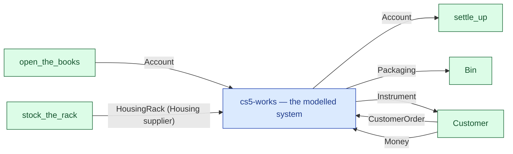

# cs5-works — context diagram

> Generated by `tools/diagram-gen` from `model/cs5-works` — **do not hand-edit**; regenerate with `tools/diagrams.sh`. Diagram nodes are clickable (absolute links into the source); the legend table under the diagram carries the hyperlinks into the source.

The system as one box — only what crosses the boundary (R12/R15): inputs from suppliers and sources on the left-hand edges, outputs to consumers and sinks on the right. Extracted statically from the crate's `boundary` module functions, its `Supplier`/`Consumer` impls and its `outcome_token!` declarations. *cs5-works — case study CS-5, the works subsystem*

## Legend — node → source

| Node | Kind | Defined at |
|---|---|---|
| `n_system` (cs5-works — the modelled system) | the system | [model/cs5-works/src/lib.rs#L1](/model/cs5-works/src/lib.rs#L1) |
| `n_open_the_books` (open_the_books) | external party | [model/cs5-works/src/resources.rs#L303](/model/cs5-works/src/resources.rs#L303) |
| `n_Customer` (Customer) | external party | [model/cs5-works/src/resources.rs#L274](/model/cs5-works/src/resources.rs#L274) |
| `n_exit_settle_up` (settle_up) | external party | [model/cs5-works/src/resources.rs#L315](/model/cs5-works/src/resources.rs#L315) |
| `n_stock_the_rack` (stock_the_rack) | external party | [model/cs5-works/src/resources.rs#L345](/model/cs5-works/src/resources.rs#L345) |
| `n_Bin` (Bin) | external party | [model/cs5-works/src/resources.rs#L186](/model/cs5-works/src/resources.rs#L186) |

## Resources on the edges

| Resource | Kind | Unit | Defined at |
|---|---|---|---|
| `Account` | boundary object | — | [model/cs5-works/src/resources.rs#L75](/model/cs5-works/src/resources.rs#L75) |
| `CustomerOrder` | discrete (consumable) | — | [model/cs5-works/src/resources.rs#L225](/model/cs5-works/src/resources.rs#L225) |
| `Housing` | discrete (consumable) | — | [model/cs5-works/src/resources.rs#L108](/model/cs5-works/src/resources.rs#L108) |
| `HousingRack` | boundary object (placeholder) | — | [model/cs5-works/src/resources.rs#L127](/model/cs5-works/src/resources.rs#L127) |
| `Instrument` | discrete (consumable) | — | [model/cs5-works/src/resources.rs#L162](/model/cs5-works/src/resources.rs#L162) |
