# cs5-works — detailed diagram

> Generated by `tools/diagram-gen` from `model/cs5-works` — **do not hand-edit**; regenerate with `tools/diagrams.sh`. Diagram nodes are clickable (absolute links into the source); the legend table under the diagram carries the hyperlinks into the source.

All levels, fully connected: every call in the flow — boundary setup, the processes, the adjacent time draws and their `History` records (F-048/R16), internal waste routing, and the disposal steps — traced from the flow function's `let`-binding sequence, with the const magnitudes from each call site. Edge labels carry the resource and its magnitude in the base unit (R7).

## Composite fallible flow — `fulfil_order`

Source: [model/cs5-works/src/flows.rs#L86](/model/cs5-works/src/flows.rs#L86)

```mermaid
flowchart LR
  classDef process fill:#dbeafe,stroke:#1e40af,color:#1e3a8a;
  classDef boundary fill:#dcfce7,stroke:#166534,color:#14532d;
  classDef sink fill:#fee2e2,stroke:#991b1b,color:#7f1d1d;
  classDef helper fill:#f3e8ff,stroke:#6b21a8,color:#581c87;
  classDef grouping fill:#ffedd5,stroke:#9a3412,color:#7c2d12;
  classDef flowio fill:#e2e8f0,stroke:#334155,color:#0f172a;
  classDef resource fill:#fef9c3,stroke:#854d0e,color:#713f12;
  classDef external fill:#dcfce7,stroke:#166534,color:#14532d;
  classDef system fill:#dbeafe,stroke:#1e40af,color:#1e3a8a;
  subgraph sg_sources["System boundary — sources and setup"]
    direction TB
    n_new_person["new_person"]:::boundary
    n_open_the_books["open_the_books"]:::boundary
    n_new_bureau["new_bureau"]:::boundary
    n_vendor_opens_for_business["vendor_opens_for_business"]:::boundary
    n_courier_reports_for_duty["courier_reports_for_duty"]:::boundary
    n_stock_the_rack["stock_the_rack"]:::boundary
    n_new_bin["new_bin"]:::boundary
    n_place_order["place_order"]:::boundary
    n_place_purchase_order["place_purchase_order"]:::boundary
    n_present_payment["present_payment"]:::boundary
  end
  subgraph sg_system["Processes"]
    direction TB
    n_draw_cash["draw_cash"]:::process
    n_exchange["exchange"]:::process
    n_consign["consign"]:::process
    n_carry_to_vendor["carry_to_vendor"]:::process
    n_purchase_at_vendor["purchase_at_vendor"]:::process
    n_hand_over["hand_over"]:::process
    n_inspect["inspect"]:::process
    n_empty_bin["empty_bin"]:::process
    n_assemble["assemble"]:::process
    n_deliver["deliver"]:::process
  end
  subgraph sg_helpers["Time accounting and helpers (model-core)"]
    direction TB
    n_new_history["new_history"]:::helper
    n_take_one["take_one"]:::helper
    n_draw_time["draw_time"]:::helper
    n_record["record exchange_currency"]:::helper
    n_draw_time_2["draw_time (2)"]:::helper
    n_record_2["record consign_courier (2)"]:::helper
    n_draw_time_3["draw_time (3)"]:::helper
    n_record_3["record receive_goods (3)"]:::helper
    n_draw_time_4["draw_time (4)"]:::helper
    n_record_4["record goods_in_inspection (4)"]:::helper
    n_draw_time_5["draw_time (5)"]:::helper
    n_record_5["record empty_bin (5)"]:::helper
    n_draw_time_6["draw_time (6)"]:::helper
    n_record_6["record assemble_instrument (6)"]:::helper
    n_draw_time_7["draw_time (7)"]:::helper
    n_record_7["record deliver_and_take_payment (7)"]:::helper
  end
  subgraph sg_sinks["System boundary — sinks"]
    direction TB
    n_new_customer["new_customer"]:::sink
    n_new_packaging_disposal["new_packaging_disposal"]:::sink
  end
  n_new_customer -- "Customer" --> n_place_order
  n_stock_the_rack -- "FullHousingRack" --> n_take_one
  n_new_person -- "Person 1200000 ms" --> n_draw_time
  n_new_history -- "History" --> n_record
  n_draw_time -- "Labour 120000 ms" --> n_record
  n_open_the_books -- "Account" --> n_draw_cash
  n_new_bureau -- "Bureau" --> n_exchange
  n_draw_cash -- "Money 2000 pence" --> n_exchange
  n_draw_time -- "Person 1080000 ms" --> n_draw_time_2
  n_record -- "History" --> n_record_2
  n_draw_time_2 -- "Labour 60000 ms" --> n_record_2
  n_courier_reports_for_duty -- "CourierAtUk" --> n_consign
  n_place_purchase_order -- "PurchaseOrder" --> n_consign
  n_consign -- "OutboundCourier" --> n_carry_to_vendor
  n_carry_to_vendor -- "CourierAtVendor" --> n_purchase_at_vendor
  n_vendor_opens_for_business -- "StockedVendor" --> n_purchase_at_vendor
  n_exchange -- "Euros 2340 euro" --> n_purchase_at_vendor
  n_draw_time_2 -- "Person 1020000 ms" --> n_draw_time_3
  n_record_2 -- "History" --> n_record_3
  n_draw_time_3 -- "Labour 60000 ms" --> n_record_3
  n_purchase_at_vendor -- "InboundCourier" --> n_hand_over
  n_draw_time_3 -- "Person 960000 ms" --> n_draw_time_4
  n_record_3 -- "History" --> n_record_4
  n_draw_time_4 -- "Labour 60000 ms" --> n_record_4
  n_hand_over -- "BoxedComponent" --> n_inspect
  n_new_bin -- "EmptyBin" --> n_inspect
  n_draw_time_4 -- "Person 900000 ms" --> n_draw_time_5
  n_record_4 -- "History" --> n_record_5
  n_draw_time_5 -- "Labour 30000 ms" --> n_record_5
  n_inspect -- "EmptyBin" --> n_empty_bin
  n_new_packaging_disposal -- "PackagingDisposal" --> n_empty_bin
  n_draw_time_5 -- "Person 870000 ms" --> n_draw_time_6
  n_record_5 -- "History" --> n_record_6
  n_draw_time_6 -- "Labour 180000 ms" --> n_record_6
  n_take_one -- "item" --> n_assemble
  n_inspect -- "InspectedComponent" --> n_assemble
  n_draw_time_6 -- "Person 690000 ms" --> n_draw_time_7
  n_record_6 -- "History" --> n_record_7
  n_draw_time_7 -- "Labour 120000 ms" --> n_record_7
  n_place_order -- "Customer" --> n_present_payment
  n_assemble -- "Instrument" --> n_deliver
  n_place_order -- "CustomerOrder" --> n_deliver
  n_present_payment -- "Money" --> n_deliver
  n_present_payment -- "Customer" --> n_deliver
  n_draw_cash -- "Account 3000" --> n_deliver
  click n_new_person "https://github.com/twalmsley/lavoisier/blob/main/model/model-core/src/common.rs#L152" "model/model-core/src/common.rs"
  click n_new_history "https://github.com/twalmsley/lavoisier/blob/main/model/model-core/src/history.rs#L264" "model/model-core/src/history.rs"
  click n_open_the_books "https://github.com/twalmsley/lavoisier/blob/main/model/cs5-works/src/resources.rs#L303" "model/cs5-works/src/resources.rs"
  click n_new_bureau "https://github.com/twalmsley/lavoisier/blob/main/model/cs5-supply/src/resources.rs#L399" "model/cs5-supply/src/resources.rs"
  click n_vendor_opens_for_business "https://github.com/twalmsley/lavoisier/blob/main/model/cs5-supply/src/resources.rs#L421" "model/cs5-supply/src/resources.rs"
  click n_courier_reports_for_duty "https://github.com/twalmsley/lavoisier/blob/main/model/cs5-logistics/src/resources.rs#L103" "model/cs5-logistics/src/resources.rs"
  click n_new_customer "https://github.com/twalmsley/lavoisier/blob/main/model/cs5-works/src/resources.rs#L323" "model/cs5-works/src/resources.rs"
  click n_stock_the_rack "https://github.com/twalmsley/lavoisier/blob/main/model/cs5-works/src/resources.rs#L345" "model/cs5-works/src/resources.rs"
  click n_new_bin "https://github.com/twalmsley/lavoisier/blob/main/model/cs5-works/src/resources.rs#L355" "model/cs5-works/src/resources.rs"
  click n_new_packaging_disposal "https://github.com/twalmsley/lavoisier/blob/main/model/cs5-supply/src/resources.rs#L489" "model/cs5-supply/src/resources.rs"
  click n_place_order "https://github.com/twalmsley/lavoisier/blob/main/model/cs5-works/src/resources.rs#L329" "model/cs5-works/src/resources.rs"
  click n_take_one "https://github.com/twalmsley/lavoisier/blob/main/model/model-core/src/boundary.rs#L173" "model/model-core/src/boundary.rs"
  click n_draw_time "https://github.com/twalmsley/lavoisier/blob/main/model/model-core/src/common.rs#L242" "model/model-core/src/common.rs"
  click n_record "https://github.com/twalmsley/lavoisier/blob/main/model/model-core/src/history.rs#L284" "model/model-core/src/history.rs"
  click n_draw_cash "https://github.com/twalmsley/lavoisier/blob/main/model/cs5-works/src/resources.rs#L391" "model/cs5-works/src/resources.rs"
  click n_exchange "https://github.com/twalmsley/lavoisier/blob/main/model/cs5-supply/src/resources.rs#L607" "model/cs5-supply/src/resources.rs"
  click n_draw_time_2 "https://github.com/twalmsley/lavoisier/blob/main/model/model-core/src/common.rs#L242" "model/model-core/src/common.rs"
  click n_record_2 "https://github.com/twalmsley/lavoisier/blob/main/model/model-core/src/history.rs#L284" "model/model-core/src/history.rs"
  click n_place_purchase_order "https://github.com/twalmsley/lavoisier/blob/main/model/cs5-supply/src/resources.rs#L409" "model/cs5-supply/src/resources.rs"
  click n_consign "https://github.com/twalmsley/lavoisier/blob/main/model/cs5-logistics/src/resources.rs#L132" "model/cs5-logistics/src/resources.rs"
  click n_carry_to_vendor "https://github.com/twalmsley/lavoisier/blob/main/model/cs5-logistics/src/resources.rs#L142" "model/cs5-logistics/src/resources.rs"
  click n_purchase_at_vendor "https://github.com/twalmsley/lavoisier/blob/main/model/cs5-logistics/src/resources.rs#L159" "model/cs5-logistics/src/resources.rs"
  click n_draw_time_3 "https://github.com/twalmsley/lavoisier/blob/main/model/model-core/src/common.rs#L242" "model/model-core/src/common.rs"
  click n_record_3 "https://github.com/twalmsley/lavoisier/blob/main/model/model-core/src/history.rs#L284" "model/model-core/src/history.rs"
  click n_hand_over "https://github.com/twalmsley/lavoisier/blob/main/model/cs5-logistics/src/resources.rs#L171" "model/cs5-logistics/src/resources.rs"
  click n_draw_time_4 "https://github.com/twalmsley/lavoisier/blob/main/model/model-core/src/common.rs#L242" "model/model-core/src/common.rs"
  click n_record_4 "https://github.com/twalmsley/lavoisier/blob/main/model/model-core/src/history.rs#L284" "model/model-core/src/history.rs"
  click n_inspect "https://github.com/twalmsley/lavoisier/blob/main/model/cs5-works/src/resources.rs#L417" "model/cs5-works/src/resources.rs"
  click n_draw_time_5 "https://github.com/twalmsley/lavoisier/blob/main/model/model-core/src/common.rs#L242" "model/model-core/src/common.rs"
  click n_record_5 "https://github.com/twalmsley/lavoisier/blob/main/model/model-core/src/history.rs#L284" "model/model-core/src/history.rs"
  click n_empty_bin "https://github.com/twalmsley/lavoisier/blob/main/model/cs5-works/src/resources.rs#L537" "model/cs5-works/src/resources.rs"
  click n_draw_time_6 "https://github.com/twalmsley/lavoisier/blob/main/model/model-core/src/common.rs#L242" "model/model-core/src/common.rs"
  click n_record_6 "https://github.com/twalmsley/lavoisier/blob/main/model/model-core/src/history.rs#L284" "model/model-core/src/history.rs"
  click n_assemble "https://github.com/twalmsley/lavoisier/blob/main/model/cs5-works/src/resources.rs#L447" "model/cs5-works/src/resources.rs"
  click n_draw_time_7 "https://github.com/twalmsley/lavoisier/blob/main/model/model-core/src/common.rs#L242" "model/model-core/src/common.rs"
  click n_record_7 "https://github.com/twalmsley/lavoisier/blob/main/model/model-core/src/history.rs#L284" "model/model-core/src/history.rs"
  click n_present_payment "https://github.com/twalmsley/lavoisier/blob/main/model/cs5-works/src/resources.rs#L336" "model/cs5-works/src/resources.rs"
  click n_deliver "https://github.com/twalmsley/lavoisier/blob/main/model/cs5-works/src/resources.rs#L488" "model/cs5-works/src/resources.rs"
```

### Legend — node → source

| Node | Kind | Defined at |
|---|---|---|
| `n_new_person` (new_person) | boundary source | [model/model-core/src/common.rs#L152](/model/model-core/src/common.rs#L152) |
| `n_new_history` (new_history) | model-core helper | [model/model-core/src/history.rs#L264](/model/model-core/src/history.rs#L264) |
| `n_open_the_books` (open_the_books) | boundary source | [model/cs5-works/src/resources.rs#L303](/model/cs5-works/src/resources.rs#L303) |
| `n_new_bureau` (new_bureau) | boundary source | [model/cs5-supply/src/resources.rs#L399](/model/cs5-supply/src/resources.rs#L399) |
| `n_vendor_opens_for_business` (vendor_opens_for_business) | boundary source | [model/cs5-supply/src/resources.rs#L421](/model/cs5-supply/src/resources.rs#L421) |
| `n_courier_reports_for_duty` (courier_reports_for_duty) | boundary source | [model/cs5-logistics/src/resources.rs#L103](/model/cs5-logistics/src/resources.rs#L103) |
| `n_new_customer` (new_customer) | boundary sink | [model/cs5-works/src/resources.rs#L323](/model/cs5-works/src/resources.rs#L323) |
| `n_stock_the_rack` (stock_the_rack) | boundary source | [model/cs5-works/src/resources.rs#L345](/model/cs5-works/src/resources.rs#L345) |
| `n_new_bin` (new_bin) | boundary source | [model/cs5-works/src/resources.rs#L355](/model/cs5-works/src/resources.rs#L355) |
| `n_new_packaging_disposal` (new_packaging_disposal) | boundary sink | [model/cs5-supply/src/resources.rs#L489](/model/cs5-supply/src/resources.rs#L489) |
| `n_place_order` (place_order) | boundary source | [model/cs5-works/src/resources.rs#L329](/model/cs5-works/src/resources.rs#L329) |
| `n_take_one` (take_one) | model-core helper | [model/model-core/src/boundary.rs#L173](/model/model-core/src/boundary.rs#L173) |
| `n_draw_time` (draw_time) | model-core helper | [model/model-core/src/common.rs#L242](/model/model-core/src/common.rs#L242) |
| `n_record` (record exchange_currency) | model-core helper | [model/model-core/src/history.rs#L284](/model/model-core/src/history.rs#L284) |
| `n_draw_cash` (draw_cash) | process | [model/cs5-works/src/resources.rs#L391](/model/cs5-works/src/resources.rs#L391) |
| `n_exchange` (exchange) | process | [model/cs5-supply/src/resources.rs#L607](/model/cs5-supply/src/resources.rs#L607) |
| `n_draw_time_2` (draw_time (2)) | model-core helper | [model/model-core/src/common.rs#L242](/model/model-core/src/common.rs#L242) |
| `n_record_2` (record consign_courier (2)) | model-core helper | [model/model-core/src/history.rs#L284](/model/model-core/src/history.rs#L284) |
| `n_place_purchase_order` (place_purchase_order) | boundary source | [model/cs5-supply/src/resources.rs#L409](/model/cs5-supply/src/resources.rs#L409) |
| `n_consign` (consign) | process | [model/cs5-logistics/src/resources.rs#L132](/model/cs5-logistics/src/resources.rs#L132) |
| `n_carry_to_vendor` (carry_to_vendor) | process | [model/cs5-logistics/src/resources.rs#L142](/model/cs5-logistics/src/resources.rs#L142) |
| `n_purchase_at_vendor` (purchase_at_vendor) | process | [model/cs5-logistics/src/resources.rs#L159](/model/cs5-logistics/src/resources.rs#L159) |
| `n_draw_time_3` (draw_time (3)) | model-core helper | [model/model-core/src/common.rs#L242](/model/model-core/src/common.rs#L242) |
| `n_record_3` (record receive_goods (3)) | model-core helper | [model/model-core/src/history.rs#L284](/model/model-core/src/history.rs#L284) |
| `n_hand_over` (hand_over) | process | [model/cs5-logistics/src/resources.rs#L171](/model/cs5-logistics/src/resources.rs#L171) |
| `n_draw_time_4` (draw_time (4)) | model-core helper | [model/model-core/src/common.rs#L242](/model/model-core/src/common.rs#L242) |
| `n_record_4` (record goods_in_inspection (4)) | model-core helper | [model/model-core/src/history.rs#L284](/model/model-core/src/history.rs#L284) |
| `n_inspect` (inspect) | process | [model/cs5-works/src/resources.rs#L417](/model/cs5-works/src/resources.rs#L417) |
| `n_draw_time_5` (draw_time (5)) | model-core helper | [model/model-core/src/common.rs#L242](/model/model-core/src/common.rs#L242) |
| `n_record_5` (record empty_bin (5)) | model-core helper | [model/model-core/src/history.rs#L284](/model/model-core/src/history.rs#L284) |
| `n_empty_bin` (empty_bin) | process | [model/cs5-works/src/resources.rs#L537](/model/cs5-works/src/resources.rs#L537) |
| `n_draw_time_6` (draw_time (6)) | model-core helper | [model/model-core/src/common.rs#L242](/model/model-core/src/common.rs#L242) |
| `n_record_6` (record assemble_instrument (6)) | model-core helper | [model/model-core/src/history.rs#L284](/model/model-core/src/history.rs#L284) |
| `n_assemble` (assemble) | process | [model/cs5-works/src/resources.rs#L447](/model/cs5-works/src/resources.rs#L447) |
| `n_draw_time_7` (draw_time (7)) | model-core helper | [model/model-core/src/common.rs#L242](/model/model-core/src/common.rs#L242) |
| `n_record_7` (record deliver_and_take_payment (7)) | model-core helper | [model/model-core/src/history.rs#L284](/model/model-core/src/history.rs#L284) |
| `n_present_payment` (present_payment) | boundary source | [model/cs5-works/src/resources.rs#L336](/model/cs5-works/src/resources.rs#L336) |
| `n_deliver` (deliver) | process | [model/cs5-works/src/resources.rs#L488](/model/cs5-works/src/resources.rs#L488) |

## Composite fallible flow — `fulfil_order_bin_last`

Source: [model/cs5-works/src/flows.rs#L172](/model/cs5-works/src/flows.rs#L172)

```mermaid
flowchart LR
  classDef process fill:#dbeafe,stroke:#1e40af,color:#1e3a8a;
  classDef boundary fill:#dcfce7,stroke:#166534,color:#14532d;
  classDef sink fill:#fee2e2,stroke:#991b1b,color:#7f1d1d;
  classDef helper fill:#f3e8ff,stroke:#6b21a8,color:#581c87;
  classDef grouping fill:#ffedd5,stroke:#9a3412,color:#7c2d12;
  classDef flowio fill:#e2e8f0,stroke:#334155,color:#0f172a;
  classDef resource fill:#fef9c3,stroke:#854d0e,color:#713f12;
  classDef external fill:#dcfce7,stroke:#166534,color:#14532d;
  classDef system fill:#dbeafe,stroke:#1e40af,color:#1e3a8a;
  subgraph sg_sources["System boundary — sources and setup"]
    direction TB
    n_new_person["new_person"]:::boundary
    n_open_the_books["open_the_books"]:::boundary
    n_new_bureau["new_bureau"]:::boundary
    n_vendor_opens_for_business["vendor_opens_for_business"]:::boundary
    n_courier_reports_for_duty["courier_reports_for_duty"]:::boundary
    n_stock_the_rack["stock_the_rack"]:::boundary
    n_new_bin["new_bin"]:::boundary
    n_place_order["place_order"]:::boundary
    n_place_purchase_order["place_purchase_order"]:::boundary
    n_present_payment["present_payment"]:::boundary
  end
  subgraph sg_system["Processes"]
    direction TB
    n_draw_cash["draw_cash"]:::process
    n_exchange["exchange"]:::process
    n_consign["consign"]:::process
    n_carry_to_vendor["carry_to_vendor"]:::process
    n_purchase_at_vendor["purchase_at_vendor"]:::process
    n_hand_over["hand_over"]:::process
    n_inspect["inspect"]:::process
    n_assemble["assemble"]:::process
    n_deliver["deliver"]:::process
    n_empty_bin["empty_bin"]:::process
  end
  subgraph sg_helpers["Time accounting and helpers (model-core)"]
    direction TB
    n_new_history["new_history"]:::helper
    n_draw_time["draw_time"]:::helper
    n_record["record exchange_currency"]:::helper
    n_draw_time_2["draw_time (2)"]:::helper
    n_record_2["record consign_courier (2)"]:::helper
    n_draw_time_3["draw_time (3)"]:::helper
    n_record_3["record receive_goods (3)"]:::helper
    n_draw_time_4["draw_time (4)"]:::helper
    n_record_4["record goods_in_inspection (4)"]:::helper
    n_take_one["take_one"]:::helper
    n_draw_time_5["draw_time (5)"]:::helper
    n_record_5["record assemble_instrument (5)"]:::helper
    n_draw_time_6["draw_time (6)"]:::helper
    n_record_6["record deliver_and_take_payment (6)"]:::helper
    n_draw_time_7["draw_time (7)"]:::helper
    n_record_7["record empty_bin (7)"]:::helper
  end
  subgraph sg_sinks["System boundary — sinks"]
    direction TB
    n_new_customer["new_customer"]:::sink
    n_new_packaging_disposal["new_packaging_disposal"]:::sink
  end
  n_new_customer -- "Customer" --> n_place_order
  n_new_person -- "Person 1200000 ms" --> n_draw_time
  n_new_history -- "History" --> n_record
  n_draw_time -- "Labour 120000 ms" --> n_record
  n_open_the_books -- "Account" --> n_draw_cash
  n_new_bureau -- "Bureau" --> n_exchange
  n_draw_cash -- "Money 2000 pence" --> n_exchange
  n_draw_time -- "Person 1080000 ms" --> n_draw_time_2
  n_record -- "History" --> n_record_2
  n_draw_time_2 -- "Labour 60000 ms" --> n_record_2
  n_courier_reports_for_duty -- "CourierAtUk" --> n_consign
  n_place_purchase_order -- "PurchaseOrder" --> n_consign
  n_consign -- "OutboundCourier" --> n_carry_to_vendor
  n_carry_to_vendor -- "CourierAtVendor" --> n_purchase_at_vendor
  n_vendor_opens_for_business -- "StockedVendor" --> n_purchase_at_vendor
  n_exchange -- "Euros 2340 euro" --> n_purchase_at_vendor
  n_draw_time_2 -- "Person 1020000 ms" --> n_draw_time_3
  n_record_2 -- "History" --> n_record_3
  n_draw_time_3 -- "Labour 60000 ms" --> n_record_3
  n_purchase_at_vendor -- "InboundCourier" --> n_hand_over
  n_draw_time_3 -- "Person 960000 ms" --> n_draw_time_4
  n_record_3 -- "History" --> n_record_4
  n_draw_time_4 -- "Labour 60000 ms" --> n_record_4
  n_hand_over -- "BoxedComponent" --> n_inspect
  n_new_bin -- "EmptyBin" --> n_inspect
  n_stock_the_rack -- "FullHousingRack" --> n_take_one
  n_draw_time_4 -- "Person 900000 ms" --> n_draw_time_5
  n_record_4 -- "History" --> n_record_5
  n_draw_time_5 -- "Labour 180000 ms" --> n_record_5
  n_take_one -- "item" --> n_assemble
  n_inspect -- "InspectedComponent" --> n_assemble
  n_draw_time_5 -- "Person 720000 ms" --> n_draw_time_6
  n_record_5 -- "History" --> n_record_6
  n_draw_time_6 -- "Labour 120000 ms" --> n_record_6
  n_place_order -- "Customer" --> n_present_payment
  n_assemble -- "Instrument" --> n_deliver
  n_place_order -- "CustomerOrder" --> n_deliver
  n_present_payment -- "Money" --> n_deliver
  n_present_payment -- "Customer" --> n_deliver
  n_draw_cash -- "Account 3000" --> n_deliver
  n_draw_time_6 -- "Person 600000 ms" --> n_draw_time_7
  n_record_6 -- "History" --> n_record_7
  n_draw_time_7 -- "Labour 30000 ms" --> n_record_7
  n_inspect -- "EmptyBin" --> n_empty_bin
  n_new_packaging_disposal -- "PackagingDisposal" --> n_empty_bin
  click n_new_person "https://github.com/twalmsley/lavoisier/blob/main/model/model-core/src/common.rs#L152" "model/model-core/src/common.rs"
  click n_new_history "https://github.com/twalmsley/lavoisier/blob/main/model/model-core/src/history.rs#L264" "model/model-core/src/history.rs"
  click n_open_the_books "https://github.com/twalmsley/lavoisier/blob/main/model/cs5-works/src/resources.rs#L303" "model/cs5-works/src/resources.rs"
  click n_new_bureau "https://github.com/twalmsley/lavoisier/blob/main/model/cs5-supply/src/resources.rs#L399" "model/cs5-supply/src/resources.rs"
  click n_vendor_opens_for_business "https://github.com/twalmsley/lavoisier/blob/main/model/cs5-supply/src/resources.rs#L421" "model/cs5-supply/src/resources.rs"
  click n_courier_reports_for_duty "https://github.com/twalmsley/lavoisier/blob/main/model/cs5-logistics/src/resources.rs#L103" "model/cs5-logistics/src/resources.rs"
  click n_new_customer "https://github.com/twalmsley/lavoisier/blob/main/model/cs5-works/src/resources.rs#L323" "model/cs5-works/src/resources.rs"
  click n_stock_the_rack "https://github.com/twalmsley/lavoisier/blob/main/model/cs5-works/src/resources.rs#L345" "model/cs5-works/src/resources.rs"
  click n_new_bin "https://github.com/twalmsley/lavoisier/blob/main/model/cs5-works/src/resources.rs#L355" "model/cs5-works/src/resources.rs"
  click n_new_packaging_disposal "https://github.com/twalmsley/lavoisier/blob/main/model/cs5-supply/src/resources.rs#L489" "model/cs5-supply/src/resources.rs"
  click n_place_order "https://github.com/twalmsley/lavoisier/blob/main/model/cs5-works/src/resources.rs#L329" "model/cs5-works/src/resources.rs"
  click n_draw_time "https://github.com/twalmsley/lavoisier/blob/main/model/model-core/src/common.rs#L242" "model/model-core/src/common.rs"
  click n_record "https://github.com/twalmsley/lavoisier/blob/main/model/model-core/src/history.rs#L284" "model/model-core/src/history.rs"
  click n_draw_cash "https://github.com/twalmsley/lavoisier/blob/main/model/cs5-works/src/resources.rs#L391" "model/cs5-works/src/resources.rs"
  click n_exchange "https://github.com/twalmsley/lavoisier/blob/main/model/cs5-supply/src/resources.rs#L607" "model/cs5-supply/src/resources.rs"
  click n_draw_time_2 "https://github.com/twalmsley/lavoisier/blob/main/model/model-core/src/common.rs#L242" "model/model-core/src/common.rs"
  click n_record_2 "https://github.com/twalmsley/lavoisier/blob/main/model/model-core/src/history.rs#L284" "model/model-core/src/history.rs"
  click n_place_purchase_order "https://github.com/twalmsley/lavoisier/blob/main/model/cs5-supply/src/resources.rs#L409" "model/cs5-supply/src/resources.rs"
  click n_consign "https://github.com/twalmsley/lavoisier/blob/main/model/cs5-logistics/src/resources.rs#L132" "model/cs5-logistics/src/resources.rs"
  click n_carry_to_vendor "https://github.com/twalmsley/lavoisier/blob/main/model/cs5-logistics/src/resources.rs#L142" "model/cs5-logistics/src/resources.rs"
  click n_purchase_at_vendor "https://github.com/twalmsley/lavoisier/blob/main/model/cs5-logistics/src/resources.rs#L159" "model/cs5-logistics/src/resources.rs"
  click n_draw_time_3 "https://github.com/twalmsley/lavoisier/blob/main/model/model-core/src/common.rs#L242" "model/model-core/src/common.rs"
  click n_record_3 "https://github.com/twalmsley/lavoisier/blob/main/model/model-core/src/history.rs#L284" "model/model-core/src/history.rs"
  click n_hand_over "https://github.com/twalmsley/lavoisier/blob/main/model/cs5-logistics/src/resources.rs#L171" "model/cs5-logistics/src/resources.rs"
  click n_draw_time_4 "https://github.com/twalmsley/lavoisier/blob/main/model/model-core/src/common.rs#L242" "model/model-core/src/common.rs"
  click n_record_4 "https://github.com/twalmsley/lavoisier/blob/main/model/model-core/src/history.rs#L284" "model/model-core/src/history.rs"
  click n_inspect "https://github.com/twalmsley/lavoisier/blob/main/model/cs5-works/src/resources.rs#L417" "model/cs5-works/src/resources.rs"
  click n_take_one "https://github.com/twalmsley/lavoisier/blob/main/model/model-core/src/boundary.rs#L173" "model/model-core/src/boundary.rs"
  click n_draw_time_5 "https://github.com/twalmsley/lavoisier/blob/main/model/model-core/src/common.rs#L242" "model/model-core/src/common.rs"
  click n_record_5 "https://github.com/twalmsley/lavoisier/blob/main/model/model-core/src/history.rs#L284" "model/model-core/src/history.rs"
  click n_assemble "https://github.com/twalmsley/lavoisier/blob/main/model/cs5-works/src/resources.rs#L447" "model/cs5-works/src/resources.rs"
  click n_draw_time_6 "https://github.com/twalmsley/lavoisier/blob/main/model/model-core/src/common.rs#L242" "model/model-core/src/common.rs"
  click n_record_6 "https://github.com/twalmsley/lavoisier/blob/main/model/model-core/src/history.rs#L284" "model/model-core/src/history.rs"
  click n_present_payment "https://github.com/twalmsley/lavoisier/blob/main/model/cs5-works/src/resources.rs#L336" "model/cs5-works/src/resources.rs"
  click n_deliver "https://github.com/twalmsley/lavoisier/blob/main/model/cs5-works/src/resources.rs#L488" "model/cs5-works/src/resources.rs"
  click n_draw_time_7 "https://github.com/twalmsley/lavoisier/blob/main/model/model-core/src/common.rs#L242" "model/model-core/src/common.rs"
  click n_record_7 "https://github.com/twalmsley/lavoisier/blob/main/model/model-core/src/history.rs#L284" "model/model-core/src/history.rs"
  click n_empty_bin "https://github.com/twalmsley/lavoisier/blob/main/model/cs5-works/src/resources.rs#L537" "model/cs5-works/src/resources.rs"
```

### Legend — node → source

| Node | Kind | Defined at |
|---|---|---|
| `n_new_person` (new_person) | boundary source | [model/model-core/src/common.rs#L152](/model/model-core/src/common.rs#L152) |
| `n_new_history` (new_history) | model-core helper | [model/model-core/src/history.rs#L264](/model/model-core/src/history.rs#L264) |
| `n_open_the_books` (open_the_books) | boundary source | [model/cs5-works/src/resources.rs#L303](/model/cs5-works/src/resources.rs#L303) |
| `n_new_bureau` (new_bureau) | boundary source | [model/cs5-supply/src/resources.rs#L399](/model/cs5-supply/src/resources.rs#L399) |
| `n_vendor_opens_for_business` (vendor_opens_for_business) | boundary source | [model/cs5-supply/src/resources.rs#L421](/model/cs5-supply/src/resources.rs#L421) |
| `n_courier_reports_for_duty` (courier_reports_for_duty) | boundary source | [model/cs5-logistics/src/resources.rs#L103](/model/cs5-logistics/src/resources.rs#L103) |
| `n_new_customer` (new_customer) | boundary sink | [model/cs5-works/src/resources.rs#L323](/model/cs5-works/src/resources.rs#L323) |
| `n_stock_the_rack` (stock_the_rack) | boundary source | [model/cs5-works/src/resources.rs#L345](/model/cs5-works/src/resources.rs#L345) |
| `n_new_bin` (new_bin) | boundary source | [model/cs5-works/src/resources.rs#L355](/model/cs5-works/src/resources.rs#L355) |
| `n_new_packaging_disposal` (new_packaging_disposal) | boundary sink | [model/cs5-supply/src/resources.rs#L489](/model/cs5-supply/src/resources.rs#L489) |
| `n_place_order` (place_order) | boundary source | [model/cs5-works/src/resources.rs#L329](/model/cs5-works/src/resources.rs#L329) |
| `n_draw_time` (draw_time) | model-core helper | [model/model-core/src/common.rs#L242](/model/model-core/src/common.rs#L242) |
| `n_record` (record exchange_currency) | model-core helper | [model/model-core/src/history.rs#L284](/model/model-core/src/history.rs#L284) |
| `n_draw_cash` (draw_cash) | process | [model/cs5-works/src/resources.rs#L391](/model/cs5-works/src/resources.rs#L391) |
| `n_exchange` (exchange) | process | [model/cs5-supply/src/resources.rs#L607](/model/cs5-supply/src/resources.rs#L607) |
| `n_draw_time_2` (draw_time (2)) | model-core helper | [model/model-core/src/common.rs#L242](/model/model-core/src/common.rs#L242) |
| `n_record_2` (record consign_courier (2)) | model-core helper | [model/model-core/src/history.rs#L284](/model/model-core/src/history.rs#L284) |
| `n_place_purchase_order` (place_purchase_order) | boundary source | [model/cs5-supply/src/resources.rs#L409](/model/cs5-supply/src/resources.rs#L409) |
| `n_consign` (consign) | process | [model/cs5-logistics/src/resources.rs#L132](/model/cs5-logistics/src/resources.rs#L132) |
| `n_carry_to_vendor` (carry_to_vendor) | process | [model/cs5-logistics/src/resources.rs#L142](/model/cs5-logistics/src/resources.rs#L142) |
| `n_purchase_at_vendor` (purchase_at_vendor) | process | [model/cs5-logistics/src/resources.rs#L159](/model/cs5-logistics/src/resources.rs#L159) |
| `n_draw_time_3` (draw_time (3)) | model-core helper | [model/model-core/src/common.rs#L242](/model/model-core/src/common.rs#L242) |
| `n_record_3` (record receive_goods (3)) | model-core helper | [model/model-core/src/history.rs#L284](/model/model-core/src/history.rs#L284) |
| `n_hand_over` (hand_over) | process | [model/cs5-logistics/src/resources.rs#L171](/model/cs5-logistics/src/resources.rs#L171) |
| `n_draw_time_4` (draw_time (4)) | model-core helper | [model/model-core/src/common.rs#L242](/model/model-core/src/common.rs#L242) |
| `n_record_4` (record goods_in_inspection (4)) | model-core helper | [model/model-core/src/history.rs#L284](/model/model-core/src/history.rs#L284) |
| `n_inspect` (inspect) | process | [model/cs5-works/src/resources.rs#L417](/model/cs5-works/src/resources.rs#L417) |
| `n_take_one` (take_one) | model-core helper | [model/model-core/src/boundary.rs#L173](/model/model-core/src/boundary.rs#L173) |
| `n_draw_time_5` (draw_time (5)) | model-core helper | [model/model-core/src/common.rs#L242](/model/model-core/src/common.rs#L242) |
| `n_record_5` (record assemble_instrument (5)) | model-core helper | [model/model-core/src/history.rs#L284](/model/model-core/src/history.rs#L284) |
| `n_assemble` (assemble) | process | [model/cs5-works/src/resources.rs#L447](/model/cs5-works/src/resources.rs#L447) |
| `n_draw_time_6` (draw_time (6)) | model-core helper | [model/model-core/src/common.rs#L242](/model/model-core/src/common.rs#L242) |
| `n_record_6` (record deliver_and_take_payment (6)) | model-core helper | [model/model-core/src/history.rs#L284](/model/model-core/src/history.rs#L284) |
| `n_present_payment` (present_payment) | boundary source | [model/cs5-works/src/resources.rs#L336](/model/cs5-works/src/resources.rs#L336) |
| `n_deliver` (deliver) | process | [model/cs5-works/src/resources.rs#L488](/model/cs5-works/src/resources.rs#L488) |
| `n_draw_time_7` (draw_time (7)) | model-core helper | [model/model-core/src/common.rs#L242](/model/model-core/src/common.rs#L242) |
| `n_record_7` (record empty_bin (7)) | model-core helper | [model/model-core/src/history.rs#L284](/model/model-core/src/history.rs#L284) |
| `n_empty_bin` (empty_bin) | process | [model/cs5-works/src/resources.rs#L537](/model/cs5-works/src/resources.rs#L537) |

## Resources on the edges

| Resource | Kind | Unit | Defined at |
|---|---|---|---|
| `Account` | boundary object | — | [model/cs5-works/src/resources.rs#L75](/model/cs5-works/src/resources.rs#L75) |
| `BoxedComponent` | discrete (consumable) | — | [model/cs5-supply/src/resources.rs#L125](/model/cs5-supply/src/resources.rs#L125) |
| `Bureau` | reusable (placeholder) | — | [model/cs5-supply/src/resources.rs#L97](/model/cs5-supply/src/resources.rs#L97) |
| `CourierAtUk` | boundary object | — | [model/cs5-logistics/src/resources.rs#L36](/model/cs5-logistics/src/resources.rs#L36) |
| `CourierAtVendor` | boundary object | — | [model/cs5-logistics/src/resources.rs#L70](/model/cs5-logistics/src/resources.rs#L70) |
| `Customer` | boundary object (placeholder) | — | [model/cs5-works/src/resources.rs#L274](/model/cs5-works/src/resources.rs#L274) |
| `CustomerOrder` | discrete (consumable) | — | [model/cs5-works/src/resources.rs#L225](/model/cs5-works/src/resources.rs#L225) |
| `Euros` | continuous (container) | euro cents | [model/cs5-supply/src/resources.rs#L60](/model/cs5-supply/src/resources.rs#L60) |
| `InboundCourier` | boundary object | — | [model/cs5-logistics/src/resources.rs#L79](/model/cs5-logistics/src/resources.rs#L79) |
| `InspectedComponent` | discrete (consumable) | — | [model/cs5-supply/src/resources.rs#L142](/model/cs5-supply/src/resources.rs#L142) |
| `Instrument` | discrete (consumable) | — | [model/cs5-works/src/resources.rs#L162](/model/cs5-works/src/resources.rs#L162) |
| `Money` | continuous (container) | pence | [model/cs5-supply/src/resources.rs#L47](/model/cs5-supply/src/resources.rs#L47) |
| `OutboundCourier` | boundary object | — | [model/cs5-logistics/src/resources.rs#L62](/model/cs5-logistics/src/resources.rs#L62) |
| `PackagingDisposal` | boundary object (placeholder) | — | [model/cs5-supply/src/resources.rs#L350](/model/cs5-supply/src/resources.rs#L350) |
| `PurchaseOrder` | discrete (consumable) | — | [model/cs5-supply/src/resources.rs#L178](/model/cs5-supply/src/resources.rs#L178) |
