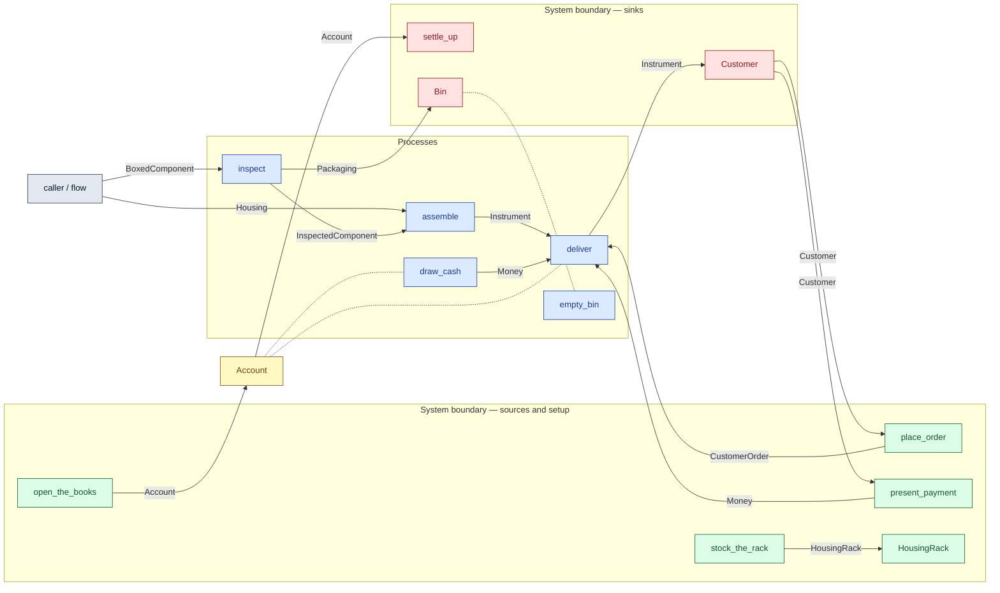

# cs5-works — top-level diagram

> Generated by `tools/diagram-gen` from `model/cs5-works` — **do not hand-edit**; regenerate with `tools/diagrams.sh`. Diagram nodes are clickable (absolute links into the source); the legend table under the diagram carries the hyperlinks into the source.

The first level of processes with their inputs and outputs, linked to each other and to the boundary. This is the **R9 connection graph**, extracted statically from the process signatures (the model describes connections, not sequences): an edge `A — T → B` means A outputs a resource of type T that B's signature accepts. Requirement-trait bounds are resolved through their `satisfies!`-tagged types; `Consumer`/`SupplyN` bounds become sink/supplier edges. Dashed links are reusable resources or boundary objects **threaded** through a process (moved in and returned, R2) — no direction is claimed. Hand-overs that happen inside a process (e.g. a sealed disposal minting its output) are not visible in signatures and appear only in the detailed diagram's flow trace.

## Legend — node → source

| Node | Kind | Defined at |
|---|---|---|
| `n_draw_cash` (draw_cash) | process | [model/cs5-works/src/resources.rs#L391](/model/cs5-works/src/resources.rs#L391) |
| `n_inspect` (inspect) | process | [model/cs5-works/src/resources.rs#L417](/model/cs5-works/src/resources.rs#L417) |
| `n_assemble` (assemble) | process | [model/cs5-works/src/resources.rs#L447](/model/cs5-works/src/resources.rs#L447) |
| `n_deliver` (deliver) | process | [model/cs5-works/src/resources.rs#L488](/model/cs5-works/src/resources.rs#L488) |
| `n_empty_bin` (empty_bin) | process | [model/cs5-works/src/resources.rs#L537](/model/cs5-works/src/resources.rs#L537) |
| `n_Account` (Account) | shared resource | [model/cs5-works/src/resources.rs#L75](/model/cs5-works/src/resources.rs#L75) |
| `n_open_the_books` (open_the_books) | boundary source | [model/cs5-works/src/resources.rs#L303](/model/cs5-works/src/resources.rs#L303) |
| `n_settle_up` (settle_up) | boundary sink | [model/cs5-works/src/resources.rs#L315](/model/cs5-works/src/resources.rs#L315) |
| `n_caller` (caller / flow) | flow input/output | — |
| `n_Customer` (Customer) | boundary sink | [model/cs5-works/src/resources.rs#L274](/model/cs5-works/src/resources.rs#L274) |
| `n_place_order` (place_order) | boundary source | [model/cs5-works/src/resources.rs#L329](/model/cs5-works/src/resources.rs#L329) |
| `n_present_payment` (present_payment) | boundary source | [model/cs5-works/src/resources.rs#L336](/model/cs5-works/src/resources.rs#L336) |
| `n_Bin` (Bin) | boundary sink | [model/cs5-works/src/resources.rs#L186](/model/cs5-works/src/resources.rs#L186) |
| `n_HousingRack` (HousingRack) | boundary source | [model/cs5-works/src/resources.rs#L127](/model/cs5-works/src/resources.rs#L127) |
| `n_stock_the_rack` (stock_the_rack) | boundary source | [model/cs5-works/src/resources.rs#L345](/model/cs5-works/src/resources.rs#L345) |

## Resources on the edges

| Resource | Kind | Unit | Defined at |
|---|---|---|---|
| `Account` | boundary object | — | [model/cs5-works/src/resources.rs#L75](/model/cs5-works/src/resources.rs#L75) |
| `Customer` | boundary object (placeholder) | — | [model/cs5-works/src/resources.rs#L274](/model/cs5-works/src/resources.rs#L274) |
| `CustomerOrder` | discrete (consumable) | — | [model/cs5-works/src/resources.rs#L225](/model/cs5-works/src/resources.rs#L225) |
| `Housing` | discrete (consumable) | — | [model/cs5-works/src/resources.rs#L108](/model/cs5-works/src/resources.rs#L108) |
| `HousingRack` | boundary object (placeholder) | — | [model/cs5-works/src/resources.rs#L127](/model/cs5-works/src/resources.rs#L127) |
| `Instrument` | discrete (consumable) | — | [model/cs5-works/src/resources.rs#L162](/model/cs5-works/src/resources.rs#L162) |

<!-- WARN (diagram-gen): empty_bin: unresolved parameter `consumer of Contents` -->
