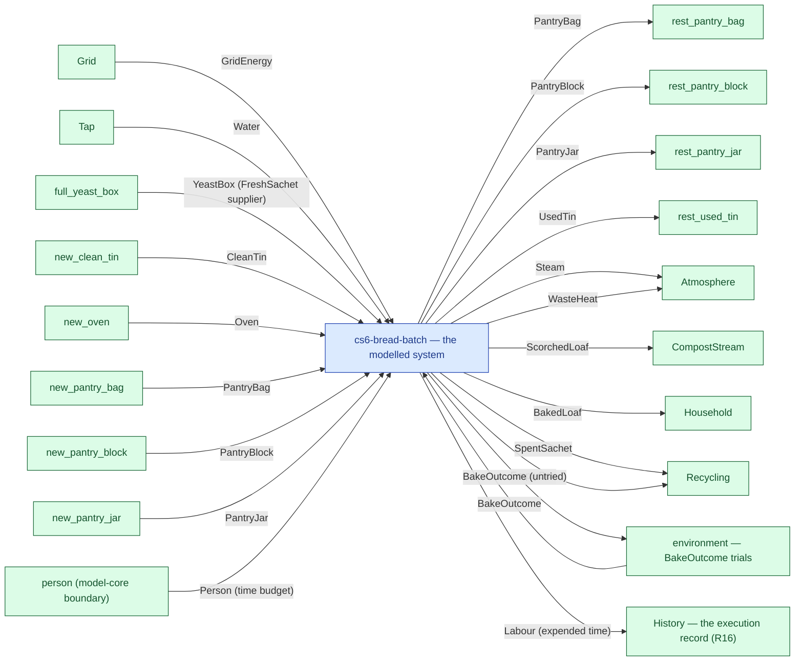

# cs6-bread-batch — context diagram

> Generated by `tools/diagram-gen` from `model/cs6-bread-batch` — **do not hand-edit**; regenerate with `tools/diagrams.sh`. Diagram nodes are clickable (absolute links into the source); the legend table under the diagram carries the hyperlinks into the source.

The system as one box — only what crosses the boundary (R12/R15): inputs from suppliers and sources on the left-hand edges, outputs to consumers and sinks on the right. Extracted statically from the crate's `boundary` module functions, its `Supplier`/`Consumer` impls and its `outcome_token!` declarations. *cs6-bread-batch — case study CS-6: baking a batch of bread*

## Legend — node → source

| Node | Kind | Defined at |
|---|---|---|
| `n_system` (cs6-bread-batch — the modelled system) | the system | [model/cs6-bread-batch/src/lib.rs#L1](/model/cs6-bread-batch/src/lib.rs#L1) |
| `n_Grid` (Grid) | external party | [model/cs6-bread-batch/src/resources.rs#L324](/model/cs6-bread-batch/src/resources.rs#L324) |
| `n_Tap` (Tap) | external party | [model/cs6-bread-batch/src/resources.rs#L316](/model/cs6-bread-batch/src/resources.rs#L316) |
| `n_full_yeast_box` (full_yeast_box) | external party | [model/cs6-bread-batch/src/resources.rs#L721](/model/cs6-bread-batch/src/resources.rs#L721) |
| `n_new_clean_tin` (new_clean_tin) | external party | [model/cs6-bread-batch/src/resources.rs#L608](/model/cs6-bread-batch/src/resources.rs#L608) |
| `n_new_oven` (new_oven) | external party | [model/cs6-bread-batch/src/resources.rs#L600](/model/cs6-bread-batch/src/resources.rs#L600) |
| `n_new_pantry_bag` (new_pantry_bag) | external party | [model/cs6-bread-batch/src/resources.rs#L648](/model/cs6-bread-batch/src/resources.rs#L648) |
| `n_new_pantry_block` (new_pantry_block) | external party | [model/cs6-bread-batch/src/resources.rs#L664](/model/cs6-bread-batch/src/resources.rs#L664) |
| `n_new_pantry_jar` (new_pantry_jar) | external party | [model/cs6-bread-batch/src/resources.rs#L656](/model/cs6-bread-batch/src/resources.rs#L656) |
| `n_exit_rest_pantry_bag` (rest_pantry_bag) | external party | [model/cs6-bread-batch/src/resources.rs#L752](/model/cs6-bread-batch/src/resources.rs#L752) |
| `n_exit_rest_pantry_block` (rest_pantry_block) | external party | [model/cs6-bread-batch/src/resources.rs#L760](/model/cs6-bread-batch/src/resources.rs#L760) |
| `n_exit_rest_pantry_jar` (rest_pantry_jar) | external party | [model/cs6-bread-batch/src/resources.rs#L768](/model/cs6-bread-batch/src/resources.rs#L768) |
| `n_exit_rest_used_tin` (rest_used_tin) | external party | [model/cs6-bread-batch/src/resources.rs#L776](/model/cs6-bread-batch/src/resources.rs#L776) |
| `n_Atmosphere` (Atmosphere) | external party | [model/cs6-bread-batch/src/resources.rs#L532](/model/cs6-bread-batch/src/resources.rs#L532) |
| `n_CompostStream` (CompostStream) | external party | [model/cs6-bread-batch/src/resources.rs#L503](/model/cs6-bread-batch/src/resources.rs#L503) |
| `n_Household` (Household) | external party | [model/cs6-bread-batch/src/resources.rs#L473](/model/cs6-bread-batch/src/resources.rs#L473) |
| `n_Recycling` (Recycling) | external party | [model/cs6-bread-batch/src/resources.rs#L563](/model/cs6-bread-batch/src/resources.rs#L563) |
| `n_env_BakeOutcome` (environment — BakeOutcome trials) | external party | [model/cs6-bread-batch/src/resources.rs#L305](/model/cs6-bread-batch/src/resources.rs#L305) |
| `n_person` (person (model-core boundary)) | external party | — |
| `n_history` (History — the execution record (R16)) | external party | — |

## Resources on the edges

| Resource | Kind | Unit | Defined at |
|---|---|---|---|
| `BakeOutcome` | outcome token (R17) | — | [model/cs6-bread-batch/src/resources.rs#L305](/model/cs6-bread-batch/src/resources.rs#L305) |
| `BakedLoaf` | discrete (consumable) | — | [model/cs6-bread-batch/src/resources.rs#L66](/model/cs6-bread-batch/src/resources.rs#L66) |
| `CleanTin` | continuous (container) | grams | [model/cs6-bread-batch/src/resources.rs#L227](/model/cs6-bread-batch/src/resources.rs#L227) |
| `EmptyBox` | discrete (consumable) | — | [model/cs6-bread-batch/src/resources.rs#L216](/model/cs6-bread-batch/src/resources.rs#L216) |
| `FreshSachet` | discrete (consumable) | — | [model/cs6-bread-batch/src/resources.rs#L186](/model/cs6-bread-batch/src/resources.rs#L186) |
| `GridEnergy` | continuous (container) | joules | [model/cs6-bread-batch/src/resources.rs#L280](/model/cs6-bread-batch/src/resources.rs#L280) |
| `Oven` | reusable | — | [model/cs6-bread-batch/src/resources.rs#L274](/model/cs6-bread-batch/src/resources.rs#L274) |
| `PantryBag` | continuous (container) | grams remaining | [model/cs6-bread-batch/src/resources.rs#L332](/model/cs6-bread-batch/src/resources.rs#L332) |
| `PantryBlock` | continuous (container) | grams remaining | [model/cs6-bread-batch/src/resources.rs#L350](/model/cs6-bread-batch/src/resources.rs#L350) |
| `PantryJar` | continuous (container) | grams remaining | [model/cs6-bread-batch/src/resources.rs#L341](/model/cs6-bread-batch/src/resources.rs#L341) |
| `ScorchedLoaf` | discrete (consumable) | — | [model/cs6-bread-batch/src/resources.rs#L86](/model/cs6-bread-batch/src/resources.rs#L86) |
| `SpentSachet` | discrete (consumable) | — | [model/cs6-bread-batch/src/resources.rs#L201](/model/cs6-bread-batch/src/resources.rs#L201) |
| `Steam` | continuous (container) | grams | [model/cs6-bread-batch/src/resources.rs#L287](/model/cs6-bread-batch/src/resources.rs#L287) |
| `UsedTin` | continuous (container) | grams | [model/cs6-bread-batch/src/resources.rs#L267](/model/cs6-bread-batch/src/resources.rs#L267) |
| `WasteHeat` | continuous (container) | joules | [model/cs6-bread-batch/src/resources.rs#L294](/model/cs6-bread-batch/src/resources.rs#L294) |
| `Water` | continuous (container) | grams | [model/cs6-bread-batch/src/resources.rs#L164](/model/cs6-bread-batch/src/resources.rs#L164) |
| `YeastBox` | boundary object | — | [model/cs6-bread-batch/src/resources.rs#L433](/model/cs6-bread-batch/src/resources.rs#L433) |
