# cs6-bread-batch — detailed diagram

> Generated by `tools/diagram-gen` from `model/cs6-bread-batch` — **do not hand-edit**; regenerate with `tools/diagrams.sh`. Diagram nodes are clickable (absolute links into the source); the legend table under the diagram carries the hyperlinks into the source.

All levels, fully connected: every call in the flow — boundary setup, the processes, the adjacent time draws and their `History` records (F-048/R16), internal waste routing, and the disposal steps — traced from the flow function's `let`-binding sequence, with the const magnitudes from each call site. Edge labels carry the resource and its magnitude in the base unit (R7).

## Composite fallible flow — `bake_batch`

Source: [model/cs6-bread-batch/src/flows.rs#L150](/model/cs6-bread-batch/src/flows.rs#L150)

```mermaid
flowchart LR
  classDef process fill:#dbeafe,stroke:#1e40af,color:#1e3a8a;
  classDef boundary fill:#dcfce7,stroke:#166534,color:#14532d;
  classDef sink fill:#fee2e2,stroke:#991b1b,color:#7f1d1d;
  classDef helper fill:#f3e8ff,stroke:#6b21a8,color:#581c87;
  classDef grouping fill:#ffedd5,stroke:#9a3412,color:#7c2d12;
  classDef flowio fill:#e2e8f0,stroke:#334155,color:#0f172a;
  classDef resource fill:#fef9c3,stroke:#854d0e,color:#713f12;
  classDef external fill:#dcfce7,stroke:#166534,color:#14532d;
  classDef system fill:#dbeafe,stroke:#1e40af,color:#1e3a8a;
  subgraph sg_sources["System boundary — sources and setup"]
    direction TB
    n_draw_water["draw_water"]:::boundary
    n_draw_grid_energy["draw_grid_energy"]:::boundary
    n_draw_grid_energy_2["draw_grid_energy (2)"]:::boundary
    n_draw_grid_energy_3["draw_grid_energy (3)"]:::boundary
  end
  subgraph sg_system["Processes"]
    direction TB
    n_draw_flour["draw_flour"]:::process
    n_draw_salt["draw_salt"]:::process
    n_mix_dough["mix_dough"]:::process
    n_knead["knead"]:::process
    n_prove["prove"]:::process
    n_draw_butter["draw_butter"]:::process
    n_grease_tins["grease_tins"]:::process
    n_divide_and_shape["divide_and_shape"]:::process
    n_bake["bake"]:::process
    n_bake_2["bake (2)"]:::process
    n_BatchOutcome__BothBaked["BatchOutcome::BothBaked"]:::grouping
    n_BatchOutcome__SecondScorched["BatchOutcome::SecondScorched"]:::grouping
    n_bake_3["bake (3)"]:::process
    n_BatchOutcome__FirstScorched["BatchOutcome::FirstScorched"]:::grouping
    n_BatchOutcome__BothScorched["BatchOutcome::BothScorched"]:::grouping
  end
  subgraph sg_helpers["Time accounting and helpers (model-core)"]
    direction TB
    n_draw_time["draw_time"]:::helper
    n_record["record mix_dough"]:::helper
    n_draw_time_2["draw_time (2)"]:::helper
    n_record_2["record knead (2)"]:::helper
    n_draw_time_3["draw_time (3)"]:::helper
    n_record_3["record prove (3)"]:::helper
    n_draw_time_4["draw_time (4)"]:::helper
    n_record_4["record grease_tins (4)"]:::helper
    n_draw_time_5["draw_time (5)"]:::helper
    n_record_5["record divide_and_shape (5)"]:::helper
    n_draw_time_6["draw_time (6)"]:::helper
    n_record_6["record bake (6)"]:::helper
    n_draw_time_7["draw_time (7)"]:::helper
    n_record_7["record bake (7)"]:::helper
    n_draw_time_8["draw_time (8)"]:::helper
    n_record_8["record bake (8)"]:::helper
  end
  subgraph sg_sinks["System boundary — sinks"]
    direction TB
    n_Recycling["Recycling"]:::sink
    n_H["H"]:::sink
    n_C["C"]:::sink
  end
  n_flow_inputs["flow inputs (provisioned by the caller)"]:::flowio
  n_flow_end["flow end — everything accounted"]:::flowio
  n_flow_inputs -- "PantryBag 1500 grams" --> n_draw_flour
  n_flow_inputs -- "Tap" --> n_draw_water
  n_flow_inputs -- "PantryJar 500 grams" --> n_draw_salt
  n_flow_inputs -- "Person 7200000 ms" --> n_mix_dough
  n_draw_flour -- "Flour 1000 grams" --> n_mix_dough
  n_draw_water -- "Water 650 grams" --> n_mix_dough
  n_draw_salt -- "Salt 18 grams" --> n_mix_dough
  n_flow_inputs -- "FullYeastBox" --> n_mix_dough
  n_mix_dough -- "Person 7200000 ms" --> n_draw_time
  n_flow_inputs -- "History" --> n_record
  n_draw_time -- "Labour 900000 ms" --> n_record
  n_mix_dough -- "SpentSachet" --> n_Recycling
  n_mix_dough -- "EmptyBox" --> n_Recycling
  n_draw_time -- "Person 6300000 ms" --> n_knead
  n_mix_dough -- "MixedDough" --> n_knead
  n_knead -- "Person 6300000 ms" --> n_draw_time_2
  n_record -- "History" --> n_record_2
  n_draw_time_2 -- "Labour 600000 ms" --> n_record_2
  n_draw_time_2 -- "Person 5700000 ms" --> n_prove
  n_knead -- "KneadedDough" --> n_prove
  n_prove -- "Person 5700000 ms" --> n_draw_time_3
  n_record_2 -- "History" --> n_record_3
  n_draw_time_3 -- "Labour 3600000 ms" --> n_record_3
  n_flow_inputs -- "PantryBlock 250 grams" --> n_draw_butter
  n_draw_time_3 -- "Person 2100000 ms" --> n_grease_tins
  n_flow_inputs -- "CleanTin 450 grams" --> n_grease_tins
  n_draw_butter -- "Butter 12 grams" --> n_grease_tins
  n_grease_tins -- "Person 2100000 ms" --> n_draw_time_4
  n_record_3 -- "History" --> n_record_4
  n_draw_time_4 -- "Labour 120000 ms" --> n_record_4
  n_draw_time_4 -- "Person 1980000 ms" --> n_divide_and_shape
  n_prove -- "ProvedDough" --> n_divide_and_shape
  n_divide_and_shape -- "Person 1980000 ms" --> n_draw_time_5
  n_record_4 -- "History" --> n_record_5
  n_draw_time_5 -- "Labour 480000 ms" --> n_record_5
  n_draw_time_5 -- "Person 1500000 ms" --> n_draw_time_6
  n_record_5 -- "History" --> n_record_6
  n_draw_time_6 -- "Labour 300000 ms" --> n_record_6
  n_flow_inputs -- "Grid" --> n_draw_grid_energy
  n_draw_time_6 -- "Person 1200000 ms" --> n_bake
  n_flow_inputs -- "Oven" --> n_bake
  n_divide_and_shape -- "ShapedLoaf" --> n_bake
  n_grease_tins -- "GreasedTin 456 grams" --> n_bake
  n_draw_grid_energy -- "GridEnergy 2500000 joules" --> n_bake
  n_flow_inputs -- "BakeOutcome" --> n_bake
  n_flow_inputs -- "Atmosphere" --> n_bake
  n_bake -- "BakedLoaf" --> n_H
  n_bake -- "Person" --> n_draw_time_7
  n_record_6 -- "History" --> n_record_7
  n_draw_time_7 -- "Labour 300000 ms" --> n_record_7
  n_draw_grid_energy -- "Grid" --> n_draw_grid_energy_2
  n_draw_time_7 -- "Person 900000 ms" --> n_bake_2
  n_bake -- "Oven" --> n_bake_2
  n_divide_and_shape -- "ShapedLoaf" --> n_bake_2
  n_grease_tins -- "GreasedTin 456 grams" --> n_bake_2
  n_draw_grid_energy_2 -- "GridEnergy 2500000 joules" --> n_bake_2
  n_flow_inputs -- "BakeOutcome" --> n_bake_2
  n_bake -- "atmosphere" --> n_bake_2
  n_bake_2 -- "BakedLoaf" --> n_H
  n_H -- "H" --> n_BatchOutcome__BothBaked
  n_flow_inputs -- "C" --> n_BatchOutcome__BothBaked
  n_BatchOutcome__BothBaked -- "BatchOutcome" --> n_flow_end
  n_draw_time_7 -- "Person 900000 ms" --> n_flow_end
  n_bake_2 -- "Person" --> n_flow_end
  n_flow_inputs -- "CleanTin 450 grams" --> n_flow_end
  n_bake -- "UsedTin 453 grams" --> n_flow_end
  n_bake_2 -- "UsedTin 453 grams" --> n_flow_end
  n_flow_inputs -- "Oven" --> n_flow_end
  n_bake_2 -- "Oven" --> n_flow_end
  n_draw_flour -- "PantryBag 500 grams" --> n_flow_end
  n_draw_salt -- "PantryJar 482 grams" --> n_flow_end
  n_draw_butter -- "PantryBlock 238 grams" --> n_flow_end
  n_draw_water -- "Tap" --> n_flow_end
  n_draw_grid_energy_2 -- "Grid" --> n_flow_end
  n_flow_inputs -- "Atmosphere" --> n_flow_end
  n_bake_2 -- "atmosphere" --> n_flow_end
  n_Recycling -- "Recycling" --> n_flow_end
  n_record_7 -- "History" --> n_flow_end
  n_bake_2 -- "ScorchedLoaf" --> n_C
  n_H -- "H" --> n_BatchOutcome__SecondScorched
  n_C -- "C" --> n_BatchOutcome__SecondScorched
  n_BatchOutcome__SecondScorched -- "BatchOutcome" --> n_flow_end
  n_bake -- "ScorchedLoaf" --> n_C
  n_bake -- "Person" --> n_draw_time_8
  n_record_7 -- "History" --> n_record_8
  n_draw_time_8 -- "Labour 300000 ms" --> n_record_8
  n_draw_grid_energy_2 -- "Grid" --> n_draw_grid_energy_3
  n_draw_time_8 -- "Person 900000 ms" --> n_bake_3
  n_bake -- "Oven" --> n_bake_3
  n_divide_and_shape -- "ShapedLoaf" --> n_bake_3
  n_grease_tins -- "GreasedTin 456 grams" --> n_bake_3
  n_draw_grid_energy_3 -- "GridEnergy 2500000 joules" --> n_bake_3
  n_flow_inputs -- "BakeOutcome" --> n_bake_3
  n_bake -- "atmosphere" --> n_bake_3
  n_bake_3 -- "BakedLoaf" --> n_H
  n_H -- "H" --> n_BatchOutcome__FirstScorched
  n_C -- "C" --> n_BatchOutcome__FirstScorched
  n_BatchOutcome__FirstScorched -- "BatchOutcome" --> n_flow_end
  n_draw_time_8 -- "Person 900000 ms" --> n_flow_end
  n_bake_3 -- "Person" --> n_flow_end
  n_bake_3 -- "UsedTin 453 grams" --> n_flow_end
  n_bake_3 -- "Oven" --> n_flow_end
  n_draw_grid_energy_3 -- "Grid" --> n_flow_end
  n_bake_3 -- "atmosphere" --> n_flow_end
  n_record_8 -- "History" --> n_flow_end
  n_bake_3 -- "ScorchedLoaf" --> n_C
  n_H -- "H" --> n_BatchOutcome__BothScorched
  n_C -- "C" --> n_BatchOutcome__BothScorched
  n_BatchOutcome__BothScorched -- "BatchOutcome" --> n_flow_end
  click n_flow_inputs "https://github.com/twalmsley/lavoisier/blob/main/model/cs6-bread-batch/src/flows.rs#L150" "model/cs6-bread-batch/src/flows.rs"
  click n_draw_flour "https://github.com/twalmsley/lavoisier/blob/main/model/cs6-bread-batch/src/resources.rs#L809" "model/cs6-bread-batch/src/resources.rs"
  click n_draw_water "https://github.com/twalmsley/lavoisier/blob/main/model/cs6-bread-batch/src/resources.rs#L624" "model/cs6-bread-batch/src/resources.rs"
  click n_draw_salt "https://github.com/twalmsley/lavoisier/blob/main/model/cs6-bread-batch/src/resources.rs#L817" "model/cs6-bread-batch/src/resources.rs"
  click n_mix_dough "https://github.com/twalmsley/lavoisier/blob/main/model/cs6-bread-batch/src/resources.rs#L845" "model/cs6-bread-batch/src/resources.rs"
  click n_draw_time "https://github.com/twalmsley/lavoisier/blob/main/model/model-core/src/common.rs#L242" "model/model-core/src/common.rs"
  click n_record "https://github.com/twalmsley/lavoisier/blob/main/model/model-core/src/history.rs#L284" "model/model-core/src/history.rs"
  click n_Recycling "https://github.com/twalmsley/lavoisier/blob/main/model/cs6-bread-batch/src/resources.rs#L563" "model/cs6-bread-batch/src/resources.rs"
  click n_knead "https://github.com/twalmsley/lavoisier/blob/main/model/cs6-bread-batch/src/resources.rs#L878" "model/cs6-bread-batch/src/resources.rs"
  click n_draw_time_2 "https://github.com/twalmsley/lavoisier/blob/main/model/model-core/src/common.rs#L242" "model/model-core/src/common.rs"
  click n_record_2 "https://github.com/twalmsley/lavoisier/blob/main/model/model-core/src/history.rs#L284" "model/model-core/src/history.rs"
  click n_prove "https://github.com/twalmsley/lavoisier/blob/main/model/cs6-bread-batch/src/resources.rs#L897" "model/cs6-bread-batch/src/resources.rs"
  click n_draw_time_3 "https://github.com/twalmsley/lavoisier/blob/main/model/model-core/src/common.rs#L242" "model/model-core/src/common.rs"
  click n_record_3 "https://github.com/twalmsley/lavoisier/blob/main/model/model-core/src/history.rs#L284" "model/model-core/src/history.rs"
  click n_draw_butter "https://github.com/twalmsley/lavoisier/blob/main/model/cs6-bread-batch/src/resources.rs#L825" "model/cs6-bread-batch/src/resources.rs"
  click n_grease_tins "https://github.com/twalmsley/lavoisier/blob/main/model/cs6-bread-batch/src/resources.rs#L918" "model/cs6-bread-batch/src/resources.rs"
  click n_draw_time_4 "https://github.com/twalmsley/lavoisier/blob/main/model/model-core/src/common.rs#L242" "model/model-core/src/common.rs"
  click n_record_4 "https://github.com/twalmsley/lavoisier/blob/main/model/model-core/src/history.rs#L284" "model/model-core/src/history.rs"
  click n_divide_and_shape "https://github.com/twalmsley/lavoisier/blob/main/model/cs6-bread-batch/src/resources.rs#L948" "model/cs6-bread-batch/src/resources.rs"
  click n_draw_time_5 "https://github.com/twalmsley/lavoisier/blob/main/model/model-core/src/common.rs#L242" "model/model-core/src/common.rs"
  click n_record_5 "https://github.com/twalmsley/lavoisier/blob/main/model/model-core/src/history.rs#L284" "model/model-core/src/history.rs"
  click n_draw_time_6 "https://github.com/twalmsley/lavoisier/blob/main/model/model-core/src/common.rs#L242" "model/model-core/src/common.rs"
  click n_record_6 "https://github.com/twalmsley/lavoisier/blob/main/model/model-core/src/history.rs#L284" "model/model-core/src/history.rs"
  click n_draw_grid_energy "https://github.com/twalmsley/lavoisier/blob/main/model/cs6-bread-batch/src/resources.rs#L640" "model/cs6-bread-batch/src/resources.rs"
  click n_bake "https://github.com/twalmsley/lavoisier/blob/main/model/cs6-bread-batch/src/resources.rs#L998" "model/cs6-bread-batch/src/resources.rs"
  click n_draw_time_7 "https://github.com/twalmsley/lavoisier/blob/main/model/model-core/src/common.rs#L242" "model/model-core/src/common.rs"
  click n_record_7 "https://github.com/twalmsley/lavoisier/blob/main/model/model-core/src/history.rs#L284" "model/model-core/src/history.rs"
  click n_draw_grid_energy_2 "https://github.com/twalmsley/lavoisier/blob/main/model/cs6-bread-batch/src/resources.rs#L640" "model/cs6-bread-batch/src/resources.rs"
  click n_bake_2 "https://github.com/twalmsley/lavoisier/blob/main/model/cs6-bread-batch/src/resources.rs#L998" "model/cs6-bread-batch/src/resources.rs"
  click n_BatchOutcome__BothBaked "https://github.com/twalmsley/lavoisier/blob/main/model/cs6-bread-batch/src/flows.rs#L70" "model/cs6-bread-batch/src/flows.rs"
  click n_flow_end "https://github.com/twalmsley/lavoisier/blob/main/model/cs6-bread-batch/src/flows.rs#L150" "model/cs6-bread-batch/src/flows.rs"
  click n_BatchOutcome__SecondScorched "https://github.com/twalmsley/lavoisier/blob/main/model/cs6-bread-batch/src/flows.rs#L70" "model/cs6-bread-batch/src/flows.rs"
  click n_draw_time_8 "https://github.com/twalmsley/lavoisier/blob/main/model/model-core/src/common.rs#L242" "model/model-core/src/common.rs"
  click n_record_8 "https://github.com/twalmsley/lavoisier/blob/main/model/model-core/src/history.rs#L284" "model/model-core/src/history.rs"
  click n_draw_grid_energy_3 "https://github.com/twalmsley/lavoisier/blob/main/model/cs6-bread-batch/src/resources.rs#L640" "model/cs6-bread-batch/src/resources.rs"
  click n_bake_3 "https://github.com/twalmsley/lavoisier/blob/main/model/cs6-bread-batch/src/resources.rs#L998" "model/cs6-bread-batch/src/resources.rs"
  click n_BatchOutcome__FirstScorched "https://github.com/twalmsley/lavoisier/blob/main/model/cs6-bread-batch/src/flows.rs#L70" "model/cs6-bread-batch/src/flows.rs"
  click n_BatchOutcome__BothScorched "https://github.com/twalmsley/lavoisier/blob/main/model/cs6-bread-batch/src/flows.rs#L70" "model/cs6-bread-batch/src/flows.rs"
```

### Legend — node → source

| Node | Kind | Defined at |
|---|---|---|
| `n_flow_inputs` (flow inputs (provisioned by the caller)) | flow input/output | [model/cs6-bread-batch/src/flows.rs#L150](/model/cs6-bread-batch/src/flows.rs#L150) |
| `n_draw_flour` (draw_flour) | process | [model/cs6-bread-batch/src/resources.rs#L809](/model/cs6-bread-batch/src/resources.rs#L809) |
| `n_draw_water` (draw_water) | boundary source | [model/cs6-bread-batch/src/resources.rs#L624](/model/cs6-bread-batch/src/resources.rs#L624) |
| `n_draw_salt` (draw_salt) | process | [model/cs6-bread-batch/src/resources.rs#L817](/model/cs6-bread-batch/src/resources.rs#L817) |
| `n_mix_dough` (mix_dough) | process | [model/cs6-bread-batch/src/resources.rs#L845](/model/cs6-bread-batch/src/resources.rs#L845) |
| `n_draw_time` (draw_time) | model-core helper | [model/model-core/src/common.rs#L242](/model/model-core/src/common.rs#L242) |
| `n_record` (record mix_dough) | model-core helper | [model/model-core/src/history.rs#L284](/model/model-core/src/history.rs#L284) |
| `n_Recycling` (Recycling) | boundary sink | [model/cs6-bread-batch/src/resources.rs#L563](/model/cs6-bread-batch/src/resources.rs#L563) |
| `n_knead` (knead) | process | [model/cs6-bread-batch/src/resources.rs#L878](/model/cs6-bread-batch/src/resources.rs#L878) |
| `n_draw_time_2` (draw_time (2)) | model-core helper | [model/model-core/src/common.rs#L242](/model/model-core/src/common.rs#L242) |
| `n_record_2` (record knead (2)) | model-core helper | [model/model-core/src/history.rs#L284](/model/model-core/src/history.rs#L284) |
| `n_prove` (prove) | process | [model/cs6-bread-batch/src/resources.rs#L897](/model/cs6-bread-batch/src/resources.rs#L897) |
| `n_draw_time_3` (draw_time (3)) | model-core helper | [model/model-core/src/common.rs#L242](/model/model-core/src/common.rs#L242) |
| `n_record_3` (record prove (3)) | model-core helper | [model/model-core/src/history.rs#L284](/model/model-core/src/history.rs#L284) |
| `n_draw_butter` (draw_butter) | process | [model/cs6-bread-batch/src/resources.rs#L825](/model/cs6-bread-batch/src/resources.rs#L825) |
| `n_grease_tins` (grease_tins) | process | [model/cs6-bread-batch/src/resources.rs#L918](/model/cs6-bread-batch/src/resources.rs#L918) |
| `n_draw_time_4` (draw_time (4)) | model-core helper | [model/model-core/src/common.rs#L242](/model/model-core/src/common.rs#L242) |
| `n_record_4` (record grease_tins (4)) | model-core helper | [model/model-core/src/history.rs#L284](/model/model-core/src/history.rs#L284) |
| `n_divide_and_shape` (divide_and_shape) | process | [model/cs6-bread-batch/src/resources.rs#L948](/model/cs6-bread-batch/src/resources.rs#L948) |
| `n_draw_time_5` (draw_time (5)) | model-core helper | [model/model-core/src/common.rs#L242](/model/model-core/src/common.rs#L242) |
| `n_record_5` (record divide_and_shape (5)) | model-core helper | [model/model-core/src/history.rs#L284](/model/model-core/src/history.rs#L284) |
| `n_draw_time_6` (draw_time (6)) | model-core helper | [model/model-core/src/common.rs#L242](/model/model-core/src/common.rs#L242) |
| `n_record_6` (record bake (6)) | model-core helper | [model/model-core/src/history.rs#L284](/model/model-core/src/history.rs#L284) |
| `n_draw_grid_energy` (draw_grid_energy) | boundary source | [model/cs6-bread-batch/src/resources.rs#L640](/model/cs6-bread-batch/src/resources.rs#L640) |
| `n_bake` (bake) | process | [model/cs6-bread-batch/src/resources.rs#L998](/model/cs6-bread-batch/src/resources.rs#L998) |
| `n_H` (H) | boundary sink | — |
| `n_draw_time_7` (draw_time (7)) | model-core helper | [model/model-core/src/common.rs#L242](/model/model-core/src/common.rs#L242) |
| `n_record_7` (record bake (7)) | model-core helper | [model/model-core/src/history.rs#L284](/model/model-core/src/history.rs#L284) |
| `n_draw_grid_energy_2` (draw_grid_energy (2)) | boundary source | [model/cs6-bread-batch/src/resources.rs#L640](/model/cs6-bread-batch/src/resources.rs#L640) |
| `n_bake_2` (bake (2)) | process | [model/cs6-bread-batch/src/resources.rs#L998](/model/cs6-bread-batch/src/resources.rs#L998) |
| `n_BatchOutcome__BothBaked` (BatchOutcome::BothBaked) | outcome grouping | [model/cs6-bread-batch/src/flows.rs#L70](/model/cs6-bread-batch/src/flows.rs#L70) |
| `n_flow_end` (flow end — everything accounted) | flow input/output | [model/cs6-bread-batch/src/flows.rs#L150](/model/cs6-bread-batch/src/flows.rs#L150) |
| `n_C` (C) | boundary sink | — |
| `n_BatchOutcome__SecondScorched` (BatchOutcome::SecondScorched) | outcome grouping | [model/cs6-bread-batch/src/flows.rs#L70](/model/cs6-bread-batch/src/flows.rs#L70) |
| `n_draw_time_8` (draw_time (8)) | model-core helper | [model/model-core/src/common.rs#L242](/model/model-core/src/common.rs#L242) |
| `n_record_8` (record bake (8)) | model-core helper | [model/model-core/src/history.rs#L284](/model/model-core/src/history.rs#L284) |
| `n_draw_grid_energy_3` (draw_grid_energy (3)) | boundary source | [model/cs6-bread-batch/src/resources.rs#L640](/model/cs6-bread-batch/src/resources.rs#L640) |
| `n_bake_3` (bake (3)) | process | [model/cs6-bread-batch/src/resources.rs#L998](/model/cs6-bread-batch/src/resources.rs#L998) |
| `n_BatchOutcome__FirstScorched` (BatchOutcome::FirstScorched) | outcome grouping | [model/cs6-bread-batch/src/flows.rs#L70](/model/cs6-bread-batch/src/flows.rs#L70) |
| `n_BatchOutcome__BothScorched` (BatchOutcome::BothScorched) | outcome grouping | [model/cs6-bread-batch/src/flows.rs#L70](/model/cs6-bread-batch/src/flows.rs#L70) |

## Composite fallible flow — `bake_batch_tins_first`

Source: [model/cs6-bread-batch/src/flows.rs#L330](/model/cs6-bread-batch/src/flows.rs#L330)

```mermaid
flowchart LR
  classDef process fill:#dbeafe,stroke:#1e40af,color:#1e3a8a;
  classDef boundary fill:#dcfce7,stroke:#166534,color:#14532d;
  classDef sink fill:#fee2e2,stroke:#991b1b,color:#7f1d1d;
  classDef helper fill:#f3e8ff,stroke:#6b21a8,color:#581c87;
  classDef grouping fill:#ffedd5,stroke:#9a3412,color:#7c2d12;
  classDef flowio fill:#e2e8f0,stroke:#334155,color:#0f172a;
  classDef resource fill:#fef9c3,stroke:#854d0e,color:#713f12;
  classDef external fill:#dcfce7,stroke:#166534,color:#14532d;
  classDef system fill:#dbeafe,stroke:#1e40af,color:#1e3a8a;
  subgraph sg_sources["System boundary — sources and setup"]
    direction TB
    n_draw_water["draw_water"]:::boundary
    n_draw_grid_energy["draw_grid_energy"]:::boundary
    n_draw_grid_energy_2["draw_grid_energy (2)"]:::boundary
    n_draw_grid_energy_3["draw_grid_energy (3)"]:::boundary
  end
  subgraph sg_system["Processes"]
    direction TB
    n_draw_butter["draw_butter"]:::process
    n_grease_tins["grease_tins"]:::process
    n_draw_flour["draw_flour"]:::process
    n_draw_salt["draw_salt"]:::process
    n_mix_dough["mix_dough"]:::process
    n_knead["knead"]:::process
    n_prove["prove"]:::process
    n_divide_and_shape["divide_and_shape"]:::process
    n_bake["bake"]:::process
    n_bake_2["bake (2)"]:::process
    n_BatchOutcome__BothBaked["BatchOutcome::BothBaked"]:::grouping
    n_BatchOutcome__SecondScorched["BatchOutcome::SecondScorched"]:::grouping
    n_bake_3["bake (3)"]:::process
    n_BatchOutcome__FirstScorched["BatchOutcome::FirstScorched"]:::grouping
    n_BatchOutcome__BothScorched["BatchOutcome::BothScorched"]:::grouping
  end
  subgraph sg_helpers["Time accounting and helpers (model-core)"]
    direction TB
    n_draw_time["draw_time"]:::helper
    n_record["record grease_tins"]:::helper
    n_draw_time_2["draw_time (2)"]:::helper
    n_record_2["record mix_dough (2)"]:::helper
    n_draw_time_3["draw_time (3)"]:::helper
    n_record_3["record knead (3)"]:::helper
    n_draw_time_4["draw_time (4)"]:::helper
    n_record_4["record prove (4)"]:::helper
    n_draw_time_5["draw_time (5)"]:::helper
    n_record_5["record divide_and_shape (5)"]:::helper
    n_draw_time_6["draw_time (6)"]:::helper
    n_record_6["record bake (6)"]:::helper
    n_draw_time_7["draw_time (7)"]:::helper
    n_record_7["record bake (7)"]:::helper
    n_draw_time_8["draw_time (8)"]:::helper
    n_record_8["record bake (8)"]:::helper
  end
  subgraph sg_sinks["System boundary — sinks"]
    direction TB
    n_Recycling["Recycling"]:::sink
    n_H["H"]:::sink
    n_C["C"]:::sink
  end
  n_flow_inputs["flow inputs (provisioned by the caller)"]:::flowio
  n_flow_end["flow end — everything accounted"]:::flowio
  n_flow_inputs -- "PantryBlock 250 grams" --> n_draw_butter
  n_flow_inputs -- "Person 7200000 ms" --> n_grease_tins
  n_flow_inputs -- "CleanTin 450 grams" --> n_grease_tins
  n_draw_butter -- "Butter 12 grams" --> n_grease_tins
  n_grease_tins -- "Person 7200000 ms" --> n_draw_time
  n_flow_inputs -- "History" --> n_record
  n_draw_time -- "Labour 120000 ms" --> n_record
  n_flow_inputs -- "PantryBag 1500 grams" --> n_draw_flour
  n_flow_inputs -- "Tap" --> n_draw_water
  n_flow_inputs -- "PantryJar 500 grams" --> n_draw_salt
  n_draw_time -- "Person 7080000 ms" --> n_mix_dough
  n_draw_flour -- "Flour 1000 grams" --> n_mix_dough
  n_draw_water -- "Water 650 grams" --> n_mix_dough
  n_draw_salt -- "Salt 18 grams" --> n_mix_dough
  n_flow_inputs -- "FullYeastBox" --> n_mix_dough
  n_mix_dough -- "Person 7080000 ms" --> n_draw_time_2
  n_record -- "History" --> n_record_2
  n_draw_time_2 -- "Labour 900000 ms" --> n_record_2
  n_mix_dough -- "SpentSachet" --> n_Recycling
  n_mix_dough -- "EmptyBox" --> n_Recycling
  n_draw_time_2 -- "Person 6180000 ms" --> n_knead
  n_mix_dough -- "MixedDough" --> n_knead
  n_knead -- "Person 6180000 ms" --> n_draw_time_3
  n_record_2 -- "History" --> n_record_3
  n_draw_time_3 -- "Labour 600000 ms" --> n_record_3
  n_draw_time_3 -- "Person 5580000 ms" --> n_prove
  n_knead -- "KneadedDough" --> n_prove
  n_prove -- "Person 5580000 ms" --> n_draw_time_4
  n_record_3 -- "History" --> n_record_4
  n_draw_time_4 -- "Labour 3600000 ms" --> n_record_4
  n_draw_time_4 -- "Person 1980000 ms" --> n_divide_and_shape
  n_prove -- "ProvedDough" --> n_divide_and_shape
  n_divide_and_shape -- "Person 1980000 ms" --> n_draw_time_5
  n_record_4 -- "History" --> n_record_5
  n_draw_time_5 -- "Labour 480000 ms" --> n_record_5
  n_draw_time_5 -- "Person 1500000 ms" --> n_draw_time_6
  n_record_5 -- "History" --> n_record_6
  n_draw_time_6 -- "Labour 300000 ms" --> n_record_6
  n_flow_inputs -- "Grid" --> n_draw_grid_energy
  n_draw_time_6 -- "Person 1200000 ms" --> n_bake
  n_flow_inputs -- "Oven" --> n_bake
  n_divide_and_shape -- "ShapedLoaf" --> n_bake
  n_grease_tins -- "GreasedTin 456 grams" --> n_bake
  n_draw_grid_energy -- "GridEnergy 2500000 joules" --> n_bake
  n_flow_inputs -- "BakeOutcome" --> n_bake
  n_flow_inputs -- "Atmosphere" --> n_bake
  n_bake -- "BakedLoaf" --> n_H
  n_bake -- "Person" --> n_draw_time_7
  n_record_6 -- "History" --> n_record_7
  n_draw_time_7 -- "Labour 300000 ms" --> n_record_7
  n_draw_grid_energy -- "Grid" --> n_draw_grid_energy_2
  n_draw_time_7 -- "Person 900000 ms" --> n_bake_2
  n_bake -- "Oven" --> n_bake_2
  n_divide_and_shape -- "ShapedLoaf" --> n_bake_2
  n_grease_tins -- "GreasedTin 456 grams" --> n_bake_2
  n_draw_grid_energy_2 -- "GridEnergy 2500000 joules" --> n_bake_2
  n_flow_inputs -- "BakeOutcome" --> n_bake_2
  n_bake -- "atmosphere" --> n_bake_2
  n_bake_2 -- "BakedLoaf" --> n_H
  n_H -- "H" --> n_BatchOutcome__BothBaked
  n_flow_inputs -- "C" --> n_BatchOutcome__BothBaked
  n_BatchOutcome__BothBaked -- "BatchOutcome" --> n_flow_end
  n_draw_time_7 -- "Person 900000 ms" --> n_flow_end
  n_bake_2 -- "Person" --> n_flow_end
  n_flow_inputs -- "CleanTin 450 grams" --> n_flow_end
  n_bake -- "UsedTin 453 grams" --> n_flow_end
  n_bake_2 -- "UsedTin 453 grams" --> n_flow_end
  n_flow_inputs -- "Oven" --> n_flow_end
  n_bake_2 -- "Oven" --> n_flow_end
  n_draw_flour -- "PantryBag 500 grams" --> n_flow_end
  n_draw_salt -- "PantryJar 482 grams" --> n_flow_end
  n_draw_butter -- "PantryBlock 238 grams" --> n_flow_end
  n_draw_water -- "Tap" --> n_flow_end
  n_draw_grid_energy_2 -- "Grid" --> n_flow_end
  n_flow_inputs -- "Atmosphere" --> n_flow_end
  n_bake_2 -- "atmosphere" --> n_flow_end
  n_Recycling -- "Recycling" --> n_flow_end
  n_record_7 -- "History" --> n_flow_end
  n_bake_2 -- "ScorchedLoaf" --> n_C
  n_H -- "H" --> n_BatchOutcome__SecondScorched
  n_C -- "C" --> n_BatchOutcome__SecondScorched
  n_BatchOutcome__SecondScorched -- "BatchOutcome" --> n_flow_end
  n_bake -- "ScorchedLoaf" --> n_C
  n_bake -- "Person" --> n_draw_time_8
  n_record_7 -- "History" --> n_record_8
  n_draw_time_8 -- "Labour 300000 ms" --> n_record_8
  n_draw_grid_energy_2 -- "Grid" --> n_draw_grid_energy_3
  n_draw_time_8 -- "Person 900000 ms" --> n_bake_3
  n_bake -- "Oven" --> n_bake_3
  n_divide_and_shape -- "ShapedLoaf" --> n_bake_3
  n_grease_tins -- "GreasedTin 456 grams" --> n_bake_3
  n_draw_grid_energy_3 -- "GridEnergy 2500000 joules" --> n_bake_3
  n_flow_inputs -- "BakeOutcome" --> n_bake_3
  n_bake -- "atmosphere" --> n_bake_3
  n_bake_3 -- "BakedLoaf" --> n_H
  n_H -- "H" --> n_BatchOutcome__FirstScorched
  n_C -- "C" --> n_BatchOutcome__FirstScorched
  n_BatchOutcome__FirstScorched -- "BatchOutcome" --> n_flow_end
  n_draw_time_8 -- "Person 900000 ms" --> n_flow_end
  n_bake_3 -- "Person" --> n_flow_end
  n_bake_3 -- "UsedTin 453 grams" --> n_flow_end
  n_bake_3 -- "Oven" --> n_flow_end
  n_draw_grid_energy_3 -- "Grid" --> n_flow_end
  n_bake_3 -- "atmosphere" --> n_flow_end
  n_record_8 -- "History" --> n_flow_end
  n_bake_3 -- "ScorchedLoaf" --> n_C
  n_H -- "H" --> n_BatchOutcome__BothScorched
  n_C -- "C" --> n_BatchOutcome__BothScorched
  n_BatchOutcome__BothScorched -- "BatchOutcome" --> n_flow_end
  click n_flow_inputs "https://github.com/twalmsley/lavoisier/blob/main/model/cs6-bread-batch/src/flows.rs#L330" "model/cs6-bread-batch/src/flows.rs"
  click n_draw_butter "https://github.com/twalmsley/lavoisier/blob/main/model/cs6-bread-batch/src/resources.rs#L825" "model/cs6-bread-batch/src/resources.rs"
  click n_grease_tins "https://github.com/twalmsley/lavoisier/blob/main/model/cs6-bread-batch/src/resources.rs#L918" "model/cs6-bread-batch/src/resources.rs"
  click n_draw_time "https://github.com/twalmsley/lavoisier/blob/main/model/model-core/src/common.rs#L242" "model/model-core/src/common.rs"
  click n_record "https://github.com/twalmsley/lavoisier/blob/main/model/model-core/src/history.rs#L284" "model/model-core/src/history.rs"
  click n_draw_flour "https://github.com/twalmsley/lavoisier/blob/main/model/cs6-bread-batch/src/resources.rs#L809" "model/cs6-bread-batch/src/resources.rs"
  click n_draw_water "https://github.com/twalmsley/lavoisier/blob/main/model/cs6-bread-batch/src/resources.rs#L624" "model/cs6-bread-batch/src/resources.rs"
  click n_draw_salt "https://github.com/twalmsley/lavoisier/blob/main/model/cs6-bread-batch/src/resources.rs#L817" "model/cs6-bread-batch/src/resources.rs"
  click n_mix_dough "https://github.com/twalmsley/lavoisier/blob/main/model/cs6-bread-batch/src/resources.rs#L845" "model/cs6-bread-batch/src/resources.rs"
  click n_draw_time_2 "https://github.com/twalmsley/lavoisier/blob/main/model/model-core/src/common.rs#L242" "model/model-core/src/common.rs"
  click n_record_2 "https://github.com/twalmsley/lavoisier/blob/main/model/model-core/src/history.rs#L284" "model/model-core/src/history.rs"
  click n_Recycling "https://github.com/twalmsley/lavoisier/blob/main/model/cs6-bread-batch/src/resources.rs#L563" "model/cs6-bread-batch/src/resources.rs"
  click n_knead "https://github.com/twalmsley/lavoisier/blob/main/model/cs6-bread-batch/src/resources.rs#L878" "model/cs6-bread-batch/src/resources.rs"
  click n_draw_time_3 "https://github.com/twalmsley/lavoisier/blob/main/model/model-core/src/common.rs#L242" "model/model-core/src/common.rs"
  click n_record_3 "https://github.com/twalmsley/lavoisier/blob/main/model/model-core/src/history.rs#L284" "model/model-core/src/history.rs"
  click n_prove "https://github.com/twalmsley/lavoisier/blob/main/model/cs6-bread-batch/src/resources.rs#L897" "model/cs6-bread-batch/src/resources.rs"
  click n_draw_time_4 "https://github.com/twalmsley/lavoisier/blob/main/model/model-core/src/common.rs#L242" "model/model-core/src/common.rs"
  click n_record_4 "https://github.com/twalmsley/lavoisier/blob/main/model/model-core/src/history.rs#L284" "model/model-core/src/history.rs"
  click n_divide_and_shape "https://github.com/twalmsley/lavoisier/blob/main/model/cs6-bread-batch/src/resources.rs#L948" "model/cs6-bread-batch/src/resources.rs"
  click n_draw_time_5 "https://github.com/twalmsley/lavoisier/blob/main/model/model-core/src/common.rs#L242" "model/model-core/src/common.rs"
  click n_record_5 "https://github.com/twalmsley/lavoisier/blob/main/model/model-core/src/history.rs#L284" "model/model-core/src/history.rs"
  click n_draw_time_6 "https://github.com/twalmsley/lavoisier/blob/main/model/model-core/src/common.rs#L242" "model/model-core/src/common.rs"
  click n_record_6 "https://github.com/twalmsley/lavoisier/blob/main/model/model-core/src/history.rs#L284" "model/model-core/src/history.rs"
  click n_draw_grid_energy "https://github.com/twalmsley/lavoisier/blob/main/model/cs6-bread-batch/src/resources.rs#L640" "model/cs6-bread-batch/src/resources.rs"
  click n_bake "https://github.com/twalmsley/lavoisier/blob/main/model/cs6-bread-batch/src/resources.rs#L998" "model/cs6-bread-batch/src/resources.rs"
  click n_draw_time_7 "https://github.com/twalmsley/lavoisier/blob/main/model/model-core/src/common.rs#L242" "model/model-core/src/common.rs"
  click n_record_7 "https://github.com/twalmsley/lavoisier/blob/main/model/model-core/src/history.rs#L284" "model/model-core/src/history.rs"
  click n_draw_grid_energy_2 "https://github.com/twalmsley/lavoisier/blob/main/model/cs6-bread-batch/src/resources.rs#L640" "model/cs6-bread-batch/src/resources.rs"
  click n_bake_2 "https://github.com/twalmsley/lavoisier/blob/main/model/cs6-bread-batch/src/resources.rs#L998" "model/cs6-bread-batch/src/resources.rs"
  click n_BatchOutcome__BothBaked "https://github.com/twalmsley/lavoisier/blob/main/model/cs6-bread-batch/src/flows.rs#L70" "model/cs6-bread-batch/src/flows.rs"
  click n_flow_end "https://github.com/twalmsley/lavoisier/blob/main/model/cs6-bread-batch/src/flows.rs#L330" "model/cs6-bread-batch/src/flows.rs"
  click n_BatchOutcome__SecondScorched "https://github.com/twalmsley/lavoisier/blob/main/model/cs6-bread-batch/src/flows.rs#L70" "model/cs6-bread-batch/src/flows.rs"
  click n_draw_time_8 "https://github.com/twalmsley/lavoisier/blob/main/model/model-core/src/common.rs#L242" "model/model-core/src/common.rs"
  click n_record_8 "https://github.com/twalmsley/lavoisier/blob/main/model/model-core/src/history.rs#L284" "model/model-core/src/history.rs"
  click n_draw_grid_energy_3 "https://github.com/twalmsley/lavoisier/blob/main/model/cs6-bread-batch/src/resources.rs#L640" "model/cs6-bread-batch/src/resources.rs"
  click n_bake_3 "https://github.com/twalmsley/lavoisier/blob/main/model/cs6-bread-batch/src/resources.rs#L998" "model/cs6-bread-batch/src/resources.rs"
  click n_BatchOutcome__FirstScorched "https://github.com/twalmsley/lavoisier/blob/main/model/cs6-bread-batch/src/flows.rs#L70" "model/cs6-bread-batch/src/flows.rs"
  click n_BatchOutcome__BothScorched "https://github.com/twalmsley/lavoisier/blob/main/model/cs6-bread-batch/src/flows.rs#L70" "model/cs6-bread-batch/src/flows.rs"
```

### Legend — node → source

| Node | Kind | Defined at |
|---|---|---|
| `n_flow_inputs` (flow inputs (provisioned by the caller)) | flow input/output | [model/cs6-bread-batch/src/flows.rs#L330](/model/cs6-bread-batch/src/flows.rs#L330) |
| `n_draw_butter` (draw_butter) | process | [model/cs6-bread-batch/src/resources.rs#L825](/model/cs6-bread-batch/src/resources.rs#L825) |
| `n_grease_tins` (grease_tins) | process | [model/cs6-bread-batch/src/resources.rs#L918](/model/cs6-bread-batch/src/resources.rs#L918) |
| `n_draw_time` (draw_time) | model-core helper | [model/model-core/src/common.rs#L242](/model/model-core/src/common.rs#L242) |
| `n_record` (record grease_tins) | model-core helper | [model/model-core/src/history.rs#L284](/model/model-core/src/history.rs#L284) |
| `n_draw_flour` (draw_flour) | process | [model/cs6-bread-batch/src/resources.rs#L809](/model/cs6-bread-batch/src/resources.rs#L809) |
| `n_draw_water` (draw_water) | boundary source | [model/cs6-bread-batch/src/resources.rs#L624](/model/cs6-bread-batch/src/resources.rs#L624) |
| `n_draw_salt` (draw_salt) | process | [model/cs6-bread-batch/src/resources.rs#L817](/model/cs6-bread-batch/src/resources.rs#L817) |
| `n_mix_dough` (mix_dough) | process | [model/cs6-bread-batch/src/resources.rs#L845](/model/cs6-bread-batch/src/resources.rs#L845) |
| `n_draw_time_2` (draw_time (2)) | model-core helper | [model/model-core/src/common.rs#L242](/model/model-core/src/common.rs#L242) |
| `n_record_2` (record mix_dough (2)) | model-core helper | [model/model-core/src/history.rs#L284](/model/model-core/src/history.rs#L284) |
| `n_Recycling` (Recycling) | boundary sink | [model/cs6-bread-batch/src/resources.rs#L563](/model/cs6-bread-batch/src/resources.rs#L563) |
| `n_knead` (knead) | process | [model/cs6-bread-batch/src/resources.rs#L878](/model/cs6-bread-batch/src/resources.rs#L878) |
| `n_draw_time_3` (draw_time (3)) | model-core helper | [model/model-core/src/common.rs#L242](/model/model-core/src/common.rs#L242) |
| `n_record_3` (record knead (3)) | model-core helper | [model/model-core/src/history.rs#L284](/model/model-core/src/history.rs#L284) |
| `n_prove` (prove) | process | [model/cs6-bread-batch/src/resources.rs#L897](/model/cs6-bread-batch/src/resources.rs#L897) |
| `n_draw_time_4` (draw_time (4)) | model-core helper | [model/model-core/src/common.rs#L242](/model/model-core/src/common.rs#L242) |
| `n_record_4` (record prove (4)) | model-core helper | [model/model-core/src/history.rs#L284](/model/model-core/src/history.rs#L284) |
| `n_divide_and_shape` (divide_and_shape) | process | [model/cs6-bread-batch/src/resources.rs#L948](/model/cs6-bread-batch/src/resources.rs#L948) |
| `n_draw_time_5` (draw_time (5)) | model-core helper | [model/model-core/src/common.rs#L242](/model/model-core/src/common.rs#L242) |
| `n_record_5` (record divide_and_shape (5)) | model-core helper | [model/model-core/src/history.rs#L284](/model/model-core/src/history.rs#L284) |
| `n_draw_time_6` (draw_time (6)) | model-core helper | [model/model-core/src/common.rs#L242](/model/model-core/src/common.rs#L242) |
| `n_record_6` (record bake (6)) | model-core helper | [model/model-core/src/history.rs#L284](/model/model-core/src/history.rs#L284) |
| `n_draw_grid_energy` (draw_grid_energy) | boundary source | [model/cs6-bread-batch/src/resources.rs#L640](/model/cs6-bread-batch/src/resources.rs#L640) |
| `n_bake` (bake) | process | [model/cs6-bread-batch/src/resources.rs#L998](/model/cs6-bread-batch/src/resources.rs#L998) |
| `n_H` (H) | boundary sink | — |
| `n_draw_time_7` (draw_time (7)) | model-core helper | [model/model-core/src/common.rs#L242](/model/model-core/src/common.rs#L242) |
| `n_record_7` (record bake (7)) | model-core helper | [model/model-core/src/history.rs#L284](/model/model-core/src/history.rs#L284) |
| `n_draw_grid_energy_2` (draw_grid_energy (2)) | boundary source | [model/cs6-bread-batch/src/resources.rs#L640](/model/cs6-bread-batch/src/resources.rs#L640) |
| `n_bake_2` (bake (2)) | process | [model/cs6-bread-batch/src/resources.rs#L998](/model/cs6-bread-batch/src/resources.rs#L998) |
| `n_BatchOutcome__BothBaked` (BatchOutcome::BothBaked) | outcome grouping | [model/cs6-bread-batch/src/flows.rs#L70](/model/cs6-bread-batch/src/flows.rs#L70) |
| `n_flow_end` (flow end — everything accounted) | flow input/output | [model/cs6-bread-batch/src/flows.rs#L330](/model/cs6-bread-batch/src/flows.rs#L330) |
| `n_C` (C) | boundary sink | — |
| `n_BatchOutcome__SecondScorched` (BatchOutcome::SecondScorched) | outcome grouping | [model/cs6-bread-batch/src/flows.rs#L70](/model/cs6-bread-batch/src/flows.rs#L70) |
| `n_draw_time_8` (draw_time (8)) | model-core helper | [model/model-core/src/common.rs#L242](/model/model-core/src/common.rs#L242) |
| `n_record_8` (record bake (8)) | model-core helper | [model/model-core/src/history.rs#L284](/model/model-core/src/history.rs#L284) |
| `n_draw_grid_energy_3` (draw_grid_energy (3)) | boundary source | [model/cs6-bread-batch/src/resources.rs#L640](/model/cs6-bread-batch/src/resources.rs#L640) |
| `n_bake_3` (bake (3)) | process | [model/cs6-bread-batch/src/resources.rs#L998](/model/cs6-bread-batch/src/resources.rs#L998) |
| `n_BatchOutcome__FirstScorched` (BatchOutcome::FirstScorched) | outcome grouping | [model/cs6-bread-batch/src/flows.rs#L70](/model/cs6-bread-batch/src/flows.rs#L70) |
| `n_BatchOutcome__BothScorched` (BatchOutcome::BothScorched) | outcome grouping | [model/cs6-bread-batch/src/flows.rs#L70](/model/cs6-bread-batch/src/flows.rs#L70) |

## Resources on the edges

| Resource | Kind | Unit | Defined at |
|---|---|---|---|
| `Atmosphere` | boundary object (placeholder) | — | [model/cs6-bread-batch/src/resources.rs#L532](/model/cs6-bread-batch/src/resources.rs#L532) |
| `BakeOutcome` | outcome token (R17) | — | [model/cs6-bread-batch/src/resources.rs#L305](/model/cs6-bread-batch/src/resources.rs#L305) |
| `BakedLoaf` | discrete (consumable) | — | [model/cs6-bread-batch/src/resources.rs#L66](/model/cs6-bread-batch/src/resources.rs#L66) |
| `Butter` | continuous (container) | grams | [model/cs6-bread-batch/src/resources.rs#L178](/model/cs6-bread-batch/src/resources.rs#L178) |
| `CleanTin` | continuous (container) | grams | [model/cs6-bread-batch/src/resources.rs#L227](/model/cs6-bread-batch/src/resources.rs#L227) |
| `EmptyBox` | discrete (consumable) | — | [model/cs6-bread-batch/src/resources.rs#L216](/model/cs6-bread-batch/src/resources.rs#L216) |
| `Flour` | continuous (container) | grams | [model/cs6-bread-batch/src/resources.rs#L157](/model/cs6-bread-batch/src/resources.rs#L157) |
| `GreasedTin` | continuous (container) | grams | [model/cs6-bread-batch/src/resources.rs#L237](/model/cs6-bread-batch/src/resources.rs#L237) |
| `Grid` | reusable (placeholder) | — | [model/cs6-bread-batch/src/resources.rs#L324](/model/cs6-bread-batch/src/resources.rs#L324) |
| `GridEnergy` | continuous (container) | joules | [model/cs6-bread-batch/src/resources.rs#L280](/model/cs6-bread-batch/src/resources.rs#L280) |
| `KneadedDough` | discrete (consumable) | — | [model/cs6-bread-batch/src/resources.rs#L114](/model/cs6-bread-batch/src/resources.rs#L114) |
| `MixedDough` | discrete (consumable) | — | [model/cs6-bread-batch/src/resources.rs#L100](/model/cs6-bread-batch/src/resources.rs#L100) |
| `Oven` | reusable | — | [model/cs6-bread-batch/src/resources.rs#L274](/model/cs6-bread-batch/src/resources.rs#L274) |
| `PantryBag` | continuous (container) | grams remaining | [model/cs6-bread-batch/src/resources.rs#L332](/model/cs6-bread-batch/src/resources.rs#L332) |
| `PantryBlock` | continuous (container) | grams remaining | [model/cs6-bread-batch/src/resources.rs#L350](/model/cs6-bread-batch/src/resources.rs#L350) |
| `PantryJar` | continuous (container) | grams remaining | [model/cs6-bread-batch/src/resources.rs#L341](/model/cs6-bread-batch/src/resources.rs#L341) |
| `ProvedDough` | discrete (consumable) | — | [model/cs6-bread-batch/src/resources.rs#L128](/model/cs6-bread-batch/src/resources.rs#L128) |
| `Recycling` | boundary object (placeholder) | — | [model/cs6-bread-batch/src/resources.rs#L563](/model/cs6-bread-batch/src/resources.rs#L563) |
| `Salt` | continuous (container) | grams | [model/cs6-bread-batch/src/resources.rs#L171](/model/cs6-bread-batch/src/resources.rs#L171) |
| `ScorchedLoaf` | discrete (consumable) | — | [model/cs6-bread-batch/src/resources.rs#L86](/model/cs6-bread-batch/src/resources.rs#L86) |
| `ShapedLoaf` | discrete (consumable) | — | [model/cs6-bread-batch/src/resources.rs#L52](/model/cs6-bread-batch/src/resources.rs#L52) |
| `SpentSachet` | discrete (consumable) | — | [model/cs6-bread-batch/src/resources.rs#L201](/model/cs6-bread-batch/src/resources.rs#L201) |
| `Tap` | reusable (placeholder) | — | [model/cs6-bread-batch/src/resources.rs#L316](/model/cs6-bread-batch/src/resources.rs#L316) |
| `UsedTin` | continuous (container) | grams | [model/cs6-bread-batch/src/resources.rs#L267](/model/cs6-bread-batch/src/resources.rs#L267) |
| `Water` | continuous (container) | grams | [model/cs6-bread-batch/src/resources.rs#L164](/model/cs6-bread-batch/src/resources.rs#L164) |
