# cs6-bread-batch — top-level diagram

> Generated by `tools/diagram-gen` from `model/cs6-bread-batch` — **do not hand-edit**; regenerate with `tools/diagrams.sh`. Diagram nodes are clickable (absolute links into the source); the legend table under the diagram carries the hyperlinks into the source.

The first level of processes with their inputs and outputs, linked to each other and to the boundary. This is the **R9 connection graph**, extracted statically from the process signatures (the model describes connections, not sequences): an edge `A — T → B` means A outputs a resource of type T that B's signature accepts. Requirement-trait bounds are resolved through their `satisfies!`-tagged types; `Consumer`/`SupplyN` bounds become sink/supplier edges. Dashed links are reusable resources or boundary objects **threaded** through a process (moved in and returned, R2) — no direction is claimed. Hand-overs that happen inside a process (e.g. a sealed disposal minting its output) are not visible in signatures and appear only in the detailed diagram's flow trace.

```mermaid
flowchart LR
  classDef process fill:#dbeafe,stroke:#1e40af,color:#1e3a8a;
  classDef boundary fill:#dcfce7,stroke:#166534,color:#14532d;
  classDef sink fill:#fee2e2,stroke:#991b1b,color:#7f1d1d;
  classDef helper fill:#f3e8ff,stroke:#6b21a8,color:#581c87;
  classDef grouping fill:#ffedd5,stroke:#9a3412,color:#7c2d12;
  classDef flowio fill:#e2e8f0,stroke:#334155,color:#0f172a;
  classDef resource fill:#fef9c3,stroke:#854d0e,color:#713f12;
  classDef external fill:#dcfce7,stroke:#166534,color:#14532d;
  classDef system fill:#dbeafe,stroke:#1e40af,color:#1e3a8a;
  subgraph sg_sources["System boundary — sources and setup"]
    direction TB
    n_bake_outcome_will_fail["bake_outcome_will_fail"]:::boundary
    n_bake_outcome_will_succeed["bake_outcome_will_succeed"]:::boundary
    n_new_clean_tin["new_clean_tin"]:::boundary
    n_new_grid["new_grid"]:::boundary
    n_draw_grid_energy["draw_grid_energy"]:::boundary
    n_new_oven["new_oven"]:::boundary
    n_new_pantry_bag["new_pantry_bag"]:::boundary
    n_new_pantry_block["new_pantry_block"]:::boundary
    n_new_pantry_jar["new_pantry_jar"]:::boundary
    n_new_tap["new_tap"]:::boundary
    n_draw_water["draw_water"]:::boundary
    n_YeastBox["YeastBox"]:::boundary
    n_full_yeast_box["full_yeast_box"]:::boundary
    n_new_person["new_person (model-core)"]:::boundary
  end
  subgraph sg_system["Processes"]
    direction TB
    n_draw_flour["draw_flour"]:::process
    n_draw_salt["draw_salt"]:::process
    n_draw_butter["draw_butter"]:::process
    n_mix_dough["mix_dough"]:::process
    n_knead["knead"]:::process
    n_prove["prove"]:::process
    n_grease_tins["grease_tins"]:::process
    n_divide_and_shape["divide_and_shape"]:::process
    n_bake["bake"]:::process
  end
  subgraph sg_sinks["System boundary — sinks"]
    direction TB
    n_return_bake_outcome["return_bake_outcome"]:::sink
    n_Household["Household"]:::sink
    n_Recycling["Recycling"]:::sink
    n_rest_pantry_bag["rest_pantry_bag"]:::sink
    n_rest_pantry_block["rest_pantry_block"]:::sink
    n_rest_pantry_jar["rest_pantry_jar"]:::sink
    n_CompostStream["CompostStream"]:::sink
    n_rest_used_tin["rest_used_tin"]:::sink
    n_Atmosphere["Atmosphere"]:::sink
  end
  n_BakeOutcome["BakeOutcome"]:::resource
  n_Oven["Oven"]:::resource
  n_caller["caller / flow"]:::flowio
  n_PantryBag["PantryBag"]:::resource
  n_PantryBlock["PantryBlock"]:::resource
  n_PantryJar["PantryJar"]:::resource
  n_Person["Person"]:::resource
  n_bake_outcome_will_fail -- "BakeOutcome" --> n_BakeOutcome
  n_bake_outcome_will_succeed -- "BakeOutcome" --> n_BakeOutcome
  n_BakeOutcome -- "BakeOutcome" --> n_bake
  n_BakeOutcome -- "BakeOutcome" --> n_return_bake_outcome
  n_bake -- "BakedLoaf (on success)" --> n_Household
  n_draw_butter -- "Butter" --> n_grease_tins
  n_new_clean_tin -- "CleanTin" --> n_grease_tins
  n_mix_dough -- "EmptyBox" --> n_Recycling
  n_draw_flour -- "Flour" --> n_mix_dough
  n_grease_tins -- "GreasedTin" --> n_bake
  n_new_grid -- "Grid" --> n_draw_grid_energy
  n_draw_grid_energy -- "GridEnergy" --> n_bake
  n_knead -- "KneadedDough" --> n_prove
  n_mix_dough -- "MixedDough" --> n_knead
  n_new_oven -- "Oven" --> n_Oven
  n_Oven -- "Oven" --> n_caller
  n_draw_flour -- "PantryBag" --> n_PantryBag
  n_new_pantry_bag -- "PantryBag" --> n_PantryBag
  n_PantryBag -- "PantryBag" --> n_draw_flour
  n_PantryBag -- "PantryBag" --> n_rest_pantry_bag
  n_draw_butter -- "PantryBlock" --> n_PantryBlock
  n_new_pantry_block -- "PantryBlock" --> n_PantryBlock
  n_PantryBlock -- "PantryBlock" --> n_draw_butter
  n_PantryBlock -- "PantryBlock" --> n_rest_pantry_block
  n_draw_salt -- "PantryJar" --> n_PantryJar
  n_new_pantry_jar -- "PantryJar" --> n_PantryJar
  n_PantryJar -- "PantryJar" --> n_draw_salt
  n_PantryJar -- "PantryJar" --> n_rest_pantry_jar
  n_prove -- "ProvedDough" --> n_divide_and_shape
  n_draw_salt -- "Salt" --> n_mix_dough
  n_bake -- "ScorchedLoaf (on failure)" --> n_CompostStream
  n_divide_and_shape -- "ShapedLoaf" --> n_bake
  n_mix_dough -- "SpentSachet" --> n_Recycling
  n_new_tap -- "Tap" --> n_draw_water
  n_bake -- "UsedTin" --> n_rest_used_tin
  n_draw_water -- "Water" --> n_mix_dough
  n_bake -- "Steam 100 grams" --> n_Atmosphere
  n_YeastBox -- "2 × FreshSachet" --> n_mix_dough
  n_full_yeast_box -- "YeastBox" --> n_YeastBox
  n_Oven -.- n_bake
  n_Person -.- n_bake
  n_Person -.- n_divide_and_shape
  n_Person -.- n_grease_tins
  n_Person -.- n_knead
  n_Person -.- n_mix_dough
  n_Person -.- n_prove
  n_new_person -- "Person" --> n_Person
  click n_draw_flour "https://github.com/twalmsley/lavoisier/blob/main/model/cs6-bread-batch/src/resources.rs#L809" "model/cs6-bread-batch/src/resources.rs"
  click n_draw_salt "https://github.com/twalmsley/lavoisier/blob/main/model/cs6-bread-batch/src/resources.rs#L817" "model/cs6-bread-batch/src/resources.rs"
  click n_draw_butter "https://github.com/twalmsley/lavoisier/blob/main/model/cs6-bread-batch/src/resources.rs#L825" "model/cs6-bread-batch/src/resources.rs"
  click n_mix_dough "https://github.com/twalmsley/lavoisier/blob/main/model/cs6-bread-batch/src/resources.rs#L845" "model/cs6-bread-batch/src/resources.rs"
  click n_knead "https://github.com/twalmsley/lavoisier/blob/main/model/cs6-bread-batch/src/resources.rs#L878" "model/cs6-bread-batch/src/resources.rs"
  click n_prove "https://github.com/twalmsley/lavoisier/blob/main/model/cs6-bread-batch/src/resources.rs#L897" "model/cs6-bread-batch/src/resources.rs"
  click n_grease_tins "https://github.com/twalmsley/lavoisier/blob/main/model/cs6-bread-batch/src/resources.rs#L918" "model/cs6-bread-batch/src/resources.rs"
  click n_divide_and_shape "https://github.com/twalmsley/lavoisier/blob/main/model/cs6-bread-batch/src/resources.rs#L948" "model/cs6-bread-batch/src/resources.rs"
  click n_bake "https://github.com/twalmsley/lavoisier/blob/main/model/cs6-bread-batch/src/resources.rs#L998" "model/cs6-bread-batch/src/resources.rs"
  click n_BakeOutcome "https://github.com/twalmsley/lavoisier/blob/main/model/cs6-bread-batch/src/resources.rs#L305" "model/cs6-bread-batch/src/resources.rs"
  click n_bake_outcome_will_fail "https://github.com/twalmsley/lavoisier/blob/main/model/cs6-bread-batch/src/resources.rs#L305" "model/cs6-bread-batch/src/resources.rs"
  click n_bake_outcome_will_succeed "https://github.com/twalmsley/lavoisier/blob/main/model/cs6-bread-batch/src/resources.rs#L305" "model/cs6-bread-batch/src/resources.rs"
  click n_return_bake_outcome "https://github.com/twalmsley/lavoisier/blob/main/model/cs6-bread-batch/src/resources.rs#L305" "model/cs6-bread-batch/src/resources.rs"
  click n_Household "https://github.com/twalmsley/lavoisier/blob/main/model/cs6-bread-batch/src/resources.rs#L473" "model/cs6-bread-batch/src/resources.rs"
  click n_new_clean_tin "https://github.com/twalmsley/lavoisier/blob/main/model/cs6-bread-batch/src/resources.rs#L608" "model/cs6-bread-batch/src/resources.rs"
  click n_Recycling "https://github.com/twalmsley/lavoisier/blob/main/model/cs6-bread-batch/src/resources.rs#L563" "model/cs6-bread-batch/src/resources.rs"
  click n_new_grid "https://github.com/twalmsley/lavoisier/blob/main/model/cs6-bread-batch/src/resources.rs#L631" "model/cs6-bread-batch/src/resources.rs"
  click n_draw_grid_energy "https://github.com/twalmsley/lavoisier/blob/main/model/cs6-bread-batch/src/resources.rs#L640" "model/cs6-bread-batch/src/resources.rs"
  click n_Oven "https://github.com/twalmsley/lavoisier/blob/main/model/cs6-bread-batch/src/resources.rs#L274" "model/cs6-bread-batch/src/resources.rs"
  click n_new_oven "https://github.com/twalmsley/lavoisier/blob/main/model/cs6-bread-batch/src/resources.rs#L600" "model/cs6-bread-batch/src/resources.rs"
  click n_PantryBag "https://github.com/twalmsley/lavoisier/blob/main/model/cs6-bread-batch/src/resources.rs#L332" "model/cs6-bread-batch/src/resources.rs"
  click n_new_pantry_bag "https://github.com/twalmsley/lavoisier/blob/main/model/cs6-bread-batch/src/resources.rs#L648" "model/cs6-bread-batch/src/resources.rs"
  click n_rest_pantry_bag "https://github.com/twalmsley/lavoisier/blob/main/model/cs6-bread-batch/src/resources.rs#L752" "model/cs6-bread-batch/src/resources.rs"
  click n_PantryBlock "https://github.com/twalmsley/lavoisier/blob/main/model/cs6-bread-batch/src/resources.rs#L350" "model/cs6-bread-batch/src/resources.rs"
  click n_new_pantry_block "https://github.com/twalmsley/lavoisier/blob/main/model/cs6-bread-batch/src/resources.rs#L664" "model/cs6-bread-batch/src/resources.rs"
  click n_rest_pantry_block "https://github.com/twalmsley/lavoisier/blob/main/model/cs6-bread-batch/src/resources.rs#L760" "model/cs6-bread-batch/src/resources.rs"
  click n_PantryJar "https://github.com/twalmsley/lavoisier/blob/main/model/cs6-bread-batch/src/resources.rs#L341" "model/cs6-bread-batch/src/resources.rs"
  click n_new_pantry_jar "https://github.com/twalmsley/lavoisier/blob/main/model/cs6-bread-batch/src/resources.rs#L656" "model/cs6-bread-batch/src/resources.rs"
  click n_rest_pantry_jar "https://github.com/twalmsley/lavoisier/blob/main/model/cs6-bread-batch/src/resources.rs#L768" "model/cs6-bread-batch/src/resources.rs"
  click n_CompostStream "https://github.com/twalmsley/lavoisier/blob/main/model/cs6-bread-batch/src/resources.rs#L503" "model/cs6-bread-batch/src/resources.rs"
  click n_new_tap "https://github.com/twalmsley/lavoisier/blob/main/model/cs6-bread-batch/src/resources.rs#L615" "model/cs6-bread-batch/src/resources.rs"
  click n_draw_water "https://github.com/twalmsley/lavoisier/blob/main/model/cs6-bread-batch/src/resources.rs#L624" "model/cs6-bread-batch/src/resources.rs"
  click n_rest_used_tin "https://github.com/twalmsley/lavoisier/blob/main/model/cs6-bread-batch/src/resources.rs#L776" "model/cs6-bread-batch/src/resources.rs"
  click n_Atmosphere "https://github.com/twalmsley/lavoisier/blob/main/model/cs6-bread-batch/src/resources.rs#L532" "model/cs6-bread-batch/src/resources.rs"
  click n_YeastBox "https://github.com/twalmsley/lavoisier/blob/main/model/cs6-bread-batch/src/resources.rs#L433" "model/cs6-bread-batch/src/resources.rs"
  click n_full_yeast_box "https://github.com/twalmsley/lavoisier/blob/main/model/cs6-bread-batch/src/resources.rs#L721" "model/cs6-bread-batch/src/resources.rs"
  click n_new_person "https://github.com/twalmsley/lavoisier/blob/main/model/model-core/src/common.rs#L152" "model/model-core/src/common.rs"
```

## Legend — node → source

| Node | Kind | Defined at |
|---|---|---|
| `n_draw_flour` (draw_flour) | process | [model/cs6-bread-batch/src/resources.rs#L809](/model/cs6-bread-batch/src/resources.rs#L809) |
| `n_draw_salt` (draw_salt) | process | [model/cs6-bread-batch/src/resources.rs#L817](/model/cs6-bread-batch/src/resources.rs#L817) |
| `n_draw_butter` (draw_butter) | process | [model/cs6-bread-batch/src/resources.rs#L825](/model/cs6-bread-batch/src/resources.rs#L825) |
| `n_mix_dough` (mix_dough) | process | [model/cs6-bread-batch/src/resources.rs#L845](/model/cs6-bread-batch/src/resources.rs#L845) |
| `n_knead` (knead) | process | [model/cs6-bread-batch/src/resources.rs#L878](/model/cs6-bread-batch/src/resources.rs#L878) |
| `n_prove` (prove) | process | [model/cs6-bread-batch/src/resources.rs#L897](/model/cs6-bread-batch/src/resources.rs#L897) |
| `n_grease_tins` (grease_tins) | process | [model/cs6-bread-batch/src/resources.rs#L918](/model/cs6-bread-batch/src/resources.rs#L918) |
| `n_divide_and_shape` (divide_and_shape) | process | [model/cs6-bread-batch/src/resources.rs#L948](/model/cs6-bread-batch/src/resources.rs#L948) |
| `n_bake` (bake) | process | [model/cs6-bread-batch/src/resources.rs#L998](/model/cs6-bread-batch/src/resources.rs#L998) |
| `n_BakeOutcome` (BakeOutcome) | shared resource | [model/cs6-bread-batch/src/resources.rs#L305](/model/cs6-bread-batch/src/resources.rs#L305) |
| `n_bake_outcome_will_fail` (bake_outcome_will_fail) | boundary source | [model/cs6-bread-batch/src/resources.rs#L305](/model/cs6-bread-batch/src/resources.rs#L305) |
| `n_bake_outcome_will_succeed` (bake_outcome_will_succeed) | boundary source | [model/cs6-bread-batch/src/resources.rs#L305](/model/cs6-bread-batch/src/resources.rs#L305) |
| `n_return_bake_outcome` (return_bake_outcome) | boundary sink | [model/cs6-bread-batch/src/resources.rs#L305](/model/cs6-bread-batch/src/resources.rs#L305) |
| `n_Household` (Household) | boundary sink | [model/cs6-bread-batch/src/resources.rs#L473](/model/cs6-bread-batch/src/resources.rs#L473) |
| `n_new_clean_tin` (new_clean_tin) | boundary source | [model/cs6-bread-batch/src/resources.rs#L608](/model/cs6-bread-batch/src/resources.rs#L608) |
| `n_Recycling` (Recycling) | boundary sink | [model/cs6-bread-batch/src/resources.rs#L563](/model/cs6-bread-batch/src/resources.rs#L563) |
| `n_new_grid` (new_grid) | boundary source | [model/cs6-bread-batch/src/resources.rs#L631](/model/cs6-bread-batch/src/resources.rs#L631) |
| `n_draw_grid_energy` (draw_grid_energy) | boundary source | [model/cs6-bread-batch/src/resources.rs#L640](/model/cs6-bread-batch/src/resources.rs#L640) |
| `n_Oven` (Oven) | shared resource | [model/cs6-bread-batch/src/resources.rs#L274](/model/cs6-bread-batch/src/resources.rs#L274) |
| `n_new_oven` (new_oven) | boundary source | [model/cs6-bread-batch/src/resources.rs#L600](/model/cs6-bread-batch/src/resources.rs#L600) |
| `n_caller` (caller / flow) | flow input/output | — |
| `n_PantryBag` (PantryBag) | shared resource | [model/cs6-bread-batch/src/resources.rs#L332](/model/cs6-bread-batch/src/resources.rs#L332) |
| `n_new_pantry_bag` (new_pantry_bag) | boundary source | [model/cs6-bread-batch/src/resources.rs#L648](/model/cs6-bread-batch/src/resources.rs#L648) |
| `n_rest_pantry_bag` (rest_pantry_bag) | boundary sink | [model/cs6-bread-batch/src/resources.rs#L752](/model/cs6-bread-batch/src/resources.rs#L752) |
| `n_PantryBlock` (PantryBlock) | shared resource | [model/cs6-bread-batch/src/resources.rs#L350](/model/cs6-bread-batch/src/resources.rs#L350) |
| `n_new_pantry_block` (new_pantry_block) | boundary source | [model/cs6-bread-batch/src/resources.rs#L664](/model/cs6-bread-batch/src/resources.rs#L664) |
| `n_rest_pantry_block` (rest_pantry_block) | boundary sink | [model/cs6-bread-batch/src/resources.rs#L760](/model/cs6-bread-batch/src/resources.rs#L760) |
| `n_PantryJar` (PantryJar) | shared resource | [model/cs6-bread-batch/src/resources.rs#L341](/model/cs6-bread-batch/src/resources.rs#L341) |
| `n_new_pantry_jar` (new_pantry_jar) | boundary source | [model/cs6-bread-batch/src/resources.rs#L656](/model/cs6-bread-batch/src/resources.rs#L656) |
| `n_rest_pantry_jar` (rest_pantry_jar) | boundary sink | [model/cs6-bread-batch/src/resources.rs#L768](/model/cs6-bread-batch/src/resources.rs#L768) |
| `n_CompostStream` (CompostStream) | boundary sink | [model/cs6-bread-batch/src/resources.rs#L503](/model/cs6-bread-batch/src/resources.rs#L503) |
| `n_new_tap` (new_tap) | boundary source | [model/cs6-bread-batch/src/resources.rs#L615](/model/cs6-bread-batch/src/resources.rs#L615) |
| `n_draw_water` (draw_water) | boundary source | [model/cs6-bread-batch/src/resources.rs#L624](/model/cs6-bread-batch/src/resources.rs#L624) |
| `n_rest_used_tin` (rest_used_tin) | boundary sink | [model/cs6-bread-batch/src/resources.rs#L776](/model/cs6-bread-batch/src/resources.rs#L776) |
| `n_Atmosphere` (Atmosphere) | boundary sink | [model/cs6-bread-batch/src/resources.rs#L532](/model/cs6-bread-batch/src/resources.rs#L532) |
| `n_YeastBox` (YeastBox) | boundary source | [model/cs6-bread-batch/src/resources.rs#L433](/model/cs6-bread-batch/src/resources.rs#L433) |
| `n_full_yeast_box` (full_yeast_box) | boundary source | [model/cs6-bread-batch/src/resources.rs#L721](/model/cs6-bread-batch/src/resources.rs#L721) |
| `n_Person` (Person) | shared resource | — |
| `n_new_person` (new_person (model-core)) | boundary source | [model/model-core/src/common.rs#L152](/model/model-core/src/common.rs#L152) |

## Resources on the edges

| Resource | Kind | Unit | Defined at |
|---|---|---|---|
| `BakeOutcome` | outcome token (R17) | — | [model/cs6-bread-batch/src/resources.rs#L305](/model/cs6-bread-batch/src/resources.rs#L305) |
| `BakedLoaf` | discrete (consumable) | — | [model/cs6-bread-batch/src/resources.rs#L66](/model/cs6-bread-batch/src/resources.rs#L66) |
| `Butter` | continuous (container) | grams | [model/cs6-bread-batch/src/resources.rs#L178](/model/cs6-bread-batch/src/resources.rs#L178) |
| `CleanTin` | continuous (container) | grams | [model/cs6-bread-batch/src/resources.rs#L227](/model/cs6-bread-batch/src/resources.rs#L227) |
| `EmptyBox` | discrete (consumable) | — | [model/cs6-bread-batch/src/resources.rs#L216](/model/cs6-bread-batch/src/resources.rs#L216) |
| `Flour` | continuous (container) | grams | [model/cs6-bread-batch/src/resources.rs#L157](/model/cs6-bread-batch/src/resources.rs#L157) |
| `FreshSachet` | discrete (consumable) | — | [model/cs6-bread-batch/src/resources.rs#L186](/model/cs6-bread-batch/src/resources.rs#L186) |
| `GreasedTin` | continuous (container) | grams | [model/cs6-bread-batch/src/resources.rs#L237](/model/cs6-bread-batch/src/resources.rs#L237) |
| `Grid` | reusable (placeholder) | — | [model/cs6-bread-batch/src/resources.rs#L324](/model/cs6-bread-batch/src/resources.rs#L324) |
| `GridEnergy` | continuous (container) | joules | [model/cs6-bread-batch/src/resources.rs#L280](/model/cs6-bread-batch/src/resources.rs#L280) |
| `KneadedDough` | discrete (consumable) | — | [model/cs6-bread-batch/src/resources.rs#L114](/model/cs6-bread-batch/src/resources.rs#L114) |
| `MixedDough` | discrete (consumable) | — | [model/cs6-bread-batch/src/resources.rs#L100](/model/cs6-bread-batch/src/resources.rs#L100) |
| `Oven` | reusable | — | [model/cs6-bread-batch/src/resources.rs#L274](/model/cs6-bread-batch/src/resources.rs#L274) |
| `PantryBag` | continuous (container) | grams remaining | [model/cs6-bread-batch/src/resources.rs#L332](/model/cs6-bread-batch/src/resources.rs#L332) |
| `PantryBlock` | continuous (container) | grams remaining | [model/cs6-bread-batch/src/resources.rs#L350](/model/cs6-bread-batch/src/resources.rs#L350) |
| `PantryJar` | continuous (container) | grams remaining | [model/cs6-bread-batch/src/resources.rs#L341](/model/cs6-bread-batch/src/resources.rs#L341) |
| `ProvedDough` | discrete (consumable) | — | [model/cs6-bread-batch/src/resources.rs#L128](/model/cs6-bread-batch/src/resources.rs#L128) |
| `Salt` | continuous (container) | grams | [model/cs6-bread-batch/src/resources.rs#L171](/model/cs6-bread-batch/src/resources.rs#L171) |
| `ScorchedLoaf` | discrete (consumable) | — | [model/cs6-bread-batch/src/resources.rs#L86](/model/cs6-bread-batch/src/resources.rs#L86) |
| `ShapedLoaf` | discrete (consumable) | — | [model/cs6-bread-batch/src/resources.rs#L52](/model/cs6-bread-batch/src/resources.rs#L52) |
| `SpentSachet` | discrete (consumable) | — | [model/cs6-bread-batch/src/resources.rs#L201](/model/cs6-bread-batch/src/resources.rs#L201) |
| `Steam` | continuous (container) | grams | [model/cs6-bread-batch/src/resources.rs#L287](/model/cs6-bread-batch/src/resources.rs#L287) |
| `Tap` | reusable (placeholder) | — | [model/cs6-bread-batch/src/resources.rs#L316](/model/cs6-bread-batch/src/resources.rs#L316) |
| `UsedTin` | continuous (container) | grams | [model/cs6-bread-batch/src/resources.rs#L267](/model/cs6-bread-batch/src/resources.rs#L267) |
| `Water` | continuous (container) | grams | [model/cs6-bread-batch/src/resources.rs#L164](/model/cs6-bread-batch/src/resources.rs#L164) |
| `YeastBox` | boundary object | — | [model/cs6-bread-batch/src/resources.rs#L433](/model/cs6-bread-batch/src/resources.rs#L433) |
