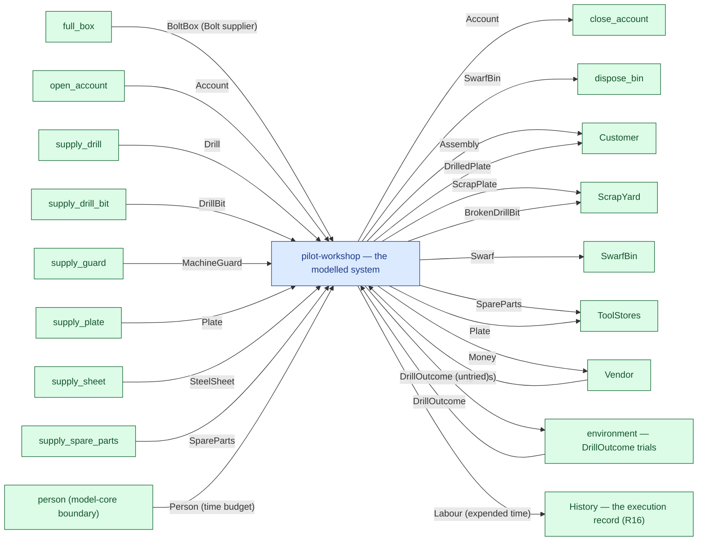

# pilot-workshop — context diagram

> Generated by `tools/diagram-gen` from `model/pilot-workshop` — **do not hand-edit**; regenerate with `tools/diagrams.sh`. Diagram nodes are clickable (absolute links into the source); the legend table under the diagram carries the hyperlinks into the source.

The system as one box — only what crosses the boundary (R12/R15): inputs from suppliers and sources on the left-hand edges, outputs to consumers and sinks on the right. Extracted statically from the crate's `boundary` module functions, its `Supplier`/`Consumer` impls and its `outcome_token!` declarations. *pilot-workshop — the downstream pilot model*

## Legend — node → source

| Node | Kind | Defined at |
|---|---|---|
| `n_system` (pilot-workshop — the modelled system) | the system | [model/pilot-workshop/src/lib.rs#L1](/model/pilot-workshop/src/lib.rs#L1) |
| `n_exit_close_account` (close_account) | external party | [model/pilot-workshop/src/money.rs#L124](/model/pilot-workshop/src/money.rs#L124) |
| `n_exit_dispose_bin` (dispose_bin) | external party | [model/pilot-workshop/src/resources.rs#L535](/model/pilot-workshop/src/resources.rs#L535) |
| `n_full_box` (full_box) | external party | [model/pilot-workshop/src/catalogue.rs#L229](/model/pilot-workshop/src/catalogue.rs#L229) |
| `n_open_account` (open_account) | external party | [model/pilot-workshop/src/money.rs#L115](/model/pilot-workshop/src/money.rs#L115) |
| `n_supply_drill` (supply_drill) | external party | [model/pilot-workshop/src/resources.rs#L431](/model/pilot-workshop/src/resources.rs#L431) |
| `n_supply_drill_bit` (supply_drill_bit) | external party | [model/pilot-workshop/src/resources.rs#L447](/model/pilot-workshop/src/resources.rs#L447) |
| `n_supply_guard` (supply_guard) | external party | [model/pilot-workshop/src/resources.rs#L461](/model/pilot-workshop/src/resources.rs#L461) |
| `n_supply_plate` (supply_plate) | external party | [model/pilot-workshop/src/resources.rs#L440](/model/pilot-workshop/src/resources.rs#L440) |
| `n_supply_sheet` (supply_sheet) | external party | [model/pilot-workshop/src/resources.rs#L424](/model/pilot-workshop/src/resources.rs#L424) |
| `n_supply_spare_parts` (supply_spare_parts) | external party | [model/pilot-workshop/src/resources.rs#L454](/model/pilot-workshop/src/resources.rs#L454) |
| `n_Customer` (Customer) | external party | [model/pilot-workshop/src/resources.rs#L378](/model/pilot-workshop/src/resources.rs#L378) |
| `n_ScrapYard` (ScrapYard) | external party | [model/pilot-workshop/src/resources.rs#L249](/model/pilot-workshop/src/resources.rs#L249) |
| `n_SwarfBin` (SwarfBin) | external party | [model/pilot-workshop/src/resources.rs#L334](/model/pilot-workshop/src/resources.rs#L334) |
| `n_ToolStores` (ToolStores) | external party | [model/pilot-workshop/src/resources.rs#L280](/model/pilot-workshop/src/resources.rs#L280) |
| `n_Vendor` (Vendor) | external party | [model/pilot-workshop/src/money.rs#L77](/model/pilot-workshop/src/money.rs#L77) |
| `n_env_DrillOutcome` (environment — DrillOutcome trials) | external party | [model/pilot-workshop/src/resources.rs#L185](/model/pilot-workshop/src/resources.rs#L185) |
| `n_person` (person (model-core boundary)) | external party | — |
| `n_history` (History — the execution record (R16)) | external party | — |

## Resources on the edges

| Resource | Kind | Unit | Defined at |
|---|---|---|---|
| `Account` | continuous (container) | pence remaining | [model/pilot-workshop/src/money.rs#L54](/model/pilot-workshop/src/money.rs#L54) |
| `Assembly` | discrete (consumable) | — | [model/pilot-workshop/src/resources.rs#L311](/model/pilot-workshop/src/resources.rs#L311) |
| `Bolt` | discrete (consumable) | — | [model/pilot-workshop/src/catalogue.rs#L91](/model/pilot-workshop/src/catalogue.rs#L91) |
| `BoltBox` | boundary object (placeholder) | — | [model/pilot-workshop/src/catalogue.rs#L139](/model/pilot-workshop/src/catalogue.rs#L139) |
| `BrokenDrillBit` | discrete (consumable) | — | [model/pilot-workshop/src/resources.rs#L117](/model/pilot-workshop/src/resources.rs#L117) |
| `Drill` | reusable | — | [model/pilot-workshop/src/resources.rs#L82](/model/pilot-workshop/src/resources.rs#L82) |
| `DrillBit` | reusable | — | [model/pilot-workshop/src/resources.rs#L107](/model/pilot-workshop/src/resources.rs#L107) |
| `DrillOutcome` | outcome token (R17) | — | [model/pilot-workshop/src/resources.rs#L185](/model/pilot-workshop/src/resources.rs#L185) |
| `DrilledPlate` | continuous (container) | grams | [model/pilot-workshop/src/resources.rs#L56](/model/pilot-workshop/src/resources.rs#L56) |
| `MachineGuard` | reusable | — | [model/pilot-workshop/src/resources.rs#L147](/model/pilot-workshop/src/resources.rs#L147) |
| `Money` | continuous (container) | pence | [model/pilot-workshop/src/money.rs#L45](/model/pilot-workshop/src/money.rs#L45) |
| `Plate` | continuous (container) | grams | [model/pilot-workshop/src/resources.rs#L47](/model/pilot-workshop/src/resources.rs#L47) |
| `ScrapPlate` | continuous (container) | grams | [model/pilot-workshop/src/resources.rs#L97](/model/pilot-workshop/src/resources.rs#L97) |
| `SpareParts` | discrete (consumable) | — | [model/pilot-workshop/src/resources.rs#L137](/model/pilot-workshop/src/resources.rs#L137) |
| `SteelSheet` | continuous (container) | grams | [model/pilot-workshop/src/resources.rs#L39](/model/pilot-workshop/src/resources.rs#L39) |
| `Swarf` | continuous (container) | grams | [model/pilot-workshop/src/resources.rs#L72](/model/pilot-workshop/src/resources.rs#L72) |
| `SwarfBin` | boundary object (placeholder) | — | [model/pilot-workshop/src/resources.rs#L334](/model/pilot-workshop/src/resources.rs#L334) |
