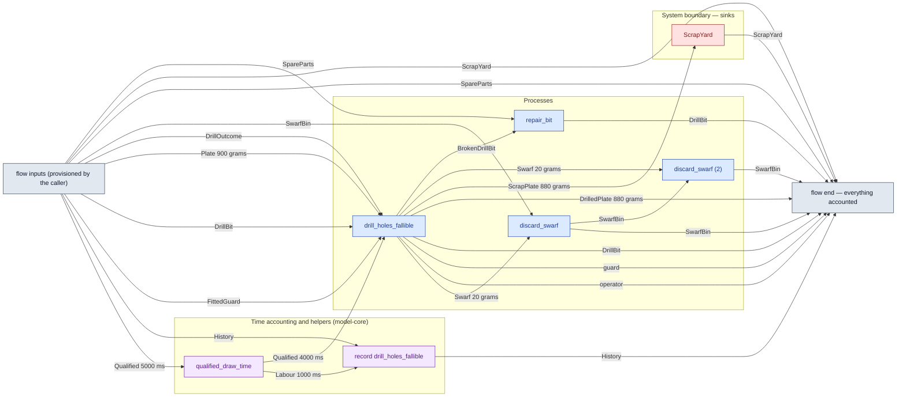

# pilot-workshop — detailed diagram

> Generated by `tools/diagram-gen` from `model/pilot-workshop` — **do not hand-edit**; regenerate with `tools/diagrams.sh`. GitHub sandboxes Mermaid `click` links, so the legend table under the diagram carries the hyperlinks into the source.

All levels, fully connected: every call in the flow — boundary setup, the processes, the adjacent time draws and their `History` records (F-048/R16), internal waste routing, and the disposal steps — traced from the flow function's `let`-binding sequence, with the const magnitudes from each call site. Edge labels carry the resource and its magnitude in the base unit (R7).

## Main flow — `flow_order_a_type_checks_and_accounts_for_everything`

Source: [model/pilot-workshop/tests/flows.rs#L55](../../../model/pilot-workshop/tests/flows.rs#L55)

```mermaid
flowchart LR
  classDef process fill:#dbeafe,stroke:#1e40af,color:#1e3a8a;
  classDef boundary fill:#dcfce7,stroke:#166534,color:#14532d;
  classDef sink fill:#fee2e2,stroke:#991b1b,color:#7f1d1d;
  classDef helper fill:#f3e8ff,stroke:#6b21a8,color:#581c87;
  classDef grouping fill:#ffedd5,stroke:#9a3412,color:#7c2d12;
  classDef flowio fill:#e2e8f0,stroke:#334155,color:#0f172a;
  classDef resource fill:#fef9c3,stroke:#854d0e,color:#713f12;
  classDef external fill:#dcfce7,stroke:#166534,color:#14532d;
  classDef system fill:#dbeafe,stroke:#1e40af,color:#1e3a8a;
  subgraph sg_sources["System boundary — sources and setup"]
    direction TB
    n_open_account["open_account"]:::boundary
    n_supply_sheet["supply_sheet"]:::boundary
    n_new_person["new_person"]:::boundary
    n_qualify["qualify"]:::boundary
    n_supply_drill["supply_drill"]:::boundary
    n_supply_guard["supply_guard"]:::boundary
    n_release["release"]:::boundary
  end
  subgraph sg_system["Processes"]
    direction TB
    n_draw_funds["draw_funds"]:::process
    n_purchase["purchase"]:::process
    n_deposit["deposit"]:::process
    n_fit_guard["fit_guard"]:::process
    n_cut["cut"]:::process
    n_drill_holes["drill_holes"]:::process
    n_drill_holes_2["drill_holes (2)"]:::process
    n_fasten["fasten"]:::process
    n_discard_swarf["discard_swarf"]:::process
    n_discard_swarf_2["discard_swarf (2)"]:::process
    n_discard_swarf_3["discard_swarf (3)"]:::process
    n_remove_guard["remove_guard"]:::process
  end
  subgraph sg_helpers["Time accounting and helpers (model-core)"]
    direction TB
    n_new_history["new_history"]:::helper
    n_new_history_2["new_history (2)"]:::helper
    n_record["record drill_holes"]:::helper
    n_record_2["record drill_holes (2)"]:::helper
    n_merge["merge"]:::helper
  end
  subgraph sg_sinks["System boundary — sinks"]
    direction TB
    n_new_vendor["new_vendor"]:::sink
    n_new_swarf_bin["new_swarf_bin"]:::sink
    n_dispose_bin["dispose_bin"]:::sink
    n_new_customer["new_customer"]:::sink
    n_close_account["close_account"]:::sink
  end
  n_flow_end["flow end — everything accounted"]:::flowio
  n_open_account -- "Account 1000 pence" --> n_draw_funds
  n_new_vendor -- "Vendor" --> n_purchase
  n_draw_funds -- "Money 500 pence" --> n_purchase
  n_draw_funds -- "Account 500 pence" --> n_deposit
  n_purchase -- "Money 100 pence" --> n_deposit
  n_new_person -- "Person 10000 ms" --> n_qualify
  n_supply_guard -- "MachineGuard" --> n_fit_guard
  n_supply_sheet -- "SteelSheet 2000 grams" --> n_cut
  n_qualify -- "Qualified 10000 ms" --> n_drill_holes
  n_supply_drill -- "Drill" --> n_drill_holes
  n_fit_guard -- "FittedGuard" --> n_drill_holes
  n_cut -- "Plate 900 grams" --> n_drill_holes
  n_drill_holes -- "Qualified 8000 ms" --> n_drill_holes_2
  n_drill_holes -- "Drill" --> n_drill_holes_2
  n_drill_holes -- "FittedGuard" --> n_drill_holes_2
  n_cut -- "Plate 900 grams" --> n_drill_holes_2
  n_drill_holes -- "DrilledPlate 880 grams" --> n_fasten
  n_drill_holes_2 -- "DrilledPlate 880 grams" --> n_fasten
  n_purchase -- "BoltBox" --> n_fasten
  n_new_swarf_bin -- "SwarfBin 3" --> n_discard_swarf
  n_cut -- "Swarf 200 grams" --> n_discard_swarf
  n_discard_swarf -- "SwarfBin" --> n_discard_swarf_2
  n_drill_holes -- "Swarf 20 grams" --> n_discard_swarf_2
  n_discard_swarf_2 -- "SwarfBin" --> n_discard_swarf_3
  n_drill_holes_2 -- "Swarf 20 grams" --> n_discard_swarf_3
  n_discard_swarf_3 -- "SwarfBin" --> n_dispose_bin
  n_new_history -- "History" --> n_record
  n_drill_holes -- "Labour 2000 ms" --> n_record
  n_new_history_2 -- "History" --> n_record_2
  n_drill_holes_2 -- "Labour 2000 ms" --> n_record_2
  n_record -- "History" --> n_merge
  n_record_2 -- "History" --> n_merge
  n_fasten -- "Assembly 1760" --> n_new_customer
  n_drill_holes_2 -- "Qualified 6000 ms" --> n_release
  n_drill_holes_2 -- "FittedGuard" --> n_remove_guard
  n_deposit -- "Account 600 pence" --> n_close_account
  n_release -- "Person" --> n_flow_end
  n_drill_holes_2 -- "Drill" --> n_flow_end
  n_remove_guard -- "MachineGuard" --> n_flow_end
  n_purchase -- "Vendor" --> n_flow_end
  n_merge -- "History" --> n_flow_end
  n_fasten -- "EmptyBoltBox" --> n_flow_end
  click n_open_account "../../../model/pilot-workshop/src/money.rs#L115" "model/pilot-workshop/src/money.rs"
  click n_draw_funds "../../../model/pilot-workshop/src/money.rs#L173" "model/pilot-workshop/src/money.rs"
  click n_new_vendor "../../../model/pilot-workshop/src/money.rs#L132" "model/pilot-workshop/src/money.rs"
  click n_purchase "../../../model/pilot-workshop/src/money.rs#L243" "model/pilot-workshop/src/money.rs"
  click n_deposit "../../../model/pilot-workshop/src/money.rs#L181" "model/pilot-workshop/src/money.rs"
  click n_supply_sheet "../../../model/pilot-workshop/src/resources.rs#L423" "model/pilot-workshop/src/resources.rs"
  click n_new_person "../../../model/model-core/src/common.rs#L152" "model/model-core/src/common.rs"
  click n_qualify "../../../model/model-core/src/common.rs#L166" "model/model-core/src/common.rs"
  click n_supply_drill "../../../model/pilot-workshop/src/resources.rs#L430" "model/pilot-workshop/src/resources.rs"
  click n_supply_guard "../../../model/pilot-workshop/src/resources.rs#L460" "model/pilot-workshop/src/resources.rs"
  click n_fit_guard "../../../model/pilot-workshop/src/resources.rs#L601" "model/pilot-workshop/src/resources.rs"
  click n_new_swarf_bin "../../../model/pilot-workshop/src/resources.rs#L478" "model/pilot-workshop/src/resources.rs"
  click n_new_history "../../../model/model-core/src/history.rs#L264" "model/model-core/src/history.rs"
  click n_new_history_2 "../../../model/model-core/src/history.rs#L264" "model/model-core/src/history.rs"
  click n_cut "../../../model/pilot-workshop/src/resources.rs#L584" "model/pilot-workshop/src/resources.rs"
  click n_drill_holes "../../../model/pilot-workshop/src/resources.rs#L668" "model/pilot-workshop/src/resources.rs"
  click n_drill_holes_2 "../../../model/pilot-workshop/src/resources.rs#L668" "model/pilot-workshop/src/resources.rs"
  click n_fasten "../../../model/pilot-workshop/src/resources.rs#L799" "model/pilot-workshop/src/resources.rs"
  click n_discard_swarf "../../../model/pilot-workshop/src/resources.rs#L820" "model/pilot-workshop/src/resources.rs"
  click n_discard_swarf_2 "../../../model/pilot-workshop/src/resources.rs#L820" "model/pilot-workshop/src/resources.rs"
  click n_discard_swarf_3 "../../../model/pilot-workshop/src/resources.rs#L820" "model/pilot-workshop/src/resources.rs"
  click n_dispose_bin "../../../model/pilot-workshop/src/resources.rs#L534" "model/pilot-workshop/src/resources.rs"
  click n_record "../../../model/model-core/src/history.rs#L284" "model/model-core/src/history.rs"
  click n_record_2 "../../../model/model-core/src/history.rs#L284" "model/model-core/src/history.rs"
  click n_merge "../../../model/model-core/src/history.rs#L304" "model/model-core/src/history.rs"
  click n_new_customer "../../../model/pilot-workshop/src/resources.rs#L487" "model/pilot-workshop/src/resources.rs"
  click n_release "../../../model/model-core/src/common.rs#L179" "model/model-core/src/common.rs"
  click n_remove_guard "../../../model/pilot-workshop/src/resources.rs#L609" "model/pilot-workshop/src/resources.rs"
  click n_close_account "../../../model/pilot-workshop/src/money.rs#L124" "model/pilot-workshop/src/money.rs"
  click n_flow_end "../../../model/pilot-workshop/tests/flows.rs#L55" "model/pilot-workshop/tests/flows.rs"
```

### Legend — node → source

| Node | Kind | Defined at |
|---|---|---|
| `n_open_account` (open_account) | boundary source | [model/pilot-workshop/src/money.rs#L115](../../../model/pilot-workshop/src/money.rs#L115) |
| `n_draw_funds` (draw_funds) | process | [model/pilot-workshop/src/money.rs#L173](../../../model/pilot-workshop/src/money.rs#L173) |
| `n_new_vendor` (new_vendor) | boundary sink | [model/pilot-workshop/src/money.rs#L132](../../../model/pilot-workshop/src/money.rs#L132) |
| `n_purchase` (purchase) | process | [model/pilot-workshop/src/money.rs#L243](../../../model/pilot-workshop/src/money.rs#L243) |
| `n_deposit` (deposit) | process | [model/pilot-workshop/src/money.rs#L181](../../../model/pilot-workshop/src/money.rs#L181) |
| `n_supply_sheet` (supply_sheet) | boundary source | [model/pilot-workshop/src/resources.rs#L423](../../../model/pilot-workshop/src/resources.rs#L423) |
| `n_new_person` (new_person) | boundary source | [model/model-core/src/common.rs#L152](../../../model/model-core/src/common.rs#L152) |
| `n_qualify` (qualify) | boundary source | [model/model-core/src/common.rs#L166](../../../model/model-core/src/common.rs#L166) |
| `n_supply_drill` (supply_drill) | boundary source | [model/pilot-workshop/src/resources.rs#L430](../../../model/pilot-workshop/src/resources.rs#L430) |
| `n_supply_guard` (supply_guard) | boundary source | [model/pilot-workshop/src/resources.rs#L460](../../../model/pilot-workshop/src/resources.rs#L460) |
| `n_fit_guard` (fit_guard) | process | [model/pilot-workshop/src/resources.rs#L601](../../../model/pilot-workshop/src/resources.rs#L601) |
| `n_new_swarf_bin` (new_swarf_bin) | boundary sink | [model/pilot-workshop/src/resources.rs#L478](../../../model/pilot-workshop/src/resources.rs#L478) |
| `n_new_history` (new_history) | model-core helper | [model/model-core/src/history.rs#L264](../../../model/model-core/src/history.rs#L264) |
| `n_new_history_2` (new_history (2)) | model-core helper | [model/model-core/src/history.rs#L264](../../../model/model-core/src/history.rs#L264) |
| `n_cut` (cut) | process | [model/pilot-workshop/src/resources.rs#L584](../../../model/pilot-workshop/src/resources.rs#L584) |
| `n_drill_holes` (drill_holes) | process | [model/pilot-workshop/src/resources.rs#L668](../../../model/pilot-workshop/src/resources.rs#L668) |
| `n_drill_holes_2` (drill_holes (2)) | process | [model/pilot-workshop/src/resources.rs#L668](../../../model/pilot-workshop/src/resources.rs#L668) |
| `n_fasten` (fasten) | process | [model/pilot-workshop/src/resources.rs#L799](../../../model/pilot-workshop/src/resources.rs#L799) |
| `n_discard_swarf` (discard_swarf) | process | [model/pilot-workshop/src/resources.rs#L820](../../../model/pilot-workshop/src/resources.rs#L820) |
| `n_discard_swarf_2` (discard_swarf (2)) | process | [model/pilot-workshop/src/resources.rs#L820](../../../model/pilot-workshop/src/resources.rs#L820) |
| `n_discard_swarf_3` (discard_swarf (3)) | process | [model/pilot-workshop/src/resources.rs#L820](../../../model/pilot-workshop/src/resources.rs#L820) |
| `n_dispose_bin` (dispose_bin) | boundary sink | [model/pilot-workshop/src/resources.rs#L534](../../../model/pilot-workshop/src/resources.rs#L534) |
| `n_record` (record drill_holes) | model-core helper | [model/model-core/src/history.rs#L284](../../../model/model-core/src/history.rs#L284) |
| `n_record_2` (record drill_holes (2)) | model-core helper | [model/model-core/src/history.rs#L284](../../../model/model-core/src/history.rs#L284) |
| `n_merge` (merge) | model-core helper | [model/model-core/src/history.rs#L304](../../../model/model-core/src/history.rs#L304) |
| `n_new_customer` (new_customer) | boundary sink | [model/pilot-workshop/src/resources.rs#L487](../../../model/pilot-workshop/src/resources.rs#L487) |
| `n_release` (release) | boundary source | [model/model-core/src/common.rs#L179](../../../model/model-core/src/common.rs#L179) |
| `n_remove_guard` (remove_guard) | process | [model/pilot-workshop/src/resources.rs#L609](../../../model/pilot-workshop/src/resources.rs#L609) |
| `n_close_account` (close_account) | boundary sink | [model/pilot-workshop/src/money.rs#L124](../../../model/pilot-workshop/src/money.rs#L124) |
| `n_flow_end` (flow end — everything accounted) | flow input/output | [model/pilot-workshop/tests/flows.rs#L55](../../../model/pilot-workshop/tests/flows.rs#L55) |

<!-- WARN (diagram-gen): skipped a `match` whose scrutinee is not a direct process call (assertion-only match) -->

## Composite fallible flow — `drill_one_plate_handling_both_arms`

Source: [model/pilot-workshop/src/flows.rs#L65](../../../model/pilot-workshop/src/flows.rs#L65)

### Legend — node → source

| Node | Kind | Defined at |
|---|---|---|
| `n_flow_inputs` (flow inputs (provisioned by the caller)) | flow input/output | [model/pilot-workshop/src/flows.rs#L65](../../../model/pilot-workshop/src/flows.rs#L65) |
| `n_qualified_draw_time` (qualified_draw_time) | model-core helper | [model/model-core/src/common.rs#L309](../../../model/model-core/src/common.rs#L309) |
| `n_record` (record drill_holes_fallible) | model-core helper | [model/model-core/src/history.rs#L284](../../../model/model-core/src/history.rs#L284) |
| `n_drill_holes_fallible` (drill_holes_fallible) | process | [model/pilot-workshop/src/resources.rs#L747](../../../model/pilot-workshop/src/resources.rs#L747) |
| `n_discard_swarf` (discard_swarf) | process | [model/pilot-workshop/src/resources.rs#L820](../../../model/pilot-workshop/src/resources.rs#L820) |
| `n_flow_end` (flow end — everything accounted) | flow input/output | [model/pilot-workshop/src/flows.rs#L65](../../../model/pilot-workshop/src/flows.rs#L65) |
| `n_ScrapYard` (ScrapYard) | boundary sink | [model/pilot-workshop/src/resources.rs#L249](../../../model/pilot-workshop/src/resources.rs#L249) |
| `n_discard_swarf_2` (discard_swarf (2)) | process | [model/pilot-workshop/src/resources.rs#L820](../../../model/pilot-workshop/src/resources.rs#L820) |
| `n_repair_bit` (repair_bit) | process | [model/pilot-workshop/src/resources.rs#L618](../../../model/pilot-workshop/src/resources.rs#L618) |

## Composite fallible flow — `drill_with_one_retry`

Source: [model/pilot-workshop/src/flows.rs#L201](../../../model/pilot-workshop/src/flows.rs#L201)

```mermaid
flowchart LR
  classDef process fill:#dbeafe,stroke:#1e40af,color:#1e3a8a;
  classDef boundary fill:#dcfce7,stroke:#166534,color:#14532d;
  classDef sink fill:#fee2e2,stroke:#991b1b,color:#7f1d1d;
  classDef helper fill:#f3e8ff,stroke:#6b21a8,color:#581c87;
  classDef grouping fill:#ffedd5,stroke:#9a3412,color:#7c2d12;
  classDef flowio fill:#e2e8f0,stroke:#334155,color:#0f172a;
  classDef resource fill:#fef9c3,stroke:#854d0e,color:#713f12;
  classDef external fill:#dcfce7,stroke:#166534,color:#14532d;
  classDef system fill:#dbeafe,stroke:#1e40af,color:#1e3a8a;
  subgraph sg_system["Processes"]
    direction TB
    n_drill_holes_fallible["drill_holes_fallible"]:::process
    n_discard_swarf["discard_swarf"]:::process
    n_RetryOutcome__FirstTry["RetryOutcome::FirstTry"]:::grouping
    n_discard_swarf_2["discard_swarf (2)"]:::process
    n_repair_bit["repair_bit"]:::process
    n_drill_holes_fallible_2["drill_holes_fallible (2)"]:::process
    n_discard_swarf_3["discard_swarf (3)"]:::process
    n_RetryOutcome__Retried["RetryOutcome::Retried"]:::grouping
    n_RetryOutcome__GaveUp["RetryOutcome::GaveUp"]:::grouping
  end
  subgraph sg_helpers["Time accounting and helpers (model-core)"]
    direction TB
    n_qualified_draw_time["qualified_draw_time"]:::helper
    n_record["record drill_holes_fallible"]:::helper
    n_qualified_draw_time_2["qualified_draw_time (2)"]:::helper
    n_record_2["record drill_holes_fallible (2)"]:::helper
  end
  subgraph sg_sinks["System boundary — sinks"]
    direction TB
    n_ScrapYard["ScrapYard"]:::sink
  end
  n_flow_inputs["flow inputs (provisioned by the caller)"]:::flowio
  n_flow_end["flow end — everything accounted"]:::flowio
  n_flow_inputs -- "Qualified 10000 ms" --> n_qualified_draw_time
  n_flow_inputs -- "History" --> n_record
  n_qualified_draw_time -- "Labour 1000 ms" --> n_record
  n_qualified_draw_time -- "Qualified 9000 ms" --> n_drill_holes_fallible
  n_flow_inputs -- "FittedGuard" --> n_drill_holes_fallible
  n_flow_inputs -- "DrillBit" --> n_drill_holes_fallible
  n_flow_inputs -- "Plate 900 grams" --> n_drill_holes_fallible
  n_flow_inputs -- "DrillOutcome" --> n_drill_holes_fallible
  n_flow_inputs -- "SwarfBin 2" --> n_discard_swarf
  n_drill_holes_fallible -- "Swarf 20 grams" --> n_discard_swarf
  n_drill_holes_fallible -- "Qualified 9000 ms" --> n_RetryOutcome__FirstTry
  n_drill_holes_fallible -- "FittedGuard" --> n_RetryOutcome__FirstTry
  n_drill_holes_fallible -- "DrillBit" --> n_RetryOutcome__FirstTry
  n_drill_holes_fallible -- "DrilledPlate 880 grams" --> n_RetryOutcome__FirstTry
  n_flow_inputs -- "Plate 900 grams" --> n_RetryOutcome__FirstTry
  n_flow_inputs -- "DrillOutcome" --> n_RetryOutcome__FirstTry
  n_flow_inputs -- "SpareParts" --> n_RetryOutcome__FirstTry
  n_discard_swarf -- "BinAfterOneSwarf" --> n_RetryOutcome__FirstTry
  n_RetryOutcome__FirstTry -- "RetryOutcome" --> n_flow_end
  n_flow_inputs -- "ScrapYard" --> n_flow_end
  n_record -- "History" --> n_flow_end
  n_drill_holes_fallible -- "ScrapPlate 880 grams" --> n_ScrapYard
  n_discard_swarf -- "SwarfBin" --> n_discard_swarf_2
  n_drill_holes_fallible -- "Swarf 20 grams" --> n_discard_swarf_2
  n_drill_holes_fallible -- "BrokenDrillBit" --> n_repair_bit
  n_flow_inputs -- "SpareParts" --> n_repair_bit
  n_drill_holes_fallible -- "operator" --> n_qualified_draw_time_2
  n_record -- "History" --> n_record_2
  n_qualified_draw_time_2 -- "Labour 1000 ms" --> n_record_2
  n_qualified_draw_time_2 -- "Qualified 8000 ms" --> n_drill_holes_fallible_2
  n_drill_holes_fallible -- "guard" --> n_drill_holes_fallible_2
  n_repair_bit -- "DrillBit" --> n_drill_holes_fallible_2
  n_flow_inputs -- "Plate 900 grams" --> n_drill_holes_fallible_2
  n_flow_inputs -- "DrillOutcome" --> n_drill_holes_fallible_2
  n_discard_swarf_2 -- "SwarfBin" --> n_discard_swarf_3
  n_drill_holes_fallible_2 -- "Swarf 20 grams" --> n_discard_swarf_3
  n_drill_holes_fallible_2 -- "Qualified 8000 ms" --> n_RetryOutcome__Retried
  n_drill_holes_fallible_2 -- "FittedGuard" --> n_RetryOutcome__Retried
  n_drill_holes_fallible_2 -- "DrillBit" --> n_RetryOutcome__Retried
  n_drill_holes_fallible_2 -- "DrilledPlate 880 grams" --> n_RetryOutcome__Retried
  n_discard_swarf_3 -- "BinAfterTwoSwarf" --> n_RetryOutcome__Retried
  n_RetryOutcome__Retried -- "RetryOutcome" --> n_flow_end
  n_ScrapYard -- "ScrapYard" --> n_flow_end
  n_record_2 -- "History" --> n_flow_end
  n_drill_holes_fallible_2 -- "DrillFail 880, 20" --> n_RetryOutcome__GaveUp
  n_discard_swarf_3 -- "BinAfterOneSwarf" --> n_RetryOutcome__GaveUp
  n_RetryOutcome__GaveUp -- "RetryOutcome" --> n_flow_end
  click n_flow_inputs "../../../model/pilot-workshop/src/flows.rs#L201" "model/pilot-workshop/src/flows.rs"
  click n_qualified_draw_time "../../../model/model-core/src/common.rs#L309" "model/model-core/src/common.rs"
  click n_record "../../../model/model-core/src/history.rs#L284" "model/model-core/src/history.rs"
  click n_drill_holes_fallible "../../../model/pilot-workshop/src/resources.rs#L747" "model/pilot-workshop/src/resources.rs"
  click n_discard_swarf "../../../model/pilot-workshop/src/resources.rs#L820" "model/pilot-workshop/src/resources.rs"
  click n_RetryOutcome__FirstTry "../../../model/pilot-workshop/src/flows.rs#L137" "model/pilot-workshop/src/flows.rs"
  click n_flow_end "../../../model/pilot-workshop/src/flows.rs#L201" "model/pilot-workshop/src/flows.rs"
  click n_ScrapYard "../../../model/pilot-workshop/src/resources.rs#L249" "model/pilot-workshop/src/resources.rs"
  click n_discard_swarf_2 "../../../model/pilot-workshop/src/resources.rs#L820" "model/pilot-workshop/src/resources.rs"
  click n_repair_bit "../../../model/pilot-workshop/src/resources.rs#L618" "model/pilot-workshop/src/resources.rs"
  click n_qualified_draw_time_2 "../../../model/model-core/src/common.rs#L309" "model/model-core/src/common.rs"
  click n_record_2 "../../../model/model-core/src/history.rs#L284" "model/model-core/src/history.rs"
  click n_drill_holes_fallible_2 "../../../model/pilot-workshop/src/resources.rs#L747" "model/pilot-workshop/src/resources.rs"
  click n_discard_swarf_3 "../../../model/pilot-workshop/src/resources.rs#L820" "model/pilot-workshop/src/resources.rs"
  click n_RetryOutcome__Retried "../../../model/pilot-workshop/src/flows.rs#L137" "model/pilot-workshop/src/flows.rs"
  click n_RetryOutcome__GaveUp "../../../model/pilot-workshop/src/flows.rs#L137" "model/pilot-workshop/src/flows.rs"
```

### Legend — node → source

| Node | Kind | Defined at |
|---|---|---|
| `n_flow_inputs` (flow inputs (provisioned by the caller)) | flow input/output | [model/pilot-workshop/src/flows.rs#L201](../../../model/pilot-workshop/src/flows.rs#L201) |
| `n_qualified_draw_time` (qualified_draw_time) | model-core helper | [model/model-core/src/common.rs#L309](../../../model/model-core/src/common.rs#L309) |
| `n_record` (record drill_holes_fallible) | model-core helper | [model/model-core/src/history.rs#L284](../../../model/model-core/src/history.rs#L284) |
| `n_drill_holes_fallible` (drill_holes_fallible) | process | [model/pilot-workshop/src/resources.rs#L747](../../../model/pilot-workshop/src/resources.rs#L747) |
| `n_discard_swarf` (discard_swarf) | process | [model/pilot-workshop/src/resources.rs#L820](../../../model/pilot-workshop/src/resources.rs#L820) |
| `n_RetryOutcome__FirstTry` (RetryOutcome::FirstTry) | outcome grouping | [model/pilot-workshop/src/flows.rs#L137](../../../model/pilot-workshop/src/flows.rs#L137) |
| `n_flow_end` (flow end — everything accounted) | flow input/output | [model/pilot-workshop/src/flows.rs#L201](../../../model/pilot-workshop/src/flows.rs#L201) |
| `n_ScrapYard` (ScrapYard) | boundary sink | [model/pilot-workshop/src/resources.rs#L249](../../../model/pilot-workshop/src/resources.rs#L249) |
| `n_discard_swarf_2` (discard_swarf (2)) | process | [model/pilot-workshop/src/resources.rs#L820](../../../model/pilot-workshop/src/resources.rs#L820) |
| `n_repair_bit` (repair_bit) | process | [model/pilot-workshop/src/resources.rs#L618](../../../model/pilot-workshop/src/resources.rs#L618) |
| `n_qualified_draw_time_2` (qualified_draw_time (2)) | model-core helper | [model/model-core/src/common.rs#L309](../../../model/model-core/src/common.rs#L309) |
| `n_record_2` (record drill_holes_fallible (2)) | model-core helper | [model/model-core/src/history.rs#L284](../../../model/model-core/src/history.rs#L284) |
| `n_drill_holes_fallible_2` (drill_holes_fallible (2)) | process | [model/pilot-workshop/src/resources.rs#L747](../../../model/pilot-workshop/src/resources.rs#L747) |
| `n_discard_swarf_3` (discard_swarf (3)) | process | [model/pilot-workshop/src/resources.rs#L820](../../../model/pilot-workshop/src/resources.rs#L820) |
| `n_RetryOutcome__Retried` (RetryOutcome::Retried) | outcome grouping | [model/pilot-workshop/src/flows.rs#L137](../../../model/pilot-workshop/src/flows.rs#L137) |
| `n_RetryOutcome__GaveUp` (RetryOutcome::GaveUp) | outcome grouping | [model/pilot-workshop/src/flows.rs#L137](../../../model/pilot-workshop/src/flows.rs#L137) |

## Resources on the edges

| Resource | Kind | Unit | Defined at |
|---|---|---|---|
| `Account` | continuous (container) | pence remaining | [model/pilot-workshop/src/money.rs#L54](../../../model/pilot-workshop/src/money.rs#L54) |
| `Assembly` | discrete (consumable) | — | [model/pilot-workshop/src/resources.rs#L311](../../../model/pilot-workshop/src/resources.rs#L311) |
| `BoltBox` | boundary object (placeholder) | — | [model/pilot-workshop/src/catalogue.rs#L139](../../../model/pilot-workshop/src/catalogue.rs#L139) |
| `BrokenDrillBit` | discrete (consumable) | — | [model/pilot-workshop/src/resources.rs#L117](../../../model/pilot-workshop/src/resources.rs#L117) |
| `Drill` | reusable | — | [model/pilot-workshop/src/resources.rs#L82](../../../model/pilot-workshop/src/resources.rs#L82) |
| `DrillBit` | reusable | — | [model/pilot-workshop/src/resources.rs#L107](../../../model/pilot-workshop/src/resources.rs#L107) |
| `DrillFail` | boundary object | — | [model/pilot-workshop/src/resources.rs#L227](../../../model/pilot-workshop/src/resources.rs#L227) |
| `DrillOutcome` | outcome token (R17) | — | [model/pilot-workshop/src/resources.rs#L185](../../../model/pilot-workshop/src/resources.rs#L185) |
| `DrilledPlate` | continuous (container) | grams | [model/pilot-workshop/src/resources.rs#L56](../../../model/pilot-workshop/src/resources.rs#L56) |
| `FittedGuard` | reusable | — | [model/pilot-workshop/src/resources.rs#L155](../../../model/pilot-workshop/src/resources.rs#L155) |
| `MachineGuard` | reusable | — | [model/pilot-workshop/src/resources.rs#L147](../../../model/pilot-workshop/src/resources.rs#L147) |
| `Money` | continuous (container) | pence | [model/pilot-workshop/src/money.rs#L45](../../../model/pilot-workshop/src/money.rs#L45) |
| `Plate` | continuous (container) | grams | [model/pilot-workshop/src/resources.rs#L47](../../../model/pilot-workshop/src/resources.rs#L47) |
| `ScrapPlate` | continuous (container) | grams | [model/pilot-workshop/src/resources.rs#L97](../../../model/pilot-workshop/src/resources.rs#L97) |
| `ScrapYard` | boundary object (placeholder) | — | [model/pilot-workshop/src/resources.rs#L249](../../../model/pilot-workshop/src/resources.rs#L249) |
| `SpareParts` | discrete (consumable) | — | [model/pilot-workshop/src/resources.rs#L137](../../../model/pilot-workshop/src/resources.rs#L137) |
| `SteelSheet` | continuous (container) | grams | [model/pilot-workshop/src/resources.rs#L39](../../../model/pilot-workshop/src/resources.rs#L39) |
| `Swarf` | continuous (container) | grams | [model/pilot-workshop/src/resources.rs#L72](../../../model/pilot-workshop/src/resources.rs#L72) |
| `SwarfBin` | boundary object (placeholder) | — | [model/pilot-workshop/src/resources.rs#L333](../../../model/pilot-workshop/src/resources.rs#L333) |
| `Vendor` | reusable (placeholder) | — | [model/pilot-workshop/src/money.rs#L77](../../../model/pilot-workshop/src/money.rs#L77) |
