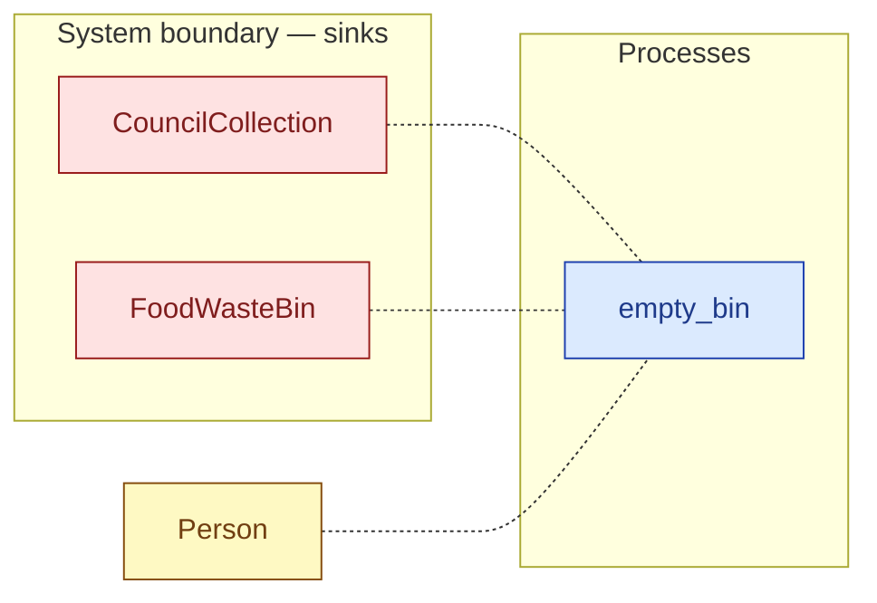

# `empty_bin` — process (R1)

> Generated by `tools/docgen.sh` from `model/cs1-pot-of-tea` — **do not hand-edit**; regenerate after any model change. Links are into the defining source lines; Mermaid nodes carry absolute click urls, the legend table the same links as plain markdown.

**P5 — empties the bin (SPEC.md P5, the F-039 pattern): the bin's kept contents (CS-1: 3 spent bags, 36 g) are released only through this sealed disposal path — their tripwires are defused inside the privacy boundary and their mass continues as one [`FoodWaste`] handed to the council collection.**

- **Crate / subsystem:** `cs1-pot-of-tea` — case study CS-1: making a pot of tea
- **Source:** [model/cs1-pot-of-tea/src/resources.rs#L837](/model/cs1-pot-of-tea/src/resources.rs#L837)
- **Requirements bound on the signature:** REQ-008

## Who and with what

| Actor | Type | Budget at entry | This step's adjacent draw (F-048) |
|---|---|---|---|
| `person` | `Person` | `B` (caller-stated) | 10000 ms |

Boundary objects used:

- `bin`: `FoodWasteBin` (boundary object (R12)), threaded by value (R2) — [model/cs1-pot-of-tea/src/resources.rs#L333](/model/cs1-pot-of-tea/src/resources.rs#L333)
- `council`: `CouncilCollection` (boundary object (R12)), threaded by value (R2) — [model/cs1-pot-of-tea/src/resources.rs#L427](/model/cs1-pot-of-tea/src/resources.rs#L427)

## Inputs

| Parameter | Declared type | Resource kind | Unit | Magnitude |
|---|---|---|---|---|
| `person` | `Person<B>` | reusable (model-core, R2/R15) | ms | `B` (caller-stated) |
| `bin` | `FoodWasteBin<Space, C>` | boundary object (R12) | — | — |
| `council` | `CouncilCollection` | boundary object (R12) | — | — |

Observed entering this step in the traced flows: `CouncilCollection`, `FoodWasteBin`, `Person 235000 ms`.

## Outputs

| Output | Resource kind | Unit | Magnitude | Routing (who takes it) |
|---|---|---|---|---|
| `Person<B>` | reusable (model-core, R2/R15) | ms | `B` (caller-stated) | moved in and returned (R2) |
| `FoodWasteBin<<Space as Add<<C as Len>::Length>>::Sum>` | boundary object (R12) | — | — | moved in and returned (R2) |
| `CouncilCollection` | boundary object (R12) | — | — | moved in and returned (R2) |

Observed leaving this step in the traced flows: `CouncilCollection`, `FoodWasteBin 10`, `Person 235000 ms`.

## Balances (R1/R3/R15)

- **Compile-time assert:** `C::MASS_G == WASTE_G`
  - message: *mass conservation violated in empty_bin (R3): the stated food-waste mass must equal the total mass of the spent teabags the bin kept*
  - fires at monomorphization (F-001): `cargo build`/`cargo test` catch a violation; `cargo check` and editor diagnostics do not.
- **Structural:** the const parameter `B` appears in an input and an output — the magnitude flows through unchanged, checked by the shared type parameter (no assert needed).

## Requirements (R10 — the compliance matrix)

| Requirement | Statement | Defined at | Satisfied by | Verified by |
|---|---|---|---|---|
| REQ-008 | All spent teabags must reach the food-waste bin. | [model/cs1-pot-of-tea/src/requirements.rs#L59](/model/cs1-pot-of-tea/src/requirements.rs#L59) | `FoodWasteBin` | [`pour_and_brew_balances_mass_and_energy`](/model/cs1-pot-of-tea/src/resources.rs#L968), [`empty_bin_restores_capacity_and_ships_the_waste`](/model/cs1-pot-of-tea/src/resources.rs#L1001), [`flow_order_a_type_checks_and_accounts_for_everything`](/model/cs1-pot-of-tea/tests/flows.rs#L79), [`flow_order_b_type_checks_and_accounts_for_everything`](/model/cs1-pot-of-tea/tests/flows.rs#L143), [`fixtures_construct_sealed_resources_for_downstream_tests`](/model/cs1-pot-of-tea/tests/flows.rs#L198), [`abandoned_spent_teabag_trips_the_tripwire_downstream`](/model/cs1-pot-of-tea/tests/flows.rs#L216) |

This item is doc-tagged `Satisfies: REQ-008`.

## Where it fits (R9: needs / feeds)

The model states **connections, not sequences**: any order satisfying these dependencies is valid (R9).

**Needs:**

- `CouncilCollection` (boundary sink) — threaded through, returned (R2)
- `FoodWasteBin` (boundary sink) — threaded through, returned (R2)
- `Person` (shared resource) — threaded through, returned (R2)

## Neighbourhood (one hop)

### Legend — node → source

| Node | Kind | Defined at |
|---|---|---|
| `n_empty_bin` (empty_bin) | process | [model/cs1-pot-of-tea/src/resources.rs#L837](/model/cs1-pot-of-tea/src/resources.rs#L837) |
| `n_FoodWasteBin` (FoodWasteBin) | boundary sink | [model/cs1-pot-of-tea/src/resources.rs#L333](/model/cs1-pot-of-tea/src/resources.rs#L333) |
| `n_CouncilCollection` (CouncilCollection) | boundary sink | [model/cs1-pot-of-tea/src/resources.rs#L427](/model/cs1-pot-of-tea/src/resources.rs#L427) |
| `n_Person` (Person) | shared resource | — |

## Open items (`Placeholder:` tags, R12)

- `CouncilCollection` — council food-waste collection — assumed unbounded. ([model/cs1-pot-of-tea/src/resources.rs#L427](/model/cs1-pot-of-tea/src/resources.rs#L427))
