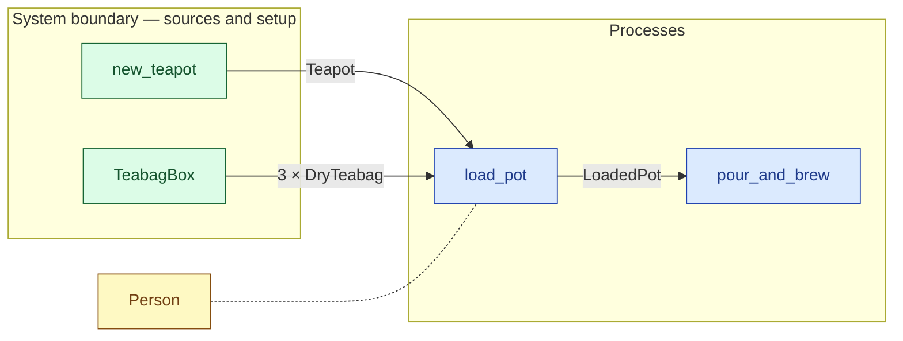

# `load_pot` — process (R1)

> Generated by `tools/docgen.sh` from `model/cs1-pot-of-tea` — **do not hand-edit**; regenerate after any model change. Links are into the defining source lines; Mermaid nodes carry absolute click urls, the legend table the same links as plain markdown.

**P2 — loads the pot with **exactly 3** teabags, taken one at a time from the box in a single `SupplyN<N3>` bound (R12, F-014; SPEC.md P2:**

- **Crate / subsystem:** `cs1-pot-of-tea` — case study CS-1: making a pot of tea
- **Source:** [model/cs1-pot-of-tea/src/resources.rs#L689](/model/cs1-pot-of-tea/src/resources.rs#L689)
- **Requirements bound on the signature:** REQ-007

## Who and with what

| Actor | Type | Budget at entry | This step's adjacent draw (F-048) |
|---|---|---|---|
| `person` | `Person` | `B` (caller-stated) | 20000 ms |

Boundary objects used:

- `teabag_box` supplies **3 × DryTeabag** from `TeabagBox` — [model/cs1-pot-of-tea/src/resources.rs#L296](/model/cs1-pot-of-tea/src/resources.rs#L296) (SupplyN bound, R12)

## Inputs

| Parameter | Declared type | Resource kind | Unit | Magnitude |
|---|---|---|---|---|
| `person` | `Person<B>` | reusable (model-core, R2/R15) | ms | `B` (caller-stated) |
| `pot` | `Teapot` | reusable (R2) | — | — |
| `teabag_box` | supplier of 3 × DryTeabag | boundary object (R12) | — | — |

Observed entering this step in the traced flows: `Person 270000 ms`, `TeabagBox`, `Teapot`.

## Outputs

| Output | Resource kind | Unit | Magnitude | Routing (who takes it) |
|---|---|---|---|---|
| `Person<B>` | reusable (model-core, R2/R15) | ms | `B` (caller-stated) | moved in and returned (R2) |
| `LoadedPot` | discrete (consumable, R13) | — | — | `pour_and_brew` (process) |
| `S::Rest` | — | — | — | the same boundary object, returned in its advanced state (R2/R12) |

Observed leaving this step in the traced flows: `LoadedPot`, `Person 270000 ms`, `TeabagBox`.

## Balances (R1/R3/R15)

- **Structural:** the const parameter `B` appears in an input and an output — the magnitude flows through unchanged, checked by the shared type parameter (no assert needed).

## Requirements (R10 — the compliance matrix)

| Requirement | Statement | Defined at | Satisfied by | Verified by |
|---|---|---|---|---|
| REQ-007 | The pot must be loaded with exactly 3 teabags before brewing. | [model/cs1-pot-of-tea/src/requirements.rs#L51](/model/cs1-pot-of-tea/src/requirements.rs#L51) | `BrewReadyPot` | [`load_pot_takes_exactly_three_bags_and_returns_the_box_at_37`](/model/cs1-pot-of-tea/src/resources.rs#L934), [`pour_and_brew_balances_mass_and_energy`](/model/cs1-pot-of-tea/src/resources.rs#L967), [`flow_order_a_type_checks_and_accounts_for_everything`](/model/cs1-pot-of-tea/tests/flows.rs#L79), [`flow_order_b_type_checks_and_accounts_for_everything`](/model/cs1-pot-of-tea/tests/flows.rs#L143) |

This item is doc-tagged `Satisfies: REQ-007`.

## Where it fits (R9: needs / feeds)

The model states **connections, not sequences**: any order satisfying these dependencies is valid (R9).

**Needs:**

- **3 × DryTeabag** from `TeabagBox` (boundary source)
- **Teapot** from `new_teapot` (boundary source)
- `Person` (shared resource) — threaded through, returned (R2)

**Feeds:**

- **LoadedPot** to `pour_and_brew` (process)

## Neighbourhood (one hop)

### Legend — node → source

| Node | Kind | Defined at |
|---|---|---|
| `n_load_pot` (load_pot) | process | [model/cs1-pot-of-tea/src/resources.rs#L689](/model/cs1-pot-of-tea/src/resources.rs#L689) |
| `n_pour_and_brew` (pour_and_brew) | process | [model/cs1-pot-of-tea/src/resources.rs#L740](/model/cs1-pot-of-tea/src/resources.rs#L740) |
| `n_new_teapot` (new_teapot) | boundary source | [model/cs1-pot-of-tea/src/resources.rs#L461](/model/cs1-pot-of-tea/src/resources.rs#L461) |
| `n_TeabagBox` (TeabagBox) | boundary source | [model/cs1-pot-of-tea/src/resources.rs#L296](/model/cs1-pot-of-tea/src/resources.rs#L296) |
| `n_Person` (Person) | shared resource | — |

## Open items (`Placeholder:` tags, R12)

- `Teapot` — kitchen setup at flow start — one teapot. ([model/cs1-pot-of-tea/src/resources.rs#L198](/model/cs1-pot-of-tea/src/resources.rs#L198))
