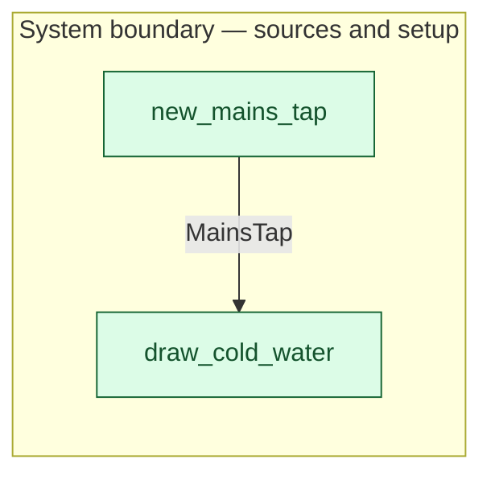

# `new_mains_tap` — boundary function (R12)

> Generated by `tools/docgen.sh` from `model/cs1-pot-of-tea` — **do not hand-edit**; regenerate after any model change. Links are into the defining source lines; Mermaid nodes carry absolute click urls, the legend table the same links as plain markdown.

**The mains tap enters the model (R12).**

- **Crate / subsystem:** `cs1-pot-of-tea` — case study CS-1: making a pot of tea
- **Source:** [model/cs1-pot-of-tea/src/resources.rs#L469](/model/cs1-pot-of-tea/src/resources.rs#L469)
- **Placeholder:** mains water — assumed unbounded (SPEC.md §7).

## Who and with what

No person in this signature: any time cost is drawn by an **adjacent** draw process in the flow (R15/F-048), or the step needs no actor.

## Inputs

| Parameter | Declared type | Resource kind | Unit | Magnitude |
|---|---|---|---|---|

## Outputs

| Output | Resource kind | Unit | Magnitude | Routing (who takes it) |
|---|---|---|---|---|
| `MainsTap` | reusable (R2) | — | — | `draw_cold_water` (boundary source) |

Observed leaving this step in the traced flows: `MainsTap`.

## Where it fits (R9: needs / feeds)

The model states **connections, not sequences**: any order satisfying these dependencies is valid (R9).

**Feeds:**

- **MainsTap** to `draw_cold_water` (boundary source)

## Neighbourhood (one hop)

### Legend — node → source

| Node | Kind | Defined at |
|---|---|---|
| `n_draw_cold_water` (draw_cold_water) | boundary source | [model/cs1-pot-of-tea/src/resources.rs#L485](/model/cs1-pot-of-tea/src/resources.rs#L485) |
| `n_new_mains_tap` (new_mains_tap) | boundary source | [model/cs1-pot-of-tea/src/resources.rs#L469](/model/cs1-pot-of-tea/src/resources.rs#L469) |

## Open items (`Placeholder:` tags, R12)

- this function is itself a placeholder (see the header above)
- `MainsTap` — mains water — assumed unbounded (SPEC.md §7). ([model/cs1-pot-of-tea/src/resources.rs#L265](/model/cs1-pot-of-tea/src/resources.rs#L265))
