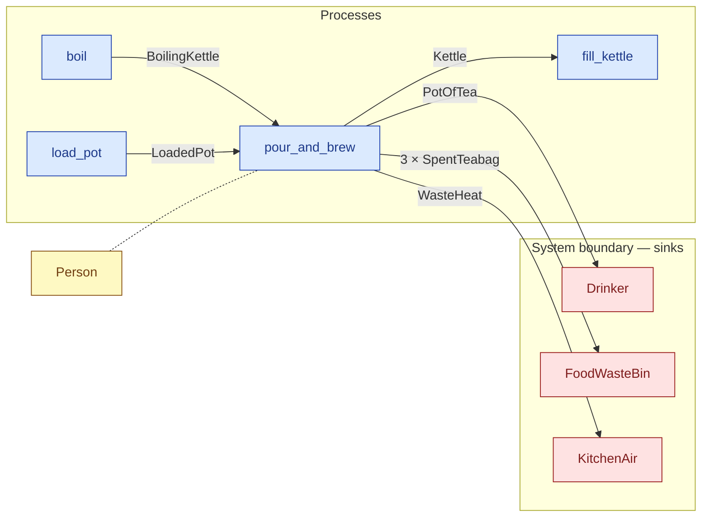

# `pour_and_brew` — process (R1)

> Generated by `tools/docgen.sh` from `model/cs1-pot-of-tea` — **do not hand-edit**; regenerate after any model change. Links are into the defining source lines; Mermaid nodes carry absolute click urls, the legend table the same links as plain markdown.

**P4 — pours the boiling kettle into the loaded pot and brews (SPEC.md P4).**

- **Crate / subsystem:** `cs1-pot-of-tea` — case study CS-1: making a pot of tea
- **Source:** [model/cs1-pot-of-tea/src/resources.rs#L741](/model/cs1-pot-of-tea/src/resources.rs#L741)
- **Requirements bound on the signature:** REQ-006, REQ-007, REQ-008, REQ-009

## Who and with what

| Actor | Type | Budget at entry | This step's adjacent draw (F-048) |
|---|---|---|---|
| `person` | `Person` | `B` (caller-stated) | 15000 ms |

## Inputs

| Parameter | Declared type | Resource kind | Unit | Magnitude |
|---|---|---|---|---|
| `person` | `Person<B>` | reusable (model-core, R2/R15) | ms | `B` (caller-stated) |
| `kettle` | `K` → `BoilingKettle` (via the requirement bound) | continuous (container, R15) | joules (embodied) | — |
| `pot` | `P` → `LoadedPot` (via the requirement bound) | discrete (consumable, R13) | — | — |
| `bin` | consumer of 3 × SpentTeabag (sink `FoodWasteBin`) | boundary object (R12) | — | — |
| `air` | consumer of WasteHeat (sink `KitchenAir`) | boundary object (R12) | — | — |

Observed entering this step in the traced flows: `BoilingKettle 1500, 500000 joules`, `FoodWasteBin 10`, `KitchenAir`, `LoadedPot`, `Person 250000 ms`.

## Outputs

| Output | Resource kind | Unit | Magnitude | Routing (who takes it) |
|---|---|---|---|---|
| `Person<B>` | reusable (model-core, R2/R15) | ms | `B` (caller-stated) | moved in and returned (R2) |
| `PotOfTea<TEA_G, TEA_E>` | continuous (container, R15) | joules (embodied) | `TEA_G` (caller-stated), `TEA_E` (caller-stated) | `Drinker` (boundary sink) |
| `Kettle` | reusable (R2) | — | — | `fill_kettle` (process) |
| `<BinC as ConsumeList<ThreeSpentBags>>::Next` | — | — | — | the same boundary object, returned in its advanced state (R2/R12) |
| `<Air as Consumer<WasteHeat<HEAT_J>>>::Next` | — | — | — | the same boundary object, returned in its advanced state (R2/R12) |

Waste routed **inside** this process (never loose in a flow):

- `bin` is a consumer parameter: **3 × SpentTeabag** is handed to `FoodWasteBin` **inside this process** (Consumer/ConsumeList bound, R12) — [model/cs1-pot-of-tea/src/resources.rs#L333](/model/cs1-pot-of-tea/src/resources.rs#L333)
- `air` is a consumer parameter: **WasteHeat** is handed to `KitchenAir` **inside this process** (Consumer/ConsumeList bound, R12) — [model/cs1-pot-of-tea/src/resources.rs#L380](/model/cs1-pot-of-tea/src/resources.rs#L380)

Observed leaving this step in the traced flows: `FoodWasteBin`, `Kettle`, `KitchenAir`, `Person 250000 ms`, `PotOfTea 1473, 480000 joules`.

## Balances (R1/R3/R15)

- **Compile-time assert:** `K::WATER_G + P::DRY_G == TEA_G + P::SPENT_G`
  - message: *mass conservation violated in pour_and_brew (R3): the boiling water plus the dry teabags must sum exactly to the pot of tea plus the spent teabags*
  - fires at monomorphization (F-001): `cargo build`/`cargo test` catch a violation; `cargo check` and editor diagnostics do not.
- **Compile-time assert:** `K::EMBODIED_J == TEA_E + HEAT_J`
  - message: *energy conservation violated in pour_and_brew (R15): the kettle's embodied energy must sum exactly to the tea's embodied energy plus the steeping waste heat*
  - fires at monomorphization (F-001): `cargo build`/`cargo test` catch a violation; `cargo check` and editor diagnostics do not.
- **Structural:** the const parameter `B` appears in an input and an output — the magnitude flows through unchanged, checked by the shared type parameter (no assert needed).

## Requirements (R10 — the compliance matrix)

| Requirement | Statement | Defined at | Satisfied by | Verified by |
|---|---|---|---|---|
| REQ-006 | Tea must be brewed with boiling water (only the boiling state of the kettle can be poured into the pot). | [model/cs1-pot-of-tea/src/requirements.rs#L43](/model/cs1-pot-of-tea/src/requirements.rs#L43) | `KettleAtTheBoil` | [`pour_and_brew_balances_mass_and_energy`](/model/cs1-pot-of-tea/src/resources.rs#L968), [`flow_order_a_type_checks_and_accounts_for_everything`](/model/cs1-pot-of-tea/tests/flows.rs#L79), [`flow_order_b_type_checks_and_accounts_for_everything`](/model/cs1-pot-of-tea/tests/flows.rs#L143) |
| REQ-007 | The pot must be loaded with exactly 3 teabags before brewing. | [model/cs1-pot-of-tea/src/requirements.rs#L51](/model/cs1-pot-of-tea/src/requirements.rs#L51) | `BrewReadyPot` | [`load_pot_takes_exactly_three_bags_and_returns_the_box_at_37`](/model/cs1-pot-of-tea/src/resources.rs#L935), [`pour_and_brew_balances_mass_and_energy`](/model/cs1-pot-of-tea/src/resources.rs#L968), [`flow_order_a_type_checks_and_accounts_for_everything`](/model/cs1-pot-of-tea/tests/flows.rs#L79), [`flow_order_b_type_checks_and_accounts_for_everything`](/model/cs1-pot-of-tea/tests/flows.rs#L143) |
| REQ-008 | All spent teabags must reach the food-waste bin. | [model/cs1-pot-of-tea/src/requirements.rs#L59](/model/cs1-pot-of-tea/src/requirements.rs#L59) | `FoodWasteBin` | [`pour_and_brew_balances_mass_and_energy`](/model/cs1-pot-of-tea/src/resources.rs#L968), [`empty_bin_restores_capacity_and_ships_the_waste`](/model/cs1-pot-of-tea/src/resources.rs#L1001), [`flow_order_a_type_checks_and_accounts_for_everything`](/model/cs1-pot-of-tea/tests/flows.rs#L79), [`flow_order_b_type_checks_and_accounts_for_everything`](/model/cs1-pot-of-tea/tests/flows.rs#L143), [`fixtures_construct_sealed_resources_for_downstream_tests`](/model/cs1-pot-of-tea/tests/flows.rs#L198), [`abandoned_spent_teabag_trips_the_tripwire_downstream`](/model/cs1-pot-of-tea/tests/flows.rs#L216) |
| REQ-009 | All waste heat must be accounted to the kitchen-air sink. | [model/cs1-pot-of-tea/src/requirements.rs#L67](/model/cs1-pot-of-tea/src/requirements.rs#L67) | `KitchenAir` | [`vent_heat_accounts_heat_to_the_kitchen_air`](/model/cs1-pot-of-tea/src/resources.rs#L924), [`pour_and_brew_balances_mass_and_energy`](/model/cs1-pot-of-tea/src/resources.rs#L968), [`flow_order_a_type_checks_and_accounts_for_everything`](/model/cs1-pot-of-tea/tests/flows.rs#L79), [`flow_order_b_type_checks_and_accounts_for_everything`](/model/cs1-pot-of-tea/tests/flows.rs#L143) |

This item is doc-tagged `Satisfies: REQ-006, REQ-008, REQ-009`.

## Where it fits (R9: needs / feeds)

The model states **connections, not sequences**: any order satisfying these dependencies is valid (R9).

**Needs:**

- **BoilingKettle** from `boil` (process)
- **LoadedPot** from `load_pot` (process)
- `Person` (shared resource) — threaded through, returned (R2)

**Feeds:**

- **3 × SpentTeabag** to `FoodWasteBin` (boundary sink)
- **Kettle** to `fill_kettle` (process)
- **PotOfTea** to `Drinker` (boundary sink)
- **WasteHeat** to `KitchenAir` (boundary sink)

## Neighbourhood (one hop)

### Legend — node → source

| Node | Kind | Defined at |
|---|---|---|
| `n_fill_kettle` (fill_kettle) | process | [model/cs1-pot-of-tea/src/resources.rs#L624](/model/cs1-pot-of-tea/src/resources.rs#L624) |
| `n_boil` (boil) | process | [model/cs1-pot-of-tea/src/resources.rs#L662](/model/cs1-pot-of-tea/src/resources.rs#L662) |
| `n_load_pot` (load_pot) | process | [model/cs1-pot-of-tea/src/resources.rs#L690](/model/cs1-pot-of-tea/src/resources.rs#L690) |
| `n_pour_and_brew` (pour_and_brew) | process | [model/cs1-pot-of-tea/src/resources.rs#L741](/model/cs1-pot-of-tea/src/resources.rs#L741) |
| `n_Drinker` (Drinker) | boundary sink | [model/cs1-pot-of-tea/src/resources.rs#L404](/model/cs1-pot-of-tea/src/resources.rs#L404) |
| `n_FoodWasteBin` (FoodWasteBin) | boundary sink | [model/cs1-pot-of-tea/src/resources.rs#L333](/model/cs1-pot-of-tea/src/resources.rs#L333) |
| `n_KitchenAir` (KitchenAir) | boundary sink | [model/cs1-pot-of-tea/src/resources.rs#L380](/model/cs1-pot-of-tea/src/resources.rs#L380) |
| `n_Person` (Person) | shared resource | — |

## Open items (`Placeholder:` tags, R12)

- `Kettle` — kitchen setup at flow start — one kettle. ([model/cs1-pot-of-tea/src/resources.rs#L87](/model/cs1-pot-of-tea/src/resources.rs#L87))
- `KitchenAir` — kitchen air — assumed able to absorb all waste heat ([model/cs1-pot-of-tea/src/resources.rs#L380](/model/cs1-pot-of-tea/src/resources.rs#L380))
