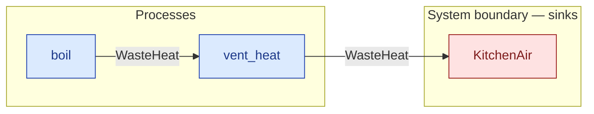

# `vent_heat` — process (R1)

> Generated by `tools/docgen.sh` from `model/cs1-pot-of-tea` — **do not hand-edit**; regenerate after any model change. Links are into the defining source lines; Mermaid nodes carry absolute click urls, the legend table the same links as plain markdown.

**Hands one quantity of waste heat to the kitchen-air sink — the only sanctioned route for waste heat out of a flow, and the process form of REQ-009 (SPEC.md P3's kettle losses go through it; P4's steeping losses are vented inside `pour_and_brew`).**

- **Crate / subsystem:** `cs1-pot-of-tea` — case study CS-1: making a pot of tea
- **Source:** [model/cs1-pot-of-tea/src/resources.rs#L774](/model/cs1-pot-of-tea/src/resources.rs#L774)
- **Requirements bound on the signature:** REQ-009

## Who and with what

No person in this signature: any time cost is drawn by an **adjacent** draw process in the flow (R15/F-048), or the step needs no actor.

## Inputs

| Parameter | Declared type | Resource kind | Unit | Magnitude |
|---|---|---|---|---|
| `sink` | consumer of WasteHeat (sink `KitchenAir`) | boundary object (R12) | — | — |
| `heat` | `WasteHeat<E_J>` | continuous (container, R15) | joules | `E_J` (caller-stated) |

Observed entering this step in the traced flows: `KitchenAir`, `WasteHeat 50000 joules`.

## Outputs

| Output | Resource kind | Unit | Magnitude | Routing (who takes it) |
|---|---|---|---|---|
| `C::Next` | — | — | — | the same boundary object, returned in its advanced state (R2/R12) |

Waste routed **inside** this process (never loose in a flow):

- `sink` is a consumer parameter: **WasteHeat** is handed to `KitchenAir` **inside this process** (Consumer/ConsumeList bound, R12) — [model/cs1-pot-of-tea/src/resources.rs#L379](/model/cs1-pot-of-tea/src/resources.rs#L379)

Observed leaving this step in the traced flows: `KitchenAir`.

## Requirements (R10 — the compliance matrix)

| Requirement | Statement | Defined at | Satisfied by | Verified by |
|---|---|---|---|---|
| REQ-009 | All waste heat must be accounted to the kitchen-air sink. | [model/cs1-pot-of-tea/src/requirements.rs#L67](/model/cs1-pot-of-tea/src/requirements.rs#L67) | `KitchenAir` | [`vent_heat_accounts_heat_to_the_kitchen_air`](/model/cs1-pot-of-tea/src/resources.rs#L923), [`pour_and_brew_balances_mass_and_energy`](/model/cs1-pot-of-tea/src/resources.rs#L967), [`flow_order_a_type_checks_and_accounts_for_everything`](/model/cs1-pot-of-tea/tests/flows.rs#L79), [`flow_order_b_type_checks_and_accounts_for_everything`](/model/cs1-pot-of-tea/tests/flows.rs#L143) |

This item is doc-tagged `Satisfies: REQ-009`.

## Where it fits (R9: needs / feeds)

The model states **connections, not sequences**: any order satisfying these dependencies is valid (R9).

**Needs:**

- **WasteHeat** from `boil` (process)

**Feeds:**

- **WasteHeat** to `KitchenAir` (boundary sink)

## Neighbourhood (one hop)

### Legend — node → source

| Node | Kind | Defined at |
|---|---|---|
| `n_boil` (boil) | process | [model/cs1-pot-of-tea/src/resources.rs#L661](/model/cs1-pot-of-tea/src/resources.rs#L661) |
| `n_vent_heat` (vent_heat) | process | [model/cs1-pot-of-tea/src/resources.rs#L774](/model/cs1-pot-of-tea/src/resources.rs#L774) |
| `n_KitchenAir` (KitchenAir) | boundary sink | [model/cs1-pot-of-tea/src/resources.rs#L379](/model/cs1-pot-of-tea/src/resources.rs#L379) |

## Open items (`Placeholder:` tags, R12)

- `KitchenAir` — kitchen air — assumed able to absorb all waste heat ([model/cs1-pot-of-tea/src/resources.rs#L379](/model/cs1-pot-of-tea/src/resources.rs#L379))
