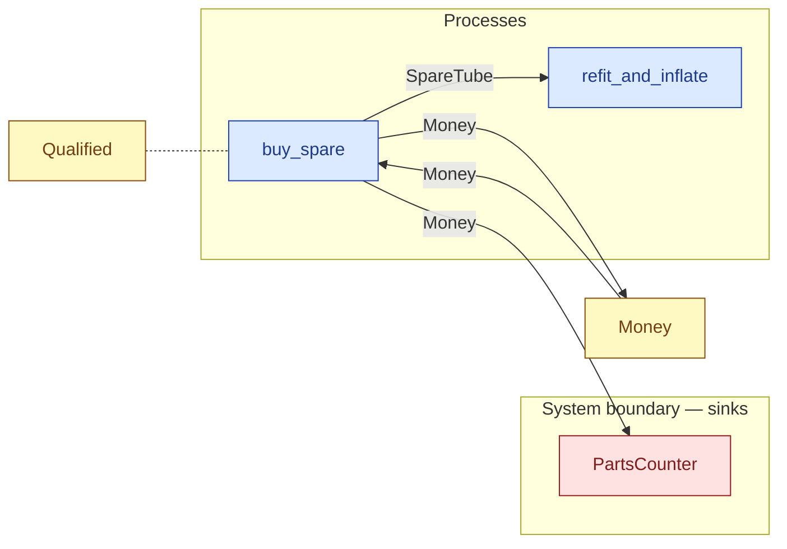

# `buy_spare` — process (R1)

> Generated by `tools/docgen.sh` from `model/cs2-puncture-repair` — **do not hand-edit**; regenerate after any model change. Links are into the defining source lines; Mermaid nodes carry absolute click urls, the legend table the same links as plain markdown.

**P5 — buys a spare tube at the parts counter (R19, SPEC.md P5; path 3 only).**

- **Crate / subsystem:** `cs2-puncture-repair` — case study CS-2: bicycle puncture repair
- **Source:** [model/cs2-puncture-repair/src/resources.rs#L994](/model/cs2-puncture-repair/src/resources.rs#L994)
- **Requirements bound on the signature:** REQ-014

## Who and with what

| Actor | Type | Budget at entry | This step's adjacent draw (F-048) |
|---|---|---|---|
| `member` | `Qualified` | `B` (caller-stated) | 120000 ms |

## Inputs

| Parameter | Declared type | Resource kind | Unit | Magnitude |
|---|---|---|---|---|
| `member` | `Qualified<Induction, B>` | reusable (model-core, R2/R15) | ms | `B` (caller-stated) |
| `counter` | consumer of Money (sink `PartsCounter`) | reusable (R2) | — | — |
| `cash` | `Money<TENDERED>` | continuous (container, R15) | pence | `TENDERED` (caller-stated) |

Observed entering this step in the traced flows: `Money 1000 pence`, `PartsCounter`, `Qualified 1140000 ms`.

## Outputs

| Output | Resource kind | Unit | Magnitude | Routing (who takes it) |
|---|---|---|---|---|
| `Qualified<Induction, B>` | reusable (model-core, R2/R15) | ms | `B` (caller-stated) | moved in and returned (R2) |
| `SpareTube` | discrete (consumable, R13) | — | — | `refit_and_inflate` (process) |
| `Money<CHANGE>` | continuous (container, R15) | pence | `CHANGE` (caller-stated) | `Money` (shared resource); `PartsCounter` (boundary sink) |
| `<<V as Consumer<Money<SPARE_TUBE_PRICE_PENCE>>>::Next as Supplier>::Next` | — | — | — | the same boundary object, returned in its advanced state (R2/R12) |

Waste routed **inside** this process (never loose in a flow):

- `counter` is a consumer parameter: **Money** is handed to `PartsCounter` **inside this process** (Consumer/ConsumeList bound, R12) — [model/cs2-puncture-repair/src/resources.rs#L482](/model/cs2-puncture-repair/src/resources.rs#L482)

Observed leaving this step in the traced flows: `Money 350 pence`, `PartsCounter`, `Qualified 1140000 ms`, `SpareTube`.

## Balances (R1/R3/R15)

- **Compile-time assert:** `TENDERED == SPARE_TUBE_PRICE_PENCE + CHANGE`
  - message: *money conservation violated in buy_spare (R1/R19): TENDERED must equal the listed price plus CHANGE - is the stated change wrong for the 650 p price?*
  - in numbers (observed instantiation): `1000 == SPARE_TUBE_PRICE_PENCE + 350` → 1000 = 1000 (holds)
  - fires at monomorphization (F-001): `cargo build`/`cargo test` catch a violation; `cargo check` and editor diagnostics do not.
- **Structural:** the const parameter `B` appears in an input and an output — the magnitude flows through unchanged, checked by the shared type parameter (no assert needed).
- **Inherited by composition:** this step calls [`split_money`](/model/cs2-puncture-repair/src/resources.rs#L749), whose conservation asserts fire at every instantiation here (F-001):
  - `A + B == IN`

## Requirements (R10 — the compliance matrix)

| Requirement | Statement | Defined at | Satisfied by | Verified by |
|---|---|---|---|---|
| REQ-014 | Spare tubes are sold only at the counter's listed price. | [model/cs2-puncture-repair/src/requirements.rs#L71](/model/cs2-puncture-repair/src/requirements.rs#L71) | `ListedPriceCounter` | [`buy_spare_splits_the_money_and_pays_the_listed_price`](/model/cs2-puncture-repair/src/resources.rs#L1189), [`path_3_spare_fitted_accounts_for_everything`](/model/cs2-puncture-repair/tests/flows.rs#L196), [`ordering_variant_path_3_ends_in_the_identical_state`](/model/cs2-puncture-repair/tests/flows.rs#L258) |

This item is doc-tagged `Satisfies: REQ-014`.

## Where it fits (R9: needs / feeds)

The model states **connections, not sequences**: any order satisfying these dependencies is valid (R9).

**Needs:**

- **Money** from `Money` (shared resource)
- `Qualified` (shared resource) — threaded through, returned (R2)

**Feeds:**

- **Money** to `Money` (shared resource)
- **Money** to `PartsCounter` (boundary sink)
- **SpareTube** to `refit_and_inflate` (process)

## Neighbourhood (one hop)

### Legend — node → source

| Node | Kind | Defined at |
|---|---|---|
| `n_buy_spare` (buy_spare) | process | [model/cs2-puncture-repair/src/resources.rs#L994](/model/cs2-puncture-repair/src/resources.rs#L994) |
| `n_refit_and_inflate` (refit_and_inflate) | process | [model/cs2-puncture-repair/src/resources.rs#L1033](/model/cs2-puncture-repair/src/resources.rs#L1033) |
| `n_Money` (Money) | shared resource | [model/cs2-puncture-repair/src/resources.rs#L334](/model/cs2-puncture-repair/src/resources.rs#L334) |
| `n_PartsCounter` (PartsCounter) | boundary sink | [model/cs2-puncture-repair/src/resources.rs#L482](/model/cs2-puncture-repair/src/resources.rs#L482) |
| `n_Qualified` (Qualified) | shared resource | — |

## Open items (`Placeholder:` tags, R12)

- `PartsCounter` — workshop stores — assumed never to run out of spare ([model/cs2-puncture-repair/src/resources.rs#L482](/model/cs2-puncture-repair/src/resources.rs#L482))
