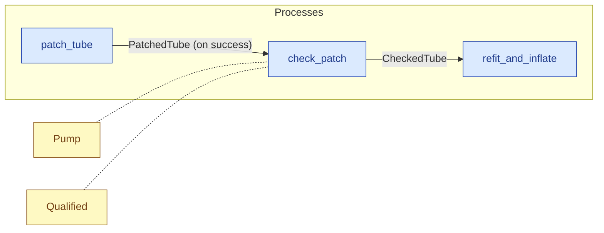

# `check_patch` — process (R1)

> Generated by `tools/docgen.sh` from `model/cs2-puncture-repair` — **do not hand-edit**; regenerate after any model change. Links are into the defining source lines; Mermaid nodes carry absolute click urls, the legend table the same links as plain markdown.

**P4 — checks the patch by inflating and watching it hold (SPEC.md P4): a state change, no mass change (`G` flows through structurally).**

- **Crate / subsystem:** `cs2-puncture-repair` — case study CS-2: bicycle puncture repair
- **Source:** [model/cs2-puncture-repair/src/resources.rs#L956](/model/cs2-puncture-repair/src/resources.rs#L956)

## Who and with what

| Actor | Type | Budget at entry | This step's adjacent draw (F-048) |
|---|---|---|---|
| `member` | `Qualified` | `B` (caller-stated) | 60000 ms |

Reusables threaded — moved in and returned (R2): `pump: Pump`.

## Inputs

| Parameter | Declared type | Resource kind | Unit | Magnitude |
|---|---|---|---|---|
| `member` | `Qualified<Induction, B>` | reusable (model-core, R2/R15) | ms | `B` (caller-stated) |
| `pump` | `Pump` | reusable (R2) | — | — |
| `tube` | `PatchedTube<G>` | continuous (container, R15) | grams | `G` (caller-stated) |

Observed entering this step in the traced flows: `PatchedTube 183 grams`, `Pump`, `Qualified 1140000 ms`, `Qualified 1260000 ms`.

## Outputs

| Output | Resource kind | Unit | Magnitude | Routing (who takes it) |
|---|---|---|---|---|
| `Qualified<Induction, B>` | reusable (model-core, R2/R15) | ms | `B` (caller-stated) | moved in and returned (R2) |
| `Pump` | reusable (R2) | — | — | moved in and returned (R2) |
| `CheckedTube<G>` | continuous (container, R15) | grams | `G` (caller-stated) | `refit_and_inflate` (process) |

Observed leaving this step in the traced flows: `CheckedTube`, `Pump`, `Qualified 1140000 ms`, `Qualified 1260000 ms`.

## Balances (R1/R3/R15)

- **Structural:** the const parameter `G` appears in an input and an output — the magnitude flows through unchanged, checked by the shared type parameter (no assert needed).
- **Structural:** the const parameter `B` appears in an input and an output — the magnitude flows through unchanged, checked by the shared type parameter (no assert needed).

## Where it fits (R9: needs / feeds)

The model states **connections, not sequences**: any order satisfying these dependencies is valid (R9).

**Needs:**

- **PatchedTube (on success)** from `patch_tube` (process)
- `Pump` (shared resource) — threaded through, returned (R2)
- `Qualified` (shared resource) — threaded through, returned (R2)

**Feeds:**

- **CheckedTube** to `refit_and_inflate` (process)

## Neighbourhood (one hop)

### Legend — node → source

| Node | Kind | Defined at |
|---|---|---|
| `n_patch_tube` (patch_tube) | process | [model/cs2-puncture-repair/src/resources.rs#L906](/model/cs2-puncture-repair/src/resources.rs#L906) |
| `n_check_patch` (check_patch) | process | [model/cs2-puncture-repair/src/resources.rs#L956](/model/cs2-puncture-repair/src/resources.rs#L956) |
| `n_refit_and_inflate` (refit_and_inflate) | process | [model/cs2-puncture-repair/src/resources.rs#L1033](/model/cs2-puncture-repair/src/resources.rs#L1033) |
| `n_Pump` (Pump) | shared resource | [model/cs2-puncture-repair/src/resources.rs#L386](/model/cs2-puncture-repair/src/resources.rs#L386) |
| `n_Qualified` (Qualified) | shared resource | — |

## Open items (`Placeholder:` tags, R12)

- `Pump` — bay setup at flow start — one pump. ([model/cs2-puncture-repair/src/resources.rs#L386](/model/cs2-puncture-repair/src/resources.rs#L386))
