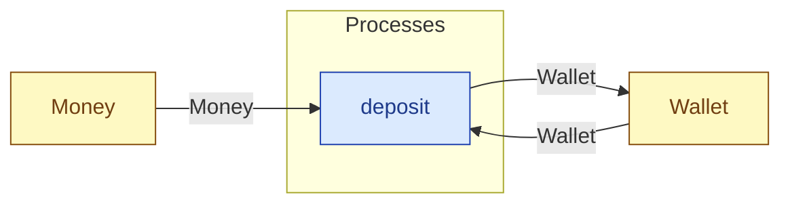

# `deposit` — process (R1)

> Generated by `tools/docgen.sh` from `model/cs2-puncture-repair` — **do not hand-edit**; regenerate after any model change. Links are into the defining source lines; Mermaid nodes carry absolute click urls, the legend table the same links as plain markdown.

**Puts cash back into the wallet (R3 combine, caller-stated total, F-022): `Wallet<BALANCE>` + `Money<ADD>` → `Wallet<NEW>` with `BALANCE + ADD == NEW` checked at compile time.**

- **Crate / subsystem:** `cs2-puncture-repair` — case study CS-2: bicycle puncture repair
- **Source:** [model/cs2-puncture-repair/src/resources.rs#L730](/model/cs2-puncture-repair/src/resources.rs#L730)

## Who and with what

No person in this signature: any time cost is drawn by an **adjacent** draw process in the flow (R15/F-048), or the step needs no actor.

## Inputs

| Parameter | Declared type | Resource kind | Unit | Magnitude |
|---|---|---|---|---|
| `wallet` | `Wallet<BALANCE>` | continuous (container, R15) | pence remaining | `BALANCE` (caller-stated) |
| `cash` | `Money<ADD>` | continuous (container, R15) | pence | `ADD` (caller-stated) |

Observed entering this step in the traced flows: `Money 1000 pence`, `Money 350 pence`, `Wallet 0 pence`, `Wallet 1000 pence`.

## Outputs

| Output | Resource kind | Unit | Magnitude | Routing (who takes it) |
|---|---|---|---|---|
| `Wallet<NEW>` | continuous (container, R15) | pence remaining | `NEW` (caller-stated) | `Wallet` (shared resource) |

Observed leaving this step in the traced flows: `Wallet 1000 pence`, `Wallet 350 pence`.

## Balances (R1/R3/R15)

- **Compile-time assert:** `BALANCE + ADD == NEW`
  - message: *money conservation violated in deposit (R3/R19): BALANCE + ADD must equal NEW - is the stated new balance wrong?*
  - in numbers (observed instantiation): `0 + 1000 == 1000` → 1000 = 1000 (holds)
  - in numbers (observed instantiation): `0 + 350 == 350` → 350 = 350 (holds)
  - fires at monomorphization (F-001): `cargo build`/`cargo test` catch a violation; `cargo check` and editor diagnostics do not.

## Where it fits (R9: needs / feeds)

The model states **connections, not sequences**: any order satisfying these dependencies is valid (R9).

**Needs:**

- **Money** from `Money` (shared resource)
- **Wallet** from `Wallet` (shared resource)

**Feeds:**

- **Wallet** to `Wallet` (shared resource)

## Neighbourhood (one hop)

### Legend — node → source

| Node | Kind | Defined at |
|---|---|---|
| `n_deposit` (deposit) | process | [model/cs2-puncture-repair/src/resources.rs#L730](/model/cs2-puncture-repair/src/resources.rs#L730) |
| `n_Money` (Money) | shared resource | [model/cs2-puncture-repair/src/resources.rs#L334](/model/cs2-puncture-repair/src/resources.rs#L334) |
| `n_Wallet` (Wallet) | shared resource | [model/cs2-puncture-repair/src/resources.rs#L344](/model/cs2-puncture-repair/src/resources.rs#L344) |
