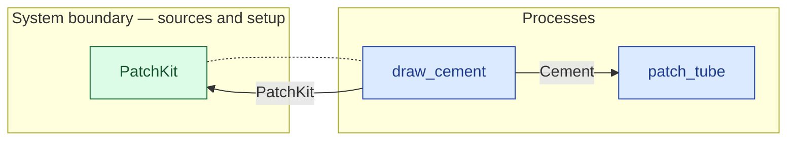

# `draw_cement` — process (R1)

> Generated by `tools/docgen.sh` from `model/cs2-puncture-repair` — **do not hand-edit**; regenerate after any model change. Links are into the defining source lines; Mermaid nodes carry absolute click urls, the legend table the same links as plain markdown.

**Draws `TAKE` grams of cement from the kit's cement tube holding `FULL`, leaving `LEFT` (R15 caller-stated remainder, F-022/F-030) — the kit's **continuous** boundary, beside its discrete `Supplier` side (the nested container, SPEC.md §3).**

- **Crate / subsystem:** `cs2-puncture-repair` — case study CS-2: bicycle puncture repair
- **Source:** [model/cs2-puncture-repair/src/resources.rs#L782](/model/cs2-puncture-repair/src/resources.rs#L782)

## Who and with what

No person in this signature: any time cost is drawn by an **adjacent** draw process in the flow (R15/F-048), or the step needs no actor.

Boundary objects used:

- `kit`: `PatchKit` (boundary object (R12)), threaded by value (R2) — [model/cs2-puncture-repair/src/resources.rs#L275](/model/cs2-puncture-repair/src/resources.rs#L275)

## Inputs

| Parameter | Declared type | Resource kind | Unit | Magnitude |
|---|---|---|---|---|
| `kit` | `PatchKit<Patches, FULL>` | boundary object (R12) | — | `FULL` (caller-stated) |

Observed entering this step in the traced flows: `FreshPatchKit`, `PatchKit 29`.

## Outputs

| Output | Resource kind | Unit | Magnitude | Routing (who takes it) |
|---|---|---|---|---|
| `Cement<TAKE>` | continuous (container, R15) | grams | `TAKE` (caller-stated) | `patch_tube` (process) |
| `PatchKit<Patches, LEFT>` | boundary object (R12) | — | `LEFT` (caller-stated) | `PatchKit` (boundary source) |

Observed leaving this step in the traced flows: `Cement 1 grams`, `PatchKit 28`, `PatchKit 29`.

## Balances (R1/R3/R15)

- **Compile-time assert:** `TAKE + LEFT == FULL`
  - message: *cement conservation violated in draw_cement (R15): TAKE + LEFT must equal FULL - is the draw larger than the kit's remaining cement?*
  - in numbers (observed instantiation): `1 + 28 == 29` → 29 = 29 (holds)
  - in numbers (observed instantiation): `1 + 29 == 30` → 30 = 30 (holds)
  - fires at monomorphization (F-001): `cargo build`/`cargo test` catch a violation; `cargo check` and editor diagnostics do not.

## Where it fits (R9: needs / feeds)

The model states **connections, not sequences**: any order satisfying these dependencies is valid (R9).

**Needs:**

- `PatchKit` (boundary source) — threaded through, returned (R2)

**Feeds:**

- **Cement** to `patch_tube` (process)
- **PatchKit** to `PatchKit` (boundary source)

## Neighbourhood (one hop)

### Legend — node → source

| Node | Kind | Defined at |
|---|---|---|
| `n_draw_cement` (draw_cement) | process | [model/cs2-puncture-repair/src/resources.rs#L782](/model/cs2-puncture-repair/src/resources.rs#L782) |
| `n_patch_tube` (patch_tube) | process | [model/cs2-puncture-repair/src/resources.rs#L906](/model/cs2-puncture-repair/src/resources.rs#L906) |
| `n_PatchKit` (PatchKit) | boundary source | [model/cs2-puncture-repair/src/resources.rs#L275](/model/cs2-puncture-repair/src/resources.rs#L275) |

## Open items (`Placeholder:` tags, R12)

- `PatchKit` — patch kit — brand/vendor not modelled (SPEC.md §4). ([model/cs2-puncture-repair/src/resources.rs#L275](/model/cs2-puncture-repair/src/resources.rs#L275))
