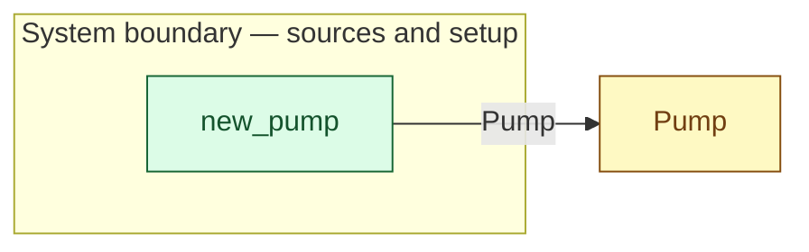

# `new_pump` — boundary function (R12)

> Generated by `tools/docgen.sh` from `model/cs2-puncture-repair` — **do not hand-edit**; regenerate after any model change. Links are into the defining source lines; Mermaid nodes carry absolute click urls, the legend table the same links as plain markdown.

**The pump enters the model (R12).**

- **Crate / subsystem:** `cs2-puncture-repair` — case study CS-2: bicycle puncture repair
- **Source:** [model/cs2-puncture-repair/src/resources.rs#L629](/model/cs2-puncture-repair/src/resources.rs#L629)
- **Placeholder:** bay setup at flow start — one pump.

## Who and with what

No person in this signature: any time cost is drawn by an **adjacent** draw process in the flow (R15/F-048), or the step needs no actor.

## Inputs

| Parameter | Declared type | Resource kind | Unit | Magnitude |
|---|---|---|---|---|

## Outputs

| Output | Resource kind | Unit | Magnitude | Routing (who takes it) |
|---|---|---|---|---|
| `Pump` | reusable (R2) | — | — | `Pump` (shared resource) |

## Where it fits (R9: needs / feeds)

The model states **connections, not sequences**: any order satisfying these dependencies is valid (R9).

**Feeds:**

- **Pump** to `Pump` (shared resource)

## Neighbourhood (one hop)

### Legend — node → source

| Node | Kind | Defined at |
|---|---|---|
| `n_Pump` (Pump) | shared resource | [model/cs2-puncture-repair/src/resources.rs#L386](/model/cs2-puncture-repair/src/resources.rs#L386) |
| `n_new_pump` (new_pump) | boundary source | [model/cs2-puncture-repair/src/resources.rs#L629](/model/cs2-puncture-repair/src/resources.rs#L629) |

## Open items (`Placeholder:` tags, R12)

- this function is itself a placeholder (see the header above)
- `Pump` — bay setup at flow start — one pump. ([model/cs2-puncture-repair/src/resources.rs#L386](/model/cs2-puncture-repair/src/resources.rs#L386))
