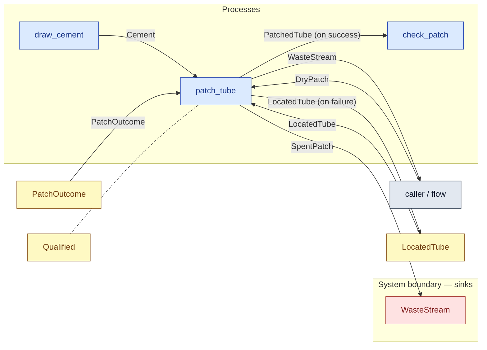

# `patch_tube` — process (R1)

> Generated by `tools/docgen.sh` from `model/cs2-puncture-repair` — **do not hand-edit**; regenerate after any model change. Links are into the defining source lines; Mermaid nodes carry absolute click urls, the legend table the same links as plain markdown.

**P3 — patches the tube: **fallible** (R17, SPEC.md P3).**

- **Crate / subsystem:** `cs2-puncture-repair` — case study CS-2: bicycle puncture repair
- **Source:** [model/cs2-puncture-repair/src/resources.rs#L906](/model/cs2-puncture-repair/src/resources.rs#L906)
- **Requirements bound on the signature:** REQ-011, REQ-013

## Who and with what

| Actor | Type | Budget at entry | This step's adjacent draw (F-048) |
|---|---|---|---|
| `member` | `Qualified` | `B` (caller-stated) | 120000 ms |

## Inputs

| Parameter | Declared type | Resource kind | Unit | Magnitude |
|---|---|---|---|---|
| `member` | `Qualified<Induction, B>` | reusable (model-core, R2/R15) | ms | `B` (caller-stated) |
| `tube` | `T` → `LocatedTube` (via the requirement bound) | discrete (consumable, R13) | — | — |
| `patch` | `DryPatch` | discrete (consumable, R13) | — | — |
| `cement` | `Cement<CEMENT_G>` | continuous (container, R15) | grams | `CEMENT_G` (caller-stated) |
| `outcome` | `PatchOutcome` | outcome token (R17) | — | — |
| `waste` | consumer of SpentPatch (sink `WasteStream`) | boundary object (R12) | — | — |

Observed entering this step in the traced flows: `Cement 1 grams`, `LocatedTube`, `PatchOutcome`, `Qualified 1140000 ms`, `Qualified 1260000 ms`, `W as Consumer SpentPatch 3 ::Next`, `WasteStream`, `item`, `tube`.

## Outputs

| Output | Resource kind | Unit | Magnitude | Routing (who takes it) |
|---|---|---|---|---|
| `PatchOk` (on success) | outcome bundle (R17 grouping, F-046) | — | — | destructured by the handling arm |
| `PatchOk.member: Qualified` (on success) | reusable (model-core, R2/R15) | ms | `B` (caller-stated) | returned in the bundle |
| `PatchOk.tube: PatchedTube` (on success) | continuous (container, R15) | grams | `PATCHED_G` (caller-stated) | `check_patch` (process) |
| `PatchOk.waste: W` (on success) | — | — | — | returned in the bundle |
| `PatchFail` (on failure) | outcome bundle (R17 grouping, F-046) | — | — | destructured by the handling arm |
| `PatchFail.member: Qualified` (on failure) | reusable (model-core, R2/R15) | ms | `B` (caller-stated) | returned in the bundle |
| `PatchFail.tube: T` (on failure) | — | — | — | returned in the bundle |
| `PatchFail.waste: W` (on failure) | — | — | — | returned in the bundle |

Waste routed **inside** this process (never loose in a flow):

- `waste` is a consumer parameter: **SpentPatch** is handed to `WasteStream` **inside this process** (Consumer/ConsumeList bound, R12) — [model/cs2-puncture-repair/src/resources.rs#L535](/model/cs2-puncture-repair/src/resources.rs#L535)

Observed leaving this step in the traced flows: `LocatedTube`, `PatchedTube 183 grams`, `Qualified 1140000 ms`, `Qualified 1260000 ms`, `W as Consumer SpentPatch 3 ::Next`, `tube`, `waste`.

## Balances (R1/R3/R15)

- **Compile-time assert:** `T::MASS_G + DryPatch::MASS_G + CEMENT_G == PATCHED_G`
  - message: *success-branch mass conservation violated in patch_tube (R3, R17): the patched tube must sum the tube*
  - fires at monomorphization (F-001): `cargo build`/`cargo test` catch a violation; `cargo check` and editor diagnostics do not.
- **Compile-time assert:** `T::MASS_G + DryPatch::MASS_G + CEMENT_G == T::MASS_G + SPENT_G`
  - message: *failure-branch mass conservation violated in patch_tube (R3, R17): the returned tube plus the spent patch must sum the tube*
  - fires at monomorphization (F-001): `cargo build`/`cargo test` catch a violation; `cargo check` and editor diagnostics do not.
- **Structural:** the const parameter `B` appears in an input and an output — the magnitude flows through unchanged, checked by the shared type parameter (no assert needed).

## Requirements (R10 — the compliance matrix)

| Requirement | Statement | Defined at | Satisfied by | Verified by |
|---|---|---|---|---|
| REQ-011 | Only a located puncture may be patched (no blind patching). | [model/cs2-puncture-repair/src/requirements.rs#L50](/model/cs2-puncture-repair/src/requirements.rs#L50) | `TubeReadyToPatch` | [`patch_tube_success_arm_balances`](/model/cs2-puncture-repair/src/resources.rs#L1116), [`patch_tube_failure_arm_feeds_the_waste_stream_inside`](/model/cs2-puncture-repair/src/resources.rs#L1148), [`path_1_patched_first_try_accounts_for_everything`](/model/cs2-puncture-repair/tests/flows.rs#L70), [`path_2_patched_on_retry_accounts_for_everything`](/model/cs2-puncture-repair/tests/flows.rs#L135), [`path_3_spare_fitted_accounts_for_everything`](/model/cs2-puncture-repair/tests/flows.rs#L196), [`ordering_variant_path_3_ends_in_the_identical_state`](/model/cs2-puncture-repair/tests/flows.rs#L258), [`ordering_variant_path_1_redeposits_the_unspent_cash`](/model/cs2-puncture-repair/tests/flows.rs#L310) |
| REQ-013 | All failed patches must reach the workshop waste stream. | [model/cs2-puncture-repair/src/requirements.rs#L64](/model/cs2-puncture-repair/src/requirements.rs#L64) | `WasteStream` | [`patch_tube_failure_arm_feeds_the_waste_stream_inside`](/model/cs2-puncture-repair/src/resources.rs#L1148), [`path_2_patched_on_retry_accounts_for_everything`](/model/cs2-puncture-repair/tests/flows.rs#L135), [`path_3_spare_fitted_accounts_for_everything`](/model/cs2-puncture-repair/tests/flows.rs#L196), [`ordering_variant_path_3_ends_in_the_identical_state`](/model/cs2-puncture-repair/tests/flows.rs#L258) |

This item is doc-tagged `Satisfies: REQ-011, REQ-013`.

## Where it fits (R9: needs / feeds)

The model states **connections, not sequences**: any order satisfying these dependencies is valid (R9).

**Needs:**

- **Cement** from `draw_cement` (process)
- **DryPatch** from `caller / flow` (flow input/output)
- **LocatedTube** from `LocatedTube` (shared resource)
- **PatchOutcome** from `PatchOutcome` (shared resource)
- `Qualified` (shared resource) — threaded through, returned (R2)

**Feeds:**

- **LocatedTube (on failure)** to `LocatedTube` (shared resource)
- **PatchedTube (on success)** to `check_patch` (process)
- **SpentPatch** to `WasteStream` (boundary sink)
- **WasteStream** to `caller / flow` (flow input/output)

## Neighbourhood (one hop)

### Legend — node → source

| Node | Kind | Defined at |
|---|---|---|
| `n_draw_cement` (draw_cement) | process | [model/cs2-puncture-repair/src/resources.rs#L782](/model/cs2-puncture-repair/src/resources.rs#L782) |
| `n_patch_tube` (patch_tube) | process | [model/cs2-puncture-repair/src/resources.rs#L906](/model/cs2-puncture-repair/src/resources.rs#L906) |
| `n_check_patch` (check_patch) | process | [model/cs2-puncture-repair/src/resources.rs#L956](/model/cs2-puncture-repair/src/resources.rs#L956) |
| `n_caller` (caller / flow) | flow input/output | — |
| `n_LocatedTube` (LocatedTube) | shared resource | [model/cs2-puncture-repair/src/resources.rs#L112](/model/cs2-puncture-repair/src/resources.rs#L112) |
| `n_PatchOutcome` (PatchOutcome) | shared resource | [model/cs2-puncture-repair/src/resources.rs#L416](/model/cs2-puncture-repair/src/resources.rs#L416) |
| `n_WasteStream` (WasteStream) | boundary sink | [model/cs2-puncture-repair/src/resources.rs#L535](/model/cs2-puncture-repair/src/resources.rs#L535) |
| `n_Qualified` (Qualified) | shared resource | — |

## Open items (`Placeholder:` tags, R12)

- `WasteStream` — workshop waste stream — assumed able to take any number of ([model/cs2-puncture-repair/src/resources.rs#L535](/model/cs2-puncture-repair/src/resources.rs#L535))
