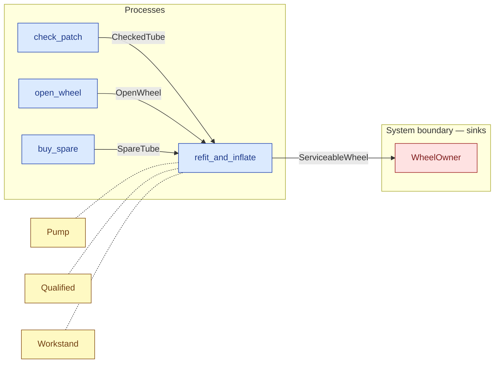

# `refit_and_inflate` — process (R1)

> Generated by `tools/docgen.sh` from `model/cs2-puncture-repair` — **do not hand-edit**; regenerate after any model change. Links are into the defining source lines; Mermaid nodes carry absolute click urls, the legend table the same links as plain markdown.

**P6 — refits an airtight tube and inflates (SPEC.md P6).**

- **Crate / subsystem:** `cs2-puncture-repair` — case study CS-2: bicycle puncture repair
- **Source:** [model/cs2-puncture-repair/src/resources.rs#L1033](/model/cs2-puncture-repair/src/resources.rs#L1033)
- **Requirements bound on the signature:** REQ-010, REQ-012

## Who and with what

| Actor | Type | Budget at entry | This step's adjacent draw (F-048) |
|---|---|---|---|
| `member` | `Qualified` | — | 300000 ms |

Reusables threaded — moved in and returned (R2): `workstand: Workstand`, `pump: Pump`.

## Inputs

| Parameter | Declared type | Resource kind | Unit | Magnitude |
|---|---|---|---|---|
| `member` | `O` → `Qualified` (via the requirement bound) | reusable (model-core, R2/R15) | ms | — |
| `workstand` | `Workstand` | reusable (R2) | — | — |
| `pump` | `Pump` | reusable (R2) | — | — |
| `wheel` | `OpenWheel` | discrete (consumable, R13) | — | — |
| `tube` | `T` → any of `CheckedTube`, `SpareTube` | continuous (container, R15) | grams | — |

Observed entering this step in the traced flows: `CheckedTube`, `OpenWheel`, `Pump`, `Qualified 1020000 ms`, `Qualified 1080000 ms`, `Qualified 1200000 ms`, `SpareTube`, `Workstand`.

## Outputs

| Output | Resource kind | Unit | Magnitude | Routing (who takes it) |
|---|---|---|---|---|
| `O` | — | — | — | moved in and returned (R2) |
| `Workstand` | reusable (R2) | — | — | moved in and returned (R2) |
| `Pump` | reusable (R2) | — | — | moved in and returned (R2) |
| `ServiceableWheel<WHEEL_G>` | continuous (container, R15) | grams | `WHEEL_G` (caller-stated) | `WheelOwner` (boundary sink) |

Observed leaving this step in the traced flows: `Pump`, `Qualified 1020000 ms`, `Qualified 1080000 ms`, `Qualified 1200000 ms`, `ServiceableWheel 2080 grams`, `ServiceableWheel 2083 grams`, `Workstand`.

## Balances (R1/R3/R15)

- **Compile-time assert:** `OpenWheel::MASS_G + T::MASS_G == WHEEL_G`
  - message: *mass conservation violated in refit_and_inflate (R3): the rim + tyre plus the airtight tube must sum exactly to the stated serviceable-wheel mass*
  - fires at monomorphization (F-001): `cargo build`/`cargo test` catch a violation; `cargo check` and editor diagnostics do not.

## Requirements (R10 — the compliance matrix)

| Requirement | Statement | Defined at | Satisfied by | Verified by |
|---|---|---|---|---|
| REQ-010 | Workshop tools (the workstand) may be used only by an inducted member. | [model/cs2-puncture-repair/src/requirements.rs#L43](/model/cs2-puncture-repair/src/requirements.rs#L43) | `WorkshopMember` | [`open_wheel_splits_the_wheel_exactly`](/model/cs2-puncture-repair/src/resources.rs#L1082), [`refit_with_the_checked_patched_tube_gives_a_2083_g_wheel`](/model/cs2-puncture-repair/src/resources.rs#L1220), [`path_1_patched_first_try_accounts_for_everything`](/model/cs2-puncture-repair/tests/flows.rs#L70), [`path_2_patched_on_retry_accounts_for_everything`](/model/cs2-puncture-repair/tests/flows.rs#L135), [`path_3_spare_fitted_accounts_for_everything`](/model/cs2-puncture-repair/tests/flows.rs#L196), [`ordering_variant_path_3_ends_in_the_identical_state`](/model/cs2-puncture-repair/tests/flows.rs#L258), [`ordering_variant_path_1_redeposits_the_unspent_cash`](/model/cs2-puncture-repair/tests/flows.rs#L310), [`fixtures_construct_sealed_resources_for_downstream_tests`](/model/cs2-puncture-repair/tests/flows.rs#L358) |
| REQ-012 | A wheel may be refitted only with an airtight tube - one that is patched and checked, or new. | [model/cs2-puncture-repair/src/requirements.rs#L57](/model/cs2-puncture-repair/src/requirements.rs#L57) | `AirtightPatchedTube`, `AirtightSpareTube` | [`refit_with_the_checked_patched_tube_gives_a_2083_g_wheel`](/model/cs2-puncture-repair/src/resources.rs#L1220), [`refit_with_the_new_spare_gives_a_2080_g_wheel`](/model/cs2-puncture-repair/src/resources.rs#L1241), [`path_1_patched_first_try_accounts_for_everything`](/model/cs2-puncture-repair/tests/flows.rs#L70), [`path_2_patched_on_retry_accounts_for_everything`](/model/cs2-puncture-repair/tests/flows.rs#L135), [`path_3_spare_fitted_accounts_for_everything`](/model/cs2-puncture-repair/tests/flows.rs#L196), [`ordering_variant_path_3_ends_in_the_identical_state`](/model/cs2-puncture-repair/tests/flows.rs#L258), [`ordering_variant_path_1_redeposits_the_unspent_cash`](/model/cs2-puncture-repair/tests/flows.rs#L310), [`fixtures_construct_sealed_resources_for_downstream_tests`](/model/cs2-puncture-repair/tests/flows.rs#L358), [`abandoned_spare_tube_trips_the_tripwire_downstream`](/model/cs2-puncture-repair/tests/flows.rs#L382) |

This item is doc-tagged `Satisfies: REQ-010, REQ-012`.

## Where it fits (R9: needs / feeds)

The model states **connections, not sequences**: any order satisfying these dependencies is valid (R9).

**Needs:**

- **CheckedTube** from `check_patch` (process)
- **OpenWheel** from `open_wheel` (process)
- **SpareTube** from `buy_spare` (process)
- `Pump` (shared resource) — threaded through, returned (R2)
- `Qualified` (shared resource) — threaded through, returned (R2)
- `Workstand` (shared resource) — threaded through, returned (R2)

**Feeds:**

- **ServiceableWheel** to `WheelOwner` (boundary sink)

## Neighbourhood (one hop)

### Legend — node → source

| Node | Kind | Defined at |
|---|---|---|
| `n_open_wheel` (open_wheel) | process | [model/cs2-puncture-repair/src/resources.rs#L817](/model/cs2-puncture-repair/src/resources.rs#L817) |
| `n_check_patch` (check_patch) | process | [model/cs2-puncture-repair/src/resources.rs#L956](/model/cs2-puncture-repair/src/resources.rs#L956) |
| `n_buy_spare` (buy_spare) | process | [model/cs2-puncture-repair/src/resources.rs#L994](/model/cs2-puncture-repair/src/resources.rs#L994) |
| `n_refit_and_inflate` (refit_and_inflate) | process | [model/cs2-puncture-repair/src/resources.rs#L1033](/model/cs2-puncture-repair/src/resources.rs#L1033) |
| `n_Pump` (Pump) | shared resource | [model/cs2-puncture-repair/src/resources.rs#L386](/model/cs2-puncture-repair/src/resources.rs#L386) |
| `n_WheelOwner` (WheelOwner) | boundary sink | [model/cs2-puncture-repair/src/resources.rs#L581](/model/cs2-puncture-repair/src/resources.rs#L581) |
| `n_Workstand` (Workstand) | shared resource | [model/cs2-puncture-repair/src/resources.rs#L376](/model/cs2-puncture-repair/src/resources.rs#L376) |
| `n_Qualified` (Qualified) | shared resource | — |

## Open items (`Placeholder:` tags, R12)

- `Pump` — bay setup at flow start — one pump. ([model/cs2-puncture-repair/src/resources.rs#L386](/model/cs2-puncture-repair/src/resources.rs#L386))
- `Workstand` — bay setup at flow start — one workstand. ([model/cs2-puncture-repair/src/resources.rs#L376](/model/cs2-puncture-repair/src/resources.rs#L376))
