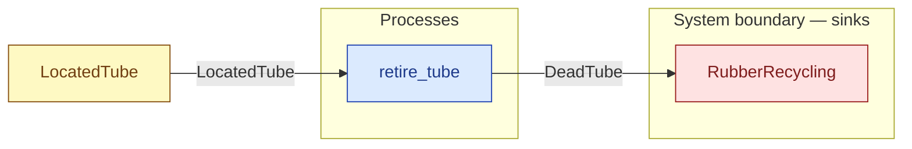

# `retire_tube` — process (R1)

> Generated by `tools/docgen.sh` from `model/cs2-puncture-repair` — **do not hand-edit**; regenerate after any model change. Links are into the defining source lines; Mermaid nodes carry absolute click urls, the legend table the same links as plain markdown.

**Gives up on the twice-failed tube (SPEC.md §3's "dead" state; path 3 only): a conserving state change (R9), no mass change (180 = 180, structural — both states carry the same fixed mass).**

- **Crate / subsystem:** `cs2-puncture-repair` — case study CS-2: bicycle puncture repair
- **Source:** [model/cs2-puncture-repair/src/resources.rs#L1015](/model/cs2-puncture-repair/src/resources.rs#L1015)

## Who and with what

No person in this signature: any time cost is drawn by an **adjacent** draw process in the flow (R15/F-048), or the step needs no actor.

## Inputs

| Parameter | Declared type | Resource kind | Unit | Magnitude |
|---|---|---|---|---|
| `tube` | `LocatedTube` | discrete (consumable, R13) | — | — |

Observed entering this step in the traced flows: `LocatedTube`.

## Outputs

| Output | Resource kind | Unit | Magnitude | Routing (who takes it) |
|---|---|---|---|---|
| `DeadTube` | discrete (consumable, R13) | — | — | `RubberRecycling` (boundary sink) |

Observed leaving this step in the traced flows: `DeadTube`.

## Where it fits (R9: needs / feeds)

The model states **connections, not sequences**: any order satisfying these dependencies is valid (R9).

**Needs:**

- **LocatedTube** from `LocatedTube` (shared resource)

**Feeds:**

- **DeadTube** to `RubberRecycling` (boundary sink)

## Neighbourhood (one hop)

### Legend — node → source

| Node | Kind | Defined at |
|---|---|---|
| `n_retire_tube` (retire_tube) | process | [model/cs2-puncture-repair/src/resources.rs#L1015](/model/cs2-puncture-repair/src/resources.rs#L1015) |
| `n_RubberRecycling` (RubberRecycling) | boundary sink | [model/cs2-puncture-repair/src/resources.rs#L561](/model/cs2-puncture-repair/src/resources.rs#L561) |
| `n_LocatedTube` (LocatedTube) | shared resource | [model/cs2-puncture-repair/src/resources.rs#L112](/model/cs2-puncture-repair/src/resources.rs#L112) |
