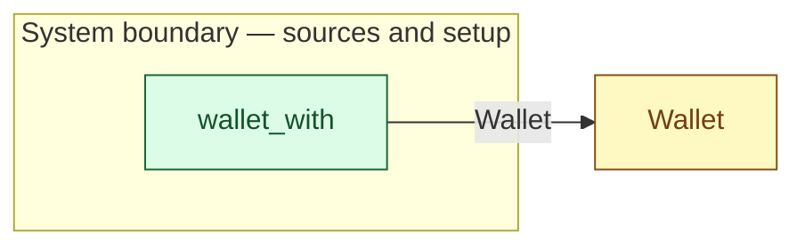

# `wallet_with` — boundary function (R12)

> Generated by `tools/docgen.sh` from `model/cs2-puncture-repair` — **do not hand-edit**; regenerate after any model change. Links are into the defining source lines; Mermaid nodes carry absolute click urls, the legend table the same links as plain markdown.

**The member's wallet enters the model holding `PENCE` pence (R12, R19; SPEC.md §3: 1000 p — the member arrives with cash already in hand, SPEC.md §7).**

- **Crate / subsystem:** `cs2-puncture-repair` — case study CS-2: bicycle puncture repair
- **Source:** [model/cs2-puncture-repair/src/resources.rs#L650](/model/cs2-puncture-repair/src/resources.rs#L650)
- **Placeholder:** the member's wallet.

## Who and with what

No person in this signature: any time cost is drawn by an **adjacent** draw process in the flow (R15/F-048), or the step needs no actor.

## Inputs

| Parameter | Declared type | Resource kind | Unit | Magnitude |
|---|---|---|---|---|

## Outputs

| Output | Resource kind | Unit | Magnitude | Routing (who takes it) |
|---|---|---|---|---|
| `Wallet<PENCE>` | continuous (container, R15) | pence remaining | `PENCE` (caller-stated) | `Wallet` (shared resource) |

## Where it fits (R9: needs / feeds)

The model states **connections, not sequences**: any order satisfying these dependencies is valid (R9).

**Feeds:**

- **Wallet** to `Wallet` (shared resource)

## Neighbourhood (one hop)

### Legend — node → source

| Node | Kind | Defined at |
|---|---|---|
| `n_Wallet` (Wallet) | shared resource | [model/cs2-puncture-repair/src/resources.rs#L344](/model/cs2-puncture-repair/src/resources.rs#L344) |
| `n_wallet_with` (wallet_with) | boundary source | [model/cs2-puncture-repair/src/resources.rs#L650](/model/cs2-puncture-repair/src/resources.rs#L650) |

## Open items (`Placeholder:` tags, R12)

- this function is itself a placeholder (see the header above)
