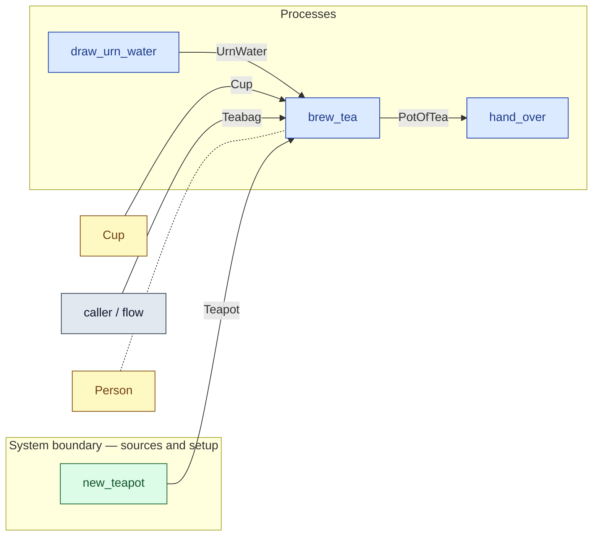

# `brew_tea` — process (R1)

> Generated by `tools/docgen.sh` from `model/cs3-cafe-orders` — **do not hand-edit**; regenerate after any model change. Links are into the defining source lines; Mermaid nodes carry absolute click urls, the legend table the same links as plain markdown.

**P5 — brews the pot of tea (SPEC.md P5): the urn water and the teabag become the 303 g pot, with the teapot and the service cup held inside the service (R12).**

- **Crate / subsystem:** `cs3-cafe-orders` — case study CS-3: café order fulfilment
- **Source:** [model/cs3-cafe-orders/src/resources.rs#L1198](/model/cs3-cafe-orders/src/resources.rs#L1198)

## Who and with what

| Actor | Type | Budget at entry | This step's adjacent draw (F-048) |
|---|---|---|---|
| `server` | `Person` | `B` (caller-stated) | 120000 ms |

## Inputs

| Parameter | Declared type | Resource kind | Unit | Magnitude |
|---|---|---|---|---|
| `server` | `Person<B>` | reusable (model-core, R2/R15) | ms | `B` (caller-stated) |
| `water` | `UrnWater<WATER>` | continuous (container, R15) | grams | `WATER` (caller-stated) |
| `teabag` | `Teabag` | discrete (consumable, R13) | — | — |
| `teapot` | `Teapot` | discrete (consumable, R13) | — | — |
| `cup` | `Cup` | discrete (consumable, R13) | — | — |

Observed entering this step in the traced flows: `Cup`, `Person 540000 ms`, `Teapot`, `UrnWater 300 grams`, `item`.

## Outputs

| Output | Resource kind | Unit | Magnitude | Routing (who takes it) |
|---|---|---|---|---|
| `Person<B>` | reusable (model-core, R2/R15) | ms | `B` (caller-stated) | moved in and returned (R2) |
| `PotOfTea<OUT>` | discrete (consumable, R13) | — | `OUT` (caller-stated) | `hand_over` (process) |

Observed leaving this step in the traced flows: `Person 540000 ms`, `PotOfTea 303`.

## Balances (R1/R3/R15)

- **Compile-time assert:** `WATER + Teabag::MASS_G == OUT`
  - message: *mass conservation violated in brew_tea (R3): the urn water plus the teabag must sum exactly to the pot of tea (SPEC.md P5: 300 + 3 = 303)*
  - fires at monomorphization (F-001): `cargo build`/`cargo test` catch a violation; `cargo check` and editor diagnostics do not.
- **Structural:** the const parameter `B` appears in an input and an output — the magnitude flows through unchanged, checked by the shared type parameter (no assert needed).

## Where it fits (R9: needs / feeds)

The model states **connections, not sequences**: any order satisfying these dependencies is valid (R9).

**Needs:**

- **Cup** from `Cup` (shared resource)
- **Teabag** from `caller / flow` (flow input/output)
- **Teapot** from `new_teapot` (boundary source)
- **UrnWater** from `draw_urn_water` (process)
- `Person` (shared resource) — threaded through, returned (R2)

**Feeds:**

- **PotOfTea** to `hand_over` (process)

## Neighbourhood (one hop)

### Legend — node → source

| Node | Kind | Defined at |
|---|---|---|
| `n_draw_urn_water` (draw_urn_water) | process | [model/cs3-cafe-orders/src/resources.rs#L915](/model/cs3-cafe-orders/src/resources.rs#L915) |
| `n_brew_tea` (brew_tea) | process | [model/cs3-cafe-orders/src/resources.rs#L1198](/model/cs3-cafe-orders/src/resources.rs#L1198) |
| `n_hand_over` (hand_over) | process | [model/cs3-cafe-orders/src/resources.rs#L1232](/model/cs3-cafe-orders/src/resources.rs#L1232) |
| `n_Cup` (Cup) | shared resource | [model/cs3-cafe-orders/src/resources.rs#L335](/model/cs3-cafe-orders/src/resources.rs#L335) |
| `n_caller` (caller / flow) | flow input/output | — |
| `n_new_teapot` (new_teapot) | boundary source | [model/cs3-cafe-orders/src/resources.rs#L800](/model/cs3-cafe-orders/src/resources.rs#L800) |
| `n_Person` (Person) | shared resource | — |
