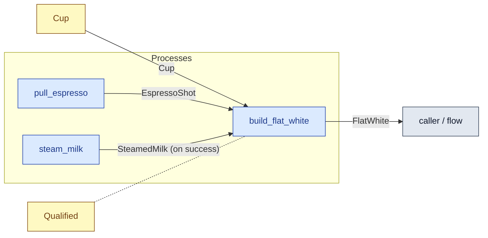

# `build_flat_white` — process (R1)

> Generated by `tools/docgen.sh` from `model/cs3-cafe-orders` — **do not hand-edit**; regenerate after any model change. Links are into the defining source lines; Mermaid nodes carry absolute click urls, the legend table the same links as plain markdown.

**P3 — builds the flat white (SPEC.md P3): the shot (with its cup) and the steamed milk become the 186 g drink, in the cup.**

- **Crate / subsystem:** `cs3-cafe-orders` — case study CS-3: café order fulfilment
- **Source:** [model/cs3-cafe-orders/src/resources.rs#L1105](/model/cs3-cafe-orders/src/resources.rs#L1105)

## Who and with what

| Actor | Type | Budget at entry | This step's adjacent draw (F-048) |
|---|---|---|---|
| `barista` | `Qualified` | `B` (caller-stated) | 30000 ms |

## Inputs

| Parameter | Declared type | Resource kind | Unit | Magnitude |
|---|---|---|---|---|
| `barista` | `Qualified<MachineTraining, B>` | reusable (model-core, R2/R15) | ms | `B` (caller-stated) |
| `shot` | `EspressoShot<SHOT>` | continuous (container, R15) | grams | `SHOT` (caller-stated) |
| `cup` | `Cup` | discrete (consumable, R13) | — | — |
| `milk` | `SteamedMilk<MILK>` | continuous (container, R15) | grams | `MILK` (caller-stated) |

Observed entering this step in the traced flows: `Cup`, `EspressoShot 36 grams`, `Qualified 390000 ms`, `Qualified 450000 ms`, `SteamedMilk 150 grams`.

## Outputs

| Output | Resource kind | Unit | Magnitude | Routing (who takes it) |
|---|---|---|---|---|
| `Qualified<MachineTraining, B>` | reusable (model-core, R2/R15) | ms | `B` (caller-stated) | moved in and returned (R2) |
| `FlatWhite<OUT>` | discrete (consumable, R13) | — | `OUT` (caller-stated) | `caller / flow` (flow input/output) |

Observed leaving this step in the traced flows: `FlatWhite 186`, `Qualified 390000 ms`, `Qualified 450000 ms`.

## Balances (R1/R3/R15)

- **Compile-time assert:** `SHOT + MILK == OUT`
  - message: *mass conservation violated in build_flat_white (R3): the shot plus the steamed milk must sum exactly to the flat white (SPEC.md P3: 36 + 150 = 186)*
  - in numbers (observed instantiation): `36 + 150 == 186` → 186 = 186 (holds)
  - fires at monomorphization (F-001): `cargo build`/`cargo test` catch a violation; `cargo check` and editor diagnostics do not.
- **Structural:** the const parameter `B` appears in an input and an output — the magnitude flows through unchanged, checked by the shared type parameter (no assert needed).

## Where it fits (R9: needs / feeds)

The model states **connections, not sequences**: any order satisfying these dependencies is valid (R9).

**Needs:**

- **Cup** from `Cup` (shared resource)
- **EspressoShot** from `pull_espresso` (process)
- **SteamedMilk (on success)** from `steam_milk` (process)
- `Qualified` (shared resource) — threaded through, returned (R2)

**Feeds:**

- **FlatWhite** to `caller / flow` (flow input/output)

## Neighbourhood (one hop)

### Legend — node → source

| Node | Kind | Defined at |
|---|---|---|
| `n_pull_espresso` (pull_espresso) | process | [model/cs3-cafe-orders/src/resources.rs#L987](/model/cs3-cafe-orders/src/resources.rs#L987) |
| `n_steam_milk` (steam_milk) | process | [model/cs3-cafe-orders/src/resources.rs#L1064](/model/cs3-cafe-orders/src/resources.rs#L1064) |
| `n_build_flat_white` (build_flat_white) | process | [model/cs3-cafe-orders/src/resources.rs#L1105](/model/cs3-cafe-orders/src/resources.rs#L1105) |
| `n_Cup` (Cup) | shared resource | [model/cs3-cafe-orders/src/resources.rs#L335](/model/cs3-cafe-orders/src/resources.rs#L335) |
| `n_caller` (caller / flow) | flow input/output | — |
| `n_Qualified` (Qualified) | shared resource | — |
