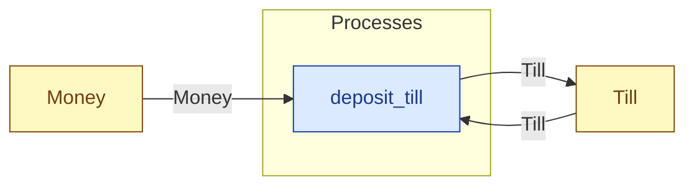

# `deposit_till` — process (R1)

> Generated by `tools/docgen.sh` from `model/cs3-cafe-orders` — **do not hand-edit**; regenerate after any model change. Links are into the defining source lines; Mermaid nodes carry absolute click urls, the legend table the same links as plain markdown.

**Deposits cash in the till (R3 combine, caller-stated total, F-022):**

- **Crate / subsystem:** `cs3-cafe-orders` — case study CS-3: café order fulfilment
- **Source:** [model/cs3-cafe-orders/src/resources.rs#L941](/model/cs3-cafe-orders/src/resources.rs#L941)

## Who and with what

No person in this signature: any time cost is drawn by an **adjacent** draw process in the flow (R15/F-048), or the step needs no actor.

## Inputs

| Parameter | Declared type | Resource kind | Unit | Magnitude |
|---|---|---|---|---|
| `till` | `Till<BALANCE>` | continuous (container, R15) | pence | `BALANCE` (caller-stated) |
| `cash` | `Money<ADD>` | continuous (container, R15) | pence | `ADD` (caller-stated) |

## Outputs

| Output | Resource kind | Unit | Magnitude | Routing (who takes it) |
|---|---|---|---|---|
| `Till<NEW>` | continuous (container, R15) | pence | `NEW` (caller-stated) | `Till` (shared resource) |

## Balances (R1/R3/R15)

- **Compile-time assert:** `BALANCE + ADD == NEW`
  - message: *money conservation violated in deposit_till (R3/R19): BALANCE + ADD must equal NEW - is the stated new balance wrong?*
  - fires at monomorphization (F-001): `cargo build`/`cargo test` catch a violation; `cargo check` and editor diagnostics do not.

## Where it fits (R9: needs / feeds)

The model states **connections, not sequences**: any order satisfying these dependencies is valid (R9).

**Needs:**

- **Money** from `Money` (shared resource)
- **Till** from `Till` (shared resource)

**Feeds:**

- **Till** to `Till` (shared resource)

## Neighbourhood (one hop)

### Legend — node → source

| Node | Kind | Defined at |
|---|---|---|
| `n_deposit_till` (deposit_till) | process | [model/cs3-cafe-orders/src/resources.rs#L941](/model/cs3-cafe-orders/src/resources.rs#L941) |
| `n_Money` (Money) | shared resource | [model/cs3-cafe-orders/src/resources.rs#L101](/model/cs3-cafe-orders/src/resources.rs#L101) |
| `n_Till` (Till) | shared resource | [model/cs3-cafe-orders/src/resources.rs#L112](/model/cs3-cafe-orders/src/resources.rs#L112) |
