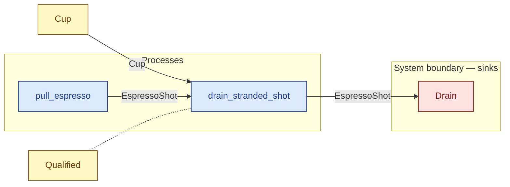

# `drain_stranded_shot` — process (R1)

> Generated by `tools/docgen.sh` from `model/cs3-cafe-orders` — **do not hand-edit**; regenerate after any model change. Links are into the defining source lines; Mermaid nodes carry absolute click urls, the legend table the same links as plain markdown.

**P8 — drains the stranded shot (SPEC.md P8; **path 3 only**): when both steams fail there is no drink for the already-pulled shot to join, so it is honest waste — the shot is fed to the drain **inside the process** (the same `Consumer` machinery as the burnt milk; SPEC.md §8 review decision 1) and its cup goes back to the counter stack ([`super::boundary::restack_cup`]).**

- **Crate / subsystem:** `cs3-cafe-orders` — case study CS-3: café order fulfilment
- **Source:** [model/cs3-cafe-orders/src/resources.rs#L1133](/model/cs3-cafe-orders/src/resources.rs#L1133)

## Who and with what

| Actor | Type | Budget at entry | This step's adjacent draw (F-048) |
|---|---|---|---|
| `barista` | `Qualified` | `B` (caller-stated) | 30000 ms |

## Inputs

| Parameter | Declared type | Resource kind | Unit | Magnitude |
|---|---|---|---|---|
| `barista` | `Qualified<MachineTraining, B>` | reusable (model-core, R2/R15) | ms | `B` (caller-stated) |
| `shot` | `EspressoShot<SHOT>` | continuous (container, R15) | grams | `SHOT` (caller-stated) |
| `cup` | `Cup` | discrete (consumable, R13) | — | — |
| `drain` | consumer of EspressoShot (sink `Drain`) | boundary object (R12) | — | — |

Observed entering this step in the traced flows: `Cup`, `D as Consumer BurntMilk 150 ::Next`, `EspressoShot 36 grams`, `Qualified 390000 ms`.

## Outputs

| Output | Resource kind | Unit | Magnitude | Routing (who takes it) |
|---|---|---|---|---|
| `Qualified<MachineTraining, B>` | reusable (model-core, R2/R15) | ms | `B` (caller-stated) | moved in and returned (R2) |
| `D::Next` | — | — | — | the same boundary object, returned in its advanced state (R2/R12) |

Waste routed **inside** this process (never loose in a flow):

- `drain` is a consumer parameter: **EspressoShot** is handed to `Drain` **inside this process** (Consumer/ConsumeList bound, R12) — [model/cs3-cafe-orders/src/resources.rs#L616](/model/cs3-cafe-orders/src/resources.rs#L616)

Observed leaving this step in the traced flows: `Qualified 390000 ms`.

## Balances (R1/R3/R15)

- **Structural:** the const parameter `B` appears in an input and an output — the magnitude flows through unchanged, checked by the shared type parameter (no assert needed).

## Where it fits (R9: needs / feeds)

The model states **connections, not sequences**: any order satisfying these dependencies is valid (R9).

**Needs:**

- **Cup** from `Cup` (shared resource)
- **EspressoShot** from `pull_espresso` (process)
- `Qualified` (shared resource) — threaded through, returned (R2)

**Feeds:**

- **EspressoShot** to `Drain` (boundary sink)

## Neighbourhood (one hop)

### Legend — node → source

| Node | Kind | Defined at |
|---|---|---|
| `n_pull_espresso` (pull_espresso) | process | [model/cs3-cafe-orders/src/resources.rs#L987](/model/cs3-cafe-orders/src/resources.rs#L987) |
| `n_drain_stranded_shot` (drain_stranded_shot) | process | [model/cs3-cafe-orders/src/resources.rs#L1133](/model/cs3-cafe-orders/src/resources.rs#L1133) |
| `n_Cup` (Cup) | shared resource | [model/cs3-cafe-orders/src/resources.rs#L335](/model/cs3-cafe-orders/src/resources.rs#L335) |
| `n_Drain` (Drain) | boundary sink | [model/cs3-cafe-orders/src/resources.rs#L616](/model/cs3-cafe-orders/src/resources.rs#L616) |
| `n_Qualified` (Qualified) | shared resource | — |
