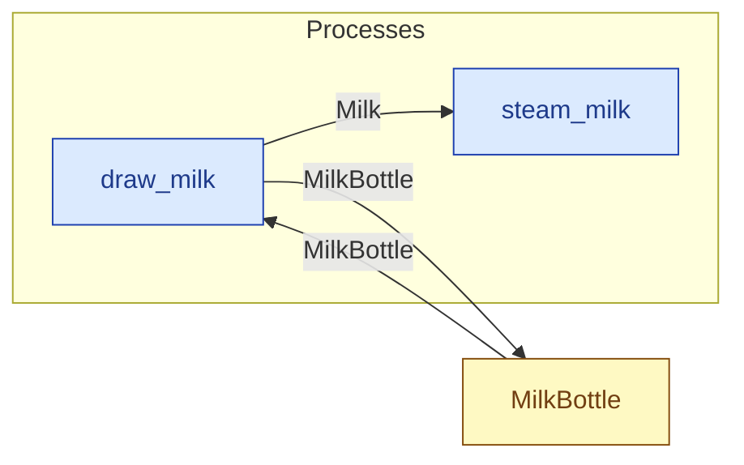

# `draw_milk` — process (R1)

> Generated by `tools/docgen.sh` from `model/cs3-cafe-orders` — **do not hand-edit**; regenerate after any model change. Links are into the defining source lines; Mermaid nodes carry absolute click urls, the legend table the same links as plain markdown.

**Draws `TAKE` grams of milk from a bottle holding `FULL`, leaving `LEFT` (SPEC.md §3: 150 g per steaming attempt).**

- **Crate / subsystem:** `cs3-cafe-orders` — case study CS-3: café order fulfilment
- **Source:** [model/cs3-cafe-orders/src/resources.rs#L892](/model/cs3-cafe-orders/src/resources.rs#L892)

## Who and with what

No person in this signature: any time cost is drawn by an **adjacent** draw process in the flow (R15/F-048), or the step needs no actor.

## Inputs

| Parameter | Declared type | Resource kind | Unit | Magnitude |
|---|---|---|---|---|
| `container` | `MilkBottle<FULL>` | continuous (container, R15) | grams | `FULL` (caller-stated) |

Observed entering this step in the traced flows: `MilkBottle 150 grams`, `MilkBottle 300 grams`.

## Outputs

| Output | Resource kind | Unit | Magnitude | Routing (who takes it) |
|---|---|---|---|---|
| `Milk<TAKE>` | continuous (container, R15) | grams | `TAKE` (caller-stated) | `steam_milk` (process) |
| `MilkBottle<LEFT>` | continuous (container, R15) | grams | `LEFT` (caller-stated) | `MilkBottle` (shared resource) |

Observed leaving this step in the traced flows: `Milk 150 grams`, `MilkBottle 0 grams`, `MilkBottle 150 grams`.

## Where it fits (R9: needs / feeds)

The model states **connections, not sequences**: any order satisfying these dependencies is valid (R9).

**Needs:**

- **MilkBottle** from `MilkBottle` (shared resource)

**Feeds:**

- **Milk** to `steam_milk` (process)
- **MilkBottle** to `MilkBottle` (shared resource)

## Neighbourhood (one hop)

### Legend — node → source

| Node | Kind | Defined at |
|---|---|---|
| `n_draw_milk` (draw_milk) | process | [model/cs3-cafe-orders/src/resources.rs#L892](/model/cs3-cafe-orders/src/resources.rs#L892) |
| `n_steam_milk` (steam_milk) | process | [model/cs3-cafe-orders/src/resources.rs#L1064](/model/cs3-cafe-orders/src/resources.rs#L1064) |
| `n_MilkBottle` (MilkBottle) | shared resource | [model/cs3-cafe-orders/src/resources.rs#L127](/model/cs3-cafe-orders/src/resources.rs#L127) |
