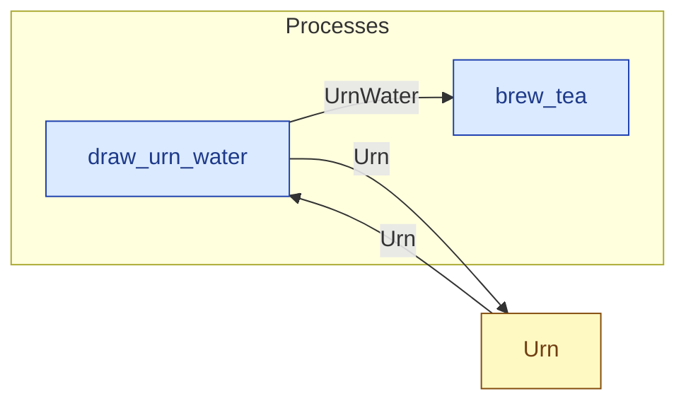

# `draw_urn_water` — process (R1)

> Generated by `tools/docgen.sh` from `model/cs3-cafe-orders` — **do not hand-edit**; regenerate after any model change. Links are into the defining source lines; Mermaid nodes carry absolute click urls, the legend table the same links as plain markdown.

**Draws `TAKE` grams of hot water from the urn (SPEC.md §3: 300 g per pot).**

- **Crate / subsystem:** `cs3-cafe-orders` — case study CS-3: café order fulfilment
- **Source:** [model/cs3-cafe-orders/src/resources.rs#L915](/model/cs3-cafe-orders/src/resources.rs#L915)

## Who and with what

No person in this signature: any time cost is drawn by an **adjacent** draw process in the flow (R15/F-048), or the step needs no actor.

## Inputs

| Parameter | Declared type | Resource kind | Unit | Magnitude |
|---|---|---|---|---|
| `container` | `Urn<FULL>` | continuous (container, R15) | grams | `FULL` (caller-stated) |

Observed entering this step in the traced flows: `Urn 1000 grams`, `Urn 700 grams`.

## Outputs

| Output | Resource kind | Unit | Magnitude | Routing (who takes it) |
|---|---|---|---|---|
| `UrnWater<TAKE>` | continuous (container, R15) | grams | `TAKE` (caller-stated) | `brew_tea` (process) |
| `Urn<LEFT>` | continuous (container, R15) | grams | `LEFT` (caller-stated) | `Urn` (shared resource) |

Observed leaving this step in the traced flows: `Urn 700 grams`, `UrnWater 300 grams`.

## Where it fits (R9: needs / feeds)

The model states **connections, not sequences**: any order satisfying these dependencies is valid (R9).

**Needs:**

- **Urn** from `Urn` (shared resource)

**Feeds:**

- **Urn** to `Urn` (shared resource)
- **UrnWater** to `brew_tea` (process)

## Neighbourhood (one hop)

### Legend — node → source

| Node | Kind | Defined at |
|---|---|---|
| `n_draw_urn_water` (draw_urn_water) | process | [model/cs3-cafe-orders/src/resources.rs#L915](/model/cs3-cafe-orders/src/resources.rs#L915) |
| `n_brew_tea` (brew_tea) | process | [model/cs3-cafe-orders/src/resources.rs#L1198](/model/cs3-cafe-orders/src/resources.rs#L1198) |
| `n_Urn` (Urn) | shared resource | [model/cs3-cafe-orders/src/resources.rs#L232](/model/cs3-cafe-orders/src/resources.rs#L232) |
