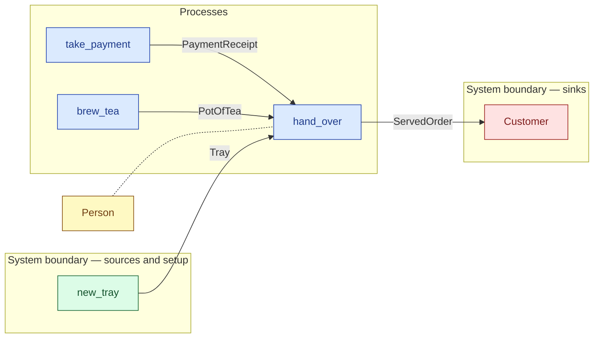

# `hand_over` — process (R1)

> Generated by `tools/docgen.sh` from `model/cs3-cafe-orders` — **do not hand-edit**; regenerate after any model change. Links are into the defining source lines; Mermaid nodes carry absolute click urls, the legend table the same links as plain markdown.

**P6 — assembles the order on the tray and hands it over (SPEC.md P6):**

- **Crate / subsystem:** `cs3-cafe-orders` — case study CS-3: café order fulfilment
- **Source:** [model/cs3-cafe-orders/src/resources.rs#L1232](/model/cs3-cafe-orders/src/resources.rs#L1232)
- **Requirements bound on the signature:** REQ-017

## Who and with what

| Actor | Type | Budget at entry | This step's adjacent draw (F-048) |
|---|---|---|---|
| `server` | `Person` | `B` (caller-stated) | 30000 ms |

## Inputs

| Parameter | Declared type | Resource kind | Unit | Magnitude |
|---|---|---|---|---|
| `server` | `Person<B>` | reusable (model-core, R2/R15) | ms | `B` (caller-stated) |
| `slot` | `W` — unresolved: W: OrderSlot | — | — | — |
| `tea` | `PotOfTea<TEA_G>` | discrete (consumable, R13) | — | `TEA_G` (caller-stated) |
| `tray` | `Tray` | discrete (consumable, R13) | — | — |
| `receipt` | `R` → `PaymentReceipt` (via the requirement bound) | discrete (consumable, R13) | — | — |
| `h_a` | `History` | execution record (model-core, R16) | — | — |
| `h_b` | `History` | execution record (model-core, R16) | — | — |

Observed entering this step in the traced flows: `FlatWhite 186`, `History`, `Money`, `PaymentReceipt`, `Person 360000 ms`, `Person 390000 ms`, `PotOfTea 303`, `Tray`.

## Outputs

| Output | Resource kind | Unit | Magnitude | Routing (who takes it) |
|---|---|---|---|---|
| `Person<B>` | reusable (model-core, R2/R15) | ms | `B` (caller-stated) | moved in and returned (R2) |
| `ServedOrder<W>` | discrete (consumable, R13) | — | — | `Customer` (boundary sink) |
| `History` | execution record (model-core, R16) | — | — | moved in and returned (R2) |

Observed leaving this step in the traced flows: `Person 360000 ms`, `Person 390000 ms`, `ServedOrder`.

## Balances (R1/R3/R15)

- **Structural:** the const parameter `B` appears in an input and an output — the magnitude flows through unchanged, checked by the shared type parameter (no assert needed).

## Requirements (R10 — the compliance matrix)

| Requirement | Statement | Defined at | Satisfied by | Verified by |
|---|---|---|---|---|
| REQ-017 | An order may be handed over only after payment (the join requires the payment receipt from the till branch). | [model/cs3-cafe-orders/src/requirements.rs#L50](/model/cs3-cafe-orders/src/requirements.rs#L50) | `OrderPaymentReceipt` | [`take_payment_splits_deposits_and_returns_the_change`](/model/cs3-cafe-orders/src/resources.rs#L1409), [`hand_over_consumes_the_receipt_and_merges_the_branches`](/model/cs3-cafe-orders/src/resources.rs#L1466), [`hand_over_takes_the_refund_in_the_flat_whites_slot`](/model/cs3-cafe-orders/src/resources.rs#L1499), [`path_1_served_first_try_accounts_for_everything`](/model/cs3-cafe-orders/tests/flows.rs#L170), [`path_2_served_on_retry_accounts_for_everything`](/model/cs3-cafe-orders/tests/flows.rs#L222), [`path_3_refund_accounts_for_everything`](/model/cs3-cafe-orders/tests/flows.rs#L273), [`interleavings_are_equivalent_on_path_1`](/model/cs3-cafe-orders/tests/flows.rs#L331), [`interleavings_are_equivalent_on_path_3`](/model/cs3-cafe-orders/tests/flows.rs#L379) |

This item is doc-tagged `Satisfies: REQ-017`.

## Where it fits (R9: needs / feeds)

The model states **connections, not sequences**: any order satisfying these dependencies is valid (R9).

**Needs:**

- **PaymentReceipt** from `take_payment` (process)
- **PotOfTea** from `brew_tea` (process)
- **Tray** from `new_tray` (boundary source)
- `Person` (shared resource) — threaded through, returned (R2)

**Feeds:**

- **ServedOrder** to `Customer` (boundary sink)

## Neighbourhood (one hop)

### Legend — node → source

| Node | Kind | Defined at |
|---|---|---|
| `n_take_payment` (take_payment) | process | [model/cs3-cafe-orders/src/resources.rs#L1177](/model/cs3-cafe-orders/src/resources.rs#L1177) |
| `n_brew_tea` (brew_tea) | process | [model/cs3-cafe-orders/src/resources.rs#L1198](/model/cs3-cafe-orders/src/resources.rs#L1198) |
| `n_hand_over` (hand_over) | process | [model/cs3-cafe-orders/src/resources.rs#L1232](/model/cs3-cafe-orders/src/resources.rs#L1232) |
| `n_Customer` (Customer) | boundary sink | [model/cs3-cafe-orders/src/resources.rs#L572](/model/cs3-cafe-orders/src/resources.rs#L572) |
| `n_new_tray` (new_tray) | boundary source | [model/cs3-cafe-orders/src/resources.rs#L807](/model/cs3-cafe-orders/src/resources.rs#L807) |
| `n_Person` (Person) | shared resource | — |

<!-- WARN (docgen): `hand_over`: parameter `slot` not resolved (W: OrderSlot) -->
