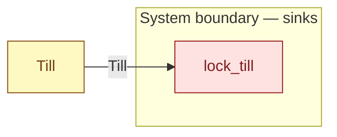

# `lock_till` — boundary function (R12)

> Generated by `tools/docgen.sh` from `model/cs3-cafe-orders` — **do not hand-edit**; regenerate after any model change. Links are into the defining source lines; Mermaid nodes carry absolute click urls, the legend table the same links as plain markdown.

**The till stays at the counter at flow end, holding its path's balance (R12; SPEC.md §6: 700 p served, 320 p after the path-3 refund).**

- **Crate / subsystem:** `cs3-cafe-orders` — case study CS-3: café order fulfilment
- **Source:** [model/cs3-cafe-orders/src/resources.rs#L823](/model/cs3-cafe-orders/src/resources.rs#L823)
- **Placeholder:** the counter at close of flow.

## Who and with what

No person in this signature: any time cost is drawn by an **adjacent** draw process in the flow (R15/F-048), or the step needs no actor.

## Inputs

| Parameter | Declared type | Resource kind | Unit | Magnitude |
|---|---|---|---|---|
| `till` | `Till<V>` | continuous (container, R15) | pence | `V` (caller-stated) |

## Outputs

| Output | Resource kind | Unit | Magnitude | Routing (who takes it) |
|---|---|---|---|---|

## Where it fits (R9: needs / feeds)

The model states **connections, not sequences**: any order satisfying these dependencies is valid (R9).

**Needs:**

- **Till** from `Till` (shared resource)

## Neighbourhood (one hop)

### Legend — node → source

| Node | Kind | Defined at |
|---|---|---|
| `n_Till` (Till) | shared resource | [model/cs3-cafe-orders/src/resources.rs#L112](/model/cs3-cafe-orders/src/resources.rs#L112) |
| `n_lock_till` (lock_till) | boundary sink | [model/cs3-cafe-orders/src/resources.rs#L823](/model/cs3-cafe-orders/src/resources.rs#L823) |

## Open items (`Placeholder:` tags, R12)

- this function is itself a placeholder (see the header above)
