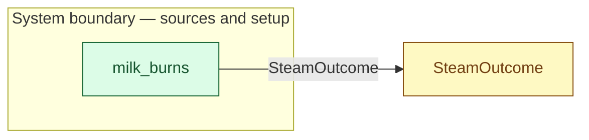

# `milk_burns` — boundary function (R12)

> Generated by `tools/docgen.sh` from `model/cs3-cafe-orders` — **do not hand-edit**; regenerate after any model change. Links are into the defining source lines; Mermaid nodes carry absolute click urls, the legend table the same links as plain markdown.

**One trial of the environment (R17): whether a single steaming attempt textures the milk or burns it.**

- **Crate / subsystem:** `cs3-cafe-orders` — case study CS-3: café order fulfilment
- **Source:** [model/cs3-cafe-orders/src/resources.rs#L510](/model/cs3-cafe-orders/src/resources.rs#L510)

## Who and with what

No person in this signature: any time cost is drawn by an **adjacent** draw process in the flow (R15/F-048), or the step needs no actor.

## Inputs

| Parameter | Declared type | Resource kind | Unit | Magnitude |
|---|---|---|---|---|

## Outputs

| Output | Resource kind | Unit | Magnitude | Routing (who takes it) |
|---|---|---|---|---|
| `SteamOutcome` | outcome token (R17) | — | — | `SteamOutcome` (shared resource) |

## Where it fits (R9: needs / feeds)

The model states **connections, not sequences**: any order satisfying these dependencies is valid (R9).

**Feeds:**

- **SteamOutcome** to `SteamOutcome` (shared resource)

## Neighbourhood (one hop)

### Legend — node → source

| Node | Kind | Defined at |
|---|---|---|
| `n_SteamOutcome` (SteamOutcome) | shared resource | [model/cs3-cafe-orders/src/resources.rs#L510](/model/cs3-cafe-orders/src/resources.rs#L510) |
| `n_milk_burns` (milk_burns) | boundary source | [model/cs3-cafe-orders/src/resources.rs#L510](/model/cs3-cafe-orders/src/resources.rs#L510) |

## Open items (`Placeholder:` tags, R12)

- this function is itself a placeholder (see the header above)
