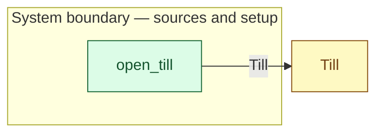

# `open_till` — boundary function (R12)

> Generated by `tools/docgen.sh` from `model/cs3-cafe-orders` — **do not hand-edit**; regenerate after any model change. Links are into the defining source lines; Mermaid nodes carry absolute click urls, the legend table the same links as plain markdown.

**The till opens empty (R12; SPEC.md §3: the float is out of scope — change comes from the tendered note by splitting).**

- **Crate / subsystem:** `cs3-cafe-orders` — case study CS-3: café order fulfilment
- **Source:** [model/cs3-cafe-orders/src/resources.rs#L815](/model/cs3-cafe-orders/src/resources.rs#L815)
- **Placeholder:** counter setup at flow start.

## Who and with what

No person in this signature: any time cost is drawn by an **adjacent** draw process in the flow (R15/F-048), or the step needs no actor.

## Inputs

| Parameter | Declared type | Resource kind | Unit | Magnitude |
|---|---|---|---|---|

## Outputs

| Output | Resource kind | Unit | Magnitude | Routing (who takes it) |
|---|---|---|---|---|
| `Till<0>` | continuous (container, R15) | pence | 0 | `Till` (shared resource) |

## Where it fits (R9: needs / feeds)

The model states **connections, not sequences**: any order satisfying these dependencies is valid (R9).

**Feeds:**

- **Till** to `Till` (shared resource)

## Neighbourhood (one hop)

### Legend — node → source

| Node | Kind | Defined at |
|---|---|---|
| `n_Till` (Till) | shared resource | [model/cs3-cafe-orders/src/resources.rs#L112](/model/cs3-cafe-orders/src/resources.rs#L112) |
| `n_open_till` (open_till) | boundary source | [model/cs3-cafe-orders/src/resources.rs#L815](/model/cs3-cafe-orders/src/resources.rs#L815) |

## Open items (`Placeholder:` tags, R12)

- this function is itself a placeholder (see the header above)
