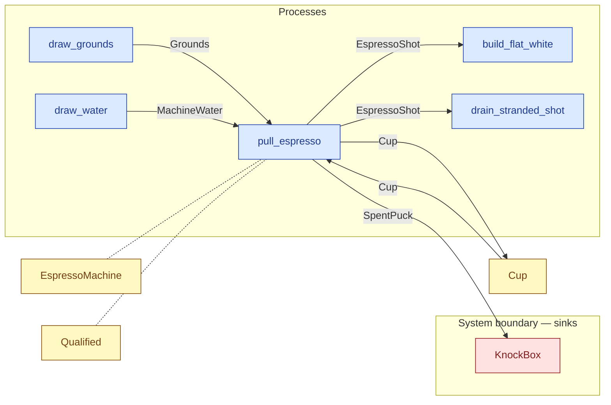

# `pull_espresso` — process (R1)

> Generated by `tools/docgen.sh` from `model/cs3-cafe-orders` — **do not hand-edit**; regenerate after any model change. Links are into the defining source lines; Mermaid nodes carry absolute click urls, the legend table the same links as plain markdown.

**P1 — pulls the espresso (SPEC.md P1).**

- **Crate / subsystem:** `cs3-cafe-orders` — case study CS-3: café order fulfilment
- **Source:** [model/cs3-cafe-orders/src/resources.rs#L987](/model/cs3-cafe-orders/src/resources.rs#L987)
- **Requirements bound on the signature:** REQ-015

## Who and with what

| Actor | Type | Budget at entry | This step's adjacent draw (F-048) |
|---|---|---|---|
| `barista` | `Qualified` | — | 90000 ms |

Reusables threaded — moved in and returned (R2): `machine: EspressoMachine`.

## Inputs

| Parameter | Declared type | Resource kind | Unit | Magnitude |
|---|---|---|---|---|
| `barista` | `O` → `Qualified` (via the requirement bound) | reusable (model-core, R2/R15) | ms | — |
| `machine` | `EspressoMachine` | reusable (R2) | — | — |
| `grounds` | `Grounds<DOSE>` | continuous (container, R15) | grams | `DOSE` (caller-stated) |
| `water` | `MachineWater<WATER>` | continuous (container, R15) | grams | `WATER` (caller-stated) |
| `cup` | `Cup` | discrete (consumable, R13) | — | — |
| `knock_box` | consumer of SpentPuck (sink `KnockBox`) | boundary object (R12) | — | — |

Observed entering this step in the traced flows: `Cup`, `EspressoMachine`, `Grounds 18 grams`, `KnockBox`, `MachineWater 40 grams`, `Qualified 600000 ms`.

## Outputs

| Output | Resource kind | Unit | Magnitude | Routing (who takes it) |
|---|---|---|---|---|
| `O` | — | — | — | moved in and returned (R2) |
| `EspressoMachine` | reusable (R2) | — | — | moved in and returned (R2) |
| `EspressoShot<SHOT>` | continuous (container, R15) | grams | `SHOT` (caller-stated) | `build_flat_white` (process); `drain_stranded_shot` (process) |
| `Cup` | discrete (consumable, R13) | — | — | `Cup` (shared resource) |
| `K::Next` | — | — | — | the same boundary object, returned in its advanced state (R2/R12) |

Waste routed **inside** this process (never loose in a flow):

- `knock_box` is a consumer parameter: **SpentPuck** is handed to `KnockBox` **inside this process** (Consumer/ConsumeList bound, R12) — [model/cs3-cafe-orders/src/resources.rs#L650](/model/cs3-cafe-orders/src/resources.rs#L650)

Observed leaving this step in the traced flows: `Cup`, `EspressoShot 36 grams`, `Qualified 600000 ms`.

## Balances (R1/R3/R15)

- **Compile-time assert:** `DOSE + WATER == SHOT + PUCK`
  - message: *mass conservation violated in pull_espresso (R3): the dose plus the water must sum exactly to the shot plus the spent puck (SPEC.md P1: 18 + 40 = 36 + 22)*
  - in numbers (observed instantiation): `18 + 40 == 36 + 22` → 58 = 58 (holds)
  - fires at monomorphization (F-001): `cargo build`/`cargo test` catch a violation; `cargo check` and editor diagnostics do not.

## Requirements (R10 — the compliance matrix)

| Requirement | Statement | Defined at | Satisfied by | Verified by |
|---|---|---|---|---|
| REQ-015 | The espresso machine may be operated only by a trained barista. | [model/cs3-cafe-orders/src/requirements.rs#L36](/model/cs3-cafe-orders/src/requirements.rs#L36) | `TrainedBarista` | [`pull_espresso_balances_the_shot_and_puck`](/model/cs3-cafe-orders/src/resources.rs#L1323), [`path_1_served_first_try_accounts_for_everything`](/model/cs3-cafe-orders/tests/flows.rs#L170), [`path_2_served_on_retry_accounts_for_everything`](/model/cs3-cafe-orders/tests/flows.rs#L222), [`path_3_refund_accounts_for_everything`](/model/cs3-cafe-orders/tests/flows.rs#L273), [`interleavings_are_equivalent_on_path_1`](/model/cs3-cafe-orders/tests/flows.rs#L331) |

This item is doc-tagged `Satisfies: REQ-015`.

## Where it fits (R9: needs / feeds)

The model states **connections, not sequences**: any order satisfying these dependencies is valid (R9).

**Needs:**

- **Cup** from `Cup` (shared resource)
- **Grounds** from `draw_grounds` (process)
- **MachineWater** from `draw_water` (process)
- `EspressoMachine` (shared resource) — threaded through, returned (R2)
- `Qualified` (shared resource) — threaded through, returned (R2)

**Feeds:**

- **Cup** to `Cup` (shared resource)
- **EspressoShot** to `build_flat_white` (process)
- **EspressoShot** to `drain_stranded_shot` (process)
- **SpentPuck** to `KnockBox` (boundary sink)

## Neighbourhood (one hop)

### Legend — node → source

| Node | Kind | Defined at |
|---|---|---|
| `n_draw_grounds` (draw_grounds) | process | [model/cs3-cafe-orders/src/resources.rs#L900](/model/cs3-cafe-orders/src/resources.rs#L900) |
| `n_draw_water` (draw_water) | process | [model/cs3-cafe-orders/src/resources.rs#L908](/model/cs3-cafe-orders/src/resources.rs#L908) |
| `n_pull_espresso` (pull_espresso) | process | [model/cs3-cafe-orders/src/resources.rs#L987](/model/cs3-cafe-orders/src/resources.rs#L987) |
| `n_build_flat_white` (build_flat_white) | process | [model/cs3-cafe-orders/src/resources.rs#L1105](/model/cs3-cafe-orders/src/resources.rs#L1105) |
| `n_drain_stranded_shot` (drain_stranded_shot) | process | [model/cs3-cafe-orders/src/resources.rs#L1133](/model/cs3-cafe-orders/src/resources.rs#L1133) |
| `n_Cup` (Cup) | shared resource | [model/cs3-cafe-orders/src/resources.rs#L335](/model/cs3-cafe-orders/src/resources.rs#L335) |
| `n_EspressoMachine` (EspressoMachine) | shared resource | [model/cs3-cafe-orders/src/resources.rs#L495](/model/cs3-cafe-orders/src/resources.rs#L495) |
| `n_KnockBox` (KnockBox) | boundary sink | [model/cs3-cafe-orders/src/resources.rs#L650](/model/cs3-cafe-orders/src/resources.rs#L650) |
| `n_Qualified` (Qualified) | shared resource | — |

## Open items (`Placeholder:` tags, R12)

- `EspressoMachine` — counter setup at flow start — one machine. ([model/cs3-cafe-orders/src/resources.rs#L495](/model/cs3-cafe-orders/src/resources.rs#L495))
