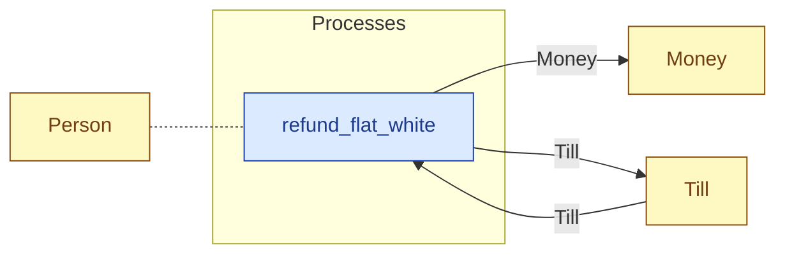

# `refund_flat_white` — process (R1)

> Generated by `tools/docgen.sh` from `model/cs3-cafe-orders` — **do not hand-edit**; regenerate after any model change. Links are into the defining source lines; Mermaid nodes carry absolute click urls, the legend table the same links as plain markdown.

**P7 — refunds the flat white (SPEC.md P7; path 3 only): the server draws the flat white's 380 p price back out of the till (R15/R19 caller-stated remainder, F-022/F-030); the refund then **takes the flat white's place on the order tray** (SPEC.md §6: "P7 replaces the flat white in P6") through the refund-in-lieu [`OrderSlot`].**

- **Crate / subsystem:** `cs3-cafe-orders` — case study CS-3: café order fulfilment
- **Source:** [model/cs3-cafe-orders/src/resources.rs#L1268](/model/cs3-cafe-orders/src/resources.rs#L1268)

## Who and with what

| Actor | Type | Budget at entry | This step's adjacent draw (F-048) |
|---|---|---|---|
| `server` | `Person` | `B` (caller-stated) | 30000 ms |

## Inputs

| Parameter | Declared type | Resource kind | Unit | Magnitude |
|---|---|---|---|---|
| `server` | `Person<B>` | reusable (model-core, R2/R15) | ms | `B` (caller-stated) |
| `till` | `Till<TILL>` | continuous (container, R15) | pence | `TILL` (caller-stated) |

Observed entering this step in the traced flows: `Person 390000 ms`, `Till 700 pence`.

## Outputs

| Output | Resource kind | Unit | Magnitude | Routing (who takes it) |
|---|---|---|---|---|
| `Person<B>` | reusable (model-core, R2/R15) | ms | `B` (caller-stated) | moved in and returned (R2) |
| `Till<LEFT>` | continuous (container, R15) | pence | `LEFT` (caller-stated) | `Till` (shared resource) |
| `Money<FLAT_WHITE_PRICE_PENCE>` | continuous (container, R15) | pence | FLAT_WHITE_PRICE_PENCE = 380 | `Money` (shared resource) |

Observed leaving this step in the traced flows: `Money`, `Person 390000 ms`, `Till 320 pence`.

## Balances (R1/R3/R15)

- **Compile-time assert:** `FLAT_WHITE_PRICE_PENCE + LEFT == TILL`
  - message: *money conservation violated in refund_flat_white (R15/R19): the 380 p refund plus LEFT must equal the till's balance - is the stated remainder wrong? (SPEC.md P7: 700 = 320 + 380)*
  - in numbers (observed instantiation): `FLAT_WHITE_PRICE_PENCE + 320 == 700` → 700 = 700 (holds)
  - fires at monomorphization (F-001): `cargo build`/`cargo test` catch a violation; `cargo check` and editor diagnostics do not.
- **Structural:** the const parameter `B` appears in an input and an output — the magnitude flows through unchanged, checked by the shared type parameter (no assert needed).

## Where it fits (R9: needs / feeds)

The model states **connections, not sequences**: any order satisfying these dependencies is valid (R9).

**Needs:**

- **Till** from `Till` (shared resource)
- `Person` (shared resource) — threaded through, returned (R2)

**Feeds:**

- **Money** to `Money` (shared resource)
- **Till** to `Till` (shared resource)

## Neighbourhood (one hop)

### Legend — node → source

| Node | Kind | Defined at |
|---|---|---|
| `n_refund_flat_white` (refund_flat_white) | process | [model/cs3-cafe-orders/src/resources.rs#L1268](/model/cs3-cafe-orders/src/resources.rs#L1268) |
| `n_Money` (Money) | shared resource | [model/cs3-cafe-orders/src/resources.rs#L101](/model/cs3-cafe-orders/src/resources.rs#L101) |
| `n_Till` (Till) | shared resource | [model/cs3-cafe-orders/src/resources.rs#L112](/model/cs3-cafe-orders/src/resources.rs#L112) |
| `n_Person` (Person) | shared resource | — |
