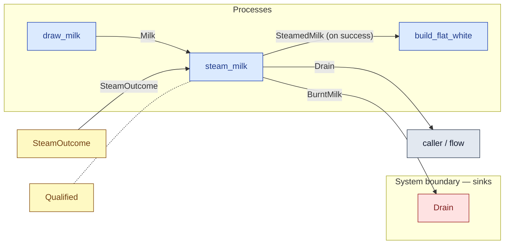

# `steam_milk` — process (R1)

> Generated by `tools/docgen.sh` from `model/cs3-cafe-orders` — **do not hand-edit**; regenerate after any model change. Links are into the defining source lines; Mermaid nodes carry absolute click urls, the legend table the same links as plain markdown.

**P2 — steams the milk: **fallible** (R17, SPEC.md P2).**

- **Crate / subsystem:** `cs3-cafe-orders` — case study CS-3: café order fulfilment
- **Source:** [model/cs3-cafe-orders/src/resources.rs#L1064](/model/cs3-cafe-orders/src/resources.rs#L1064)
- **Requirements bound on the signature:** REQ-016

## Who and with what

| Actor | Type | Budget at entry | This step's adjacent draw (F-048) |
|---|---|---|---|
| `barista` | `Qualified` | `B` (caller-stated) | 60000 ms |

## Inputs

| Parameter | Declared type | Resource kind | Unit | Magnitude |
|---|---|---|---|---|
| `barista` | `Qualified<MachineTraining, B>` | reusable (model-core, R2/R15) | ms | `B` (caller-stated) |
| `milk` | `Milk<M>` | continuous (container, R15) | grams | `M` (caller-stated) |
| `outcome` | `SteamOutcome` | outcome token (R17) | — | — |
| `drain` | consumer of BurntMilk (sink `Drain`) | boundary object (R12) | — | — |

Observed entering this step in the traced flows: `D as Consumer BurntMilk 150 ::Next`, `Drain`, `Milk 150 grams`, `Qualified 390000 ms`, `Qualified 450000 ms`, `SteamOutcome`.

## Outputs

| Output | Resource kind | Unit | Magnitude | Routing (who takes it) |
|---|---|---|---|---|
| `SteamOk` (on success) | outcome bundle (R17 grouping, F-046) | — | — | destructured by the handling arm |
| `SteamOk.barista: Qualified` (on success) | reusable (model-core, R2/R15) | ms | `B` (caller-stated) | returned in the bundle |
| `SteamOk.milk: SteamedMilk` (on success) | continuous (container, R15) | grams | `STEAMED` (caller-stated) | `build_flat_white` (process) |
| `SteamOk.drain: D` (on success) | — | — | — | returned in the bundle |
| `SteamFail` (on failure) | outcome bundle (R17 grouping, F-046) | — | — | destructured by the handling arm |
| `SteamFail.barista: Qualified` (on failure) | reusable (model-core, R2/R15) | ms | `B` (caller-stated) | returned in the bundle |
| `SteamFail.drain: D` (on failure) | — | — | — | returned in the bundle |

Waste routed **inside** this process (never loose in a flow):

- `drain` is a consumer parameter: **BurntMilk** is handed to `Drain` **inside this process** (Consumer/ConsumeList bound, R12) — [model/cs3-cafe-orders/src/resources.rs#L616](/model/cs3-cafe-orders/src/resources.rs#L616)

Observed leaving this step in the traced flows: `D as Consumer BurntMilk 150 ::Next`, `Qualified 390000 ms`, `Qualified 450000 ms`, `SteamedMilk 150 grams`.

## Balances (R1/R3/R15)

- **Compile-time assert:** `M == STEAMED`
  - message: *success-branch mass conservation violated in steam_milk (R3, R17): the steamed milk must carry exactly the drawn milk's mass*
  - in numbers (observed instantiation): `150 == 150` → 150 = 150 (holds)
  - fires at monomorphization (F-001): `cargo build`/`cargo test` catch a violation; `cargo check` and editor diagnostics do not.
- **Compile-time assert:** `M == BURNT`
  - message: *failure-branch mass conservation violated in steam_milk (R3, R17): the burnt milk fed to the drain must carry exactly the drawn milk's mass*
  - in numbers (observed instantiation): `150 == 150` → 150 = 150 (holds)
  - fires at monomorphization (F-001): `cargo build`/`cargo test` catch a violation; `cargo check` and editor diagnostics do not.
- **Structural:** the const parameter `B` appears in an input and an output — the magnitude flows through unchanged, checked by the shared type parameter (no assert needed).

## Requirements (R10 — the compliance matrix)

| Requirement | Statement | Defined at | Satisfied by | Verified by |
|---|---|---|---|---|
| REQ-016 | Burnt milk must be discarded to the drain - it is never re-steamed or served. | [model/cs3-cafe-orders/src/requirements.rs#L43](/model/cs3-cafe-orders/src/requirements.rs#L43) | `Drain` | [`steam_milk_failure_arm_feeds_the_drain_inside`](/model/cs3-cafe-orders/src/resources.rs#L1369), [`path_1_served_first_try_accounts_for_everything`](/model/cs3-cafe-orders/tests/flows.rs#L170), [`path_2_served_on_retry_accounts_for_everything`](/model/cs3-cafe-orders/tests/flows.rs#L222), [`path_3_refund_accounts_for_everything`](/model/cs3-cafe-orders/tests/flows.rs#L273), [`interleavings_are_equivalent_on_path_3`](/model/cs3-cafe-orders/tests/flows.rs#L379) |

This item is doc-tagged `Satisfies: REQ-016`.

## Where it fits (R9: needs / feeds)

The model states **connections, not sequences**: any order satisfying these dependencies is valid (R9).

**Needs:**

- **Milk** from `draw_milk` (process)
- **SteamOutcome** from `SteamOutcome` (shared resource)
- `Qualified` (shared resource) — threaded through, returned (R2)

**Feeds:**

- **BurntMilk** to `Drain` (boundary sink)
- **Drain** to `caller / flow` (flow input/output)
- **SteamedMilk (on success)** to `build_flat_white` (process)

## Neighbourhood (one hop)

### Legend — node → source

| Node | Kind | Defined at |
|---|---|---|
| `n_draw_milk` (draw_milk) | process | [model/cs3-cafe-orders/src/resources.rs#L892](/model/cs3-cafe-orders/src/resources.rs#L892) |
| `n_steam_milk` (steam_milk) | process | [model/cs3-cafe-orders/src/resources.rs#L1064](/model/cs3-cafe-orders/src/resources.rs#L1064) |
| `n_build_flat_white` (build_flat_white) | process | [model/cs3-cafe-orders/src/resources.rs#L1105](/model/cs3-cafe-orders/src/resources.rs#L1105) |
| `n_caller` (caller / flow) | flow input/output | — |
| `n_SteamOutcome` (SteamOutcome) | shared resource | [model/cs3-cafe-orders/src/resources.rs#L510](/model/cs3-cafe-orders/src/resources.rs#L510) |
| `n_Drain` (Drain) | boundary sink | [model/cs3-cafe-orders/src/resources.rs#L616](/model/cs3-cafe-orders/src/resources.rs#L616) |
| `n_Qualified` (Qualified) | shared resource | — |

## Open items (`Placeholder:` tags, R12)

- `Drain` — the drain — assumed able to take any amount of burnt milk. ([model/cs3-cafe-orders/src/resources.rs#L616](/model/cs3-cafe-orders/src/resources.rs#L616))
