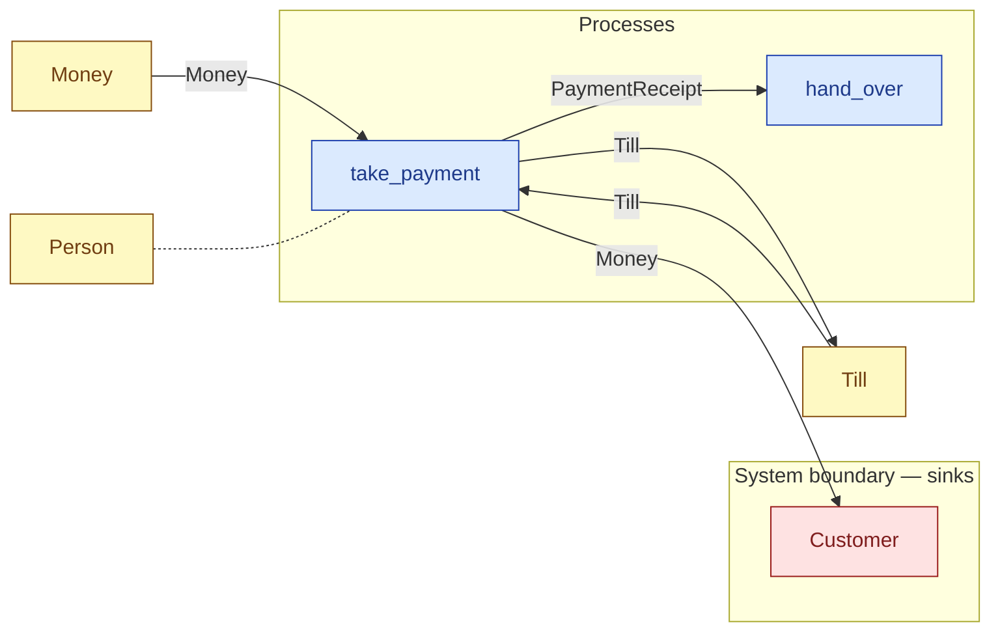

# `take_payment` — process (R1)

> Generated by `tools/docgen.sh` from `model/cs3-cafe-orders` — **do not hand-edit**; regenerate after any model change. Links are into the defining source lines; Mermaid nodes carry absolute click urls, the legend table the same links as plain markdown.

**P4 — takes payment at the till (R19, SPEC.md P4).**

- **Crate / subsystem:** `cs3-cafe-orders` — case study CS-3: café order fulfilment
- **Source:** [model/cs3-cafe-orders/src/resources.rs#L1177](/model/cs3-cafe-orders/src/resources.rs#L1177)
- **Requirements bound on the signature:** REQ-018

## Who and with what

| Actor | Type | Budget at entry | This step's adjacent draw (F-048) |
|---|---|---|---|
| `server` | `Person` | `B` (caller-stated) | 60000 ms |

## Inputs

| Parameter | Declared type | Resource kind | Unit | Magnitude |
|---|---|---|---|---|
| `server` | `Person<B>` | reusable (model-core, R2/R15) | ms | `B` (caller-stated) |
| `till` | `Till<TILL>` | continuous (container, R15) | pence | `TILL` (caller-stated) |
| `cash` | `Money<TENDERED_NOTE_PENCE>` | continuous (container, R15) | pence | TENDERED_NOTE_PENCE = 1000 |
| `customer` | consumer of Money (sink `Customer`) | boundary object (R12) | — | — |

Observed entering this step in the traced flows: `Customer`, `Money`, `Person 390000 ms`, `Person 600000 ms`, `ServedOrder`, `Till 0 pence`, `Till 700 pence`.

## Outputs

| Output | Resource kind | Unit | Magnitude | Routing (who takes it) |
|---|---|---|---|---|
| `Person<B>` | reusable (model-core, R2/R15) | ms | `B` (caller-stated) | moved in and returned (R2) |
| `Till<NEW>` | continuous (container, R15) | pence | `NEW` (caller-stated) | `Till` (shared resource) |
| `PaymentReceipt` | discrete (consumable, R13) | — | — | `hand_over` (process) |
| `C::Next` | — | — | — | the same boundary object, returned in its advanced state (R2/R12) |

Waste routed **inside** this process (never loose in a flow):

- `customer` is a consumer parameter: **Money** is handed to `Customer` **inside this process** (Consumer/ConsumeList bound, R12) — [model/cs3-cafe-orders/src/resources.rs#L572](/model/cs3-cafe-orders/src/resources.rs#L572)

Observed leaving this step in the traced flows: `Customer`, `PaymentReceipt`, `Person 390000 ms`, `Person 600000 ms`, `Till 700 pence`.

## Balances (R1/R3/R15)

- **Compile-time assert:** `TENDERED_NOTE_PENCE == ORDER_PRICE_PENCE + CHANGE`
  - message: *money conservation violated in take_payment (R1/R19): the tendered note must equal the order price plus the change - is the stated change wrong for the 700 p order?*
  - in numbers (observed instantiation): `TENDERED_NOTE_PENCE == ORDER_PRICE_PENCE + 300` → 1000 = 1000 (holds)
  - fires at monomorphization (F-001): `cargo build`/`cargo test` catch a violation; `cargo check` and editor diagnostics do not.
- **Structural:** the const parameter `B` appears in an input and an output — the magnitude flows through unchanged, checked by the shared type parameter (no assert needed).
- **Inherited by composition:** this step calls [`deposit_till`](/model/cs3-cafe-orders/src/resources.rs#L941), whose conservation asserts fire at every instantiation here (F-001):
  - `BALANCE + ADD == NEW`
- **Inherited by composition:** this step calls [`split_money`](/model/cs3-cafe-orders/src/resources.rs#L924), whose conservation asserts fire at every instantiation here (F-001):
  - `A + B == IN`

## Requirements (R10 — the compliance matrix)

| Requirement | Statement | Defined at | Satisfied by | Verified by |
|---|---|---|---|---|
| REQ-018 | The customer's change must be returned in full at the till. | [model/cs3-cafe-orders/src/requirements.rs#L57](/model/cs3-cafe-orders/src/requirements.rs#L57) | `Customer` | [`take_payment_splits_deposits_and_returns_the_change`](/model/cs3-cafe-orders/src/resources.rs#L1409), [`path_1_served_first_try_accounts_for_everything`](/model/cs3-cafe-orders/tests/flows.rs#L170), [`path_2_served_on_retry_accounts_for_everything`](/model/cs3-cafe-orders/tests/flows.rs#L222), [`path_3_refund_accounts_for_everything`](/model/cs3-cafe-orders/tests/flows.rs#L273), [`interleavings_are_equivalent_on_path_3`](/model/cs3-cafe-orders/tests/flows.rs#L379) |

This item is doc-tagged `Satisfies: REQ-017, REQ-018`.

## Where it fits (R9: needs / feeds)

The model states **connections, not sequences**: any order satisfying these dependencies is valid (R9).

**Needs:**

- **Money** from `Money` (shared resource)
- **Till** from `Till` (shared resource)
- `Person` (shared resource) — threaded through, returned (R2)

**Feeds:**

- **Money** to `Customer` (boundary sink)
- **PaymentReceipt** to `hand_over` (process)
- **Till** to `Till` (shared resource)

## Neighbourhood (one hop)

### Legend — node → source

| Node | Kind | Defined at |
|---|---|---|
| `n_take_payment` (take_payment) | process | [model/cs3-cafe-orders/src/resources.rs#L1177](/model/cs3-cafe-orders/src/resources.rs#L1177) |
| `n_hand_over` (hand_over) | process | [model/cs3-cafe-orders/src/resources.rs#L1232](/model/cs3-cafe-orders/src/resources.rs#L1232) |
| `n_Customer` (Customer) | boundary sink | [model/cs3-cafe-orders/src/resources.rs#L572](/model/cs3-cafe-orders/src/resources.rs#L572) |
| `n_Money` (Money) | shared resource | [model/cs3-cafe-orders/src/resources.rs#L101](/model/cs3-cafe-orders/src/resources.rs#L101) |
| `n_Till` (Till) | shared resource | [model/cs3-cafe-orders/src/resources.rs#L112](/model/cs3-cafe-orders/src/resources.rs#L112) |
| `n_Person` (Person) | shared resource | — |

## Open items (`Placeholder:` tags, R12)

- `Customer` — the customer — refine to a queue of real customers. ([model/cs3-cafe-orders/src/resources.rs#L572](/model/cs3-cafe-orders/src/resources.rs#L572))
